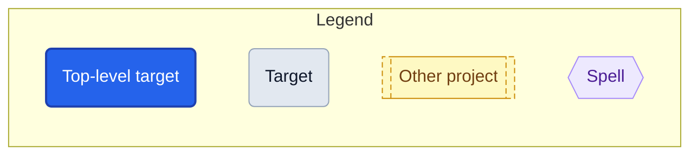
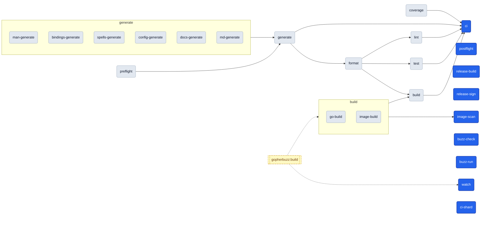
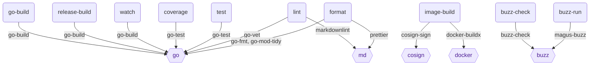
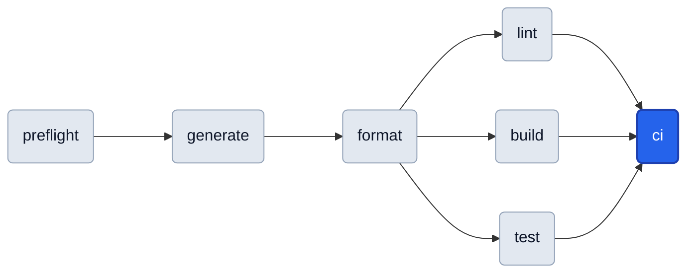
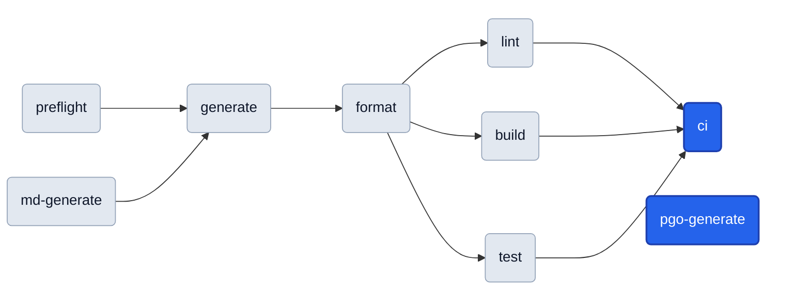
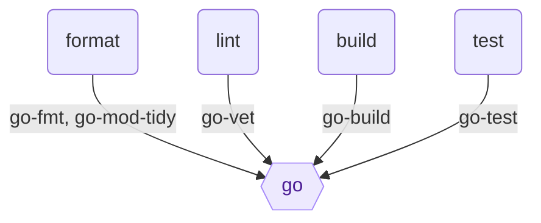
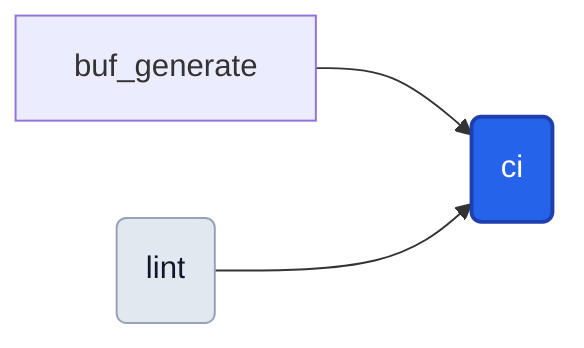
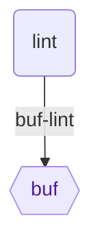
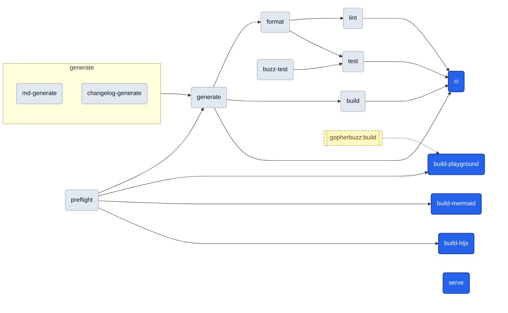

# Targets

<!-- Generated by `magus describe graph -o markdown`. Do not edit by hand. -->

A **target** is a named operation (build, test, lint, …) declared as an `export fun` in a project's magusfile. This cheat sheet (the per-target catalog and run-order graph below) is extracted statically from the magusfile source, so it stays in lockstep with how the project actually builds.

## Quick start

```sh
magus run <target>          # from inside the project directory
magus run <target> <path>   # from anywhere in the workspace
magus run <target>:<charm>  # change HOW it runs (e.g. lint:rw)
```

Unfamiliar with a term? See the [Glossary](https://eli.gladman.cc/magus/glossary/).

Prefer a picture? Explore this graph in the [Graph Explorer](https://eli.gladman.cc/magus/graph/#src=https%3A%2F%2Fraw.githubusercontent.com%2Fegladman%2Fmagus%2Fmain%2Fdocs%2Fgraph.json) - an interactive, force-directed view of this repo's committed graph.json (it renders in your browser; nothing is uploaded).

## Query first

This workspace has a knowledge graph of **1689 nodes** and **2958 edges** (schema v1). Query it instead of grepping:

```sh
magus query "<terms>"       # kind:spell, project:pkg/foo, relation:uses, free text, -negation
magus explain <node>        # one node: its edges, provenance, blast radius
magus path <a> <b>          # how two nodes connect
magus graph stats           # god nodes, orphans, doc coverage (MCP: magus_stats)
magus graph export -o json  # the whole graph (MCP: magus_query, magus_explain, magus_path)
```

| Kind | Count | List them | Anchors (most connected) |
|---|--:|---|---|
| project | 5 | [`magus query kind:project`](https://eli.gladman.cc/magus/graph/#q=magus%20query%20kind:project) | `magus`, `website`, `gopherbuzz` |
| target | 56 | [`magus query kind:target`](https://eli.gladman.cc/magus/graph/#q=magus%20query%20kind:target) | `generate`, `format`, `generate` |
| spell | 12 | [`magus query kind:spell`](https://eli.gladman.cc/magus/graph/#q=magus%20query%20kind:spell) | `go`, `buf`, `docker` |
| op | 43 | [`magus query kind:op`](https://eli.gladman.cc/magus/graph/#q=magus%20query%20kind:op) | `go-build`, `go-test`, `go-fmt` |
| charm | 5 | [`magus query kind:charm`](https://eli.gladman.cc/magus/graph/#q=magus%20query%20kind:charm) | `rw`, `static`, `cd` |
| module | 22 | [`magus query kind:module`](https://eli.gladman.cc/magus/graph/#q=magus%20query%20kind:module) | `fs`, `charm`, `env` |
| method | 148 | [`magus query kind:method`](https://eli.gladman.cc/magus/graph/#q=magus%20query%20kind:method) | `archive.compress`, `archive.uncompress`, `charm.after` |
| diagnostic | 26 | [`magus query kind:diagnostic`](https://eli.gladman.cc/magus/graph/#q=magus%20query%20kind:diagnostic) | `MGS5002`, `MGS4001`, `MGS5003` |
| doc | 104 | [`magus query kind:doc`](https://eli.gladman.cc/magus/graph/#q=magus%20query%20kind:doc) | `docs/spells.md`, `docs/documentation.md`, `docs/sandbox.md` |
| file | 196 | [`magus query kind:file`](https://eli.gladman.cc/magus/graph/#q=magus%20query%20kind:file) | `website/scribe.buzz`, `gopherbuzz/examples/bubblegum/config.buzz`, `gopherbuzz/examples/bubblegum/platform/macos/cocoa.buzz` |
| function | 977 | [`magus query kind:function`](https://eli.gladman.cc/magus/graph/#q=magus%20query%20kind:function) | `sel`, `site_render`, `sendObject` |
| import | 91 | [`magus query kind:import`](https://eli.gladman.cc/magus/graph/#q=magus%20query%20kind:import) | `std`, `magus`, `fs` |
| rationale | 4 | [`magus query kind:rationale`](https://eli.gladman.cc/magus/graph/#q=magus%20query%20kind:rationale) | `NOTE`, `NOTE`, `NOTE` |

| Project | Targets | Scope a query | Key targets |
|---|--:|---|---|
| . | 24 | [`magus query project:.`](https://eli.gladman.cc/magus/graph/#q=magus%20query%20project:.) | `generate`, `format`, `image-build` |
| cmd/magus/starter | 7 | [`magus query project:cmd/magus/starter`](https://eli.gladman.cc/magus/graph/#q=magus%20query%20project:cmd%2Fmagus%2Fstarter) | `format`, `ci`, `build` |
| gopherbuzz | 9 | [`magus query project:gopherbuzz`](https://eli.gladman.cc/magus/graph/#q=magus%20query%20project:gopherbuzz) | `build`, `format`, `generate` |
| proto | 2 | [`magus query project:proto`](https://eli.gladman.cc/magus/graph/#q=magus%20query%20project:proto) | `ci`, `lint` |
| website | 14 | [`magus query project:website`](https://eli.gladman.cc/magus/graph/#q=magus%20query%20project:website) | `generate`, `ci`, `preflight` |

## Reading the graphs



- Every rounded box is a **target** you can `magus run`. **Blue** is a top-level target (nothing else depends on it — a typical entry point); **gray** ones are pulled in as dependencies.
- Arrows show **run order**: a target's dependencies run before it, so the graph flows left -> right (e.g. `preflight` runs first, `ci` last).
- A dotted arrow marks a **cross-project dependency** (the other project's target runs first).
- Each project's **Toolchain** graph (top-down) shows which **spell** each target drives.

## Project: magus

<details>
<summary><b>Shared defaults</b>: inputs, outputs &amp; spells shared by every target in <code>magus</code></summary>

```text
sources  **/*.MD, **/*.buzz, **/*.go, **/*.markdown, **/*.md, .markdownlint.json, .markdownlint.yaml, go.mod, go.sum, go.work, go.work.sum, magusfile.buzz, magusfiles/**/*.buzz
outputs  host/gen/*.go, docs/buzz/modules/*.md, docs/spells/*.md, docs/spells.md, docs/manpage/gen/*.md, manpage/gen/*.1, MAGUS.md, dist/*
spells   magusfile, go, buzz, md (claims: **/*.md, **/*.mdx)
```

</details>

**Run order**



**Toolchain**

Which spell each target drives; edge labels are the tool-native operations.



[Explore this project's graph interactively](https://eli.gladman.cc/magus/graph/#data=H4sIAAAAAAAC_8RX4W7juBF-lYFwwNpdyblesQWa-5VN75zgdm-LTfKjaIOEJkcSLxIpzFB2vIcF-hB9wj5JMaQsWzknu21_9Fdicjj8hvN9M6NfM4OldTZY77LT7LpGCIoqDGCwQ2fQ6S1UpLoaLEOoEVpV9bxwiIbhz2dL8CUo6Mj_gjq84rRd2gZPAZWuwXmDclTt_M6UA3zsPAU0UPZOy9XzPFmjqRDU4d02gPZt5xl5AZdBXOFjIKXlOAcVrFZNs4WSfLvHJwCAfU8ac2AvXrj2GwZcI23TNf_6xz_BOt30xroKVj7UoKjlFBD1LtgWYUXK6TraKmegbFTFoNz2EKLe6gZhtqmtriME6h10KtRAKK_CYHqSO4zlTgVdzxdZng1Pxtnp337NxDo7zWQdXWUdZqfZqv_0KcszecBk5FQr65UvVr1tTJZnxuvsNDv3bWcbTOlZI7H1ruCg2g5Neg5YWadoK-65w6ZJ_uK_0WGWZ76Txb3z28-3eabJM9-NodoByAA9Hu1qpAFpSnBELh4-337OR9C2VRU-wX3jDFIErQ3oWlGbQ7R43fVcv2ZbuZSWlOaYgPPlB4i-GHqnvTORucIACS46iXFouSady26PRm28fkDaR55-J4iPWcS-M9VesOxN0-8iLt4eCZO1cmOUV1q5lJq4CRsbaghk19vvE1k2KXbYkA3IcHX28fLHGGul5Ld3cHG5vDg5_3h5fXl-9k7ifJKRyeveHj4DbbJDeK1yRYUOSQUcAX4UV7QTtzBXXndGviznYF3wsiqLJxW6RXbgbmWdaIeP-dwtJb9LD7XnALsTMONgoPh7_-23f8C4Jc7nScUczOK9N32DYFA3ipTkmCdXp4R--WKdtGEisUJhHcSTsNoG1FKaZtYFJKeak7gRYUxu0t6VtvryTefvLmGwlSoBXdO3K1H9TLfmJMrwIMbx1nRk-LOo_ORu4_XXxdjaIPVQ7OG9ogfjNw5mbXpEwhIJnUZ4vU_wNMjWPM-L92fLm6tFa2BtFdynemKQNdkVptZwP_HVeQ5lY6s6HKWYdSx7QCg9AGa1D9z5wDmoMnaibQ5-45C4tl0OgdCZOQQvtPB9EGXkYB0sbbjoV3AW-4ec7kQTLKU--HjTL34FHLAD7ts2lr8DlC--auoSvxvfBNiuGuuqXPy6vTAN2TLADB9107NdS6_RXqpu8KA3Zn5Mqx3h-DpP9HhMT78l-lFCTiwOs_lSOSBsUPHTsvxWfkl4wpxoMLQPKD3F5a5RofTUTkvui9X2uR5zBM1Qa4fqaSvH0jjDydXF2Xdv_nh18_5qqKE1wg_muzdvfv8neMCtcEKWIl3vri6XP1_-vLz76Ye_AqMmGTwYEUYtFn2wDZ_IZYvKz4fMMjZlsUaypR3EJQYq9ISgKmUdh7iK7QqNQTO-UNevBMO-mgwbD7idwwpLT5iq_WBfeWFQH9JkAbpG1QFhRcjSvqHqFZkcWJUoZJKJokZCmPWusQ8IjKHvihhJDmny0Mq92o1tQs5xGBoGIZGSxCOFwMqoRtizVMYtKFrZQJJifEz4ozyfFImNzC4HelntiDLoxeDK905jbOauQpAZqkmljvouoPkeSl5EN_D23Yfzn65E39sTHVceELsoX9XYNf4fZxXt10iq2peG3YKkYWBFb8PQyjukolP6QfZHQ2nfhENHlwOKGQOf7AwWvK5gpUyFUw2JQL8m7oAcnshHAit0jfphxH297TAtDaiDckY1IuG3_adPexn1HQdC1cK9eLmH4H2ja2UdzIrkYP5MPobnHJAdYDgCjnr3n0GL7H3F0g72ikvzMcy-iUIH8fx14JLs49oU3GFFTuiWY2-N9BCKbzw9cKc0Qo2qCbXIhnrnpMPvmqLXwdO0GT4zqUucioItlQ6n8aLdeKRI-t8wFnsXlHVIw-jYjwPz_bh1n6bHY51GSrSSoKbD9142k4F553DSISLPduh_jP4YSkschoI5KmLpQYyTMl5A89_Su7HuZSSVb5SrtC3EMofKwxrj33XfuMi0HNphNBKT_xXjGsP0K6E1h1zbX_QkkDErvxk7hkDKIbilzyFYI43ovvKL1pv7PBaWjjCEfYeS7n8smMMR4MvhlG1I3Gi9KYI12-eDS_dHpkzKpt0HJawYh6dZGpNkaprnkNITGZhHyqSgEt9TdSxiZYSSkGuHzPFo-lpSZYny6X_S2Q4bKQTyfe4JiqgpGYWTNyV9hD3E3hK_Fml8aSOdt-vDi6-W7yi3082ghbE7TGMvuFa0V_o1KcdNLCPj0LzDDkXRNcrdw4xQxeLCwVg3fGxN51qIbotWBbKPA2xOT1HVavrl-M3y8vri5u3dh5vrv9xc5-BDjbSxjMMoEF1YKT7NVki0trhBM21AVa1SO03vwnfeJYKMvVOS_u8AAAD__xi4a7M2EgAA)

### `image-scan`

Scans the image with trivy; the rw charm writes SARIF and gates on HIGH/CRITICAL.

**Defaults**

```sh
magus run image-scan  # from the workspace root
```

**Charms**

```sh
magus run image-scan:rw  # mutate in place instead of checking
```

**Depends on:**

- [`image-build`](#image-build)

### `postflight`

Renders the insight report (hotspots, affinity, ownership, trend) to stdout and, in GitHub Actions, appends it to the job step summary.

**Defaults**

```sh
magus run postflight  # from the workspace root
```

**Details:** uncached (always runs)

### `generate`

Regenerates every *-generate sibling, then gates on drift (exclusive, scoped to cwd).

**Defaults**

```sh
magus run generate  # from the workspace root
```

**Charms**

```sh
magus run generate:rw  # mutate in place instead of checking
```

**Depends on:**

- [`preflight`](#preflight)
- [`man-generate`](#man-generate)
- [`bindings-generate`](#bindings-generate)
- [`spells-generate`](#spells-generate)
- [`config-generate`](#config-generate)
- [`docs-generate`](#docs-generate)
- [`md-generate`](#md-generate)

**Details:** uncached (always runs) · exclusive (runs alone, no concurrent targets)

### `release-build`

Builds one release binary for one platform.

**Defaults**

```sh
magus run release-build  # from the workspace root
```

**Charms**

```sh
magus run release-build:static  # apply the static charm
```

**Details:** uncached (always runs)

### `release-sign`

Signs dist/SHA256SUMS with the Ed25519 key in the MAGUS_SIGNING_KEY secret (see cmd/magus-utils/sign.go), then self-verifies the signature against the embedded release pubkey (internal/releasekey) before the release goes out — a cheap regression guard, safe to run here (unlike setup-magus, which can't depend on the magus source tree since it's reused by arbitrary external repos).

**Defaults**

```sh
magus run release-sign  # from the workspace root
```

**Details:** uncached (always runs)

### `watch`

Rebuilds on every debounced change until interrupted; fs.watch BLOCKS, try/catch keeps it alive.

**Defaults**

```sh
magus run watch  # from the workspace root
```

**Details:** uncached (always runs)

### `buzz-check`

Type-checks the standalone Buzz with the upstream `buzz` toolchain (--check).

**Defaults**

```sh
magus run buzz-check  # from the workspace root
```

**Executes**

```sh
sh -c find . -name '*.buzz' -print0 | xargs -0 -r -n1 buzz --check
```

### `buzz-run`

Type-checks the standalone Buzz with magus's own embedded engine ($MAGUS buzz).

**Defaults**

```sh
magus run buzz-run  # from the workspace root
```

### `build`

Compiles one artifact: the host binary, or the container image under the `container` charm.

**Defaults**

```sh
magus run build  # from the workspace root
```

**Charms**

```sh
magus run build:container  # build the container image instead of the host binary
```

**Depends on:**

- [`format`](#format)
- [`image-build`](#image-build)
- [`go-build`](#go-build)

### `test`

Formats first, then runs the Go test suite.

**Defaults**

```sh
magus run test  # from the workspace root
```

**Depends on:**

- [`format`](#format)

### `lint`

Formats first, then golangci-lint, go vet, govulncheck, markdownlint.

**Defaults**

```sh
magus run lint  # from the workspace root
```

**Depends on:**

- [`format`](#format)

### `format`

Regenerates, then formats Go, tidies `go.mod`, and prettifies the docs.

**Defaults**

```sh
magus run format  # from the workspace root
```

**Depends on:**

- [`generate`](#generate)

### `ci`

Runs generate (drift gate), lint, build, test, and the coverage-badge freshness gate; the affected/pipeline anchor - one command that also catches unregenerated output.

**Defaults**

```sh
magus run ci  # from the workspace root
```

**Depends on:**

- [`generate`](#generate)
- [`lint`](#lint)
- [`build`](#build)
- [`test`](#test)
- [`coverage`](#coverage)

### `ci-shard`

Translates a `magus affected --plan` (read on stdin) into GitHub Actions shard-matrix outputs; the gha charm writes $GITHUB_OUTPUT, otherwise the matrix is only previewed.

**Defaults**

```sh
magus run ci-shard  # from the workspace root
```

**Charms**

```sh
magus run ci-shard:gha  # apply the gha charm
```

**Details:** uncached (always runs)

### `go-build`

Compiles the version-stamped magus binary.

**Defaults**

```sh
magus run go-build  # from the workspace root
```

**Executes**

```sh
go build
```

### `image-build`

Under the cd charm, build+push+sign both static and CGO images unconditionally.

**Defaults**

```sh
magus run image-build  # from the workspace root
```

**Charms**

```sh
magus run image-build:cd      # apply the cd charm
magus run image-build:static  # apply the static charm
```

**Details:** uncached (always runs)

### `man-generate`

Renders the man pages (roff) into manpage/gen.

**Defaults**

```sh
magus run man-generate  # from the workspace root
```

### `bindings-generate`

Regenerates the Go host bindings (std -> host/gen) from std.Module declarations.

**Defaults**

```sh
magus run bindings-generate  # from the workspace root
```

### `spells-generate`

Regenerates the compiled built-in spell bytecode (internal/spell/gen).

**Defaults**

```sh
magus run spells-generate  # from the workspace root
```

### `config-generate`

Regenerates the CLI config-flag plumbing (cmd/magus/gen) from internal/config/config.go.

**Defaults**

```sh
magus run config-generate  # from the workspace root
```

### `docs-generate`

Regenerates the committed docs Markdown (module reference + man pages).

**Defaults**

```sh
magus run docs-generate  # from the workspace root
```

### `md-generate`

Renders MAGUS.md via `magus describe graph`.

**Defaults**

```sh
magus run md-generate  # from the workspace root
```

### `coverage`

coverage runs the suite with per-package coverage and rewrites the assets/coverage.svg badge.

**Defaults**

```sh
magus run coverage  # from the workspace root
```

**Charms**

```sh
magus run coverage:rw  # mutate in place instead of checking
```

**Details:** uncached (always runs)

### `preflight`

Gates the build on workspace health by running `magus doctor`.

**Defaults**

```sh
magus run preflight  # from the workspace root
```

## Project: cmd/magus/starter

<details>
<summary><b>Shared defaults</b>: inputs, outputs &amp; spells shared by every target in <code>cmd/magus/starter</code></summary>

```text
sources  cmd/magus/starter/magusfile.buzz, cmd/magus/starter/magusfiles/**/*.buzz, magusfile.buzz, magusfiles/**/*.buzz
spells   magusfile
```

</details>

**Run order**



[Explore this project's graph interactively](https://eli.gladman.cc/magus/graph/#data=H4sIAAAAAAAC_4ySz2rcPhDHX2XQZRMwm7tvP_hB6b23EsisNLKmlUdmNE7ihEAfok_YJymyd7c-7CH4Jn--fzSadxcosrBxEde7b4nAUAcyCDSRBBK_wKA4JeAKlghGHOZ6FKJQ4f__vkCJgDBp-UHeDnX7HTlTD4Q-gZRATYoX3zsUoNepqFGAOItv0ffdRlMYCHCfzQa-jFOpVI_w1ZoVvZqib_JqaOwx5wWilvFfv1YAapnVUwe1NJeayksFeiZdtpg_v34Di89zYBngVCwB6li3C-ksxiPBSVF8WlmUADHjUAFl2Vf0i88Edy-JfVor6CwwoSVQalOpEGZtGYHrhObT_dF17jyy6vrv767Rrnd-DA9r_4dqqEbqOkcysJDr3Wl-e3OdawPdRIJjO5-UYuYhmfvorocDCSkauc5dm_Kq2_GPO0EsOqLdwK9Oezqz3GLPJnvyNHMOn0ON6idNPTeueNe7g-fDZTV9kWeStk-Yob1bUbCEBk_rUAFjpHVvPD_BT1raW8fjjcjz9S7d12KPH-37GwAA__9JWf9TMAMAAA)

### `generate`

**Defaults**

```sh
magus run generate cmd/magus/starter  # from the workspace root
```

**Depends on:**

- [`preflight`](#preflight)

### `format`

**Defaults**

```sh
magus run format cmd/magus/starter  # from the workspace root
```

**Depends on:**

- [`generate`](#generate)

### `lint`

**Defaults**

```sh
magus run lint cmd/magus/starter  # from the workspace root
```

**Depends on:**

- [`format`](#format)

### `build`

**Defaults**

```sh
magus run build cmd/magus/starter  # from the workspace root
```

**Depends on:**

- [`format`](#format)

### `test`

**Defaults**

```sh
magus run test cmd/magus/starter  # from the workspace root
```

**Depends on:**

- [`format`](#format)

### `ci`

'ci' is the conventional anchor that `magus affected ci` keys off.

**Defaults**

```sh
magus run ci cmd/magus/starter  # from the workspace root
```

**Depends on:**

- [`lint`](#lint)
- [`build`](#build)
- [`test`](#test)

### `preflight`

**Defaults**

```sh
magus run preflight cmd/magus/starter  # from the workspace root
```

## Project: gopherbuzz

<details>
<summary><b>Shared defaults</b>: inputs, outputs &amp; spells shared by every target in <code>gopherbuzz</code></summary>

```text
sources  gopherbuzz/**/*.go, gopherbuzz/go.mod, gopherbuzz/go.sum, gopherbuzz/go.work, gopherbuzz/go.work.sum, gopherbuzz/magusfile.buzz, gopherbuzz/magusfiles/**/*.buzz, magusfile.buzz, magusfiles/**/*.buzz
outputs  gopherbuzz/MAGUS.md
spells   magusfile, go
```

</details>

**Run order**



**Toolchain**

Which spell each target drives; edge labels are the tool-native operations.



[Explore this project's graph interactively](https://eli.gladman.cc/magus/graph/#data=H4sIAAAAAAAC_6RUzWocPRB8lUYX2zC7vs938kfA5GAS8ncJBvdKrZ9EIwmpZXvWGPIQecI8SdDM7HocTAj4tqspVVVXd-tBKNIuOHYxiF58sgSM2RCDokRBUZAjmIzJgivAlmBAU8s2EKkCby4uIWpASDl-I8knZf6snaceCKWFEBW1q3jgPcUAdJ9iZlKga5BN-qyb0aQMAa61HYOMQ4qFyhbecqOie84o2_XCyE6i9yPoHIcnf80AlFizpA5KbCzFxrsCdEt5nGV-_fgJLkhflQsGdpEtYB7KXFCugd1AsMsYpJ2wGBRoj6YAhnFtUY7SE5zeWSftZCHXAAnZQqaWSgFVc9NQriRkac-2ohNLZEX0Xx9EQ4temJgs5V3d70UnKBgXSPRi-d-SnNEBh3aeMmnvjGXx2B0PDQXKyCQ6oaIUvfhAh6MCVxeXnz9uBzXXgs4XiAFUdpqbpWNNbhJaCXRiUJsj9XUnpG1ZNVC-E9cr_TXuyUJQlFfyp8ssSGT00UDytcxTdnZopFuN0nZdoI55QH7B7dpeSeT9HNb0c8pWdCKmGRo3emgcJm6GqDbs1CiuH9d1eBdeElnU_0nilvgP0l11Xr2SdeZ4zstUXmt2onjOKt2xg-1daIsQM9xMbQHUmqYdlO4GvtPY9kb_BxpDgVgZWn7nk9fzRg2omTLMjl6atSXvQ0KLnSczycTNX2dbkcbqeZtM7KYt_L_u9_Dl6qTA-8t37YVaRqkV-TsAAP__emIa3vcEAAA)

### `generate`

Regenerates MAGUS.md and fails on drift.

**Defaults**

```sh
magus run generate gopherbuzz  # from the workspace root
```

**Charms**

```sh
magus run generate:rw  # mutate in place instead of checking
```

**Depends on:**

- [`preflight`](#preflight)
- [`md-generate`](#md-generate)

**Details:** uncached (always runs) · exclusive (runs alone, no concurrent targets)

### `format`

**Defaults**

```sh
magus run format gopherbuzz  # from the workspace root
```

**Depends on:**

- [`generate`](#generate)

### `lint`

**Defaults**

```sh
magus run lint gopherbuzz  # from the workspace root
```

**Depends on:**

- [`format`](#format)

### `build`

**Defaults**

```sh
magus run build gopherbuzz  # from the workspace root
```

**Depends on:**

- [`format`](#format)

### `test`

**Defaults**

```sh
magus run test gopherbuzz  # from the workspace root
```

**Depends on:**

- [`format`](#format)

### `ci`

The anchor `magus affected ci` keys off; fans out lint/build/test after format.

**Defaults**

```sh
magus run ci gopherbuzz  # from the workspace root
```

**Depends on:**

- [`lint`](#lint)
- [`build`](#build)
- [`test`](#test)

### `pgo-generate`

Regenerates default.pgo, the Buzz VM's PGO profile.

**Defaults**

```sh
magus run pgo-generate gopherbuzz  # from the workspace root
```

**Details:** uncached (always runs)

### `preflight`

**Defaults**

```sh
magus run preflight gopherbuzz  # from the workspace root
```

### `md-generate`

Renders MAGUS.md (target catalog plus graph) from this magusfile.

**Defaults**

```sh
magus run md-generate gopherbuzz  # from the workspace root
```

## Project: proto

<details>
<summary><b>Shared defaults</b>: inputs, outputs &amp; spells shared by every target in <code>proto</code></summary>

```text
sources  magusfile.buzz, magusfiles/**/*.buzz, proto/**/*.proto, proto/buf.gen.yaml, proto/buf.lock, proto/buf.work.yaml, proto/buf.yaml, proto/magusfile.buzz, proto/magusfiles/**/*.buzz
outputs  proto/gen/**, proto/gen/**
spells   buf
```

</details>

**Run order**



**Toolchain**

Which spell each target drives; edge labels are the tool-native operations.



[Explore this project's graph interactively](https://eli.gladman.cc/magus/graph/#data=H4sIAAAAAAAC_0yRQW7cMAxFr0Jw0wTwzAG8K1Cg6LrdFQOEI31bKmzKkOhOnGCAHqIn7EkKyZlJdjb1Sf7_-MoeQ9RoMSn3_COATPIII48F6qFuozHLEigWsgCaZVzLUQFf6Mvnr5QGElpy-gVnn8r-PMQJPUFcIE0etVVucx9ECc9LygZPw6qurn7sdjX8CJKPu6ORS_OSCsqRvlkdhWfL4mp7MbHoZJo2GnKa3_1VA1TSmh06KqlOKSFdCuE38rav-ffnL0V10-qjjnROFkjyXPZAeVWLM-icRV1oWlFPwyRjIdHto0W3uQn0cAnRhWYhr0qLWKCMSqWQX3Pd4WNZxFx4PHLHb8gK9z9fuaq5rzVL3DF0jAru-by-vHDHFeIuVJlrfYpq3LFPjnv-jmk4uKQmUeFvt3jjXVr-p0aFZBjQwLn4RKMY9pPW3kqULgHaKs0IuSA6otCBNFGygHwfnuu5UChqzVIWTNNusH025wN3nJZarT-HZvl0PV27ewoXa4YbyIi7doQii4E7vredrv8DAAD__716IfKsAgAA)

### `ci`

**Defaults**

```sh
magus run ci proto  # from the workspace root
```

**Depends on:**

- [`buf-generate`](#buf-generate)
- [`lint`](#lint)

### `lint`

Self-contained project targets, so `magus affected ci` gates the contract when the proto changes - no other project reaches in.

**Defaults**

```sh
magus run lint proto  # from the workspace root
```

## Project: website

<details>
<summary><b>Shared defaults</b>: inputs, outputs &amp; spells shared by every target in <code>website</code></summary>

```text
sources  magusfile.buzz, magusfiles/**/*.buzz, website/magusfile.buzz, website/magusfiles/**/*.buzz
outputs  website/gen/**, website/MAGUS.md, website/js/gen/**
spells   magusfile
```

</details>

**Run order**



[Explore this project's graph interactively](https://eli.gladman.cc/magus/graph/#data=H4sIAAAAAAAC_4xW227jNhN-lYFukvy_LO-id75q0BbZAj0BzaIXu0ZCkSORCQ_CDGVHGxjoQ_QJ-yQFKctWYnebO3uO33wznNFzobAx3kQTfLEqbjVCFNRiBIUdeoVeDtCS6DQYhqgRnGh7rjyiYvj--gZCAwI6Cg8o4wWP6sZYXAEKqcEHhclVTHEvhQd86gJFVND0XqbUV-VojapFEPPcJoIMrguMXMGPMYXCp0hCJneOIhoprB2goeCO-BIA4NCTxBI4pCisw5YBN0jDmObvP_8C46XtlfEt1CFqEOR4LIh6H41DqEl4qbOt8AoaK1oG4Yc5RDlIi3C51UbqDIF6D52IGggTKwyqp5RDGe5ElPqqKspiTxkXq0_PRbIuVsUWazYRi7JA3xqPxaqo-y9firJINI6mXrgk7wgba1odi115EDq1aNEjiRxDBflSBoQNIWtk-Pn65uPvlVNwGY8tlyIKG1r4_0nzryZ-zazDB2ajGBiMBxvkI0fsYGviyMQYmKs5SKmFb9GG9hTrqQoIp58M3324_uXmh59-vUnAMyBCi4KRl_-rBuFsCR0hI20S2yn_p49-b6LWwJhnDTZItYjGvUB1gmWGwCukcfhTd8ozNJb_jjMTPIGYMPBVmeeJsO6NVWNwaQ36CHXvlUUuk8xDmyMGD4pME1cgQFoUHqRG-Rj6CMHbAdqADMpQHGCbvMR--AGVibAV7C8iEC7GWlAtx8Qxg5DBORMjqjSWh86bPG-zOStfjdeZPq6zlFz2pG2xnhHcBHIinslw9J5ZW-PP2e6DzC0zgW8Nm17TIiLHQ5sPkvRqGViSqfEijfMiL5H7rPtcVFX1uYDn3T3Uecwhagp9q-E-vwdIce7L9AoWC3Q1KoUKXFp-HI5RnaBHFbZ-iV6GvHeMS6uQgZCD3eCLmZyAniehnFUzr1GaQ3EX0lxMezvtsUATXNE0mFeoNPfwiENae031NRrLqScT4SeJs2LRWTG0FHqvZhy_VLwc-z-wvmZGV9sBjI9IHWFEyrqZjw1C8QpujR9uQr4JxiJDVS2lU8tMxcyaI4k0tSligBb98qjMxtVWsBsf4Xg1otSpH0l8h08oqweG1vb5eMnQGVRQI5t0zeLXH0p6BRSY716ZPE87P22X0Gmk_XIft-RhlnenpDokJ8xrRvfSaWPkQjboVaA0e3ulNTUJGuDygZejcrlXpQoXn_t3777Byfrb9--vRsryQpoWQyZQMGPkmfN_sHBShLYP_KqCJDoPX5tW50AJ5Zkakue8gLn9G6rYu7-9hHRVjsch_ztchuDzZ0aScU4CYYMEH25vf5vW_OJom75vguRlnU7tuERhAVp4NUATKF1RYbMJbAM9VsVuPYHku_SV9mk-PevdevdPAAAA__-mqaTNxQkAAA)

### `generate`

generate renders the site, refreshes MAGUS.md, regenerates CHANGELOG.md (the released sections), and rebuilds the client bundles, then gates on drift: a clean checkout only goes dirty when a source edit wasn't re-rendered/rebuilt and committed.

**Defaults**

```sh
magus run generate website  # from the workspace root
```

**Charms**

```sh
magus run generate:rw  # mutate in place instead of checking
```

**Depends on:**

- [`preflight`](#preflight)
- [`md-generate`](#md-generate)
- [`changelog-generate`](#changelog-generate)

**Details:** uncached (always runs) · exclusive (runs alone, no concurrent targets)

### `format`

**Defaults**

```sh
magus run format website  # from the workspace root
```

**Depends on:**

- [`generate`](#generate)

### `lint`

**Defaults**

```sh
magus run lint website  # from the workspace root
```

**Depends on:**

- [`format`](#format)

### `build`

**Defaults**

```sh
magus run build website  # from the workspace root
```

**Depends on:**

- [`generate`](#generate)

### `test`

**Defaults**

```sh
magus run test website  # from the workspace root
```

**Depends on:**

- [`format`](#format)
- [`buzz-test`](#buzz-test)

### `ci`

'ci' is the anchor `magus affected ci` keys off.

**Defaults**

```sh
magus run ci website  # from the workspace root
```

**Depends on:**

- [`generate`](#generate)
- [`lint`](#lint)
- [`build`](#build)
- [`test`](#test)

### `build-playground`

build-playground rebuilds the WebAssembly interpreter the playground loads: TinyGo compiles ../cmd/buzz-playground straight into gen/playground/buzz.wasm, and the matching wasm_exec.js glue is copied beside it.

**Defaults**

```sh
magus run build-playground website  # from the workspace root
```

**Depends on:**

- [`preflight`](#preflight)

**Details:** uncached (always runs)

### `build-mermaid`

build-mermaid bundles the vendored mermaid library (js/vendor/mermaid.js -> mermaid@11) into the committed gen/assets/mermaid.js.

**Defaults**

```sh
magus run build-mermaid website  # from the workspace root
```

**Depends on:**

- [`preflight`](#preflight)

### `build-hljs`

build-hljs bundles the vendored highlight.js library (js/vendor/hljs.js -> highlight.js@11) into the committed gen/assets/hljs.js.

**Defaults**

```sh
magus run build-hljs website  # from the workspace root
```

**Depends on:**

- [`preflight`](#preflight)

### `serve`

serve renders once, serves gen/ over HTTP, and re-renders on a docs/blog change - handy for local docs work.

**Defaults**

```sh
magus run serve website  # from the workspace root
```

**Details:** uncached (always runs)

### `preflight`

**Defaults**

```sh
magus run preflight website  # from the workspace root
```

### `md-generate`

md-generate refreshes MAGUS.md (the target catalog + dependency graph) from this magusfile, so it stays in lockstep with the targets.

**Defaults**

```sh
magus run md-generate website  # from the workspace root
```

### `changelog-generate`

changelog-generate regenerates CHANGELOG.md from releases/*.yaml, preserving the [Unreleased] section verbatim.

**Defaults**

```sh
magus run changelog-generate website  # from the workspace root
```

### `buzz-test`

buzz-test runs scribe's in-file `test "..." {}` blocks through `magus buzz`, in --embedded mode so scribe's markdown/encoding imports resolve.

**Defaults**

```sh
magus run buzz-test website  # from the workspace root
```
