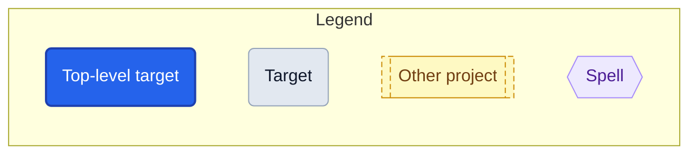
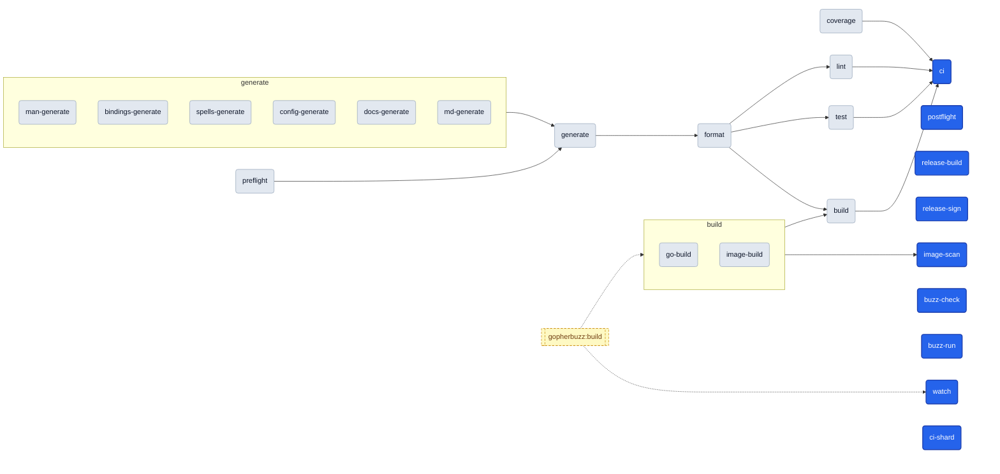
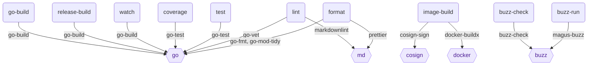
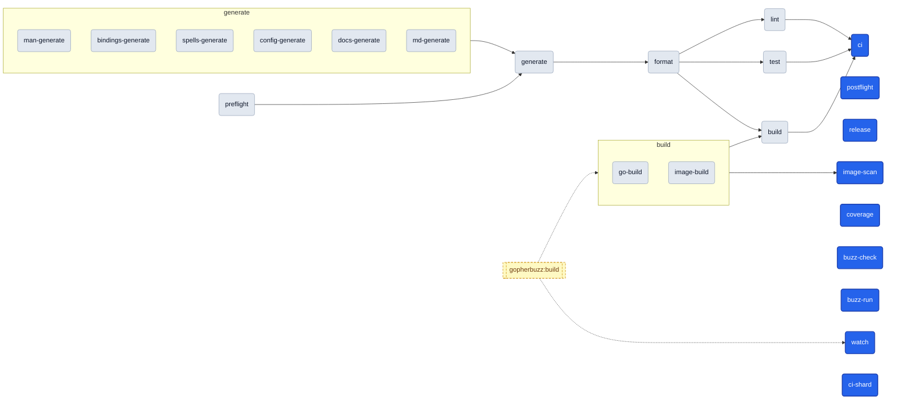
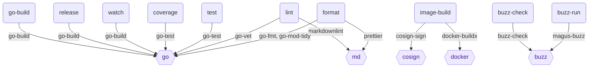
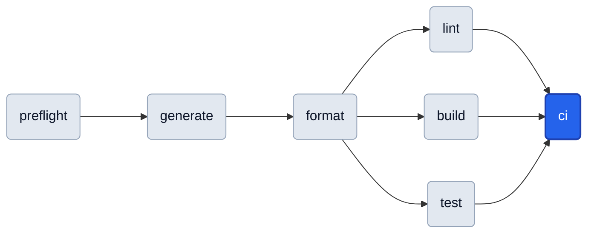
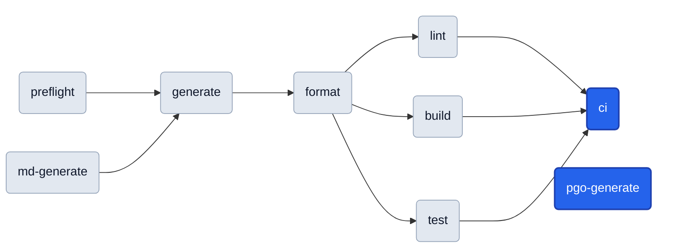
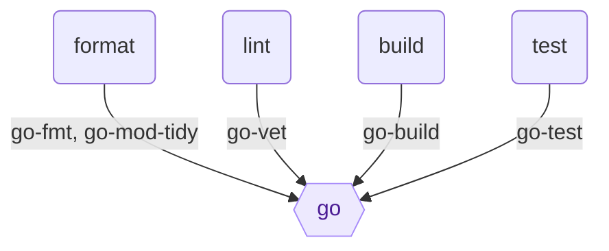
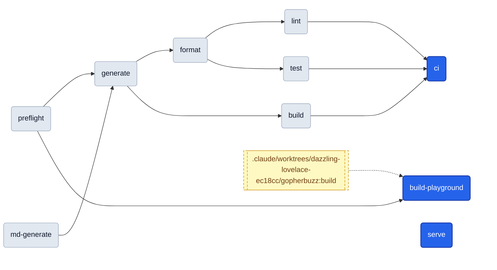

# Targets

<!-- Generated by `magus describe graph -o markdown`. Do not edit by hand. -->

A **target** is a named operation (build, test, lint, …) declared as an `export fun` in a project's magusfile. This cheat sheet (the per-target catalog and run-order graph below) is extracted statically from the magusfile source, so it stays in lockstep with how the project actually builds.

## Quick start

```sh
magus run <target>            # from inside the project directory
magus run <target> <path>     # from anywhere in the workspace
magus run <target>:<charm>    # change HOW it runs (e.g. lint:rw)
```

Unfamiliar with a term? See the [Glossary](#glossary).

## Reading the graphs



- Every rounded box is a **target** you can `magus run`. **Blue** is a top-level target (nothing else depends on it — a typical entry point); **gray** ones are pulled in as dependencies.
- Arrows show **run order**: a target's dependencies run before it, so the graph flows left → right (e.g. `preflight` runs first, `ci` last).
- A dotted arrow marks a **cross-project dependency** (the other project's target runs first).
- Each project's **Toolchain** graph (top-down) shows which **spell** each target drives.

## Project: magus

<details>
<summary><b>Shared defaults</b>: inputs, outputs &amp; spells shared by every target in <code>magus</code></summary>

```text
sources  **/*.MD, **/*.buzz, **/*.go, **/*.markdown, **/*.md, .markdownlint.json, .markdownlint.yaml, go.mod, go.sum, go.work, go.work.sum, magusfile.buzz, magusfiles/**/*.buzz
outputs  host/gen/*.go, docs/buzz/modules/*.md, docs/spells/*.md, docs/spells.md, docs/manpage/gen/*.md, manpage/gen/*.1, MAGUS.md, dist/*
spells   magusfile, go, buzz, md (claims: **/*.md, **/*.mdx)
```

</details>

**Run order**



**Toolchain**

Which spell each target drives; edge labels are the tool-native operations.



### `image-scan`

Scans the image with trivy; the rw charm writes SARIF and gates on HIGH/CRITICAL.

**Defaults**

```sh
magus run image-scan    # from the project directory
magus run image-scan .  # from the workspace root
```

**Charms**

```sh
magus run image-scan:rw  # mutate in place instead of checking
```

**Depends on:**

- [`image-build`](#image-build)

### `postflight`

Renders the insight report (hotspots, affinity, ownership, trend) to stdout and, in GitHub Actions, appends it to the job step summary.

**Defaults**

```sh
magus run postflight    # from the project directory
magus run postflight .  # from the workspace root
```

**Details:** uncached (always runs)

### `generate`

Regenerates every *-generate sibling, then gates on drift (exclusive, scoped to cwd).

**Defaults**

```sh
magus run generate    # from the project directory
magus run generate .  # from the workspace root
```

**Charms**

```sh
magus run generate:rw  # mutate in place instead of checking
```

**Depends on:**

- [`preflight`](#preflight)
- [`man-generate`](#man-generate)
- [`bindings-generate`](#bindings-generate)
- [`spells-generate`](#spells-generate)
- [`config-generate`](#config-generate)
- [`docs-generate`](#docs-generate)
- [`md-generate`](#md-generate)

**Details:** uncached (always runs) · exclusive (runs alone, no concurrent targets)

### `release-build`

Builds one release binary for one platform.

**Defaults**

```sh
magus run release-build    # from the project directory
magus run release-build .  # from the workspace root
```

**Charms**

```sh
magus run release-build:static  # apply the static charm
```

**Details:** uncached (always runs)

### `release-sign`

Signs dist/SHA256SUMS with the Ed25519 key in the MAGUS_SIGNING_KEY secret (see cmd/magus-utils/sign.go), then self-verifies the signature against the embedded release pubkey (internal/releasekey) before the release goes out — a cheap regression guard, safe to run here (unlike setup-magus, which can't depend on the magus source tree since it's reused by arbitrary external repos).

**Defaults**

```sh
magus run release-sign    # from the project directory
magus run release-sign .  # from the workspace root
```

**Details:** uncached (always runs)

### `watch`

Rebuilds on every debounced change until interrupted; fs.watch BLOCKS, try/catch keeps it alive.

**Defaults**

```sh
magus run watch    # from the project directory
magus run watch .  # from the workspace root
```

**Details:** uncached (always runs)

### `buzz-check`

Type-checks the standalone Buzz with the upstream `buzz` toolchain (--check).

**Defaults**

```sh
magus run buzz-check    # from the project directory
magus run buzz-check .  # from the workspace root
```

**Executes**

```sh
sh -c find . -name '*.buzz' -print0 | xargs -0 -r -n1 buzz --check
```

### `buzz-run`

Type-checks the standalone Buzz with magus's own embedded engine ($MAGUS buzz).

**Defaults**

```sh
magus run buzz-run    # from the project directory
magus run buzz-run .  # from the workspace root
```

### `build`

Compiles one artifact: the host binary, or the container image under the `container` charm.

**Defaults**

```sh
magus run build    # from the project directory
magus run build .  # from the workspace root
```

**Charms**

```sh
magus run build:container  # build the container image instead of the host binary
```

**Depends on:**

- [`format`](#format)
- [`image-build`](#image-build)
- [`go-build`](#go-build)

### `test`

Formats first, then runs the Go test suite.

**Defaults**

```sh
magus run test    # from the project directory
magus run test .  # from the workspace root
```

**Depends on:**

- [`format`](#format)

### `lint`

Formats first, then golangci-lint, go vet, govulncheck, markdownlint.

**Defaults**

```sh
magus run lint    # from the project directory
magus run lint .  # from the workspace root
```

**Depends on:**

- [`format`](#format)

### `format`

Regenerates, then formats Go, tidies `go.mod`, and prettifies the docs.

**Defaults**

```sh
magus run format    # from the project directory
magus run format .  # from the workspace root
```

**Depends on:**

- [`generate`](#generate)

### `ci`

Runs lint, build, test, and the coverage-badge freshness gate read-only; the affected/pipeline anchor.

**Defaults**

```sh
magus run ci    # from the project directory
magus run ci .  # from the workspace root
```

**Depends on:**

- [`lint`](#lint)
- [`build`](#build)
- [`test`](#test)
- [`coverage`](#coverage)

### `ci-shard`

Translates a `magus affected --plan` (read on stdin) into GitHub Actions shard-matrix outputs; the gha charm writes $GITHUB_OUTPUT, otherwise the matrix is only previewed.

**Defaults**

```sh
magus run ci-shard    # from the project directory
magus run ci-shard .  # from the workspace root
```

**Charms**

```sh
magus run ci-shard:gha  # apply the gha charm
```

**Details:** uncached (always runs)

### `go-build`

Compiles the version-stamped magus binary.

**Defaults**

```sh
magus run go-build    # from the project directory
magus run go-build .  # from the workspace root
```

**Executes**

```sh
go build
```

### `image-build`

Under the cd charm, build+push+sign both static and CGO images unconditionally.

**Defaults**

```sh
magus run image-build    # from the project directory
magus run image-build .  # from the workspace root
```

**Charms**

```sh
magus run image-build:cd      # apply the cd charm
magus run image-build:static  # apply the static charm
```

**Details:** uncached (always runs)

### `man-generate`

Renders the man pages (roff) into manpage/gen.

**Defaults**

```sh
magus run man-generate    # from the project directory
magus run man-generate .  # from the workspace root
```

### `bindings-generate`

Regenerates the Go host bindings (std -> host/gen) from std.Module declarations.

**Defaults**

```sh
magus run bindings-generate    # from the project directory
magus run bindings-generate .  # from the workspace root
```

### `spells-generate`

Regenerates the compiled built-in spell bytecode (internal/spell/gen).

**Defaults**

```sh
magus run spells-generate    # from the project directory
magus run spells-generate .  # from the workspace root
```

### `config-generate`

Regenerates the CLI config-flag plumbing (cmd/magus/gen) from internal/config/config.go.

**Defaults**

```sh
magus run config-generate    # from the project directory
magus run config-generate .  # from the workspace root
```

### `docs-generate`

Regenerates the committed docs Markdown (module reference + man pages).

**Defaults**

```sh
magus run docs-generate    # from the project directory
magus run docs-generate .  # from the workspace root
```

### `md-generate`

Renders MAGUS.md via `magus describe graph`.

**Defaults**

```sh
magus run md-generate    # from the project directory
magus run md-generate .  # from the workspace root
```

### `coverage`

coverage runs the suite with per-package coverage and rewrites the assets/coverage.svg badge.

**Defaults**

```sh
magus run coverage    # from the project directory
magus run coverage .  # from the workspace root
```

**Charms**

```sh
magus run coverage:rw  # mutate in place instead of checking
```

**Details:** uncached (always runs)

### `preflight`

Gates the build on workspace health by running `magus doctor`.

**Defaults**

```sh
magus run preflight    # from the project directory
magus run preflight .  # from the workspace root
```

## Project: .claude/worktrees/adoring-jemison-fdd4e9

<details>
<summary><b>Shared defaults</b>: inputs, outputs &amp; spells shared by every target in <code>.claude/worktrees/adoring-jemison-fdd4e9</code></summary>

```text
sources  .claude/worktrees/adoring-jemison-fdd4e9/**/*.MD, .claude/worktrees/adoring-jemison-fdd4e9/**/*.buzz, .claude/worktrees/adoring-jemison-fdd4e9/**/*.go, .claude/worktrees/adoring-jemison-fdd4e9/**/*.markdown, .claude/worktrees/adoring-jemison-fdd4e9/**/*.md, .claude/worktrees/adoring-jemison-fdd4e9/.markdownlint.json, .claude/worktrees/adoring-jemison-fdd4e9/.markdownlint.yaml, .claude/worktrees/adoring-jemison-fdd4e9/go.mod, .claude/worktrees/adoring-jemison-fdd4e9/go.sum, .claude/worktrees/adoring-jemison-fdd4e9/go.work, .claude/worktrees/adoring-jemison-fdd4e9/go.work.sum, .claude/worktrees/adoring-jemison-fdd4e9/magusfile.buzz, .claude/worktrees/adoring-jemison-fdd4e9/magusfiles/**/*.buzz, magusfile.buzz, magusfiles/**/*.buzz
outputs  .claude/worktrees/adoring-jemison-fdd4e9/host/gen/*.go, .claude/worktrees/adoring-jemison-fdd4e9/docs/modules/*.md, .claude/worktrees/adoring-jemison-fdd4e9/docs/spells/*.md, .claude/worktrees/adoring-jemison-fdd4e9/docs/spells.md, .claude/worktrees/adoring-jemison-fdd4e9/docs/manpage/gen/*.md, .claude/worktrees/adoring-jemison-fdd4e9/manpage/gen/*.1, .claude/worktrees/adoring-jemison-fdd4e9/MAGUS.md, .claude/worktrees/adoring-jemison-fdd4e9/dist/*
spells   magusfile, go, buzz, md (claims: **/*.md, **/*.mdx)
```

</details>

**Run order**



**Toolchain**

Which spell each target drives; edge labels are the tool-native operations.



### `image-scan`

Scans the image with trivy; the rw charm writes SARIF and gates on HIGH/CRITICAL.

**Defaults**

```sh
magus run image-scan                                           # from the project directory
magus run image-scan .claude/worktrees/adoring-jemison-fdd4e9  # from the workspace root
```

**Charms**

```sh
magus run image-scan:rw  # mutate in place instead of checking
```

**Depends on:**

- [`image-build`](#image-build)

### `postflight`

Renders the insight report (hotspots, affinity, ownership, trend) to stdout and, in GitHub Actions, appends it to the job step summary.

**Defaults**

```sh
magus run postflight                                           # from the project directory
magus run postflight .claude/worktrees/adoring-jemison-fdd4e9  # from the workspace root
```

**Details:** uncached (always runs)

### `generate`

Regenerates every *-generate sibling, then gates on drift (exclusive, scoped to cwd).

**Defaults**

```sh
magus run generate                                           # from the project directory
magus run generate .claude/worktrees/adoring-jemison-fdd4e9  # from the workspace root
```

**Charms**

```sh
magus run generate:rw  # mutate in place instead of checking
```

**Depends on:**

- [`preflight`](#preflight)
- [`man-generate`](#man-generate)
- [`bindings-generate`](#bindings-generate)
- [`spells-generate`](#spells-generate)
- [`config-generate`](#config-generate)
- [`docs-generate`](#docs-generate)
- [`md-generate`](#md-generate)

**Details:** uncached (always runs) · exclusive (runs alone, no concurrent targets)

### `release`

Cross-compiles a static binary per platform into dist/ and archives each.

**Defaults**

```sh
magus run release                                           # from the project directory
magus run release .claude/worktrees/adoring-jemison-fdd4e9  # from the workspace root
```

### `watch`

Rebuilds on every debounced change until interrupted; fs.watch BLOCKS, try/catch keeps it alive.

**Defaults**

```sh
magus run watch                                           # from the project directory
magus run watch .claude/worktrees/adoring-jemison-fdd4e9  # from the workspace root
```

**Details:** uncached (always runs)

### `coverage`

Runs the suite with -coverprofile and writes the assets/coverage.svg badge.

**Defaults**

```sh
magus run coverage                                           # from the project directory
magus run coverage .claude/worktrees/adoring-jemison-fdd4e9  # from the workspace root
```

**Details:** uncached (always runs)

### `buzz-check`

Type-checks the standalone Buzz with the upstream `buzz` toolchain (--check).

**Defaults**

```sh
magus run buzz-check                                           # from the project directory
magus run buzz-check .claude/worktrees/adoring-jemison-fdd4e9  # from the workspace root
```

**Executes**

```sh
sh -c find . -name '*.buzz' -print0 | xargs -0 -r -n1 buzz --check
```

### `buzz-run`

Type-checks the standalone Buzz with magus's own embedded engine ($MAGUS buzz).

**Defaults**

```sh
magus run buzz-run                                           # from the project directory
magus run buzz-run .claude/worktrees/adoring-jemison-fdd4e9  # from the workspace root
```

### `build`

Compiles one artifact: the host binary, or the container image under the `container` charm.

**Defaults**

```sh
magus run build                                           # from the project directory
magus run build .claude/worktrees/adoring-jemison-fdd4e9  # from the workspace root
```

**Charms**

```sh
magus run build:container  # build the container image instead of the host binary
```

**Depends on:**

- [`format`](#format)
- [`image-build`](#image-build)
- [`go-build`](#go-build)

### `test`

Formats first, then runs the Go test suite.

**Defaults**

```sh
magus run test                                           # from the project directory
magus run test .claude/worktrees/adoring-jemison-fdd4e9  # from the workspace root
```

**Depends on:**

- [`format`](#format)

### `lint`

Formats first, then golangci-lint, go vet, govulncheck, markdownlint.

**Defaults**

```sh
magus run lint                                           # from the project directory
magus run lint .claude/worktrees/adoring-jemison-fdd4e9  # from the workspace root
```

**Depends on:**

- [`format`](#format)

### `format`

Regenerates, then formats Go, tidies `go.mod`, and prettifies the docs.

**Defaults**

```sh
magus run format                                           # from the project directory
magus run format .claude/worktrees/adoring-jemison-fdd4e9  # from the workspace root
```

**Depends on:**

- [`generate`](#generate)

### `ci`

Runs lint, build, and test read-only; the affected/pipeline anchor.

**Defaults**

```sh
magus run ci                                           # from the project directory
magus run ci .claude/worktrees/adoring-jemison-fdd4e9  # from the workspace root
```

**Depends on:**

- [`lint`](#lint)
- [`build`](#build)
- [`test`](#test)

### `ci-shard`

Translates a `magus affected --plan` (read on stdin) into GitHub Actions shard-matrix outputs; the gha charm writes $GITHUB_OUTPUT, otherwise the matrix is only previewed.

**Defaults**

```sh
magus run ci-shard                                           # from the project directory
magus run ci-shard .claude/worktrees/adoring-jemison-fdd4e9  # from the workspace root
```

**Charms**

```sh
magus run ci-shard:gha  # apply the gha charm
```

**Details:** uncached (always runs)

### `go-build`

Compiles the version-stamped magus binary.

**Defaults**

```sh
magus run go-build                                           # from the project directory
magus run go-build .claude/worktrees/adoring-jemison-fdd4e9  # from the workspace root
```

**Executes**

```sh
go build
```

### `image-build`

Under the cd charm, build+push+sign static and CGO images; else load a single-arch static image.

**Defaults**

```sh
magus run image-build                                           # from the project directory
magus run image-build .claude/worktrees/adoring-jemison-fdd4e9  # from the workspace root
```

**Charms**

```sh
magus run image-build:cd  # apply the cd charm
```

**Details:** uncached (always runs)

### `man-generate`

Renders the man pages (roff) into manpage/gen.

**Defaults**

```sh
magus run man-generate                                           # from the project directory
magus run man-generate .claude/worktrees/adoring-jemison-fdd4e9  # from the workspace root
```

### `bindings-generate`

Regenerates the Go host bindings (std -> host/gen) from std.Module declarations.

**Defaults**

```sh
magus run bindings-generate                                           # from the project directory
magus run bindings-generate .claude/worktrees/adoring-jemison-fdd4e9  # from the workspace root
```

### `spells-generate`

Regenerates the compiled built-in spell bytecode (internal/spell/gen).

**Defaults**

```sh
magus run spells-generate                                           # from the project directory
magus run spells-generate .claude/worktrees/adoring-jemison-fdd4e9  # from the workspace root
```

### `config-generate`

Regenerates the CLI config-flag plumbing (cmd/magus/gen) from internal/config/config.go.

**Defaults**

```sh
magus run config-generate                                           # from the project directory
magus run config-generate .claude/worktrees/adoring-jemison-fdd4e9  # from the workspace root
```

### `docs-generate`

Regenerates the committed docs Markdown (module reference + man pages).

**Defaults**

```sh
magus run docs-generate                                           # from the project directory
magus run docs-generate .claude/worktrees/adoring-jemison-fdd4e9  # from the workspace root
```

### `md-generate`

Renders MAGUS.md via `magus describe graph`.

**Defaults**

```sh
magus run md-generate                                           # from the project directory
magus run md-generate .claude/worktrees/adoring-jemison-fdd4e9  # from the workspace root
```

### `preflight`

Gates the build on workspace health by running `magus doctor`.

**Defaults**

```sh
magus run preflight                                           # from the project directory
magus run preflight .claude/worktrees/adoring-jemison-fdd4e9  # from the workspace root
```

## Project: .claude/worktrees/adoring-jemison-fdd4e9/cmd/magus/starter

<details>
<summary><b>Shared defaults</b>: inputs, outputs &amp; spells shared by every target in <code>.claude/worktrees/adoring-jemison-fdd4e9/cmd/magus/starter</code></summary>

```text
sources  .claude/worktrees/adoring-jemison-fdd4e9/cmd/magus/starter/magusfile.buzz, .claude/worktrees/adoring-jemison-fdd4e9/cmd/magus/starter/magusfiles/**/*.buzz, magusfile.buzz, magusfiles/**/*.buzz
spells   magusfile
```

</details>

**Run order**



### `generate`

**Defaults**

```sh
magus run generate                                                             # from the project directory
magus run generate .claude/worktrees/adoring-jemison-fdd4e9/cmd/magus/starter  # from the workspace root
```

**Depends on:**

- [`preflight`](#preflight)

### `format`

**Defaults**

```sh
magus run format                                                             # from the project directory
magus run format .claude/worktrees/adoring-jemison-fdd4e9/cmd/magus/starter  # from the workspace root
```

**Depends on:**

- [`generate`](#generate)

### `lint`

**Defaults**

```sh
magus run lint                                                             # from the project directory
magus run lint .claude/worktrees/adoring-jemison-fdd4e9/cmd/magus/starter  # from the workspace root
```

**Depends on:**

- [`format`](#format)

### `build`

**Defaults**

```sh
magus run build                                                             # from the project directory
magus run build .claude/worktrees/adoring-jemison-fdd4e9/cmd/magus/starter  # from the workspace root
```

**Depends on:**

- [`format`](#format)

### `test`

**Defaults**

```sh
magus run test                                                             # from the project directory
magus run test .claude/worktrees/adoring-jemison-fdd4e9/cmd/magus/starter  # from the workspace root
```

**Depends on:**

- [`format`](#format)

### `ci`

'ci' is the conventional anchor that `magus affected ci` keys off.

**Defaults**

```sh
magus run ci                                                             # from the project directory
magus run ci .claude/worktrees/adoring-jemison-fdd4e9/cmd/magus/starter  # from the workspace root
```

**Depends on:**

- [`lint`](#lint)
- [`build`](#build)
- [`test`](#test)

### `preflight`

**Defaults**

```sh
magus run preflight                                                             # from the project directory
magus run preflight .claude/worktrees/adoring-jemison-fdd4e9/cmd/magus/starter  # from the workspace root
```

## Project: .claude/worktrees/adoring-jemison-fdd4e9/gopherbuzz

<details>
<summary><b>Shared defaults</b>: inputs, outputs &amp; spells shared by every target in <code>.claude/worktrees/adoring-jemison-fdd4e9/gopherbuzz</code></summary>

```text
sources  .claude/worktrees/adoring-jemison-fdd4e9/gopherbuzz/**/*.go, .claude/worktrees/adoring-jemison-fdd4e9/gopherbuzz/go.mod, .claude/worktrees/adoring-jemison-fdd4e9/gopherbuzz/go.sum, .claude/worktrees/adoring-jemison-fdd4e9/gopherbuzz/go.work, .claude/worktrees/adoring-jemison-fdd4e9/gopherbuzz/go.work.sum, .claude/worktrees/adoring-jemison-fdd4e9/gopherbuzz/magusfile.buzz, .claude/worktrees/adoring-jemison-fdd4e9/gopherbuzz/magusfiles/**/*.buzz, magusfile.buzz, magusfiles/**/*.buzz
outputs  .claude/worktrees/adoring-jemison-fdd4e9/gopherbuzz/MAGUS.md
spells   magusfile, go
```

</details>

**Run order**



**Toolchain**

Which spell each target drives; edge labels are the tool-native operations.



### `generate`

Regenerates MAGUS.md and fails on drift.

**Defaults**

```sh
magus run generate                                                      # from the project directory
magus run generate .claude/worktrees/adoring-jemison-fdd4e9/gopherbuzz  # from the workspace root
```

**Charms**

```sh
magus run generate:rw  # mutate in place instead of checking
```

**Depends on:**

- [`preflight`](#preflight)
- [`md-generate`](#md-generate)

**Details:** uncached (always runs) · exclusive (runs alone, no concurrent targets)

### `format`

**Defaults**

```sh
magus run format                                                      # from the project directory
magus run format .claude/worktrees/adoring-jemison-fdd4e9/gopherbuzz  # from the workspace root
```

**Depends on:**

- [`generate`](#generate)

### `lint`

**Defaults**

```sh
magus run lint                                                      # from the project directory
magus run lint .claude/worktrees/adoring-jemison-fdd4e9/gopherbuzz  # from the workspace root
```

**Depends on:**

- [`format`](#format)

### `build`

**Defaults**

```sh
magus run build                                                      # from the project directory
magus run build .claude/worktrees/adoring-jemison-fdd4e9/gopherbuzz  # from the workspace root
```

**Depends on:**

- [`format`](#format)

### `test`

**Defaults**

```sh
magus run test                                                      # from the project directory
magus run test .claude/worktrees/adoring-jemison-fdd4e9/gopherbuzz  # from the workspace root
```

**Depends on:**

- [`format`](#format)

### `ci`

The anchor `magus affected ci` keys off; fans out lint/build/test after format.

**Defaults**

```sh
magus run ci                                                      # from the project directory
magus run ci .claude/worktrees/adoring-jemison-fdd4e9/gopherbuzz  # from the workspace root
```

**Depends on:**

- [`lint`](#lint)
- [`build`](#build)
- [`test`](#test)

### `pgo-generate`

Regenerates default.pgo, the Buzz VM's PGO profile.

**Defaults**

```sh
magus run pgo-generate                                                      # from the project directory
magus run pgo-generate .claude/worktrees/adoring-jemison-fdd4e9/gopherbuzz  # from the workspace root
```

**Details:** uncached (always runs)

### `preflight`

**Defaults**

```sh
magus run preflight                                                      # from the project directory
magus run preflight .claude/worktrees/adoring-jemison-fdd4e9/gopherbuzz  # from the workspace root
```

### `md-generate`

Renders MAGUS.md (target catalog plus graph) from this magusfile.

**Defaults**

```sh
magus run md-generate                                                      # from the project directory
magus run md-generate .claude/worktrees/adoring-jemison-fdd4e9/gopherbuzz  # from the workspace root
```

## Project: .claude/worktrees/adoring-jemison-fdd4e9/website

<details>
<summary><b>Shared defaults</b>: inputs, outputs &amp; spells shared by every target in <code>.claude/worktrees/adoring-jemison-fdd4e9/website</code></summary>

```text
sources  .claude/worktrees/adoring-jemison-fdd4e9/website/magusfile.buzz, .claude/worktrees/adoring-jemison-fdd4e9/website/magusfiles/**/*.buzz, magusfile.buzz, magusfiles/**/*.buzz
outputs  .claude/worktrees/adoring-jemison-fdd4e9/website/gen/**, .claude/worktrees/adoring-jemison-fdd4e9/website/MAGUS.md
spells   magusfile
```

</details>

**Run order**


### `generate`

generate renders the site and refreshes MAGUS.md, then gates on drift: a clean checkout only goes dirty when gen/ or MAGUS.md actually changed (i.e.

**Defaults**

```sh
magus run generate                                                   # from the project directory
magus run generate .claude/worktrees/adoring-jemison-fdd4e9/website  # from the workspace root
```

**Charms**

```sh
magus run generate:rw  # mutate in place instead of checking
```

**Depends on:**

- [`preflight`](#preflight)
- [`md-generate`](#md-generate)

**Details:** uncached (always runs) · exclusive (runs alone, no concurrent targets)

### `format`

**Defaults**

```sh
magus run format                                                   # from the project directory
magus run format .claude/worktrees/adoring-jemison-fdd4e9/website  # from the workspace root
```

**Depends on:**

- [`generate`](#generate)

### `lint`

**Defaults**

```sh
magus run lint                                                   # from the project directory
magus run lint .claude/worktrees/adoring-jemison-fdd4e9/website  # from the workspace root
```

**Depends on:**

- [`format`](#format)

### `build`

**Defaults**

```sh
magus run build                                                   # from the project directory
magus run build .claude/worktrees/adoring-jemison-fdd4e9/website  # from the workspace root
```

**Depends on:**

- [`generate`](#generate)

### `test`

**Defaults**

```sh
magus run test                                                   # from the project directory
magus run test .claude/worktrees/adoring-jemison-fdd4e9/website  # from the workspace root
```

**Depends on:**

- [`format`](#format)

### `ci`

'ci' is the conventional anchor `magus affected ci` keys off; it fans out lint/build/test, each of which waits for the render via generate.

**Defaults**

```sh
magus run ci                                                   # from the project directory
magus run ci .claude/worktrees/adoring-jemison-fdd4e9/website  # from the workspace root
```

**Depends on:**

- [`lint`](#lint)
- [`build`](#build)
- [`test`](#test)

### `build-playground`

build-playground rebuilds the WebAssembly interpreter the playground page loads: TinyGo compiles ../cmd/buzz-playground to website/playground/buzz.wasm and the matching wasm_exec.js glue is copied beside it.

**Defaults**

```sh
magus run build-playground                                                   # from the project directory
magus run build-playground .claude/worktrees/adoring-jemison-fdd4e9/website  # from the workspace root
```

**Depends on:**

- [`preflight`](#preflight)

**Details:** uncached (always runs)

### `serve`

serve watches ../docs and re-renders gen/ on change — handy for local docs work.

**Defaults**

```sh
magus run serve                                                   # from the project directory
magus run serve .claude/worktrees/adoring-jemison-fdd4e9/website  # from the workspace root
```

**Details:** uncached (always runs)

### `preflight`

**Defaults**

```sh
magus run preflight                                                   # from the project directory
magus run preflight .claude/worktrees/adoring-jemison-fdd4e9/website  # from the workspace root
```

### `md-generate`

md-generate renders MAGUS.md (the target catalog + dependency graph) via `magus describe graph`, parsed statically from this magusfile so it stays in lockstep with the project's targets.

**Defaults**

```sh
magus run md-generate                                                   # from the project directory
magus run md-generate .claude/worktrees/adoring-jemison-fdd4e9/website  # from the workspace root
```

## Project: .claude/worktrees/dazzling-lovelace-ec18cc

<details>
<summary><b>Shared defaults</b>: inputs, outputs &amp; spells shared by every target in <code>.claude/worktrees/dazzling-lovelace-ec18cc</code></summary>

```text
sources  .claude/worktrees/dazzling-lovelace-ec18cc/**/*.MD, .claude/worktrees/dazzling-lovelace-ec18cc/**/*.buzz, .claude/worktrees/dazzling-lovelace-ec18cc/**/*.go, .claude/worktrees/dazzling-lovelace-ec18cc/**/*.markdown, .claude/worktrees/dazzling-lovelace-ec18cc/**/*.md, .claude/worktrees/dazzling-lovelace-ec18cc/.markdownlint.json, .claude/worktrees/dazzling-lovelace-ec18cc/.markdownlint.yaml, .claude/worktrees/dazzling-lovelace-ec18cc/go.mod, .claude/worktrees/dazzling-lovelace-ec18cc/go.sum, .claude/worktrees/dazzling-lovelace-ec18cc/go.work, .claude/worktrees/dazzling-lovelace-ec18cc/go.work.sum, .claude/worktrees/dazzling-lovelace-ec18cc/magusfile.buzz, .claude/worktrees/dazzling-lovelace-ec18cc/magusfiles/**/*.buzz, magusfile.buzz, magusfiles/**/*.buzz
outputs  .claude/worktrees/dazzling-lovelace-ec18cc/host/gen/*.go, .claude/worktrees/dazzling-lovelace-ec18cc/docs/modules/*.md, .claude/worktrees/dazzling-lovelace-ec18cc/docs/spells/*.md, .claude/worktrees/dazzling-lovelace-ec18cc/docs/spells.md, .claude/worktrees/dazzling-lovelace-ec18cc/docs/manpage/gen/*.md, .claude/worktrees/dazzling-lovelace-ec18cc/manpage/gen/*.1, .claude/worktrees/dazzling-lovelace-ec18cc/MAGUS.md, .claude/worktrees/dazzling-lovelace-ec18cc/dist/*
spells   magusfile, go, buzz, md (claims: **/*.md, **/*.mdx)
```

</details>

**Run order**


**Toolchain**

Which spell each target drives; edge labels are the tool-native operations.


### `image-scan`

Scans the image with trivy; the rw charm writes SARIF and gates on HIGH/CRITICAL.

**Defaults**

```sh
magus run image-scan                                             # from the project directory
magus run image-scan .claude/worktrees/dazzling-lovelace-ec18cc  # from the workspace root
```

**Charms**

```sh
magus run image-scan:rw  # mutate in place instead of checking
```

**Depends on:**

- [`image-build`](#image-build)

### `postflight`

Renders the insight report (hotspots, affinity, ownership, trend) to stdout and, in GitHub Actions, appends it to the job step summary.

**Defaults**

```sh
magus run postflight                                             # from the project directory
magus run postflight .claude/worktrees/dazzling-lovelace-ec18cc  # from the workspace root
```

**Details:** uncached (always runs)

### `generate`

Regenerates every *-generate sibling, then gates on drift (exclusive, scoped to cwd).

**Defaults**

```sh
magus run generate                                             # from the project directory
magus run generate .claude/worktrees/dazzling-lovelace-ec18cc  # from the workspace root
```

**Charms**

```sh
magus run generate:rw  # mutate in place instead of checking
```

**Depends on:**

- [`preflight`](#preflight)
- [`man-generate`](#man-generate)
- [`bindings-generate`](#bindings-generate)
- [`spells-generate`](#spells-generate)
- [`config-generate`](#config-generate)
- [`docs-generate`](#docs-generate)
- [`md-generate`](#md-generate)

**Details:** uncached (always runs) · exclusive (runs alone, no concurrent targets)

### `release`

Cross-compiles a static binary per platform into dist/ and archives each.

**Defaults**

```sh
magus run release                                             # from the project directory
magus run release .claude/worktrees/dazzling-lovelace-ec18cc  # from the workspace root
```

### `watch`

Rebuilds on every debounced change until interrupted; fs.watch BLOCKS, try/catch keeps it alive.

**Defaults**

```sh
magus run watch                                             # from the project directory
magus run watch .claude/worktrees/dazzling-lovelace-ec18cc  # from the workspace root
```

**Details:** uncached (always runs)

### `coverage`

Runs the suite with -coverprofile and writes the assets/coverage.svg badge.

**Defaults**

```sh
magus run coverage                                             # from the project directory
magus run coverage .claude/worktrees/dazzling-lovelace-ec18cc  # from the workspace root
```

**Details:** uncached (always runs)

### `buzz-check`

Type-checks the standalone Buzz with the upstream `buzz` toolchain (--check).

**Defaults**

```sh
magus run buzz-check                                             # from the project directory
magus run buzz-check .claude/worktrees/dazzling-lovelace-ec18cc  # from the workspace root
```

**Executes**

```sh
sh -c find . -name '*.buzz' -print0 | xargs -0 -r -n1 buzz --check
```

### `buzz-run`

Type-checks the standalone Buzz with magus's own embedded engine ($MAGUS buzz).

**Defaults**

```sh
magus run buzz-run                                             # from the project directory
magus run buzz-run .claude/worktrees/dazzling-lovelace-ec18cc  # from the workspace root
```

### `build`

Compiles one artifact: the host binary, or the container image under the `container` charm.

**Defaults**

```sh
magus run build                                             # from the project directory
magus run build .claude/worktrees/dazzling-lovelace-ec18cc  # from the workspace root
```

**Charms**

```sh
magus run build:container  # build the container image instead of the host binary
```

**Depends on:**

- [`format`](#format)
- [`image-build`](#image-build)
- [`go-build`](#go-build)

### `test`

Formats first, then runs the Go test suite.

**Defaults**

```sh
magus run test                                             # from the project directory
magus run test .claude/worktrees/dazzling-lovelace-ec18cc  # from the workspace root
```

**Depends on:**

- [`format`](#format)

### `lint`

Formats first, then golangci-lint, go vet, govulncheck, markdownlint.

**Defaults**

```sh
magus run lint                                             # from the project directory
magus run lint .claude/worktrees/dazzling-lovelace-ec18cc  # from the workspace root
```

**Depends on:**

- [`format`](#format)

### `format`

Regenerates, then formats Go, tidies `go.mod`, and prettifies the docs.

**Defaults**

```sh
magus run format                                             # from the project directory
magus run format .claude/worktrees/dazzling-lovelace-ec18cc  # from the workspace root
```

**Depends on:**

- [`generate`](#generate)

### `ci`

Runs lint, build, and test read-only; the affected/pipeline anchor.

**Defaults**

```sh
magus run ci                                             # from the project directory
magus run ci .claude/worktrees/dazzling-lovelace-ec18cc  # from the workspace root
```

**Depends on:**

- [`lint`](#lint)
- [`build`](#build)
- [`test`](#test)

### `ci-shard`

Translates a `magus affected --plan` (read on stdin) into GitHub Actions shard-matrix outputs; the gha charm writes $GITHUB_OUTPUT, otherwise the matrix is only previewed.

**Defaults**

```sh
magus run ci-shard                                             # from the project directory
magus run ci-shard .claude/worktrees/dazzling-lovelace-ec18cc  # from the workspace root
```

**Charms**

```sh
magus run ci-shard:gha  # apply the gha charm
```

**Details:** uncached (always runs)

### `go-build`

Compiles the version-stamped magus binary.

**Defaults**

```sh
magus run go-build                                             # from the project directory
magus run go-build .claude/worktrees/dazzling-lovelace-ec18cc  # from the workspace root
```

**Executes**

```sh
go build
```

### `image-build`

Under the cd charm, build+push+sign static and CGO images; else load a single-arch static image.

**Defaults**

```sh
magus run image-build                                             # from the project directory
magus run image-build .claude/worktrees/dazzling-lovelace-ec18cc  # from the workspace root
```

**Charms**

```sh
magus run image-build:cd  # apply the cd charm
```

**Details:** uncached (always runs)

### `man-generate`

Renders the man pages (roff) into manpage/gen.

**Defaults**

```sh
magus run man-generate                                             # from the project directory
magus run man-generate .claude/worktrees/dazzling-lovelace-ec18cc  # from the workspace root
```

### `bindings-generate`

Regenerates the Go host bindings (std -> host/gen) from std.Module declarations.

**Defaults**

```sh
magus run bindings-generate                                             # from the project directory
magus run bindings-generate .claude/worktrees/dazzling-lovelace-ec18cc  # from the workspace root
```

### `spells-generate`

Regenerates the compiled built-in spell bytecode (internal/spell/gen).

**Defaults**

```sh
magus run spells-generate                                             # from the project directory
magus run spells-generate .claude/worktrees/dazzling-lovelace-ec18cc  # from the workspace root
```

### `config-generate`

Regenerates the CLI config-flag plumbing (cmd/magus/gen) from internal/config/config.go.

**Defaults**

```sh
magus run config-generate                                             # from the project directory
magus run config-generate .claude/worktrees/dazzling-lovelace-ec18cc  # from the workspace root
```

### `docs-generate`

Regenerates the committed docs Markdown (module reference + man pages).

**Defaults**

```sh
magus run docs-generate                                             # from the project directory
magus run docs-generate .claude/worktrees/dazzling-lovelace-ec18cc  # from the workspace root
```

### `md-generate`

Renders MAGUS.md via `magus describe graph`.

**Defaults**

```sh
magus run md-generate                                             # from the project directory
magus run md-generate .claude/worktrees/dazzling-lovelace-ec18cc  # from the workspace root
```

### `preflight`

Gates the build on workspace health by running `magus doctor`.

**Defaults**

```sh
magus run preflight                                             # from the project directory
magus run preflight .claude/worktrees/dazzling-lovelace-ec18cc  # from the workspace root
```

## Project: .claude/worktrees/dazzling-lovelace-ec18cc/cmd/magus/starter

<details>
<summary><b>Shared defaults</b>: inputs, outputs &amp; spells shared by every target in <code>.claude/worktrees/dazzling-lovelace-ec18cc/cmd/magus/starter</code></summary>

```text
sources  .claude/worktrees/dazzling-lovelace-ec18cc/cmd/magus/starter/magusfile.buzz, .claude/worktrees/dazzling-lovelace-ec18cc/cmd/magus/starter/magusfiles/**/*.buzz, magusfile.buzz, magusfiles/**/*.buzz
spells   magusfile
```

</details>

**Run order**


### `generate`

**Defaults**

```sh
magus run generate                                                               # from the project directory
magus run generate .claude/worktrees/dazzling-lovelace-ec18cc/cmd/magus/starter  # from the workspace root
```

**Depends on:**

- [`preflight`](#preflight)

### `format`

**Defaults**

```sh
magus run format                                                               # from the project directory
magus run format .claude/worktrees/dazzling-lovelace-ec18cc/cmd/magus/starter  # from the workspace root
```

**Depends on:**

- [`generate`](#generate)

### `lint`

**Defaults**

```sh
magus run lint                                                               # from the project directory
magus run lint .claude/worktrees/dazzling-lovelace-ec18cc/cmd/magus/starter  # from the workspace root
```

**Depends on:**

- [`format`](#format)

### `build`

**Defaults**

```sh
magus run build                                                               # from the project directory
magus run build .claude/worktrees/dazzling-lovelace-ec18cc/cmd/magus/starter  # from the workspace root
```

**Depends on:**

- [`format`](#format)

### `test`

**Defaults**

```sh
magus run test                                                               # from the project directory
magus run test .claude/worktrees/dazzling-lovelace-ec18cc/cmd/magus/starter  # from the workspace root
```

**Depends on:**

- [`format`](#format)

### `ci`

'ci' is the conventional anchor that `magus affected ci` keys off.

**Defaults**

```sh
magus run ci                                                               # from the project directory
magus run ci .claude/worktrees/dazzling-lovelace-ec18cc/cmd/magus/starter  # from the workspace root
```

**Depends on:**

- [`lint`](#lint)
- [`build`](#build)
- [`test`](#test)

### `preflight`

**Defaults**

```sh
magus run preflight                                                               # from the project directory
magus run preflight .claude/worktrees/dazzling-lovelace-ec18cc/cmd/magus/starter  # from the workspace root
```

## Project: .claude/worktrees/dazzling-lovelace-ec18cc/gopherbuzz

<details>
<summary><b>Shared defaults</b>: inputs, outputs &amp; spells shared by every target in <code>.claude/worktrees/dazzling-lovelace-ec18cc/gopherbuzz</code></summary>

```text
sources  .claude/worktrees/dazzling-lovelace-ec18cc/gopherbuzz/**/*.go, .claude/worktrees/dazzling-lovelace-ec18cc/gopherbuzz/go.mod, .claude/worktrees/dazzling-lovelace-ec18cc/gopherbuzz/go.sum, .claude/worktrees/dazzling-lovelace-ec18cc/gopherbuzz/go.work, .claude/worktrees/dazzling-lovelace-ec18cc/gopherbuzz/go.work.sum, .claude/worktrees/dazzling-lovelace-ec18cc/gopherbuzz/magusfile.buzz, .claude/worktrees/dazzling-lovelace-ec18cc/gopherbuzz/magusfiles/**/*.buzz, magusfile.buzz, magusfiles/**/*.buzz
outputs  .claude/worktrees/dazzling-lovelace-ec18cc/gopherbuzz/MAGUS.md
spells   magusfile, go
```

</details>

**Run order**


**Toolchain**

Which spell each target drives; edge labels are the tool-native operations.


### `generate`

Regenerates MAGUS.md and fails on drift.

**Defaults**

```sh
magus run generate                                                        # from the project directory
magus run generate .claude/worktrees/dazzling-lovelace-ec18cc/gopherbuzz  # from the workspace root
```

**Charms**

```sh
magus run generate:rw  # mutate in place instead of checking
```

**Depends on:**

- [`preflight`](#preflight)
- [`md-generate`](#md-generate)

**Details:** uncached (always runs) · exclusive (runs alone, no concurrent targets)

### `format`

**Defaults**

```sh
magus run format                                                        # from the project directory
magus run format .claude/worktrees/dazzling-lovelace-ec18cc/gopherbuzz  # from the workspace root
```

**Depends on:**

- [`generate`](#generate)

### `lint`

**Defaults**

```sh
magus run lint                                                        # from the project directory
magus run lint .claude/worktrees/dazzling-lovelace-ec18cc/gopherbuzz  # from the workspace root
```

**Depends on:**

- [`format`](#format)

### `build`

**Defaults**

```sh
magus run build                                                        # from the project directory
magus run build .claude/worktrees/dazzling-lovelace-ec18cc/gopherbuzz  # from the workspace root
```

**Depends on:**

- [`format`](#format)

### `test`

**Defaults**

```sh
magus run test                                                        # from the project directory
magus run test .claude/worktrees/dazzling-lovelace-ec18cc/gopherbuzz  # from the workspace root
```

**Depends on:**

- [`format`](#format)

### `ci`

The anchor `magus affected ci` keys off; fans out lint/build/test after format.

**Defaults**

```sh
magus run ci                                                        # from the project directory
magus run ci .claude/worktrees/dazzling-lovelace-ec18cc/gopherbuzz  # from the workspace root
```

**Depends on:**

- [`lint`](#lint)
- [`build`](#build)
- [`test`](#test)

### `pgo-generate`

Regenerates default.pgo, the Buzz VM's PGO profile.

**Defaults**

```sh
magus run pgo-generate                                                        # from the project directory
magus run pgo-generate .claude/worktrees/dazzling-lovelace-ec18cc/gopherbuzz  # from the workspace root
```

**Details:** uncached (always runs)

### `preflight`

**Defaults**

```sh
magus run preflight                                                        # from the project directory
magus run preflight .claude/worktrees/dazzling-lovelace-ec18cc/gopherbuzz  # from the workspace root
```

### `md-generate`

Renders MAGUS.md (target catalog plus graph) from this magusfile.

**Defaults**

```sh
magus run md-generate                                                        # from the project directory
magus run md-generate .claude/worktrees/dazzling-lovelace-ec18cc/gopherbuzz  # from the workspace root
```

## Project: .claude/worktrees/dazzling-lovelace-ec18cc/website

<details>
<summary><b>Shared defaults</b>: inputs, outputs &amp; spells shared by every target in <code>.claude/worktrees/dazzling-lovelace-ec18cc/website</code></summary>

```text
sources  .claude/worktrees/dazzling-lovelace-ec18cc/website/magusfile.buzz, .claude/worktrees/dazzling-lovelace-ec18cc/website/magusfiles/**/*.buzz, magusfile.buzz, magusfiles/**/*.buzz
outputs  .claude/worktrees/dazzling-lovelace-ec18cc/website/gen/**, .claude/worktrees/dazzling-lovelace-ec18cc/website/MAGUS.md
spells   magusfile
```

</details>

**Run order**



### `generate`

generate renders the site and refreshes MAGUS.md, then gates on drift: a clean checkout only goes dirty when gen/ or MAGUS.md actually changed (i.e.

**Defaults**

```sh
magus run generate                                                     # from the project directory
magus run generate .claude/worktrees/dazzling-lovelace-ec18cc/website  # from the workspace root
```

**Charms**

```sh
magus run generate:rw  # mutate in place instead of checking
```

**Depends on:**

- [`preflight`](#preflight)
- [`md-generate`](#md-generate)

**Details:** uncached (always runs) · exclusive (runs alone, no concurrent targets)

### `format`

**Defaults**

```sh
magus run format                                                     # from the project directory
magus run format .claude/worktrees/dazzling-lovelace-ec18cc/website  # from the workspace root
```

**Depends on:**

- [`generate`](#generate)

### `lint`

**Defaults**

```sh
magus run lint                                                     # from the project directory
magus run lint .claude/worktrees/dazzling-lovelace-ec18cc/website  # from the workspace root
```

**Depends on:**

- [`format`](#format)

### `build`

**Defaults**

```sh
magus run build                                                     # from the project directory
magus run build .claude/worktrees/dazzling-lovelace-ec18cc/website  # from the workspace root
```

**Depends on:**

- [`generate`](#generate)

### `test`

**Defaults**

```sh
magus run test                                                     # from the project directory
magus run test .claude/worktrees/dazzling-lovelace-ec18cc/website  # from the workspace root
```

**Depends on:**

- [`format`](#format)

### `ci`

'ci' is the conventional anchor `magus affected ci` keys off; it fans out lint/build/test, each of which waits for the render via generate.

**Defaults**

```sh
magus run ci                                                     # from the project directory
magus run ci .claude/worktrees/dazzling-lovelace-ec18cc/website  # from the workspace root
```

**Depends on:**

- [`lint`](#lint)
- [`build`](#build)
- [`test`](#test)

### `build-playground`

build-playground rebuilds the WebAssembly interpreter the playground page loads: TinyGo compiles ../cmd/buzz-playground to website/playground/buzz.wasm and the matching wasm_exec.js glue is copied beside it.

**Defaults**

```sh
magus run build-playground                                                     # from the project directory
magus run build-playground .claude/worktrees/dazzling-lovelace-ec18cc/website  # from the workspace root
```

**Depends on:**

- [`preflight`](#preflight)

**Details:** uncached (always runs)

### `serve`

serve watches ../docs and re-renders gen/ on change — handy for local docs work.

**Defaults**

```sh
magus run serve                                                     # from the project directory
magus run serve .claude/worktrees/dazzling-lovelace-ec18cc/website  # from the workspace root
```

**Details:** uncached (always runs)

### `preflight`

**Defaults**

```sh
magus run preflight                                                     # from the project directory
magus run preflight .claude/worktrees/dazzling-lovelace-ec18cc/website  # from the workspace root
```

### `md-generate`

md-generate renders MAGUS.md (the target catalog + dependency graph) via `magus describe graph`, parsed statically from this magusfile so it stays in lockstep with the project's targets.

**Defaults**

```sh
magus run md-generate                                                     # from the project directory
magus run md-generate .claude/worktrees/dazzling-lovelace-ec18cc/website  # from the workspace root
```

## Project: .claude/worktrees/gracious-hermann-0bb03a

<details>
<summary><b>Shared defaults</b>: inputs, outputs &amp; spells shared by every target in <code>.claude/worktrees/gracious-hermann-0bb03a</code></summary>

```text
sources  .claude/worktrees/gracious-hermann-0bb03a/**/*.MD, .claude/worktrees/gracious-hermann-0bb03a/**/*.buzz, .claude/worktrees/gracious-hermann-0bb03a/**/*.go, .claude/worktrees/gracious-hermann-0bb03a/**/*.markdown, .claude/worktrees/gracious-hermann-0bb03a/**/*.md, .claude/worktrees/gracious-hermann-0bb03a/.markdownlint.json, .claude/worktrees/gracious-hermann-0bb03a/.markdownlint.yaml, .claude/worktrees/gracious-hermann-0bb03a/go.mod, .claude/worktrees/gracious-hermann-0bb03a/go.sum, .claude/worktrees/gracious-hermann-0bb03a/go.work, .claude/worktrees/gracious-hermann-0bb03a/go.work.sum, .claude/worktrees/gracious-hermann-0bb03a/magusfile.buzz, .claude/worktrees/gracious-hermann-0bb03a/magusfiles/**/*.buzz, magusfile.buzz, magusfiles/**/*.buzz
outputs  .claude/worktrees/gracious-hermann-0bb03a/host/gen/*.go, .claude/worktrees/gracious-hermann-0bb03a/docs/modules/*.md, .claude/worktrees/gracious-hermann-0bb03a/docs/spells/*.md, .claude/worktrees/gracious-hermann-0bb03a/docs/spells.md, .claude/worktrees/gracious-hermann-0bb03a/docs/manpage/gen/*.md, .claude/worktrees/gracious-hermann-0bb03a/manpage/gen/*.1, .claude/worktrees/gracious-hermann-0bb03a/MAGUS.md, .claude/worktrees/gracious-hermann-0bb03a/dist/*
spells   magusfile, go, buzz, md (claims: **/*.md, **/*.mdx)
```

</details>

**Run order**


**Toolchain**

Which spell each target drives; edge labels are the tool-native operations.


### `image-scan`

Scans the image with trivy; the rw charm writes SARIF and gates on HIGH/CRITICAL.

**Defaults**

```sh
magus run image-scan                                            # from the project directory
magus run image-scan .claude/worktrees/gracious-hermann-0bb03a  # from the workspace root
```

**Charms**

```sh
magus run image-scan:rw  # mutate in place instead of checking
```

**Depends on:**

- [`image-build`](#image-build)

### `postflight`

Renders the insight report (hotspots, affinity, ownership, trend) to stdout and, in GitHub Actions, appends it to the job step summary.

**Defaults**

```sh
magus run postflight                                            # from the project directory
magus run postflight .claude/worktrees/gracious-hermann-0bb03a  # from the workspace root
```

**Details:** uncached (always runs)

### `generate`

Regenerates every *-generate sibling, then gates on drift (exclusive, scoped to cwd).

**Defaults**

```sh
magus run generate                                            # from the project directory
magus run generate .claude/worktrees/gracious-hermann-0bb03a  # from the workspace root
```

**Charms**

```sh
magus run generate:rw  # mutate in place instead of checking
```

**Depends on:**

- [`preflight`](#preflight)
- [`man-generate`](#man-generate)
- [`bindings-generate`](#bindings-generate)
- [`spells-generate`](#spells-generate)
- [`config-generate`](#config-generate)
- [`docs-generate`](#docs-generate)
- [`md-generate`](#md-generate)

**Details:** uncached (always runs) · exclusive (runs alone, no concurrent targets)

### `release`

Cross-compiles a static binary per platform into dist/ and archives each.

**Defaults**

```sh
magus run release                                            # from the project directory
magus run release .claude/worktrees/gracious-hermann-0bb03a  # from the workspace root
```

### `watch`

Rebuilds on every debounced change until interrupted; fs.watch BLOCKS, try/catch keeps it alive.

**Defaults**

```sh
magus run watch                                            # from the project directory
magus run watch .claude/worktrees/gracious-hermann-0bb03a  # from the workspace root
```

**Details:** uncached (always runs)

### `coverage`

Runs the suite with -coverprofile and writes the assets/coverage.svg badge.

**Defaults**

```sh
magus run coverage                                            # from the project directory
magus run coverage .claude/worktrees/gracious-hermann-0bb03a  # from the workspace root
```

**Details:** uncached (always runs)

### `buzz-check`

Type-checks the standalone Buzz with the upstream `buzz` toolchain (--check).

**Defaults**

```sh
magus run buzz-check                                            # from the project directory
magus run buzz-check .claude/worktrees/gracious-hermann-0bb03a  # from the workspace root
```

**Executes**

```sh
sh -c find . -name '*.buzz' -print0 | xargs -0 -r -n1 buzz --check
```

### `buzz-run`

Type-checks the standalone Buzz with magus's own embedded engine ($MAGUS buzz).

**Defaults**

```sh
magus run buzz-run                                            # from the project directory
magus run buzz-run .claude/worktrees/gracious-hermann-0bb03a  # from the workspace root
```

### `build`

Compiles one artifact: the host binary, or the container image under the `container` charm.

**Defaults**

```sh
magus run build                                            # from the project directory
magus run build .claude/worktrees/gracious-hermann-0bb03a  # from the workspace root
```

**Charms**

```sh
magus run build:container  # build the container image instead of the host binary
```

**Depends on:**

- [`format`](#format)
- [`image-build`](#image-build)
- [`go-build`](#go-build)

### `test`

Formats first, then runs the Go test suite.

**Defaults**

```sh
magus run test                                            # from the project directory
magus run test .claude/worktrees/gracious-hermann-0bb03a  # from the workspace root
```

**Depends on:**

- [`format`](#format)

### `lint`

Formats first, then golangci-lint, go vet, govulncheck, markdownlint.

**Defaults**

```sh
magus run lint                                            # from the project directory
magus run lint .claude/worktrees/gracious-hermann-0bb03a  # from the workspace root
```

**Depends on:**

- [`format`](#format)

### `format`

Regenerates, then formats Go, tidies `go.mod`, and prettifies the docs.

**Defaults**

```sh
magus run format                                            # from the project directory
magus run format .claude/worktrees/gracious-hermann-0bb03a  # from the workspace root
```

**Depends on:**

- [`generate`](#generate)

### `ci`

Runs lint, build, and test read-only; the affected/pipeline anchor.

**Defaults**

```sh
magus run ci                                            # from the project directory
magus run ci .claude/worktrees/gracious-hermann-0bb03a  # from the workspace root
```

**Depends on:**

- [`lint`](#lint)
- [`build`](#build)
- [`test`](#test)

### `ci-shard`

Translates a `magus affected --plan` (read on stdin) into GitHub Actions shard-matrix outputs; the gha charm writes $GITHUB_OUTPUT, otherwise the matrix is only previewed.

**Defaults**

```sh
magus run ci-shard                                            # from the project directory
magus run ci-shard .claude/worktrees/gracious-hermann-0bb03a  # from the workspace root
```

**Charms**

```sh
magus run ci-shard:gha  # apply the gha charm
```

**Details:** uncached (always runs)

### `go-build`

Compiles the version-stamped magus binary.

**Defaults**

```sh
magus run go-build                                            # from the project directory
magus run go-build .claude/worktrees/gracious-hermann-0bb03a  # from the workspace root
```

**Executes**

```sh
go build
```

### `image-build`

Under the cd charm, build+push+sign static and CGO images; else load a single-arch static image.

**Defaults**

```sh
magus run image-build                                            # from the project directory
magus run image-build .claude/worktrees/gracious-hermann-0bb03a  # from the workspace root
```

**Charms**

```sh
magus run image-build:cd  # apply the cd charm
```

**Details:** uncached (always runs)

### `man-generate`

Renders the man pages (roff) into manpage/gen.

**Defaults**

```sh
magus run man-generate                                            # from the project directory
magus run man-generate .claude/worktrees/gracious-hermann-0bb03a  # from the workspace root
```

### `bindings-generate`

Regenerates the Go host bindings (std -> host/gen) from std.Module declarations.

**Defaults**

```sh
magus run bindings-generate                                            # from the project directory
magus run bindings-generate .claude/worktrees/gracious-hermann-0bb03a  # from the workspace root
```

### `spells-generate`

Regenerates the compiled built-in spell bytecode (internal/spell/gen).

**Defaults**

```sh
magus run spells-generate                                            # from the project directory
magus run spells-generate .claude/worktrees/gracious-hermann-0bb03a  # from the workspace root
```

### `config-generate`

Regenerates the CLI config-flag plumbing (cmd/magus/gen) from internal/config/config.go.

**Defaults**

```sh
magus run config-generate                                            # from the project directory
magus run config-generate .claude/worktrees/gracious-hermann-0bb03a  # from the workspace root
```

### `docs-generate`

Regenerates the committed docs Markdown (module reference + man pages).

**Defaults**

```sh
magus run docs-generate                                            # from the project directory
magus run docs-generate .claude/worktrees/gracious-hermann-0bb03a  # from the workspace root
```

### `md-generate`

Renders MAGUS.md via `magus describe graph`.

**Defaults**

```sh
magus run md-generate                                            # from the project directory
magus run md-generate .claude/worktrees/gracious-hermann-0bb03a  # from the workspace root
```

### `preflight`

Gates the build on workspace health by running `magus doctor`.

**Defaults**

```sh
magus run preflight                                            # from the project directory
magus run preflight .claude/worktrees/gracious-hermann-0bb03a  # from the workspace root
```

## Project: .claude/worktrees/gracious-hermann-0bb03a/cmd/magus/starter

<details>
<summary><b>Shared defaults</b>: inputs, outputs &amp; spells shared by every target in <code>.claude/worktrees/gracious-hermann-0bb03a/cmd/magus/starter</code></summary>

```text
sources  .claude/worktrees/gracious-hermann-0bb03a/cmd/magus/starter/magusfile.buzz, .claude/worktrees/gracious-hermann-0bb03a/cmd/magus/starter/magusfiles/**/*.buzz, magusfile.buzz, magusfiles/**/*.buzz
spells   magusfile
```

</details>

**Run order**


### `generate`

**Defaults**

```sh
magus run generate                                                              # from the project directory
magus run generate .claude/worktrees/gracious-hermann-0bb03a/cmd/magus/starter  # from the workspace root
```

**Depends on:**

- [`preflight`](#preflight)

### `format`

**Defaults**

```sh
magus run format                                                              # from the project directory
magus run format .claude/worktrees/gracious-hermann-0bb03a/cmd/magus/starter  # from the workspace root
```

**Depends on:**

- [`generate`](#generate)

### `lint`

**Defaults**

```sh
magus run lint                                                              # from the project directory
magus run lint .claude/worktrees/gracious-hermann-0bb03a/cmd/magus/starter  # from the workspace root
```

**Depends on:**

- [`format`](#format)

### `build`

**Defaults**

```sh
magus run build                                                              # from the project directory
magus run build .claude/worktrees/gracious-hermann-0bb03a/cmd/magus/starter  # from the workspace root
```

**Depends on:**

- [`format`](#format)

### `test`

**Defaults**

```sh
magus run test                                                              # from the project directory
magus run test .claude/worktrees/gracious-hermann-0bb03a/cmd/magus/starter  # from the workspace root
```

**Depends on:**

- [`format`](#format)

### `ci`

'ci' is the conventional anchor that `magus affected ci` keys off.

**Defaults**

```sh
magus run ci                                                              # from the project directory
magus run ci .claude/worktrees/gracious-hermann-0bb03a/cmd/magus/starter  # from the workspace root
```

**Depends on:**

- [`lint`](#lint)
- [`build`](#build)
- [`test`](#test)

### `preflight`

**Defaults**

```sh
magus run preflight                                                              # from the project directory
magus run preflight .claude/worktrees/gracious-hermann-0bb03a/cmd/magus/starter  # from the workspace root
```

## Project: .claude/worktrees/gracious-hermann-0bb03a/gopherbuzz

<details>
<summary><b>Shared defaults</b>: inputs, outputs &amp; spells shared by every target in <code>.claude/worktrees/gracious-hermann-0bb03a/gopherbuzz</code></summary>

```text
sources  .claude/worktrees/gracious-hermann-0bb03a/gopherbuzz/**/*.go, .claude/worktrees/gracious-hermann-0bb03a/gopherbuzz/go.mod, .claude/worktrees/gracious-hermann-0bb03a/gopherbuzz/go.sum, .claude/worktrees/gracious-hermann-0bb03a/gopherbuzz/go.work, .claude/worktrees/gracious-hermann-0bb03a/gopherbuzz/go.work.sum, .claude/worktrees/gracious-hermann-0bb03a/gopherbuzz/magusfile.buzz, .claude/worktrees/gracious-hermann-0bb03a/gopherbuzz/magusfiles/**/*.buzz, magusfile.buzz, magusfiles/**/*.buzz
outputs  .claude/worktrees/gracious-hermann-0bb03a/gopherbuzz/MAGUS.md
spells   magusfile, go
```

</details>

**Run order**


**Toolchain**

Which spell each target drives; edge labels are the tool-native operations.


### `generate`

Regenerates MAGUS.md and fails on drift.

**Defaults**

```sh
magus run generate                                                       # from the project directory
magus run generate .claude/worktrees/gracious-hermann-0bb03a/gopherbuzz  # from the workspace root
```

**Charms**

```sh
magus run generate:rw  # mutate in place instead of checking
```

**Depends on:**

- [`preflight`](#preflight)
- [`md-generate`](#md-generate)

**Details:** uncached (always runs) · exclusive (runs alone, no concurrent targets)

### `format`

**Defaults**

```sh
magus run format                                                       # from the project directory
magus run format .claude/worktrees/gracious-hermann-0bb03a/gopherbuzz  # from the workspace root
```

**Depends on:**

- [`generate`](#generate)

### `lint`

**Defaults**

```sh
magus run lint                                                       # from the project directory
magus run lint .claude/worktrees/gracious-hermann-0bb03a/gopherbuzz  # from the workspace root
```

**Depends on:**

- [`format`](#format)

### `build`

**Defaults**

```sh
magus run build                                                       # from the project directory
magus run build .claude/worktrees/gracious-hermann-0bb03a/gopherbuzz  # from the workspace root
```

**Depends on:**

- [`format`](#format)

### `test`

**Defaults**

```sh
magus run test                                                       # from the project directory
magus run test .claude/worktrees/gracious-hermann-0bb03a/gopherbuzz  # from the workspace root
```

**Depends on:**

- [`format`](#format)

### `ci`

The anchor `magus affected ci` keys off; fans out lint/build/test after format.

**Defaults**

```sh
magus run ci                                                       # from the project directory
magus run ci .claude/worktrees/gracious-hermann-0bb03a/gopherbuzz  # from the workspace root
```

**Depends on:**

- [`lint`](#lint)
- [`build`](#build)
- [`test`](#test)

### `pgo-generate`

Regenerates default.pgo, the Buzz VM's PGO profile.

**Defaults**

```sh
magus run pgo-generate                                                       # from the project directory
magus run pgo-generate .claude/worktrees/gracious-hermann-0bb03a/gopherbuzz  # from the workspace root
```

**Details:** uncached (always runs)

### `preflight`

**Defaults**

```sh
magus run preflight                                                       # from the project directory
magus run preflight .claude/worktrees/gracious-hermann-0bb03a/gopherbuzz  # from the workspace root
```

### `md-generate`

Renders MAGUS.md (target catalog plus graph) from this magusfile.

**Defaults**

```sh
magus run md-generate                                                       # from the project directory
magus run md-generate .claude/worktrees/gracious-hermann-0bb03a/gopherbuzz  # from the workspace root
```

## Project: .claude/worktrees/gracious-hermann-0bb03a/website

<details>
<summary><b>Shared defaults</b>: inputs, outputs &amp; spells shared by every target in <code>.claude/worktrees/gracious-hermann-0bb03a/website</code></summary>

```text
sources  .claude/worktrees/gracious-hermann-0bb03a/website/magusfile.buzz, .claude/worktrees/gracious-hermann-0bb03a/website/magusfiles/**/*.buzz, magusfile.buzz, magusfiles/**/*.buzz
outputs  .claude/worktrees/gracious-hermann-0bb03a/website/gen/**, .claude/worktrees/gracious-hermann-0bb03a/website/MAGUS.md
spells   magusfile
```

</details>

**Run order**

```mermaid
---
config:
  flowchart:
    nodeSpacing: 50
    rankSpacing: 80
---
graph LR
  subgraph entry_cluster[" "]
    ci("ci")
    build_playground("build-playground")
    serve("serve")
  end
  preflight("preflight")
  md_generate("md-generate")
  generate("generate")
  format("format")
  lint("lint")
  build("build")
  test("test")
  xt__claude_worktrees_gracious_hermann_0bb03a_gopherbuzz_build[[".claude/worktrees/gracious-hermann-0bb03a/gopherbuzz:build"]]
  preflight --> generate
  md_generate --> generate
  generate --> format
  format --> lint
  generate --> build
  format --> test
  lint --> ci
  build --> ci
  test --> ci
  preflight --> build_playground
  xt__claude_worktrees_gracious_hermann_0bb03a_gopherbuzz_build -.-> build_playground
  classDef anchor fill:#2563eb,color:#ffffff,stroke:#1e40af,stroke-width:2px
  classDef target fill:#e2e8f0,color:#0f172a,stroke:#94a3b8
  classDef external fill:#fef9c3,color:#713f12,stroke:#ca8a04,stroke-dasharray:5 3
  class build_playground,ci,serve anchor
  class build,format,generate,lint,md_generate,preflight,test target
  class xt__claude_worktrees_gracious_hermann_0bb03a_gopherbuzz_build external
  style entry_cluster fill:transparent,stroke:transparent
```

### `generate`

generate renders the site and refreshes MAGUS.md, then gates on drift: a clean checkout only goes dirty when gen/ or MAGUS.md actually changed (i.e.

**Defaults**

```sh
magus run generate                                                    # from the project directory
magus run generate .claude/worktrees/gracious-hermann-0bb03a/website  # from the workspace root
```

**Charms**

```sh
magus run generate:rw  # mutate in place instead of checking
```

**Depends on:**

- [`preflight`](#preflight)
- [`md-generate`](#md-generate)

**Details:** uncached (always runs) · exclusive (runs alone, no concurrent targets)

### `format`

**Defaults**

```sh
magus run format                                                    # from the project directory
magus run format .claude/worktrees/gracious-hermann-0bb03a/website  # from the workspace root
```

**Depends on:**

- [`generate`](#generate)

### `lint`

**Defaults**

```sh
magus run lint                                                    # from the project directory
magus run lint .claude/worktrees/gracious-hermann-0bb03a/website  # from the workspace root
```

**Depends on:**

- [`format`](#format)

### `build`

**Defaults**

```sh
magus run build                                                    # from the project directory
magus run build .claude/worktrees/gracious-hermann-0bb03a/website  # from the workspace root
```

**Depends on:**

- [`generate`](#generate)

### `test`

**Defaults**

```sh
magus run test                                                    # from the project directory
magus run test .claude/worktrees/gracious-hermann-0bb03a/website  # from the workspace root
```

**Depends on:**

- [`format`](#format)

### `ci`

'ci' is the conventional anchor `magus affected ci` keys off; it fans out lint/build/test, each of which waits for the render via generate.

**Defaults**

```sh
magus run ci                                                    # from the project directory
magus run ci .claude/worktrees/gracious-hermann-0bb03a/website  # from the workspace root
```

**Depends on:**

- [`lint`](#lint)
- [`build`](#build)
- [`test`](#test)

### `build-playground`

build-playground rebuilds the WebAssembly interpreter the playground page loads: TinyGo compiles ../cmd/buzz-playground to website/playground/buzz.wasm and the matching wasm_exec.js glue is copied beside it.

**Defaults**

```sh
magus run build-playground                                                    # from the project directory
magus run build-playground .claude/worktrees/gracious-hermann-0bb03a/website  # from the workspace root
```

**Depends on:**

- [`preflight`](#preflight)

**Details:** uncached (always runs)

### `serve`

serve watches ../docs and re-renders gen/ on change — handy for local docs work.

**Defaults**

```sh
magus run serve                                                    # from the project directory
magus run serve .claude/worktrees/gracious-hermann-0bb03a/website  # from the workspace root
```

**Details:** uncached (always runs)

### `preflight`

**Defaults**

```sh
magus run preflight                                                    # from the project directory
magus run preflight .claude/worktrees/gracious-hermann-0bb03a/website  # from the workspace root
```

### `md-generate`

md-generate renders MAGUS.md (the target catalog + dependency graph) via `magus describe graph`, parsed statically from this magusfile so it stays in lockstep with the project's targets.

**Defaults**

```sh
magus run md-generate                                                    # from the project directory
magus run md-generate .claude/worktrees/gracious-hermann-0bb03a/website  # from the workspace root
```

## Project: .claude/worktrees/infallible-antonelli-3f99dd

<details>
<summary><b>Shared defaults</b>: inputs, outputs &amp; spells shared by every target in <code>.claude/worktrees/infallible-antonelli-3f99dd</code></summary>

```text
sources  .claude/worktrees/infallible-antonelli-3f99dd/**/*.MD, .claude/worktrees/infallible-antonelli-3f99dd/**/*.buzz, .claude/worktrees/infallible-antonelli-3f99dd/**/*.go, .claude/worktrees/infallible-antonelli-3f99dd/**/*.markdown, .claude/worktrees/infallible-antonelli-3f99dd/**/*.md, .claude/worktrees/infallible-antonelli-3f99dd/.markdownlint.json, .claude/worktrees/infallible-antonelli-3f99dd/.markdownlint.yaml, .claude/worktrees/infallible-antonelli-3f99dd/go.mod, .claude/worktrees/infallible-antonelli-3f99dd/go.sum, .claude/worktrees/infallible-antonelli-3f99dd/go.work, .claude/worktrees/infallible-antonelli-3f99dd/go.work.sum, .claude/worktrees/infallible-antonelli-3f99dd/magusfile.buzz, .claude/worktrees/infallible-antonelli-3f99dd/magusfiles/**/*.buzz, magusfile.buzz, magusfiles/**/*.buzz
outputs  .claude/worktrees/infallible-antonelli-3f99dd/host/gen/*.go, .claude/worktrees/infallible-antonelli-3f99dd/docs/modules/*.md, .claude/worktrees/infallible-antonelli-3f99dd/docs/spells/*.md, .claude/worktrees/infallible-antonelli-3f99dd/docs/spells.md, .claude/worktrees/infallible-antonelli-3f99dd/docs/manpage/gen/*.md, .claude/worktrees/infallible-antonelli-3f99dd/manpage/gen/*.1, .claude/worktrees/infallible-antonelli-3f99dd/MAGUS.md, .claude/worktrees/infallible-antonelli-3f99dd/dist/*
spells   magusfile, go, buzz, md (claims: **/*.md, **/*.mdx)
```

</details>

**Run order**

```mermaid
---
config:
  flowchart:
    nodeSpacing: 50
    rankSpacing: 80
---
graph LR
  subgraph stage_build["build"]
    go_build("go-build")
    image_build("image-build")
  end
  subgraph stage_generate["generate"]
    man_generate("man-generate")
    bindings_generate("bindings-generate")
    spells_generate("spells-generate")
    config_generate("config-generate")
    docs_generate("docs-generate")
    md_generate("md-generate")
  end
  subgraph entry_cluster[" "]
    image_scan("image-scan")
    postflight("postflight")
    release("release")
    watch("watch")
    coverage("coverage")
    buzz_check("buzz-check")
    buzz_run("buzz-run")
    ci("ci")
    ci_shard("ci-shard")
  end
  generate("generate")
  preflight("preflight")
  build("build")
  test("test")
  lint("lint")
  format("format")
  xt_gopherbuzz_build[["gopherbuzz:build"]]
  stage_build --> image_scan
  preflight --> generate
  stage_generate --> generate
  format --> build
  stage_build --> build
  format --> test
  format --> lint
  generate --> format
  lint --> ci
  build --> ci
  test --> ci
  xt_gopherbuzz_build -.-> stage_build
  xt_gopherbuzz_build -.-> watch
  classDef anchor fill:#2563eb,color:#ffffff,stroke:#1e40af,stroke-width:2px
  classDef target fill:#e2e8f0,color:#0f172a,stroke:#94a3b8
  classDef external fill:#fef9c3,color:#713f12,stroke:#ca8a04,stroke-dasharray:5 3
  class buzz_check,buzz_run,ci,ci_shard,coverage,image_scan,postflight,release,watch anchor
  class bindings_generate,build,config_generate,docs_generate,format,generate,go_build,image_build,lint,man_generate,md_generate,preflight,spells_generate,test target
  class xt_gopherbuzz_build external
  style entry_cluster fill:transparent,stroke:transparent
```

**Toolchain**

Which spell each target drives; edge labels are the tool-native operations.

```mermaid
graph TB
  t_go_build("go-build")
  sp_go{{"go"}}
  t_image_build("image-build")
  sp_docker{{"docker"}}
  sp_cosign{{"cosign"}}
  t_release("release")
  t_watch("watch")
  t_coverage("coverage")
  t_buzz_check("buzz-check")
  sp_buzz{{"buzz"}}
  t_buzz_run("buzz-run")
  t_test("test")
  t_lint("lint")
  sp_md{{"md"}}
  t_format("format")
  t_go_build -->|"go-build"| sp_go
  t_image_build -->|"docker-buildx"| sp_docker
  t_image_build -->|"cosign-sign"| sp_cosign
  t_release -->|"go-build"| sp_go
  t_watch -->|"go-build"| sp_go
  t_coverage -->|"go-test"| sp_go
  t_buzz_check -->|"buzz-check"| sp_buzz
  t_buzz_run -->|"magus-buzz"| sp_buzz
  t_test -->|"go-test"| sp_go
  t_lint -->|"go-vet"| sp_go
  t_lint -->|"markdownlint"| sp_md
  t_format -->|"go-fmt, go-mod-tidy"| sp_go
  t_format -->|"prettier"| sp_md
  classDef spell fill:#ede9fe,color:#4c1d95,stroke:#a78bfa
  class sp_buzz,sp_cosign,sp_docker,sp_go,sp_md spell
```

### `image-scan`

Scans the image with trivy; the rw charm writes SARIF and gates on HIGH/CRITICAL.

**Defaults**

```sh
magus run image-scan                                                # from the project directory
magus run image-scan .claude/worktrees/infallible-antonelli-3f99dd  # from the workspace root
```

**Charms**

```sh
magus run image-scan:rw  # mutate in place instead of checking
```

**Depends on:**

- [`image-build`](#image-build)

### `postflight`

Renders the insight report (hotspots, affinity, ownership, trend) to stdout and, in GitHub Actions, appends it to the job step summary.

**Defaults**

```sh
magus run postflight                                                # from the project directory
magus run postflight .claude/worktrees/infallible-antonelli-3f99dd  # from the workspace root
```

**Details:** uncached (always runs)

### `generate`

Regenerates every *-generate sibling, then gates on drift (exclusive, scoped to cwd).

**Defaults**

```sh
magus run generate                                                # from the project directory
magus run generate .claude/worktrees/infallible-antonelli-3f99dd  # from the workspace root
```

**Charms**

```sh
magus run generate:rw  # mutate in place instead of checking
```

**Depends on:**

- [`preflight`](#preflight)
- [`man-generate`](#man-generate)
- [`bindings-generate`](#bindings-generate)
- [`spells-generate`](#spells-generate)
- [`config-generate`](#config-generate)
- [`docs-generate`](#docs-generate)
- [`md-generate`](#md-generate)

**Details:** uncached (always runs) · exclusive (runs alone, no concurrent targets)

### `release`

Cross-compiles a static binary per platform into dist/ and archives each.

**Defaults**

```sh
magus run release                                                # from the project directory
magus run release .claude/worktrees/infallible-antonelli-3f99dd  # from the workspace root
```

### `watch`

Rebuilds on every debounced change until interrupted; fs.watch BLOCKS, try/catch keeps it alive.

**Defaults**

```sh
magus run watch                                                # from the project directory
magus run watch .claude/worktrees/infallible-antonelli-3f99dd  # from the workspace root
```

**Details:** uncached (always runs)

### `coverage`

Runs the suite with -coverprofile and writes the assets/coverage.svg badge.

**Defaults**

```sh
magus run coverage                                                # from the project directory
magus run coverage .claude/worktrees/infallible-antonelli-3f99dd  # from the workspace root
```

**Details:** uncached (always runs)

### `buzz-check`

Type-checks the standalone Buzz with the upstream `buzz` toolchain (--check).

**Defaults**

```sh
magus run buzz-check                                                # from the project directory
magus run buzz-check .claude/worktrees/infallible-antonelli-3f99dd  # from the workspace root
```

**Executes**

```sh
sh -c find . -name '*.buzz' -print0 | xargs -0 -r -n1 buzz --check
```

### `buzz-run`

Type-checks the standalone Buzz with magus's own embedded engine ($MAGUS buzz).

**Defaults**

```sh
magus run buzz-run                                                # from the project directory
magus run buzz-run .claude/worktrees/infallible-antonelli-3f99dd  # from the workspace root
```

### `build`

Compiles one artifact: the host binary, or the container image under the `container` charm.

**Defaults**

```sh
magus run build                                                # from the project directory
magus run build .claude/worktrees/infallible-antonelli-3f99dd  # from the workspace root
```

**Charms**

```sh
magus run build:container  # build the container image instead of the host binary
```

**Depends on:**

- [`format`](#format)
- [`image-build`](#image-build)
- [`go-build`](#go-build)

### `test`

Formats first, then runs the Go test suite.

**Defaults**

```sh
magus run test                                                # from the project directory
magus run test .claude/worktrees/infallible-antonelli-3f99dd  # from the workspace root
```

**Depends on:**

- [`format`](#format)

### `lint`

Formats first, then golangci-lint, go vet, govulncheck, markdownlint.

**Defaults**

```sh
magus run lint                                                # from the project directory
magus run lint .claude/worktrees/infallible-antonelli-3f99dd  # from the workspace root
```

**Depends on:**

- [`format`](#format)

### `format`

Regenerates, then formats Go, tidies `go.mod`, and prettifies the docs.

**Defaults**

```sh
magus run format                                                # from the project directory
magus run format .claude/worktrees/infallible-antonelli-3f99dd  # from the workspace root
```

**Depends on:**

- [`generate`](#generate)

### `ci`

Runs lint, build, and test read-only; the affected/pipeline anchor.

**Defaults**

```sh
magus run ci                                                # from the project directory
magus run ci .claude/worktrees/infallible-antonelli-3f99dd  # from the workspace root
```

**Depends on:**

- [`lint`](#lint)
- [`build`](#build)
- [`test`](#test)

### `ci-shard`

Translates a `magus affected --plan` (read on stdin) into GitHub Actions shard-matrix outputs; the gha charm writes $GITHUB_OUTPUT, otherwise the matrix is only previewed.

**Defaults**

```sh
magus run ci-shard                                                # from the project directory
magus run ci-shard .claude/worktrees/infallible-antonelli-3f99dd  # from the workspace root
```

**Charms**

```sh
magus run ci-shard:gha  # apply the gha charm
```

**Details:** uncached (always runs)

### `go-build`

Compiles the version-stamped magus binary.

**Defaults**

```sh
magus run go-build                                                # from the project directory
magus run go-build .claude/worktrees/infallible-antonelli-3f99dd  # from the workspace root
```

**Executes**

```sh
go build
```

### `image-build`

Under the cd charm, build+push+sign static and CGO images; else load a single-arch static image.

**Defaults**

```sh
magus run image-build                                                # from the project directory
magus run image-build .claude/worktrees/infallible-antonelli-3f99dd  # from the workspace root
```

**Charms**

```sh
magus run image-build:cd  # apply the cd charm
```

**Details:** uncached (always runs)

### `man-generate`

Renders the man pages (roff) into manpage/gen.

**Defaults**

```sh
magus run man-generate                                                # from the project directory
magus run man-generate .claude/worktrees/infallible-antonelli-3f99dd  # from the workspace root
```

### `bindings-generate`

Regenerates the Go host bindings (std -> host/gen) from std.Module declarations.

**Defaults**

```sh
magus run bindings-generate                                                # from the project directory
magus run bindings-generate .claude/worktrees/infallible-antonelli-3f99dd  # from the workspace root
```

### `spells-generate`

Regenerates the compiled built-in spell bytecode (internal/spell/gen).

**Defaults**

```sh
magus run spells-generate                                                # from the project directory
magus run spells-generate .claude/worktrees/infallible-antonelli-3f99dd  # from the workspace root
```

### `config-generate`

Regenerates the CLI config-flag plumbing (cmd/magus/gen) from internal/config/config.go.

**Defaults**

```sh
magus run config-generate                                                # from the project directory
magus run config-generate .claude/worktrees/infallible-antonelli-3f99dd  # from the workspace root
```

### `docs-generate`

Regenerates the committed docs Markdown (module reference + man pages).

**Defaults**

```sh
magus run docs-generate                                                # from the project directory
magus run docs-generate .claude/worktrees/infallible-antonelli-3f99dd  # from the workspace root
```

### `md-generate`

Renders MAGUS.md via `magus describe graph`.

**Defaults**

```sh
magus run md-generate                                                # from the project directory
magus run md-generate .claude/worktrees/infallible-antonelli-3f99dd  # from the workspace root
```

### `preflight`

Gates the build on workspace health by running `magus doctor`.

**Defaults**

```sh
magus run preflight                                                # from the project directory
magus run preflight .claude/worktrees/infallible-antonelli-3f99dd  # from the workspace root
```

## Project: .claude/worktrees/infallible-antonelli-3f99dd/cmd/magus/starter

<details>
<summary><b>Shared defaults</b>: inputs, outputs &amp; spells shared by every target in <code>.claude/worktrees/infallible-antonelli-3f99dd/cmd/magus/starter</code></summary>

```text
sources  .claude/worktrees/infallible-antonelli-3f99dd/cmd/magus/starter/magusfile.buzz, .claude/worktrees/infallible-antonelli-3f99dd/cmd/magus/starter/magusfiles/**/*.buzz, magusfile.buzz, magusfiles/**/*.buzz
spells   magusfile
```

</details>

**Run order**

```mermaid
---
config:
  flowchart:
    nodeSpacing: 50
    rankSpacing: 80
---
graph LR
  preflight("preflight")
  generate("generate")
  format("format")
  lint("lint")
  build("build")
  test("test")
  ci("ci")
  preflight --> generate
  generate --> format
  format --> lint
  format --> build
  format --> test
  lint --> ci
  build --> ci
  test --> ci
  classDef anchor fill:#2563eb,color:#ffffff,stroke:#1e40af,stroke-width:2px
  classDef target fill:#e2e8f0,color:#0f172a,stroke:#94a3b8
  class ci anchor
  class build,format,generate,lint,preflight,test target
```

### `generate`

**Defaults**

```sh
magus run generate                                                                  # from the project directory
magus run generate .claude/worktrees/infallible-antonelli-3f99dd/cmd/magus/starter  # from the workspace root
```

**Depends on:**

- [`preflight`](#preflight)

### `format`

**Defaults**

```sh
magus run format                                                                  # from the project directory
magus run format .claude/worktrees/infallible-antonelli-3f99dd/cmd/magus/starter  # from the workspace root
```

**Depends on:**

- [`generate`](#generate)

### `lint`

**Defaults**

```sh
magus run lint                                                                  # from the project directory
magus run lint .claude/worktrees/infallible-antonelli-3f99dd/cmd/magus/starter  # from the workspace root
```

**Depends on:**

- [`format`](#format)

### `build`

**Defaults**

```sh
magus run build                                                                  # from the project directory
magus run build .claude/worktrees/infallible-antonelli-3f99dd/cmd/magus/starter  # from the workspace root
```

**Depends on:**

- [`format`](#format)

### `test`

**Defaults**

```sh
magus run test                                                                  # from the project directory
magus run test .claude/worktrees/infallible-antonelli-3f99dd/cmd/magus/starter  # from the workspace root
```

**Depends on:**

- [`format`](#format)

### `ci`

'ci' is the conventional anchor that `magus affected ci` keys off.

**Defaults**

```sh
magus run ci                                                                  # from the project directory
magus run ci .claude/worktrees/infallible-antonelli-3f99dd/cmd/magus/starter  # from the workspace root
```

**Depends on:**

- [`lint`](#lint)
- [`build`](#build)
- [`test`](#test)

### `preflight`

**Defaults**

```sh
magus run preflight                                                                  # from the project directory
magus run preflight .claude/worktrees/infallible-antonelli-3f99dd/cmd/magus/starter  # from the workspace root
```

## Project: .claude/worktrees/infallible-antonelli-3f99dd/gopherbuzz

<details>
<summary><b>Shared defaults</b>: inputs, outputs &amp; spells shared by every target in <code>.claude/worktrees/infallible-antonelli-3f99dd/gopherbuzz</code></summary>

```text
sources  .claude/worktrees/infallible-antonelli-3f99dd/gopherbuzz/**/*.go, .claude/worktrees/infallible-antonelli-3f99dd/gopherbuzz/go.mod, .claude/worktrees/infallible-antonelli-3f99dd/gopherbuzz/go.sum, .claude/worktrees/infallible-antonelli-3f99dd/gopherbuzz/go.work, .claude/worktrees/infallible-antonelli-3f99dd/gopherbuzz/go.work.sum, .claude/worktrees/infallible-antonelli-3f99dd/gopherbuzz/magusfile.buzz, .claude/worktrees/infallible-antonelli-3f99dd/gopherbuzz/magusfiles/**/*.buzz, magusfile.buzz, magusfiles/**/*.buzz
outputs  .claude/worktrees/infallible-antonelli-3f99dd/gopherbuzz/MAGUS.md
spells   magusfile, go
```

</details>

**Run order**

```mermaid
---
config:
  flowchart:
    nodeSpacing: 50
    rankSpacing: 80
---
graph LR
  subgraph entry_cluster[" "]
    ci("ci")
    pgo_generate("pgo-generate")
  end
  preflight("preflight")
  generate("generate")
  md_generate("md-generate")
  format("format")
  lint("lint")
  build("build")
  test("test")
  preflight --> generate
  md_generate --> generate
  generate --> format
  format --> lint
  format --> build
  format --> test
  lint --> ci
  build --> ci
  test --> ci
  classDef anchor fill:#2563eb,color:#ffffff,stroke:#1e40af,stroke-width:2px
  classDef target fill:#e2e8f0,color:#0f172a,stroke:#94a3b8
  class ci,pgo_generate anchor
  class build,format,generate,lint,md_generate,preflight,test target
  style entry_cluster fill:transparent,stroke:transparent
```

**Toolchain**

Which spell each target drives; edge labels are the tool-native operations.

```mermaid
graph TB
  t_format("format")
  sp_go{{"go"}}
  t_lint("lint")
  t_build("build")
  t_test("test")
  t_format -->|"go-fmt, go-mod-tidy"| sp_go
  t_lint -->|"go-vet"| sp_go
  t_build -->|"go-build"| sp_go
  t_test -->|"go-test"| sp_go
  classDef spell fill:#ede9fe,color:#4c1d95,stroke:#a78bfa
  class sp_go spell
```

### `generate`

Regenerates MAGUS.md and fails on drift.

**Defaults**

```sh
magus run generate                                                           # from the project directory
magus run generate .claude/worktrees/infallible-antonelli-3f99dd/gopherbuzz  # from the workspace root
```

**Charms**

```sh
magus run generate:rw  # mutate in place instead of checking
```

**Depends on:**

- [`preflight`](#preflight)
- [`md-generate`](#md-generate)

**Details:** uncached (always runs) · exclusive (runs alone, no concurrent targets)

### `format`

**Defaults**

```sh
magus run format                                                           # from the project directory
magus run format .claude/worktrees/infallible-antonelli-3f99dd/gopherbuzz  # from the workspace root
```

**Depends on:**

- [`generate`](#generate)

### `lint`

**Defaults**

```sh
magus run lint                                                           # from the project directory
magus run lint .claude/worktrees/infallible-antonelli-3f99dd/gopherbuzz  # from the workspace root
```

**Depends on:**

- [`format`](#format)

### `build`

**Defaults**

```sh
magus run build                                                           # from the project directory
magus run build .claude/worktrees/infallible-antonelli-3f99dd/gopherbuzz  # from the workspace root
```

**Depends on:**

- [`format`](#format)

### `test`

**Defaults**

```sh
magus run test                                                           # from the project directory
magus run test .claude/worktrees/infallible-antonelli-3f99dd/gopherbuzz  # from the workspace root
```

**Depends on:**

- [`format`](#format)

### `ci`

The anchor `magus affected ci` keys off; fans out lint/build/test after format.

**Defaults**

```sh
magus run ci                                                           # from the project directory
magus run ci .claude/worktrees/infallible-antonelli-3f99dd/gopherbuzz  # from the workspace root
```

**Depends on:**

- [`lint`](#lint)
- [`build`](#build)
- [`test`](#test)

### `pgo-generate`

Regenerates default.pgo, the Buzz VM's PGO profile.

**Defaults**

```sh
magus run pgo-generate                                                           # from the project directory
magus run pgo-generate .claude/worktrees/infallible-antonelli-3f99dd/gopherbuzz  # from the workspace root
```

**Details:** uncached (always runs)

### `preflight`

**Defaults**

```sh
magus run preflight                                                           # from the project directory
magus run preflight .claude/worktrees/infallible-antonelli-3f99dd/gopherbuzz  # from the workspace root
```

### `md-generate`

Renders MAGUS.md (target catalog plus graph) from this magusfile.

**Defaults**

```sh
magus run md-generate                                                           # from the project directory
magus run md-generate .claude/worktrees/infallible-antonelli-3f99dd/gopherbuzz  # from the workspace root
```

## Project: .claude/worktrees/infallible-antonelli-3f99dd/website

<details>
<summary><b>Shared defaults</b>: inputs, outputs &amp; spells shared by every target in <code>.claude/worktrees/infallible-antonelli-3f99dd/website</code></summary>

```text
sources  .claude/worktrees/infallible-antonelli-3f99dd/website/magusfile.buzz, .claude/worktrees/infallible-antonelli-3f99dd/website/magusfiles/**/*.buzz, magusfile.buzz, magusfiles/**/*.buzz
outputs  .claude/worktrees/infallible-antonelli-3f99dd/website/gen/**, .claude/worktrees/infallible-antonelli-3f99dd/website/MAGUS.md
spells   magusfile
```

</details>

**Run order**

```mermaid
---
config:
  flowchart:
    nodeSpacing: 50
    rankSpacing: 80
---
graph LR
  subgraph entry_cluster[" "]
    ci("ci")
    build_playground("build-playground")
    serve("serve")
  end
  preflight("preflight")
  md_generate("md-generate")
  generate("generate")
  format("format")
  lint("lint")
  build("build")
  test("test")
  xt__claude_worktrees_infallible_antonelli_3f99dd_gopherbuzz_build[[".claude/worktrees/infallible-antonelli-3f99dd/gopherbuzz:build"]]
  preflight --> generate
  md_generate --> generate
  generate --> format
  format --> lint
  generate --> build
  format --> test
  lint --> ci
  build --> ci
  test --> ci
  preflight --> build_playground
  xt__claude_worktrees_infallible_antonelli_3f99dd_gopherbuzz_build -.-> build_playground
  classDef anchor fill:#2563eb,color:#ffffff,stroke:#1e40af,stroke-width:2px
  classDef target fill:#e2e8f0,color:#0f172a,stroke:#94a3b8
  classDef external fill:#fef9c3,color:#713f12,stroke:#ca8a04,stroke-dasharray:5 3
  class build_playground,ci,serve anchor
  class build,format,generate,lint,md_generate,preflight,test target
  class xt__claude_worktrees_infallible_antonelli_3f99dd_gopherbuzz_build external
  style entry_cluster fill:transparent,stroke:transparent
```

### `generate`

generate renders the site and refreshes MAGUS.md, then gates on drift: a clean checkout only goes dirty when gen/ or MAGUS.md actually changed (i.e.

**Defaults**

```sh
magus run generate                                                        # from the project directory
magus run generate .claude/worktrees/infallible-antonelli-3f99dd/website  # from the workspace root
```

**Charms**

```sh
magus run generate:rw  # mutate in place instead of checking
```

**Depends on:**

- [`preflight`](#preflight)
- [`md-generate`](#md-generate)

**Details:** uncached (always runs) · exclusive (runs alone, no concurrent targets)

### `format`

**Defaults**

```sh
magus run format                                                        # from the project directory
magus run format .claude/worktrees/infallible-antonelli-3f99dd/website  # from the workspace root
```

**Depends on:**

- [`generate`](#generate)

### `lint`

**Defaults**

```sh
magus run lint                                                        # from the project directory
magus run lint .claude/worktrees/infallible-antonelli-3f99dd/website  # from the workspace root
```

**Depends on:**

- [`format`](#format)

### `build`

**Defaults**

```sh
magus run build                                                        # from the project directory
magus run build .claude/worktrees/infallible-antonelli-3f99dd/website  # from the workspace root
```

**Depends on:**

- [`generate`](#generate)

### `test`

**Defaults**

```sh
magus run test                                                        # from the project directory
magus run test .claude/worktrees/infallible-antonelli-3f99dd/website  # from the workspace root
```

**Depends on:**

- [`format`](#format)

### `ci`

'ci' is the conventional anchor `magus affected ci` keys off; it fans out lint/build/test, each of which waits for the render via generate.

**Defaults**

```sh
magus run ci                                                        # from the project directory
magus run ci .claude/worktrees/infallible-antonelli-3f99dd/website  # from the workspace root
```

**Depends on:**

- [`lint`](#lint)
- [`build`](#build)
- [`test`](#test)

### `build-playground`

build-playground rebuilds the WebAssembly interpreter the playground page loads: TinyGo compiles ../cmd/buzz-playground to website/playground/buzz.wasm and the matching wasm_exec.js glue is copied beside it.

**Defaults**

```sh
magus run build-playground                                                        # from the project directory
magus run build-playground .claude/worktrees/infallible-antonelli-3f99dd/website  # from the workspace root
```

**Depends on:**

- [`preflight`](#preflight)

**Details:** uncached (always runs)

### `serve`

serve watches ../docs and re-renders gen/ on change — handy for local docs work.

**Defaults**

```sh
magus run serve                                                        # from the project directory
magus run serve .claude/worktrees/infallible-antonelli-3f99dd/website  # from the workspace root
```

**Details:** uncached (always runs)

### `preflight`

**Defaults**

```sh
magus run preflight                                                        # from the project directory
magus run preflight .claude/worktrees/infallible-antonelli-3f99dd/website  # from the workspace root
```

### `md-generate`

md-generate renders MAGUS.md (the target catalog + dependency graph) via `magus describe graph`, parsed statically from this magusfile so it stays in lockstep with the project's targets.

**Defaults**

```sh
magus run md-generate                                                        # from the project directory
magus run md-generate .claude/worktrees/infallible-antonelli-3f99dd/website  # from the workspace root
```

## Project: .claude/worktrees/modest-heisenberg-9711d6

<details>
<summary><b>Shared defaults</b>: inputs, outputs &amp; spells shared by every target in <code>.claude/worktrees/modest-heisenberg-9711d6</code></summary>

```text
sources  .claude/worktrees/modest-heisenberg-9711d6/**/*.MD, .claude/worktrees/modest-heisenberg-9711d6/**/*.buzz, .claude/worktrees/modest-heisenberg-9711d6/**/*.go, .claude/worktrees/modest-heisenberg-9711d6/**/*.markdown, .claude/worktrees/modest-heisenberg-9711d6/**/*.md, .claude/worktrees/modest-heisenberg-9711d6/.markdownlint.json, .claude/worktrees/modest-heisenberg-9711d6/.markdownlint.yaml, .claude/worktrees/modest-heisenberg-9711d6/go.mod, .claude/worktrees/modest-heisenberg-9711d6/go.sum, .claude/worktrees/modest-heisenberg-9711d6/go.work, .claude/worktrees/modest-heisenberg-9711d6/go.work.sum, .claude/worktrees/modest-heisenberg-9711d6/magusfile.buzz, .claude/worktrees/modest-heisenberg-9711d6/magusfiles/**/*.buzz, magusfile.buzz, magusfiles/**/*.buzz
outputs  .claude/worktrees/modest-heisenberg-9711d6/host/gen/*.go, .claude/worktrees/modest-heisenberg-9711d6/docs/modules/*.md, .claude/worktrees/modest-heisenberg-9711d6/docs/spells/*.md, .claude/worktrees/modest-heisenberg-9711d6/docs/spells.md, .claude/worktrees/modest-heisenberg-9711d6/docs/manpage/gen/*.md, .claude/worktrees/modest-heisenberg-9711d6/manpage/gen/*.1, .claude/worktrees/modest-heisenberg-9711d6/MAGUS.md, .claude/worktrees/modest-heisenberg-9711d6/dist/*
spells   magusfile, go, buzz, md (claims: **/*.md, **/*.mdx)
```

</details>

**Run order**

```mermaid
---
config:
  flowchart:
    nodeSpacing: 50
    rankSpacing: 80
---
graph LR
  subgraph stage_build["build"]
    go_build("go-build")
    image_build("image-build")
  end
  subgraph stage_generate["generate"]
    man_generate("man-generate")
    bindings_generate("bindings-generate")
    spells_generate("spells-generate")
    config_generate("config-generate")
    docs_generate("docs-generate")
    md_generate("md-generate")
  end
  subgraph entry_cluster[" "]
    image_scan("image-scan")
    postflight("postflight")
    release("release")
    watch("watch")
    coverage("coverage")
    buzz_check("buzz-check")
    buzz_run("buzz-run")
    ci("ci")
    ci_shard("ci-shard")
  end
  generate("generate")
  preflight("preflight")
  build("build")
  test("test")
  lint("lint")
  format("format")
  xt_gopherbuzz_build[["gopherbuzz:build"]]
  stage_build --> image_scan
  preflight --> generate
  stage_generate --> generate
  format --> build
  stage_build --> build
  format --> test
  format --> lint
  generate --> format
  lint --> ci
  build --> ci
  test --> ci
  xt_gopherbuzz_build -.-> stage_build
  xt_gopherbuzz_build -.-> watch
  classDef anchor fill:#2563eb,color:#ffffff,stroke:#1e40af,stroke-width:2px
  classDef target fill:#e2e8f0,color:#0f172a,stroke:#94a3b8
  classDef external fill:#fef9c3,color:#713f12,stroke:#ca8a04,stroke-dasharray:5 3
  class buzz_check,buzz_run,ci,ci_shard,coverage,image_scan,postflight,release,watch anchor
  class bindings_generate,build,config_generate,docs_generate,format,generate,go_build,image_build,lint,man_generate,md_generate,preflight,spells_generate,test target
  class xt_gopherbuzz_build external
  style entry_cluster fill:transparent,stroke:transparent
```

**Toolchain**

Which spell each target drives; edge labels are the tool-native operations.

```mermaid
graph TB
  t_go_build("go-build")
  sp_go{{"go"}}
  t_image_build("image-build")
  sp_docker{{"docker"}}
  sp_cosign{{"cosign"}}
  t_release("release")
  t_watch("watch")
  t_coverage("coverage")
  t_buzz_check("buzz-check")
  sp_buzz{{"buzz"}}
  t_buzz_run("buzz-run")
  t_test("test")
  t_lint("lint")
  sp_md{{"md"}}
  t_format("format")
  t_go_build -->|"go-build"| sp_go
  t_image_build -->|"docker-buildx"| sp_docker
  t_image_build -->|"cosign-sign"| sp_cosign
  t_release -->|"go-build"| sp_go
  t_watch -->|"go-build"| sp_go
  t_coverage -->|"go-test"| sp_go
  t_buzz_check -->|"buzz-check"| sp_buzz
  t_buzz_run -->|"magus-buzz"| sp_buzz
  t_test -->|"go-test"| sp_go
  t_lint -->|"go-vet"| sp_go
  t_lint -->|"markdownlint"| sp_md
  t_format -->|"go-fmt, go-mod-tidy"| sp_go
  t_format -->|"prettier"| sp_md
  classDef spell fill:#ede9fe,color:#4c1d95,stroke:#a78bfa
  class sp_buzz,sp_cosign,sp_docker,sp_go,sp_md spell
```

### `image-scan`

Scans the image with trivy; the rw charm writes SARIF and gates on HIGH/CRITICAL.

**Defaults**

```sh
magus run image-scan                                             # from the project directory
magus run image-scan .claude/worktrees/modest-heisenberg-9711d6  # from the workspace root
```

**Charms**

```sh
magus run image-scan:rw  # mutate in place instead of checking
```

**Depends on:**

- [`image-build`](#image-build)

### `postflight`

Renders the insight report (hotspots, affinity, ownership, trend) to stdout and, in GitHub Actions, appends it to the job step summary.

**Defaults**

```sh
magus run postflight                                             # from the project directory
magus run postflight .claude/worktrees/modest-heisenberg-9711d6  # from the workspace root
```

**Details:** uncached (always runs)

### `generate`

Regenerates every *-generate sibling, then gates on drift (exclusive, scoped to cwd).

**Defaults**

```sh
magus run generate                                             # from the project directory
magus run generate .claude/worktrees/modest-heisenberg-9711d6  # from the workspace root
```

**Charms**

```sh
magus run generate:rw  # mutate in place instead of checking
```

**Depends on:**

- [`preflight`](#preflight)
- [`man-generate`](#man-generate)
- [`bindings-generate`](#bindings-generate)
- [`spells-generate`](#spells-generate)
- [`config-generate`](#config-generate)
- [`docs-generate`](#docs-generate)
- [`md-generate`](#md-generate)

**Details:** uncached (always runs) · exclusive (runs alone, no concurrent targets)

### `release`

Cross-compiles a static binary per platform into dist/ and archives each.

**Defaults**

```sh
magus run release                                             # from the project directory
magus run release .claude/worktrees/modest-heisenberg-9711d6  # from the workspace root
```

### `watch`

Rebuilds on every debounced change until interrupted; fs.watch BLOCKS, try/catch keeps it alive.

**Defaults**

```sh
magus run watch                                             # from the project directory
magus run watch .claude/worktrees/modest-heisenberg-9711d6  # from the workspace root
```

**Details:** uncached (always runs)

### `coverage`

Runs the suite with -coverprofile and writes the assets/coverage.svg badge.

**Defaults**

```sh
magus run coverage                                             # from the project directory
magus run coverage .claude/worktrees/modest-heisenberg-9711d6  # from the workspace root
```

**Details:** uncached (always runs)

### `buzz-check`

Type-checks the standalone Buzz with the upstream `buzz` toolchain (--check).

**Defaults**

```sh
magus run buzz-check                                             # from the project directory
magus run buzz-check .claude/worktrees/modest-heisenberg-9711d6  # from the workspace root
```

**Executes**

```sh
sh -c find . -name '*.buzz' -print0 | xargs -0 -r -n1 buzz --check
```

### `buzz-run`

Type-checks the standalone Buzz with magus's own embedded engine ($MAGUS buzz).

**Defaults**

```sh
magus run buzz-run                                             # from the project directory
magus run buzz-run .claude/worktrees/modest-heisenberg-9711d6  # from the workspace root
```

### `build`

Compiles one artifact: the host binary, or the container image under the `container` charm.

**Defaults**

```sh
magus run build                                             # from the project directory
magus run build .claude/worktrees/modest-heisenberg-9711d6  # from the workspace root
```

**Charms**

```sh
magus run build:container  # build the container image instead of the host binary
```

**Depends on:**

- [`format`](#format)
- [`image-build`](#image-build)
- [`go-build`](#go-build)

### `test`

Formats first, then runs the Go test suite.

**Defaults**

```sh
magus run test                                             # from the project directory
magus run test .claude/worktrees/modest-heisenberg-9711d6  # from the workspace root
```

**Depends on:**

- [`format`](#format)

### `lint`

Formats first, then golangci-lint, go vet, govulncheck, markdownlint.

**Defaults**

```sh
magus run lint                                             # from the project directory
magus run lint .claude/worktrees/modest-heisenberg-9711d6  # from the workspace root
```

**Depends on:**

- [`format`](#format)

### `format`

Regenerates, then formats Go, tidies `go.mod`, and prettifies the docs.

**Defaults**

```sh
magus run format                                             # from the project directory
magus run format .claude/worktrees/modest-heisenberg-9711d6  # from the workspace root
```

**Depends on:**

- [`generate`](#generate)

### `ci`

Runs lint, build, and test read-only; the affected/pipeline anchor.

**Defaults**

```sh
magus run ci                                             # from the project directory
magus run ci .claude/worktrees/modest-heisenberg-9711d6  # from the workspace root
```

**Depends on:**

- [`lint`](#lint)
- [`build`](#build)
- [`test`](#test)

### `ci-shard`

Translates a `magus affected --plan` (read on stdin) into GitHub Actions shard-matrix outputs; the gha charm writes $GITHUB_OUTPUT, otherwise the matrix is only previewed.

**Defaults**

```sh
magus run ci-shard                                             # from the project directory
magus run ci-shard .claude/worktrees/modest-heisenberg-9711d6  # from the workspace root
```

**Charms**

```sh
magus run ci-shard:gha  # apply the gha charm
```

**Details:** uncached (always runs)

### `go-build`

Compiles the version-stamped magus binary.

**Defaults**

```sh
magus run go-build                                             # from the project directory
magus run go-build .claude/worktrees/modest-heisenberg-9711d6  # from the workspace root
```

**Executes**

```sh
go build
```

### `image-build`

Under the cd charm, build+push+sign static and CGO images; else load a single-arch static image.

**Defaults**

```sh
magus run image-build                                             # from the project directory
magus run image-build .claude/worktrees/modest-heisenberg-9711d6  # from the workspace root
```

**Charms**

```sh
magus run image-build:cd  # apply the cd charm
```

**Details:** uncached (always runs)

### `man-generate`

Renders the man pages (roff) into manpage/gen.

**Defaults**

```sh
magus run man-generate                                             # from the project directory
magus run man-generate .claude/worktrees/modest-heisenberg-9711d6  # from the workspace root
```

### `bindings-generate`

Regenerates the Go host bindings (std -> host/gen) from std.Module declarations.

**Defaults**

```sh
magus run bindings-generate                                             # from the project directory
magus run bindings-generate .claude/worktrees/modest-heisenberg-9711d6  # from the workspace root
```

### `spells-generate`

Regenerates the compiled built-in spell bytecode (internal/spell/gen).

**Defaults**

```sh
magus run spells-generate                                             # from the project directory
magus run spells-generate .claude/worktrees/modest-heisenberg-9711d6  # from the workspace root
```

### `config-generate`

Regenerates the CLI config-flag plumbing (cmd/magus/gen) from internal/config/config.go.

**Defaults**

```sh
magus run config-generate                                             # from the project directory
magus run config-generate .claude/worktrees/modest-heisenberg-9711d6  # from the workspace root
```

### `docs-generate`

Regenerates the committed docs Markdown (module reference + man pages).

**Defaults**

```sh
magus run docs-generate                                             # from the project directory
magus run docs-generate .claude/worktrees/modest-heisenberg-9711d6  # from the workspace root
```

### `md-generate`

Renders MAGUS.md via `magus describe graph`.

**Defaults**

```sh
magus run md-generate                                             # from the project directory
magus run md-generate .claude/worktrees/modest-heisenberg-9711d6  # from the workspace root
```

### `preflight`

Gates the build on workspace health by running `magus doctor`.

**Defaults**

```sh
magus run preflight                                             # from the project directory
magus run preflight .claude/worktrees/modest-heisenberg-9711d6  # from the workspace root
```

## Project: .claude/worktrees/modest-heisenberg-9711d6/cmd/magus/starter

<details>
<summary><b>Shared defaults</b>: inputs, outputs &amp; spells shared by every target in <code>.claude/worktrees/modest-heisenberg-9711d6/cmd/magus/starter</code></summary>

```text
sources  .claude/worktrees/modest-heisenberg-9711d6/cmd/magus/starter/magusfile.buzz, .claude/worktrees/modest-heisenberg-9711d6/cmd/magus/starter/magusfiles/**/*.buzz, magusfile.buzz, magusfiles/**/*.buzz
spells   magusfile
```

</details>

**Run order**

```mermaid
---
config:
  flowchart:
    nodeSpacing: 50
    rankSpacing: 80
---
graph LR
  preflight("preflight")
  generate("generate")
  format("format")
  lint("lint")
  build("build")
  test("test")
  ci("ci")
  preflight --> generate
  generate --> format
  format --> lint
  format --> build
  format --> test
  lint --> ci
  build --> ci
  test --> ci
  classDef anchor fill:#2563eb,color:#ffffff,stroke:#1e40af,stroke-width:2px
  classDef target fill:#e2e8f0,color:#0f172a,stroke:#94a3b8
  class ci anchor
  class build,format,generate,lint,preflight,test target
```

### `generate`

**Defaults**

```sh
magus run generate                                                               # from the project directory
magus run generate .claude/worktrees/modest-heisenberg-9711d6/cmd/magus/starter  # from the workspace root
```

**Depends on:**

- [`preflight`](#preflight)

### `format`

**Defaults**

```sh
magus run format                                                               # from the project directory
magus run format .claude/worktrees/modest-heisenberg-9711d6/cmd/magus/starter  # from the workspace root
```

**Depends on:**

- [`generate`](#generate)

### `lint`

**Defaults**

```sh
magus run lint                                                               # from the project directory
magus run lint .claude/worktrees/modest-heisenberg-9711d6/cmd/magus/starter  # from the workspace root
```

**Depends on:**

- [`format`](#format)

### `build`

**Defaults**

```sh
magus run build                                                               # from the project directory
magus run build .claude/worktrees/modest-heisenberg-9711d6/cmd/magus/starter  # from the workspace root
```

**Depends on:**

- [`format`](#format)

### `test`

**Defaults**

```sh
magus run test                                                               # from the project directory
magus run test .claude/worktrees/modest-heisenberg-9711d6/cmd/magus/starter  # from the workspace root
```

**Depends on:**

- [`format`](#format)

### `ci`

'ci' is the conventional anchor that `magus affected ci` keys off.

**Defaults**

```sh
magus run ci                                                               # from the project directory
magus run ci .claude/worktrees/modest-heisenberg-9711d6/cmd/magus/starter  # from the workspace root
```

**Depends on:**

- [`lint`](#lint)
- [`build`](#build)
- [`test`](#test)

### `preflight`

**Defaults**

```sh
magus run preflight                                                               # from the project directory
magus run preflight .claude/worktrees/modest-heisenberg-9711d6/cmd/magus/starter  # from the workspace root
```

## Project: .claude/worktrees/modest-heisenberg-9711d6/gopherbuzz

<details>
<summary><b>Shared defaults</b>: inputs, outputs &amp; spells shared by every target in <code>.claude/worktrees/modest-heisenberg-9711d6/gopherbuzz</code></summary>

```text
sources  .claude/worktrees/modest-heisenberg-9711d6/gopherbuzz/**/*.go, .claude/worktrees/modest-heisenberg-9711d6/gopherbuzz/go.mod, .claude/worktrees/modest-heisenberg-9711d6/gopherbuzz/go.sum, .claude/worktrees/modest-heisenberg-9711d6/gopherbuzz/go.work, .claude/worktrees/modest-heisenberg-9711d6/gopherbuzz/go.work.sum, .claude/worktrees/modest-heisenberg-9711d6/gopherbuzz/magusfile.buzz, .claude/worktrees/modest-heisenberg-9711d6/gopherbuzz/magusfiles/**/*.buzz, magusfile.buzz, magusfiles/**/*.buzz
outputs  .claude/worktrees/modest-heisenberg-9711d6/gopherbuzz/MAGUS.md
spells   magusfile, go
```

</details>

**Run order**

```mermaid
---
config:
  flowchart:
    nodeSpacing: 50
    rankSpacing: 80
---
graph LR
  subgraph entry_cluster[" "]
    ci("ci")
    pgo_generate("pgo-generate")
  end
  preflight("preflight")
  generate("generate")
  md_generate("md-generate")
  format("format")
  lint("lint")
  build("build")
  test("test")
  preflight --> generate
  md_generate --> generate
  generate --> format
  format --> lint
  format --> build
  format --> test
  lint --> ci
  build --> ci
  test --> ci
  classDef anchor fill:#2563eb,color:#ffffff,stroke:#1e40af,stroke-width:2px
  classDef target fill:#e2e8f0,color:#0f172a,stroke:#94a3b8
  class ci,pgo_generate anchor
  class build,format,generate,lint,md_generate,preflight,test target
  style entry_cluster fill:transparent,stroke:transparent
```

**Toolchain**

Which spell each target drives; edge labels are the tool-native operations.

```mermaid
graph TB
  t_format("format")
  sp_go{{"go"}}
  t_lint("lint")
  t_build("build")
  t_test("test")
  t_format -->|"go-fmt, go-mod-tidy"| sp_go
  t_lint -->|"go-vet"| sp_go
  t_build -->|"go-build"| sp_go
  t_test -->|"go-test"| sp_go
  classDef spell fill:#ede9fe,color:#4c1d95,stroke:#a78bfa
  class sp_go spell
```

### `generate`

Regenerates MAGUS.md and fails on drift.

**Defaults**

```sh
magus run generate                                                        # from the project directory
magus run generate .claude/worktrees/modest-heisenberg-9711d6/gopherbuzz  # from the workspace root
```

**Charms**

```sh
magus run generate:rw  # mutate in place instead of checking
```

**Depends on:**

- [`preflight`](#preflight)
- [`md-generate`](#md-generate)

**Details:** uncached (always runs) · exclusive (runs alone, no concurrent targets)

### `format`

**Defaults**

```sh
magus run format                                                        # from the project directory
magus run format .claude/worktrees/modest-heisenberg-9711d6/gopherbuzz  # from the workspace root
```

**Depends on:**

- [`generate`](#generate)

### `lint`

**Defaults**

```sh
magus run lint                                                        # from the project directory
magus run lint .claude/worktrees/modest-heisenberg-9711d6/gopherbuzz  # from the workspace root
```

**Depends on:**

- [`format`](#format)

### `build`

**Defaults**

```sh
magus run build                                                        # from the project directory
magus run build .claude/worktrees/modest-heisenberg-9711d6/gopherbuzz  # from the workspace root
```

**Depends on:**

- [`format`](#format)

### `test`

**Defaults**

```sh
magus run test                                                        # from the project directory
magus run test .claude/worktrees/modest-heisenberg-9711d6/gopherbuzz  # from the workspace root
```

**Depends on:**

- [`format`](#format)

### `ci`

The anchor `magus affected ci` keys off; fans out lint/build/test after format.

**Defaults**

```sh
magus run ci                                                        # from the project directory
magus run ci .claude/worktrees/modest-heisenberg-9711d6/gopherbuzz  # from the workspace root
```

**Depends on:**

- [`lint`](#lint)
- [`build`](#build)
- [`test`](#test)

### `pgo-generate`

Regenerates default.pgo, the Buzz VM's PGO profile.

**Defaults**

```sh
magus run pgo-generate                                                        # from the project directory
magus run pgo-generate .claude/worktrees/modest-heisenberg-9711d6/gopherbuzz  # from the workspace root
```

**Details:** uncached (always runs)

### `preflight`

**Defaults**

```sh
magus run preflight                                                        # from the project directory
magus run preflight .claude/worktrees/modest-heisenberg-9711d6/gopherbuzz  # from the workspace root
```

### `md-generate`

Renders MAGUS.md (target catalog plus graph) from this magusfile.

**Defaults**

```sh
magus run md-generate                                                        # from the project directory
magus run md-generate .claude/worktrees/modest-heisenberg-9711d6/gopherbuzz  # from the workspace root
```

## Project: .claude/worktrees/modest-heisenberg-9711d6/website

<details>
<summary><b>Shared defaults</b>: inputs, outputs &amp; spells shared by every target in <code>.claude/worktrees/modest-heisenberg-9711d6/website</code></summary>

```text
sources  .claude/worktrees/modest-heisenberg-9711d6/website/magusfile.buzz, .claude/worktrees/modest-heisenberg-9711d6/website/magusfiles/**/*.buzz, magusfile.buzz, magusfiles/**/*.buzz
outputs  .claude/worktrees/modest-heisenberg-9711d6/website/gen/**, .claude/worktrees/modest-heisenberg-9711d6/website/MAGUS.md
spells   magusfile
```

</details>

**Run order**

```mermaid
---
config:
  flowchart:
    nodeSpacing: 50
    rankSpacing: 80
---
graph LR
  subgraph entry_cluster[" "]
    ci("ci")
    build_playground("build-playground")
    serve("serve")
  end
  preflight("preflight")
  md_generate("md-generate")
  generate("generate")
  format("format")
  lint("lint")
  build("build")
  test("test")
  xt__claude_worktrees_modest_heisenberg_9711d6_gopherbuzz_build[[".claude/worktrees/modest-heisenberg-9711d6/gopherbuzz:build"]]
  preflight --> generate
  md_generate --> generate
  generate --> format
  format --> lint
  generate --> build
  format --> test
  lint --> ci
  build --> ci
  test --> ci
  preflight --> build_playground
  xt__claude_worktrees_modest_heisenberg_9711d6_gopherbuzz_build -.-> build_playground
  classDef anchor fill:#2563eb,color:#ffffff,stroke:#1e40af,stroke-width:2px
  classDef target fill:#e2e8f0,color:#0f172a,stroke:#94a3b8
  classDef external fill:#fef9c3,color:#713f12,stroke:#ca8a04,stroke-dasharray:5 3
  class build_playground,ci,serve anchor
  class build,format,generate,lint,md_generate,preflight,test target
  class xt__claude_worktrees_modest_heisenberg_9711d6_gopherbuzz_build external
  style entry_cluster fill:transparent,stroke:transparent
```

### `generate`

generate renders the site and refreshes MAGUS.md, then gates on drift: a clean checkout only goes dirty when gen/ or MAGUS.md actually changed (i.e.

**Defaults**

```sh
magus run generate                                                     # from the project directory
magus run generate .claude/worktrees/modest-heisenberg-9711d6/website  # from the workspace root
```

**Charms**

```sh
magus run generate:rw  # mutate in place instead of checking
```

**Depends on:**

- [`preflight`](#preflight)
- [`md-generate`](#md-generate)

**Details:** uncached (always runs) · exclusive (runs alone, no concurrent targets)

### `format`

**Defaults**

```sh
magus run format                                                     # from the project directory
magus run format .claude/worktrees/modest-heisenberg-9711d6/website  # from the workspace root
```

**Depends on:**

- [`generate`](#generate)

### `lint`

**Defaults**

```sh
magus run lint                                                     # from the project directory
magus run lint .claude/worktrees/modest-heisenberg-9711d6/website  # from the workspace root
```

**Depends on:**

- [`format`](#format)

### `build`

**Defaults**

```sh
magus run build                                                     # from the project directory
magus run build .claude/worktrees/modest-heisenberg-9711d6/website  # from the workspace root
```

**Depends on:**

- [`generate`](#generate)

### `test`

**Defaults**

```sh
magus run test                                                     # from the project directory
magus run test .claude/worktrees/modest-heisenberg-9711d6/website  # from the workspace root
```

**Depends on:**

- [`format`](#format)

### `ci`

'ci' is the conventional anchor `magus affected ci` keys off; it fans out lint/build/test, each of which waits for the render via generate.

**Defaults**

```sh
magus run ci                                                     # from the project directory
magus run ci .claude/worktrees/modest-heisenberg-9711d6/website  # from the workspace root
```

**Depends on:**

- [`lint`](#lint)
- [`build`](#build)
- [`test`](#test)

### `build-playground`

build-playground rebuilds the WebAssembly interpreter the playground page loads: TinyGo compiles ../cmd/buzz-playground to website/playground/buzz.wasm and the matching wasm_exec.js glue is copied beside it.

**Defaults**

```sh
magus run build-playground                                                     # from the project directory
magus run build-playground .claude/worktrees/modest-heisenberg-9711d6/website  # from the workspace root
```

**Depends on:**

- [`preflight`](#preflight)

**Details:** uncached (always runs)

### `serve`

serve watches ../docs and re-renders gen/ on change — handy for local docs work.

**Defaults**

```sh
magus run serve                                                     # from the project directory
magus run serve .claude/worktrees/modest-heisenberg-9711d6/website  # from the workspace root
```

**Details:** uncached (always runs)

### `preflight`

**Defaults**

```sh
magus run preflight                                                     # from the project directory
magus run preflight .claude/worktrees/modest-heisenberg-9711d6/website  # from the workspace root
```

### `md-generate`

md-generate renders MAGUS.md (the target catalog + dependency graph) via `magus describe graph`, parsed statically from this magusfile so it stays in lockstep with the project's targets.

**Defaults**

```sh
magus run md-generate                                                     # from the project directory
magus run md-generate .claude/worktrees/modest-heisenberg-9711d6/website  # from the workspace root
```

## Project: .claude/worktrees/nifty-burnell-7f0e31

<details>
<summary><b>Shared defaults</b>: inputs, outputs &amp; spells shared by every target in <code>.claude/worktrees/nifty-burnell-7f0e31</code></summary>

```text
sources  .claude/worktrees/nifty-burnell-7f0e31/**/*.MD, .claude/worktrees/nifty-burnell-7f0e31/**/*.buzz, .claude/worktrees/nifty-burnell-7f0e31/**/*.go, .claude/worktrees/nifty-burnell-7f0e31/**/*.markdown, .claude/worktrees/nifty-burnell-7f0e31/**/*.md, .claude/worktrees/nifty-burnell-7f0e31/.markdownlint.json, .claude/worktrees/nifty-burnell-7f0e31/.markdownlint.yaml, .claude/worktrees/nifty-burnell-7f0e31/go.mod, .claude/worktrees/nifty-burnell-7f0e31/go.sum, .claude/worktrees/nifty-burnell-7f0e31/go.work, .claude/worktrees/nifty-burnell-7f0e31/go.work.sum, .claude/worktrees/nifty-burnell-7f0e31/magusfile.buzz, .claude/worktrees/nifty-burnell-7f0e31/magusfiles/**/*.buzz, magusfile.buzz, magusfiles/**/*.buzz
outputs  .claude/worktrees/nifty-burnell-7f0e31/host/gen/*.go, .claude/worktrees/nifty-burnell-7f0e31/docs/buzz/modules/*.md, .claude/worktrees/nifty-burnell-7f0e31/docs/spells/*.md, .claude/worktrees/nifty-burnell-7f0e31/docs/spells.md, .claude/worktrees/nifty-burnell-7f0e31/docs/manpage/gen/*.md, .claude/worktrees/nifty-burnell-7f0e31/manpage/gen/*.1, .claude/worktrees/nifty-burnell-7f0e31/MAGUS.md, .claude/worktrees/nifty-burnell-7f0e31/dist/*
spells   magusfile, go, buzz, md (claims: **/*.md, **/*.mdx)
```

</details>

**Run order**

```mermaid
---
config:
  flowchart:
    nodeSpacing: 50
    rankSpacing: 80
---
graph LR
  subgraph stage_build["build"]
    go_build("go-build")
    image_build("image-build")
  end
  subgraph stage_generate["generate"]
    man_generate("man-generate")
    bindings_generate("bindings-generate")
    spells_generate("spells-generate")
    config_generate("config-generate")
    docs_generate("docs-generate")
    md_generate("md-generate")
  end
  subgraph entry_cluster[" "]
    image_scan("image-scan")
    postflight("postflight")
    release("release")
    watch("watch")
    buzz_check("buzz-check")
    buzz_run("buzz-run")
    ci("ci")
    ci_shard("ci-shard")
  end
  generate("generate")
  coverage("coverage")
  preflight("preflight")
  build("build")
  test("test")
  lint("lint")
  format("format")
  xt_gopherbuzz_build[["gopherbuzz:build"]]
  stage_build --> image_scan
  preflight --> generate
  stage_generate --> generate
  format --> build
  stage_build --> build
  format --> test
  format --> lint
  generate --> format
  lint --> ci
  build --> ci
  test --> ci
  coverage --> ci
  xt_gopherbuzz_build -.-> stage_build
  xt_gopherbuzz_build -.-> watch
  classDef anchor fill:#2563eb,color:#ffffff,stroke:#1e40af,stroke-width:2px
  classDef target fill:#e2e8f0,color:#0f172a,stroke:#94a3b8
  classDef external fill:#fef9c3,color:#713f12,stroke:#ca8a04,stroke-dasharray:5 3
  class buzz_check,buzz_run,ci,ci_shard,image_scan,postflight,release,watch anchor
  class bindings_generate,build,config_generate,coverage,docs_generate,format,generate,go_build,image_build,lint,man_generate,md_generate,preflight,spells_generate,test target
  class xt_gopherbuzz_build external
  style entry_cluster fill:transparent,stroke:transparent
```

**Toolchain**

Which spell each target drives; edge labels are the tool-native operations.

```mermaid
graph TB
  t_go_build("go-build")
  sp_go{{"go"}}
  t_image_build("image-build")
  sp_docker{{"docker"}}
  sp_cosign{{"cosign"}}
  t_release("release")
  t_watch("watch")
  t_coverage("coverage")
  t_buzz_check("buzz-check")
  sp_buzz{{"buzz"}}
  t_buzz_run("buzz-run")
  t_test("test")
  t_lint("lint")
  sp_md{{"md"}}
  t_format("format")
  t_go_build -->|"go-build"| sp_go
  t_image_build -->|"docker-buildx"| sp_docker
  t_image_build -->|"cosign-sign"| sp_cosign
  t_release -->|"go-build"| sp_go
  t_watch -->|"go-build"| sp_go
  t_coverage -->|"go-test"| sp_go
  t_buzz_check -->|"buzz-check"| sp_buzz
  t_buzz_run -->|"magus-buzz"| sp_buzz
  t_test -->|"go-test"| sp_go
  t_lint -->|"go-vet"| sp_go
  t_lint -->|"markdownlint"| sp_md
  t_format -->|"go-fmt, go-mod-tidy"| sp_go
  t_format -->|"prettier"| sp_md
  classDef spell fill:#ede9fe,color:#4c1d95,stroke:#a78bfa
  class sp_buzz,sp_cosign,sp_docker,sp_go,sp_md spell
```

### `image-scan`

Scans the image with trivy; the rw charm writes SARIF and gates on HIGH/CRITICAL.

**Defaults**

```sh
magus run image-scan                                         # from the project directory
magus run image-scan .claude/worktrees/nifty-burnell-7f0e31  # from the workspace root
```

**Charms**

```sh
magus run image-scan:rw  # mutate in place instead of checking
```

**Depends on:**

- [`image-build`](#image-build)

### `postflight`

Renders the insight report (hotspots, affinity, ownership, trend) to stdout and, in GitHub Actions, appends it to the job step summary.

**Defaults**

```sh
magus run postflight                                         # from the project directory
magus run postflight .claude/worktrees/nifty-burnell-7f0e31  # from the workspace root
```

**Details:** uncached (always runs)

### `generate`

Regenerates every *-generate sibling, then gates on drift (exclusive, scoped to cwd).

**Defaults**

```sh
magus run generate                                         # from the project directory
magus run generate .claude/worktrees/nifty-burnell-7f0e31  # from the workspace root
```

**Charms**

```sh
magus run generate:rw  # mutate in place instead of checking
```

**Depends on:**

- [`preflight`](#preflight)
- [`man-generate`](#man-generate)
- [`bindings-generate`](#bindings-generate)
- [`spells-generate`](#spells-generate)
- [`config-generate`](#config-generate)
- [`docs-generate`](#docs-generate)
- [`md-generate`](#md-generate)

**Details:** uncached (always runs) · exclusive (runs alone, no concurrent targets)

### `release`

Cross-compiles a static binary per platform into dist/ and archives each.

**Defaults**

```sh
magus run release                                         # from the project directory
magus run release .claude/worktrees/nifty-burnell-7f0e31  # from the workspace root
```

### `watch`

Rebuilds on every debounced change until interrupted; fs.watch BLOCKS, try/catch keeps it alive.

**Defaults**

```sh
magus run watch                                         # from the project directory
magus run watch .claude/worktrees/nifty-burnell-7f0e31  # from the workspace root
```

**Details:** uncached (always runs)

### `buzz-check`

Type-checks the standalone Buzz with the upstream `buzz` toolchain (--check).

**Defaults**

```sh
magus run buzz-check                                         # from the project directory
magus run buzz-check .claude/worktrees/nifty-burnell-7f0e31  # from the workspace root
```

**Executes**

```sh
sh -c find . -name '*.buzz' -print0 | xargs -0 -r -n1 buzz --check
```

### `buzz-run`

Type-checks the standalone Buzz with magus's own embedded engine ($MAGUS buzz).

**Defaults**

```sh
magus run buzz-run                                         # from the project directory
magus run buzz-run .claude/worktrees/nifty-burnell-7f0e31  # from the workspace root
```

### `build`

Compiles one artifact: the host binary, or the container image under the `container` charm.

**Defaults**

```sh
magus run build                                         # from the project directory
magus run build .claude/worktrees/nifty-burnell-7f0e31  # from the workspace root
```

**Charms**

```sh
magus run build:container  # build the container image instead of the host binary
```

**Depends on:**

- [`format`](#format)
- [`image-build`](#image-build)
- [`go-build`](#go-build)

### `test`

Formats first, then runs the Go test suite.

**Defaults**

```sh
magus run test                                         # from the project directory
magus run test .claude/worktrees/nifty-burnell-7f0e31  # from the workspace root
```

**Depends on:**

- [`format`](#format)

### `lint`

Formats first, then golangci-lint, go vet, govulncheck, markdownlint.

**Defaults**

```sh
magus run lint                                         # from the project directory
magus run lint .claude/worktrees/nifty-burnell-7f0e31  # from the workspace root
```

**Depends on:**

- [`format`](#format)

### `format`

Regenerates, then formats Go, tidies `go.mod`, and prettifies the docs.

**Defaults**

```sh
magus run format                                         # from the project directory
magus run format .claude/worktrees/nifty-burnell-7f0e31  # from the workspace root
```

**Depends on:**

- [`generate`](#generate)

### `ci`

Runs lint, build, test, and the coverage-badge freshness gate read-only; the affected/pipeline anchor.

**Defaults**

```sh
magus run ci                                         # from the project directory
magus run ci .claude/worktrees/nifty-burnell-7f0e31  # from the workspace root
```

**Depends on:**

- [`lint`](#lint)
- [`build`](#build)
- [`test`](#test)
- [`coverage`](#coverage)

### `ci-shard`

Translates a `magus affected --plan` (read on stdin) into GitHub Actions shard-matrix outputs; the gha charm writes $GITHUB_OUTPUT, otherwise the matrix is only previewed.

**Defaults**

```sh
magus run ci-shard                                         # from the project directory
magus run ci-shard .claude/worktrees/nifty-burnell-7f0e31  # from the workspace root
```

**Charms**

```sh
magus run ci-shard:gha  # apply the gha charm
```

**Details:** uncached (always runs)

### `go-build`

Compiles the version-stamped magus binary.

**Defaults**

```sh
magus run go-build                                         # from the project directory
magus run go-build .claude/worktrees/nifty-burnell-7f0e31  # from the workspace root
```

**Executes**

```sh
go build
```

### `image-build`

Under the cd charm, build+push+sign static and CGO images; else load a single-arch static image.

**Defaults**

```sh
magus run image-build                                         # from the project directory
magus run image-build .claude/worktrees/nifty-burnell-7f0e31  # from the workspace root
```

**Charms**

```sh
magus run image-build:cd  # apply the cd charm
```

**Details:** uncached (always runs)

### `man-generate`

Renders the man pages (roff) into manpage/gen.

**Defaults**

```sh
magus run man-generate                                         # from the project directory
magus run man-generate .claude/worktrees/nifty-burnell-7f0e31  # from the workspace root
```

### `bindings-generate`

Regenerates the Go host bindings (std -> host/gen) from std.Module declarations.

**Defaults**

```sh
magus run bindings-generate                                         # from the project directory
magus run bindings-generate .claude/worktrees/nifty-burnell-7f0e31  # from the workspace root
```

### `spells-generate`

Regenerates the compiled built-in spell bytecode (internal/spell/gen).

**Defaults**

```sh
magus run spells-generate                                         # from the project directory
magus run spells-generate .claude/worktrees/nifty-burnell-7f0e31  # from the workspace root
```

### `config-generate`

Regenerates the CLI config-flag plumbing (cmd/magus/gen) from internal/config/config.go.

**Defaults**

```sh
magus run config-generate                                         # from the project directory
magus run config-generate .claude/worktrees/nifty-burnell-7f0e31  # from the workspace root
```

### `docs-generate`

Regenerates the committed docs Markdown (module reference + man pages).

**Defaults**

```sh
magus run docs-generate                                         # from the project directory
magus run docs-generate .claude/worktrees/nifty-burnell-7f0e31  # from the workspace root
```

### `md-generate`

Renders MAGUS.md via `magus describe graph`.

**Defaults**

```sh
magus run md-generate                                         # from the project directory
magus run md-generate .claude/worktrees/nifty-burnell-7f0e31  # from the workspace root
```

### `coverage`

coverage runs the suite with per-package coverage and rewrites the assets/coverage.svg badge.

**Defaults**

```sh
magus run coverage                                         # from the project directory
magus run coverage .claude/worktrees/nifty-burnell-7f0e31  # from the workspace root
```

**Charms**

```sh
magus run coverage:rw  # mutate in place instead of checking
```

**Details:** uncached (always runs)

### `preflight`

Gates the build on workspace health by running `magus doctor`.

**Defaults**

```sh
magus run preflight                                         # from the project directory
magus run preflight .claude/worktrees/nifty-burnell-7f0e31  # from the workspace root
```

## Project: .claude/worktrees/nifty-burnell-7f0e31/cmd/magus/starter

<details>
<summary><b>Shared defaults</b>: inputs, outputs &amp; spells shared by every target in <code>.claude/worktrees/nifty-burnell-7f0e31/cmd/magus/starter</code></summary>

```text
sources  .claude/worktrees/nifty-burnell-7f0e31/cmd/magus/starter/magusfile.buzz, .claude/worktrees/nifty-burnell-7f0e31/cmd/magus/starter/magusfiles/**/*.buzz, magusfile.buzz, magusfiles/**/*.buzz
spells   magusfile
```

</details>

**Run order**

```mermaid
---
config:
  flowchart:
    nodeSpacing: 50
    rankSpacing: 80
---
graph LR
  preflight("preflight")
  generate("generate")
  format("format")
  lint("lint")
  build("build")
  test("test")
  ci("ci")
  preflight --> generate
  generate --> format
  format --> lint
  format --> build
  format --> test
  lint --> ci
  build --> ci
  test --> ci
  classDef anchor fill:#2563eb,color:#ffffff,stroke:#1e40af,stroke-width:2px
  classDef target fill:#e2e8f0,color:#0f172a,stroke:#94a3b8
  class ci anchor
  class build,format,generate,lint,preflight,test target
```

### `generate`

**Defaults**

```sh
magus run generate                                                           # from the project directory
magus run generate .claude/worktrees/nifty-burnell-7f0e31/cmd/magus/starter  # from the workspace root
```

**Depends on:**

- [`preflight`](#preflight)

### `format`

**Defaults**

```sh
magus run format                                                           # from the project directory
magus run format .claude/worktrees/nifty-burnell-7f0e31/cmd/magus/starter  # from the workspace root
```

**Depends on:**

- [`generate`](#generate)

### `lint`

**Defaults**

```sh
magus run lint                                                           # from the project directory
magus run lint .claude/worktrees/nifty-burnell-7f0e31/cmd/magus/starter  # from the workspace root
```

**Depends on:**

- [`format`](#format)

### `build`

**Defaults**

```sh
magus run build                                                           # from the project directory
magus run build .claude/worktrees/nifty-burnell-7f0e31/cmd/magus/starter  # from the workspace root
```

**Depends on:**

- [`format`](#format)

### `test`

**Defaults**

```sh
magus run test                                                           # from the project directory
magus run test .claude/worktrees/nifty-burnell-7f0e31/cmd/magus/starter  # from the workspace root
```

**Depends on:**

- [`format`](#format)

### `ci`

'ci' is the conventional anchor that `magus affected ci` keys off.

**Defaults**

```sh
magus run ci                                                           # from the project directory
magus run ci .claude/worktrees/nifty-burnell-7f0e31/cmd/magus/starter  # from the workspace root
```

**Depends on:**

- [`lint`](#lint)
- [`build`](#build)
- [`test`](#test)

### `preflight`

**Defaults**

```sh
magus run preflight                                                           # from the project directory
magus run preflight .claude/worktrees/nifty-burnell-7f0e31/cmd/magus/starter  # from the workspace root
```

## Project: .claude/worktrees/nifty-burnell-7f0e31/gopherbuzz

<details>
<summary><b>Shared defaults</b>: inputs, outputs &amp; spells shared by every target in <code>.claude/worktrees/nifty-burnell-7f0e31/gopherbuzz</code></summary>

```text
sources  .claude/worktrees/nifty-burnell-7f0e31/gopherbuzz/**/*.go, .claude/worktrees/nifty-burnell-7f0e31/gopherbuzz/go.mod, .claude/worktrees/nifty-burnell-7f0e31/gopherbuzz/go.sum, .claude/worktrees/nifty-burnell-7f0e31/gopherbuzz/go.work, .claude/worktrees/nifty-burnell-7f0e31/gopherbuzz/go.work.sum, .claude/worktrees/nifty-burnell-7f0e31/gopherbuzz/magusfile.buzz, .claude/worktrees/nifty-burnell-7f0e31/gopherbuzz/magusfiles/**/*.buzz, magusfile.buzz, magusfiles/**/*.buzz
outputs  .claude/worktrees/nifty-burnell-7f0e31/gopherbuzz/MAGUS.md
spells   magusfile, go
```

</details>

**Run order**

```mermaid
---
config:
  flowchart:
    nodeSpacing: 50
    rankSpacing: 80
---
graph LR
  subgraph entry_cluster[" "]
    ci("ci")
    pgo_generate("pgo-generate")
  end
  preflight("preflight")
  generate("generate")
  md_generate("md-generate")
  format("format")
  lint("lint")
  build("build")
  test("test")
  preflight --> generate
  md_generate --> generate
  generate --> format
  format --> lint
  format --> build
  format --> test
  lint --> ci
  build --> ci
  test --> ci
  classDef anchor fill:#2563eb,color:#ffffff,stroke:#1e40af,stroke-width:2px
  classDef target fill:#e2e8f0,color:#0f172a,stroke:#94a3b8
  class ci,pgo_generate anchor
  class build,format,generate,lint,md_generate,preflight,test target
  style entry_cluster fill:transparent,stroke:transparent
```

**Toolchain**

Which spell each target drives; edge labels are the tool-native operations.

```mermaid
graph TB
  t_format("format")
  sp_go{{"go"}}
  t_lint("lint")
  t_build("build")
  t_test("test")
  t_format -->|"go-fmt, go-mod-tidy"| sp_go
  t_lint -->|"go-vet"| sp_go
  t_build -->|"go-build"| sp_go
  t_test -->|"go-test"| sp_go
  classDef spell fill:#ede9fe,color:#4c1d95,stroke:#a78bfa
  class sp_go spell
```

### `generate`

Regenerates MAGUS.md and fails on drift.

**Defaults**

```sh
magus run generate                                                    # from the project directory
magus run generate .claude/worktrees/nifty-burnell-7f0e31/gopherbuzz  # from the workspace root
```

**Charms**

```sh
magus run generate:rw  # mutate in place instead of checking
```

**Depends on:**

- [`preflight`](#preflight)
- [`md-generate`](#md-generate)

**Details:** uncached (always runs) · exclusive (runs alone, no concurrent targets)

### `format`

**Defaults**

```sh
magus run format                                                    # from the project directory
magus run format .claude/worktrees/nifty-burnell-7f0e31/gopherbuzz  # from the workspace root
```

**Depends on:**

- [`generate`](#generate)

### `lint`

**Defaults**

```sh
magus run lint                                                    # from the project directory
magus run lint .claude/worktrees/nifty-burnell-7f0e31/gopherbuzz  # from the workspace root
```

**Depends on:**

- [`format`](#format)

### `build`

**Defaults**

```sh
magus run build                                                    # from the project directory
magus run build .claude/worktrees/nifty-burnell-7f0e31/gopherbuzz  # from the workspace root
```

**Depends on:**

- [`format`](#format)

### `test`

**Defaults**

```sh
magus run test                                                    # from the project directory
magus run test .claude/worktrees/nifty-burnell-7f0e31/gopherbuzz  # from the workspace root
```

**Depends on:**

- [`format`](#format)

### `ci`

The anchor `magus affected ci` keys off; fans out lint/build/test after format.

**Defaults**

```sh
magus run ci                                                    # from the project directory
magus run ci .claude/worktrees/nifty-burnell-7f0e31/gopherbuzz  # from the workspace root
```

**Depends on:**

- [`lint`](#lint)
- [`build`](#build)
- [`test`](#test)

### `pgo-generate`

Regenerates default.pgo, the Buzz VM's PGO profile.

**Defaults**

```sh
magus run pgo-generate                                                    # from the project directory
magus run pgo-generate .claude/worktrees/nifty-burnell-7f0e31/gopherbuzz  # from the workspace root
```

**Details:** uncached (always runs)

### `preflight`

**Defaults**

```sh
magus run preflight                                                    # from the project directory
magus run preflight .claude/worktrees/nifty-burnell-7f0e31/gopherbuzz  # from the workspace root
```

### `md-generate`

Renders MAGUS.md (target catalog plus graph) from this magusfile.

**Defaults**

```sh
magus run md-generate                                                    # from the project directory
magus run md-generate .claude/worktrees/nifty-burnell-7f0e31/gopherbuzz  # from the workspace root
```

## Project: .claude/worktrees/nifty-burnell-7f0e31/website

<details>
<summary><b>Shared defaults</b>: inputs, outputs &amp; spells shared by every target in <code>.claude/worktrees/nifty-burnell-7f0e31/website</code></summary>

```text
sources  .claude/worktrees/nifty-burnell-7f0e31/website/magusfile.buzz, .claude/worktrees/nifty-burnell-7f0e31/website/magusfiles/**/*.buzz, magusfile.buzz, magusfiles/**/*.buzz
outputs  .claude/worktrees/nifty-burnell-7f0e31/website/gen/**, .claude/worktrees/nifty-burnell-7f0e31/website/MAGUS.md
spells   magusfile
```

</details>

**Run order**

```mermaid
---
config:
  flowchart:
    nodeSpacing: 50
    rankSpacing: 80
---
graph LR
  subgraph entry_cluster[" "]
    ci("ci")
    build_playground("build-playground")
    build_playground_editor("build-playground-editor")
    serve("serve")
  end
  preflight("preflight")
  md_generate("md-generate")
  generate("generate")
  format("format")
  lint("lint")
  build("build")
  buzz_test("buzz-test")
  test("test")
  xt__claude_worktrees_nifty_burnell_7f0e31_gopherbuzz_build[[".claude/worktrees/nifty-burnell-7f0e31/gopherbuzz:build"]]
  preflight --> generate
  md_generate --> generate
  generate --> format
  format --> lint
  generate --> build
  format --> test
  buzz_test --> test
  lint --> ci
  build --> ci
  test --> ci
  preflight --> build_playground
  preflight --> build_playground_editor
  xt__claude_worktrees_nifty_burnell_7f0e31_gopherbuzz_build -.-> build_playground
  classDef anchor fill:#2563eb,color:#ffffff,stroke:#1e40af,stroke-width:2px
  classDef target fill:#e2e8f0,color:#0f172a,stroke:#94a3b8
  classDef external fill:#fef9c3,color:#713f12,stroke:#ca8a04,stroke-dasharray:5 3
  class build_playground,build_playground_editor,ci,serve anchor
  class build,buzz_test,format,generate,lint,md_generate,preflight,test target
  class xt__claude_worktrees_nifty_burnell_7f0e31_gopherbuzz_build external
  style entry_cluster fill:transparent,stroke:transparent
```

### `generate`

generate renders the site and refreshes MAGUS.md, then gates on drift: a clean checkout only goes dirty when gen/ or MAGUS.md actually changed (i.e.

**Defaults**

```sh
magus run generate                                                 # from the project directory
magus run generate .claude/worktrees/nifty-burnell-7f0e31/website  # from the workspace root
```

**Charms**

```sh
magus run generate:rw  # mutate in place instead of checking
```

**Depends on:**

- [`preflight`](#preflight)
- [`md-generate`](#md-generate)

**Details:** uncached (always runs) · exclusive (runs alone, no concurrent targets)

### `format`

**Defaults**

```sh
magus run format                                                 # from the project directory
magus run format .claude/worktrees/nifty-burnell-7f0e31/website  # from the workspace root
```

**Depends on:**

- [`generate`](#generate)

### `lint`

**Defaults**

```sh
magus run lint                                                 # from the project directory
magus run lint .claude/worktrees/nifty-burnell-7f0e31/website  # from the workspace root
```

**Depends on:**

- [`format`](#format)

### `build`

**Defaults**

```sh
magus run build                                                 # from the project directory
magus run build .claude/worktrees/nifty-burnell-7f0e31/website  # from the workspace root
```

**Depends on:**

- [`generate`](#generate)

### `test`

**Defaults**

```sh
magus run test                                                 # from the project directory
magus run test .claude/worktrees/nifty-burnell-7f0e31/website  # from the workspace root
```

**Depends on:**

- [`format`](#format)
- [`buzz-test`](#buzz-test)

### `ci`

'ci' is the conventional anchor `magus affected ci` keys off; it fans out lint/build/test, each of which waits for the render via generate.

**Defaults**

```sh
magus run ci                                                 # from the project directory
magus run ci .claude/worktrees/nifty-burnell-7f0e31/website  # from the workspace root
```

**Depends on:**

- [`lint`](#lint)
- [`build`](#build)
- [`test`](#test)

### `build-playground`

build-playground rebuilds the WebAssembly interpreter the playground page loads: TinyGo compiles ../cmd/buzz-playground to website/playground/buzz.wasm and the matching wasm_exec.js glue is copied beside it.

**Defaults**

```sh
magus run build-playground                                                 # from the project directory
magus run build-playground .claude/worktrees/nifty-burnell-7f0e31/website  # from the workspace root
```

**Depends on:**

- [`preflight`](#preflight)

**Details:** uncached (always runs)

### `build-playground-editor`

build_playground_editor bundles the vendored CodeMirror editor into the committed website/playground/editor.js — the editor analog of build_playground's committed buzz.wasm.

**Defaults**

```sh
magus run build-playground-editor                                                 # from the project directory
magus run build-playground-editor .claude/worktrees/nifty-burnell-7f0e31/website  # from the workspace root
```

**Depends on:**

- [`preflight`](#preflight)

**Details:** uncached (always runs)

### `serve`

serve watches ../docs and re-renders gen/ on change — handy for local docs work.

**Defaults**

```sh
magus run serve                                                 # from the project directory
magus run serve .claude/worktrees/nifty-burnell-7f0e31/website  # from the workspace root
```

**Details:** uncached (always runs)

### `preflight`

**Defaults**

```sh
magus run preflight                                                 # from the project directory
magus run preflight .claude/worktrees/nifty-burnell-7f0e31/website  # from the workspace root
```

### `md-generate`

md-generate renders MAGUS.md (the target catalog + dependency graph) via `magus describe graph`, parsed statically from this magusfile so it stays in lockstep with the project's targets.

**Defaults**

```sh
magus run md-generate                                                 # from the project directory
magus run md-generate .claude/worktrees/nifty-burnell-7f0e31/website  # from the workspace root
```

### `buzz-test`

buzz-test runs scribe's unit tests (the `test "..." {}` blocks in scribe.buzz) through `magus buzz`, in --embedded mode with the pure magus modules registered so scribe's markdown/encoding imports resolve.

**Defaults**

```sh
magus run buzz-test                                                 # from the project directory
magus run buzz-test .claude/worktrees/nifty-burnell-7f0e31/website  # from the workspace root
```

## Project: .claude/worktrees/peaceful-elbakyan-6bb406

<details>
<summary><b>Shared defaults</b>: inputs, outputs &amp; spells shared by every target in <code>.claude/worktrees/peaceful-elbakyan-6bb406</code></summary>

```text
sources  .claude/worktrees/peaceful-elbakyan-6bb406/**/*.MD, .claude/worktrees/peaceful-elbakyan-6bb406/**/*.buzz, .claude/worktrees/peaceful-elbakyan-6bb406/**/*.go, .claude/worktrees/peaceful-elbakyan-6bb406/**/*.markdown, .claude/worktrees/peaceful-elbakyan-6bb406/**/*.md, .claude/worktrees/peaceful-elbakyan-6bb406/.markdownlint.json, .claude/worktrees/peaceful-elbakyan-6bb406/.markdownlint.yaml, .claude/worktrees/peaceful-elbakyan-6bb406/go.mod, .claude/worktrees/peaceful-elbakyan-6bb406/go.sum, .claude/worktrees/peaceful-elbakyan-6bb406/go.work, .claude/worktrees/peaceful-elbakyan-6bb406/go.work.sum, .claude/worktrees/peaceful-elbakyan-6bb406/magusfile.buzz, .claude/worktrees/peaceful-elbakyan-6bb406/magusfiles/**/*.buzz, magusfile.buzz, magusfiles/**/*.buzz
outputs  .claude/worktrees/peaceful-elbakyan-6bb406/host/gen/*.go, .claude/worktrees/peaceful-elbakyan-6bb406/docs/modules/*.md, .claude/worktrees/peaceful-elbakyan-6bb406/docs/spells/*.md, .claude/worktrees/peaceful-elbakyan-6bb406/docs/spells.md, .claude/worktrees/peaceful-elbakyan-6bb406/docs/manpage/gen/*.md, .claude/worktrees/peaceful-elbakyan-6bb406/manpage/gen/*.1, .claude/worktrees/peaceful-elbakyan-6bb406/MAGUS.md, .claude/worktrees/peaceful-elbakyan-6bb406/dist/*
spells   magusfile, go, buzz, md (claims: **/*.md, **/*.mdx)
```

</details>

**Run order**

```mermaid
---
config:
  flowchart:
    nodeSpacing: 50
    rankSpacing: 80
---
graph LR
  subgraph stage_build["build"]
    go_build("go-build")
    image_build("image-build")
  end
  subgraph stage_generate["generate"]
    man_generate("man-generate")
    bindings_generate("bindings-generate")
    spells_generate("spells-generate")
    config_generate("config-generate")
    docs_generate("docs-generate")
    md_generate("md-generate")
  end
  subgraph entry_cluster[" "]
    image_scan("image-scan")
    postflight("postflight")
    release("release")
    watch("watch")
    coverage("coverage")
    buzz_check("buzz-check")
    buzz_run("buzz-run")
    ci("ci")
    ci_shard("ci-shard")
  end
  generate("generate")
  preflight("preflight")
  build("build")
  test("test")
  lint("lint")
  format("format")
  xt_gopherbuzz_build[["gopherbuzz:build"]]
  stage_build --> image_scan
  preflight --> generate
  stage_generate --> generate
  format --> build
  stage_build --> build
  format --> test
  format --> lint
  generate --> format
  lint --> ci
  build --> ci
  test --> ci
  xt_gopherbuzz_build -.-> stage_build
  xt_gopherbuzz_build -.-> watch
  classDef anchor fill:#2563eb,color:#ffffff,stroke:#1e40af,stroke-width:2px
  classDef target fill:#e2e8f0,color:#0f172a,stroke:#94a3b8
  classDef external fill:#fef9c3,color:#713f12,stroke:#ca8a04,stroke-dasharray:5 3
  class buzz_check,buzz_run,ci,ci_shard,coverage,image_scan,postflight,release,watch anchor
  class bindings_generate,build,config_generate,docs_generate,format,generate,go_build,image_build,lint,man_generate,md_generate,preflight,spells_generate,test target
  class xt_gopherbuzz_build external
  style entry_cluster fill:transparent,stroke:transparent
```

**Toolchain**

Which spell each target drives; edge labels are the tool-native operations.

```mermaid
graph TB
  t_go_build("go-build")
  sp_go{{"go"}}
  t_image_build("image-build")
  sp_docker{{"docker"}}
  sp_cosign{{"cosign"}}
  t_release("release")
  t_watch("watch")
  t_coverage("coverage")
  t_buzz_check("buzz-check")
  sp_buzz{{"buzz"}}
  t_buzz_run("buzz-run")
  t_test("test")
  t_lint("lint")
  sp_md{{"md"}}
  t_format("format")
  t_go_build -->|"go-build"| sp_go
  t_image_build -->|"docker-buildx"| sp_docker
  t_image_build -->|"cosign-sign"| sp_cosign
  t_release -->|"go-build"| sp_go
  t_watch -->|"go-build"| sp_go
  t_coverage -->|"go-test"| sp_go
  t_buzz_check -->|"buzz-check"| sp_buzz
  t_buzz_run -->|"magus-buzz"| sp_buzz
  t_test -->|"go-test"| sp_go
  t_lint -->|"go-vet"| sp_go
  t_lint -->|"markdownlint"| sp_md
  t_format -->|"go-fmt, go-mod-tidy"| sp_go
  t_format -->|"prettier"| sp_md
  classDef spell fill:#ede9fe,color:#4c1d95,stroke:#a78bfa
  class sp_buzz,sp_cosign,sp_docker,sp_go,sp_md spell
```

### `image-scan`

Scans the image with trivy; the rw charm writes SARIF and gates on HIGH/CRITICAL.

**Defaults**

```sh
magus run image-scan                                             # from the project directory
magus run image-scan .claude/worktrees/peaceful-elbakyan-6bb406  # from the workspace root
```

**Charms**

```sh
magus run image-scan:rw  # mutate in place instead of checking
```

**Depends on:**

- [`image-build`](#image-build)

### `postflight`

Renders the insight report (hotspots, affinity, ownership, trend) to stdout and, in GitHub Actions, appends it to the job step summary.

**Defaults**

```sh
magus run postflight                                             # from the project directory
magus run postflight .claude/worktrees/peaceful-elbakyan-6bb406  # from the workspace root
```

**Details:** uncached (always runs)

### `generate`

Regenerates every *-generate sibling, then gates on drift (exclusive, scoped to cwd).

**Defaults**

```sh
magus run generate                                             # from the project directory
magus run generate .claude/worktrees/peaceful-elbakyan-6bb406  # from the workspace root
```

**Charms**

```sh
magus run generate:rw  # mutate in place instead of checking
```

**Depends on:**

- [`preflight`](#preflight)
- [`man-generate`](#man-generate)
- [`bindings-generate`](#bindings-generate)
- [`spells-generate`](#spells-generate)
- [`config-generate`](#config-generate)
- [`docs-generate`](#docs-generate)
- [`md-generate`](#md-generate)

**Details:** uncached (always runs) · exclusive (runs alone, no concurrent targets)

### `release`

Cross-compiles a static binary per platform into dist/ and archives each.

**Defaults**

```sh
magus run release                                             # from the project directory
magus run release .claude/worktrees/peaceful-elbakyan-6bb406  # from the workspace root
```

### `watch`

Rebuilds on every debounced change until interrupted; fs.watch BLOCKS, try/catch keeps it alive.

**Defaults**

```sh
magus run watch                                             # from the project directory
magus run watch .claude/worktrees/peaceful-elbakyan-6bb406  # from the workspace root
```

**Details:** uncached (always runs)

### `coverage`

Runs the suite with -coverprofile and writes the assets/coverage.svg badge.

**Defaults**

```sh
magus run coverage                                             # from the project directory
magus run coverage .claude/worktrees/peaceful-elbakyan-6bb406  # from the workspace root
```

**Details:** uncached (always runs)

### `buzz-check`

Type-checks the standalone Buzz with the upstream `buzz` toolchain (--check).

**Defaults**

```sh
magus run buzz-check                                             # from the project directory
magus run buzz-check .claude/worktrees/peaceful-elbakyan-6bb406  # from the workspace root
```

**Executes**

```sh
sh -c find . -name '*.buzz' -print0 | xargs -0 -r -n1 buzz --check
```

### `buzz-run`

Type-checks the standalone Buzz with magus's own embedded engine ($MAGUS buzz).

**Defaults**

```sh
magus run buzz-run                                             # from the project directory
magus run buzz-run .claude/worktrees/peaceful-elbakyan-6bb406  # from the workspace root
```

### `build`

Compiles one artifact: the host binary, or the container image under the `container` charm.

**Defaults**

```sh
magus run build                                             # from the project directory
magus run build .claude/worktrees/peaceful-elbakyan-6bb406  # from the workspace root
```

**Charms**

```sh
magus run build:container  # build the container image instead of the host binary
```

**Depends on:**

- [`format`](#format)
- [`image-build`](#image-build)
- [`go-build`](#go-build)

### `test`

Formats first, then runs the Go test suite.

**Defaults**

```sh
magus run test                                             # from the project directory
magus run test .claude/worktrees/peaceful-elbakyan-6bb406  # from the workspace root
```

**Depends on:**

- [`format`](#format)

### `lint`

Formats first, then golangci-lint, go vet, govulncheck, markdownlint.

**Defaults**

```sh
magus run lint                                             # from the project directory
magus run lint .claude/worktrees/peaceful-elbakyan-6bb406  # from the workspace root
```

**Depends on:**

- [`format`](#format)

### `format`

Regenerates, then formats Go, tidies `go.mod`, and prettifies the docs.

**Defaults**

```sh
magus run format                                             # from the project directory
magus run format .claude/worktrees/peaceful-elbakyan-6bb406  # from the workspace root
```

**Depends on:**

- [`generate`](#generate)

### `ci`

Runs lint, build, and test read-only; the affected/pipeline anchor.

**Defaults**

```sh
magus run ci                                             # from the project directory
magus run ci .claude/worktrees/peaceful-elbakyan-6bb406  # from the workspace root
```

**Depends on:**

- [`lint`](#lint)
- [`build`](#build)
- [`test`](#test)

### `ci-shard`

Translates a `magus affected --plan` (read on stdin) into GitHub Actions shard-matrix outputs; the gha charm writes $GITHUB_OUTPUT, otherwise the matrix is only previewed.

**Defaults**

```sh
magus run ci-shard                                             # from the project directory
magus run ci-shard .claude/worktrees/peaceful-elbakyan-6bb406  # from the workspace root
```

**Charms**

```sh
magus run ci-shard:gha  # apply the gha charm
```

**Details:** uncached (always runs)

### `go-build`

Compiles the version-stamped magus binary.

**Defaults**

```sh
magus run go-build                                             # from the project directory
magus run go-build .claude/worktrees/peaceful-elbakyan-6bb406  # from the workspace root
```

**Executes**

```sh
go build
```

### `image-build`

Under the cd charm, build+push+sign static and CGO images; else load a single-arch static image.

**Defaults**

```sh
magus run image-build                                             # from the project directory
magus run image-build .claude/worktrees/peaceful-elbakyan-6bb406  # from the workspace root
```

**Charms**

```sh
magus run image-build:cd  # apply the cd charm
```

**Details:** uncached (always runs)

### `man-generate`

Renders the man pages (roff) into manpage/gen.

**Defaults**

```sh
magus run man-generate                                             # from the project directory
magus run man-generate .claude/worktrees/peaceful-elbakyan-6bb406  # from the workspace root
```

### `bindings-generate`

Regenerates the Go host bindings (std -> host/gen) from std.Module declarations.

**Defaults**

```sh
magus run bindings-generate                                             # from the project directory
magus run bindings-generate .claude/worktrees/peaceful-elbakyan-6bb406  # from the workspace root
```

### `spells-generate`

Regenerates the compiled built-in spell bytecode (internal/spell/gen).

**Defaults**

```sh
magus run spells-generate                                             # from the project directory
magus run spells-generate .claude/worktrees/peaceful-elbakyan-6bb406  # from the workspace root
```

### `config-generate`

Regenerates the CLI config-flag plumbing (cmd/magus/gen) from internal/config/config.go.

**Defaults**

```sh
magus run config-generate                                             # from the project directory
magus run config-generate .claude/worktrees/peaceful-elbakyan-6bb406  # from the workspace root
```

### `docs-generate`

Regenerates the committed docs Markdown (module reference + man pages).

**Defaults**

```sh
magus run docs-generate                                             # from the project directory
magus run docs-generate .claude/worktrees/peaceful-elbakyan-6bb406  # from the workspace root
```

### `md-generate`

Renders MAGUS.md via `magus describe graph`.

**Defaults**

```sh
magus run md-generate                                             # from the project directory
magus run md-generate .claude/worktrees/peaceful-elbakyan-6bb406  # from the workspace root
```

### `preflight`

Gates the build on workspace health by running `magus doctor`.

**Defaults**

```sh
magus run preflight                                             # from the project directory
magus run preflight .claude/worktrees/peaceful-elbakyan-6bb406  # from the workspace root
```

## Project: .claude/worktrees/peaceful-elbakyan-6bb406/cmd/magus/starter

<details>
<summary><b>Shared defaults</b>: inputs, outputs &amp; spells shared by every target in <code>.claude/worktrees/peaceful-elbakyan-6bb406/cmd/magus/starter</code></summary>

```text
sources  .claude/worktrees/peaceful-elbakyan-6bb406/cmd/magus/starter/magusfile.buzz, .claude/worktrees/peaceful-elbakyan-6bb406/cmd/magus/starter/magusfiles/**/*.buzz, magusfile.buzz, magusfiles/**/*.buzz
spells   magusfile
```

</details>

**Run order**

```mermaid
---
config:
  flowchart:
    nodeSpacing: 50
    rankSpacing: 80
---
graph LR
  preflight("preflight")
  generate("generate")
  format("format")
  lint("lint")
  build("build")
  test("test")
  ci("ci")
  preflight --> generate
  generate --> format
  format --> lint
  format --> build
  format --> test
  lint --> ci
  build --> ci
  test --> ci
  classDef anchor fill:#2563eb,color:#ffffff,stroke:#1e40af,stroke-width:2px
  classDef target fill:#e2e8f0,color:#0f172a,stroke:#94a3b8
  class ci anchor
  class build,format,generate,lint,preflight,test target
```

### `generate`

**Defaults**

```sh
magus run generate                                                               # from the project directory
magus run generate .claude/worktrees/peaceful-elbakyan-6bb406/cmd/magus/starter  # from the workspace root
```

**Depends on:**

- [`preflight`](#preflight)

### `format`

**Defaults**

```sh
magus run format                                                               # from the project directory
magus run format .claude/worktrees/peaceful-elbakyan-6bb406/cmd/magus/starter  # from the workspace root
```

**Depends on:**

- [`generate`](#generate)

### `lint`

**Defaults**

```sh
magus run lint                                                               # from the project directory
magus run lint .claude/worktrees/peaceful-elbakyan-6bb406/cmd/magus/starter  # from the workspace root
```

**Depends on:**

- [`format`](#format)

### `build`

**Defaults**

```sh
magus run build                                                               # from the project directory
magus run build .claude/worktrees/peaceful-elbakyan-6bb406/cmd/magus/starter  # from the workspace root
```

**Depends on:**

- [`format`](#format)

### `test`

**Defaults**

```sh
magus run test                                                               # from the project directory
magus run test .claude/worktrees/peaceful-elbakyan-6bb406/cmd/magus/starter  # from the workspace root
```

**Depends on:**

- [`format`](#format)

### `ci`

'ci' is the conventional anchor that `magus affected ci` keys off.

**Defaults**

```sh
magus run ci                                                               # from the project directory
magus run ci .claude/worktrees/peaceful-elbakyan-6bb406/cmd/magus/starter  # from the workspace root
```

**Depends on:**

- [`lint`](#lint)
- [`build`](#build)
- [`test`](#test)

### `preflight`

**Defaults**

```sh
magus run preflight                                                               # from the project directory
magus run preflight .claude/worktrees/peaceful-elbakyan-6bb406/cmd/magus/starter  # from the workspace root
```

## Project: .claude/worktrees/peaceful-elbakyan-6bb406/gopherbuzz

<details>
<summary><b>Shared defaults</b>: inputs, outputs &amp; spells shared by every target in <code>.claude/worktrees/peaceful-elbakyan-6bb406/gopherbuzz</code></summary>

```text
sources  .claude/worktrees/peaceful-elbakyan-6bb406/gopherbuzz/**/*.go, .claude/worktrees/peaceful-elbakyan-6bb406/gopherbuzz/go.mod, .claude/worktrees/peaceful-elbakyan-6bb406/gopherbuzz/go.sum, .claude/worktrees/peaceful-elbakyan-6bb406/gopherbuzz/go.work, .claude/worktrees/peaceful-elbakyan-6bb406/gopherbuzz/go.work.sum, .claude/worktrees/peaceful-elbakyan-6bb406/gopherbuzz/magusfile.buzz, .claude/worktrees/peaceful-elbakyan-6bb406/gopherbuzz/magusfiles/**/*.buzz, magusfile.buzz, magusfiles/**/*.buzz
outputs  .claude/worktrees/peaceful-elbakyan-6bb406/gopherbuzz/MAGUS.md
spells   magusfile, go
```

</details>

**Run order**

```mermaid
---
config:
  flowchart:
    nodeSpacing: 50
    rankSpacing: 80
---
graph LR
  subgraph entry_cluster[" "]
    ci("ci")
    pgo_generate("pgo-generate")
  end
  preflight("preflight")
  generate("generate")
  md_generate("md-generate")
  format("format")
  lint("lint")
  build("build")
  test("test")
  preflight --> generate
  md_generate --> generate
  generate --> format
  format --> lint
  format --> build
  format --> test
  lint --> ci
  build --> ci
  test --> ci
  classDef anchor fill:#2563eb,color:#ffffff,stroke:#1e40af,stroke-width:2px
  classDef target fill:#e2e8f0,color:#0f172a,stroke:#94a3b8
  class ci,pgo_generate anchor
  class build,format,generate,lint,md_generate,preflight,test target
  style entry_cluster fill:transparent,stroke:transparent
```

**Toolchain**

Which spell each target drives; edge labels are the tool-native operations.

```mermaid
graph TB
  t_format("format")
  sp_go{{"go"}}
  t_lint("lint")
  t_build("build")
  t_test("test")
  t_format -->|"go-fmt, go-mod-tidy"| sp_go
  t_lint -->|"go-vet"| sp_go
  t_build -->|"go-build"| sp_go
  t_test -->|"go-test"| sp_go
  classDef spell fill:#ede9fe,color:#4c1d95,stroke:#a78bfa
  class sp_go spell
```

### `generate`

Regenerates MAGUS.md and fails on drift.

**Defaults**

```sh
magus run generate                                                        # from the project directory
magus run generate .claude/worktrees/peaceful-elbakyan-6bb406/gopherbuzz  # from the workspace root
```

**Charms**

```sh
magus run generate:rw  # mutate in place instead of checking
```

**Depends on:**

- [`preflight`](#preflight)
- [`md-generate`](#md-generate)

**Details:** uncached (always runs) · exclusive (runs alone, no concurrent targets)

### `format`

**Defaults**

```sh
magus run format                                                        # from the project directory
magus run format .claude/worktrees/peaceful-elbakyan-6bb406/gopherbuzz  # from the workspace root
```

**Depends on:**

- [`generate`](#generate)

### `lint`

**Defaults**

```sh
magus run lint                                                        # from the project directory
magus run lint .claude/worktrees/peaceful-elbakyan-6bb406/gopherbuzz  # from the workspace root
```

**Depends on:**

- [`format`](#format)

### `build`

**Defaults**

```sh
magus run build                                                        # from the project directory
magus run build .claude/worktrees/peaceful-elbakyan-6bb406/gopherbuzz  # from the workspace root
```

**Depends on:**

- [`format`](#format)

### `test`

**Defaults**

```sh
magus run test                                                        # from the project directory
magus run test .claude/worktrees/peaceful-elbakyan-6bb406/gopherbuzz  # from the workspace root
```

**Depends on:**

- [`format`](#format)

### `ci`

The anchor `magus affected ci` keys off; fans out lint/build/test after format.

**Defaults**

```sh
magus run ci                                                        # from the project directory
magus run ci .claude/worktrees/peaceful-elbakyan-6bb406/gopherbuzz  # from the workspace root
```

**Depends on:**

- [`lint`](#lint)
- [`build`](#build)
- [`test`](#test)

### `pgo-generate`

Regenerates default.pgo, the Buzz VM's PGO profile.

**Defaults**

```sh
magus run pgo-generate                                                        # from the project directory
magus run pgo-generate .claude/worktrees/peaceful-elbakyan-6bb406/gopherbuzz  # from the workspace root
```

**Details:** uncached (always runs)

### `preflight`

**Defaults**

```sh
magus run preflight                                                        # from the project directory
magus run preflight .claude/worktrees/peaceful-elbakyan-6bb406/gopherbuzz  # from the workspace root
```

### `md-generate`

Renders MAGUS.md (target catalog plus graph) from this magusfile.

**Defaults**

```sh
magus run md-generate                                                        # from the project directory
magus run md-generate .claude/worktrees/peaceful-elbakyan-6bb406/gopherbuzz  # from the workspace root
```

## Project: .claude/worktrees/peaceful-elbakyan-6bb406/website

<details>
<summary><b>Shared defaults</b>: inputs, outputs &amp; spells shared by every target in <code>.claude/worktrees/peaceful-elbakyan-6bb406/website</code></summary>

```text
sources  .claude/worktrees/peaceful-elbakyan-6bb406/website/magusfile.buzz, .claude/worktrees/peaceful-elbakyan-6bb406/website/magusfiles/**/*.buzz, magusfile.buzz, magusfiles/**/*.buzz
outputs  .claude/worktrees/peaceful-elbakyan-6bb406/website/gen/**, .claude/worktrees/peaceful-elbakyan-6bb406/website/MAGUS.md
spells   magusfile
```

</details>

**Run order**

```mermaid
---
config:
  flowchart:
    nodeSpacing: 50
    rankSpacing: 80
---
graph LR
  subgraph entry_cluster[" "]
    ci("ci")
    build_playground("build-playground")
    serve("serve")
  end
  preflight("preflight")
  md_generate("md-generate")
  generate("generate")
  format("format")
  lint("lint")
  build("build")
  test("test")
  xt__claude_worktrees_peaceful_elbakyan_6bb406_gopherbuzz_build[[".claude/worktrees/peaceful-elbakyan-6bb406/gopherbuzz:build"]]
  preflight --> generate
  md_generate --> generate
  generate --> format
  format --> lint
  generate --> build
  format --> test
  lint --> ci
  build --> ci
  test --> ci
  preflight --> build_playground
  xt__claude_worktrees_peaceful_elbakyan_6bb406_gopherbuzz_build -.-> build_playground
  classDef anchor fill:#2563eb,color:#ffffff,stroke:#1e40af,stroke-width:2px
  classDef target fill:#e2e8f0,color:#0f172a,stroke:#94a3b8
  classDef external fill:#fef9c3,color:#713f12,stroke:#ca8a04,stroke-dasharray:5 3
  class build_playground,ci,serve anchor
  class build,format,generate,lint,md_generate,preflight,test target
  class xt__claude_worktrees_peaceful_elbakyan_6bb406_gopherbuzz_build external
  style entry_cluster fill:transparent,stroke:transparent
```

### `generate`

generate renders the site and refreshes MAGUS.md, then gates on drift: a clean checkout only goes dirty when gen/ or MAGUS.md actually changed (i.e.

**Defaults**

```sh
magus run generate                                                     # from the project directory
magus run generate .claude/worktrees/peaceful-elbakyan-6bb406/website  # from the workspace root
```

**Charms**

```sh
magus run generate:rw  # mutate in place instead of checking
```

**Depends on:**

- [`preflight`](#preflight)
- [`md-generate`](#md-generate)

**Details:** uncached (always runs) · exclusive (runs alone, no concurrent targets)

### `format`

**Defaults**

```sh
magus run format                                                     # from the project directory
magus run format .claude/worktrees/peaceful-elbakyan-6bb406/website  # from the workspace root
```

**Depends on:**

- [`generate`](#generate)

### `lint`

**Defaults**

```sh
magus run lint                                                     # from the project directory
magus run lint .claude/worktrees/peaceful-elbakyan-6bb406/website  # from the workspace root
```

**Depends on:**

- [`format`](#format)

### `build`

**Defaults**

```sh
magus run build                                                     # from the project directory
magus run build .claude/worktrees/peaceful-elbakyan-6bb406/website  # from the workspace root
```

**Depends on:**

- [`generate`](#generate)

### `test`

**Defaults**

```sh
magus run test                                                     # from the project directory
magus run test .claude/worktrees/peaceful-elbakyan-6bb406/website  # from the workspace root
```

**Depends on:**

- [`format`](#format)

### `ci`

'ci' is the conventional anchor `magus affected ci` keys off; it fans out lint/build/test, each of which waits for the render via generate.

**Defaults**

```sh
magus run ci                                                     # from the project directory
magus run ci .claude/worktrees/peaceful-elbakyan-6bb406/website  # from the workspace root
```

**Depends on:**

- [`lint`](#lint)
- [`build`](#build)
- [`test`](#test)

### `build-playground`

build-playground rebuilds the WebAssembly interpreter the playground page loads: TinyGo compiles ../cmd/buzz-playground to website/playground/buzz.wasm and the matching wasm_exec.js glue is copied beside it.

**Defaults**

```sh
magus run build-playground                                                     # from the project directory
magus run build-playground .claude/worktrees/peaceful-elbakyan-6bb406/website  # from the workspace root
```

**Depends on:**

- [`preflight`](#preflight)

**Details:** uncached (always runs)

### `serve`

serve watches ../docs and re-renders gen/ on change — handy for local docs work.

**Defaults**

```sh
magus run serve                                                     # from the project directory
magus run serve .claude/worktrees/peaceful-elbakyan-6bb406/website  # from the workspace root
```

**Details:** uncached (always runs)

### `preflight`

**Defaults**

```sh
magus run preflight                                                     # from the project directory
magus run preflight .claude/worktrees/peaceful-elbakyan-6bb406/website  # from the workspace root
```

### `md-generate`

md-generate renders MAGUS.md (the target catalog + dependency graph) via `magus describe graph`, parsed statically from this magusfile so it stays in lockstep with the project's targets.

**Defaults**

```sh
magus run md-generate                                                     # from the project directory
magus run md-generate .claude/worktrees/peaceful-elbakyan-6bb406/website  # from the workspace root
```

## Project: .claude/worktrees/tender-kirch-3b3f4d

<details>
<summary><b>Shared defaults</b>: inputs, outputs &amp; spells shared by every target in <code>.claude/worktrees/tender-kirch-3b3f4d</code></summary>

```text
sources  .claude/worktrees/tender-kirch-3b3f4d/**/*.MD, .claude/worktrees/tender-kirch-3b3f4d/**/*.buzz, .claude/worktrees/tender-kirch-3b3f4d/**/*.go, .claude/worktrees/tender-kirch-3b3f4d/**/*.markdown, .claude/worktrees/tender-kirch-3b3f4d/**/*.md, .claude/worktrees/tender-kirch-3b3f4d/.markdownlint.json, .claude/worktrees/tender-kirch-3b3f4d/.markdownlint.yaml, .claude/worktrees/tender-kirch-3b3f4d/go.mod, .claude/worktrees/tender-kirch-3b3f4d/go.sum, .claude/worktrees/tender-kirch-3b3f4d/go.work, .claude/worktrees/tender-kirch-3b3f4d/go.work.sum, .claude/worktrees/tender-kirch-3b3f4d/magusfile.buzz, .claude/worktrees/tender-kirch-3b3f4d/magusfiles/**/*.buzz, magusfile.buzz, magusfiles/**/*.buzz
outputs  .claude/worktrees/tender-kirch-3b3f4d/host/gen/*.go, .claude/worktrees/tender-kirch-3b3f4d/docs/buzz/modules/*.md, .claude/worktrees/tender-kirch-3b3f4d/docs/spells/*.md, .claude/worktrees/tender-kirch-3b3f4d/docs/spells.md, .claude/worktrees/tender-kirch-3b3f4d/docs/manpage/gen/*.md, .claude/worktrees/tender-kirch-3b3f4d/manpage/gen/*.1, .claude/worktrees/tender-kirch-3b3f4d/MAGUS.md, .claude/worktrees/tender-kirch-3b3f4d/dist/*
spells   magusfile, go, buzz, md (claims: **/*.md, **/*.mdx)
```

</details>

**Run order**

```mermaid
---
config:
  flowchart:
    nodeSpacing: 50
    rankSpacing: 80
---
graph LR
  subgraph stage_build["build"]
    go_build("go-build")
    image_build("image-build")
  end
  subgraph stage_generate["generate"]
    man_generate("man-generate")
    bindings_generate("bindings-generate")
    spells_generate("spells-generate")
    config_generate("config-generate")
    docs_generate("docs-generate")
    md_generate("md-generate")
  end
  subgraph entry_cluster[" "]
    image_scan("image-scan")
    postflight("postflight")
    release("release")
    watch("watch")
    buzz_check("buzz-check")
    buzz_run("buzz-run")
    ci("ci")
    ci_shard("ci-shard")
  end
  generate("generate")
  coverage("coverage")
  preflight("preflight")
  build("build")
  test("test")
  lint("lint")
  format("format")
  xt_gopherbuzz_build[["gopherbuzz:build"]]
  stage_build --> image_scan
  preflight --> generate
  stage_generate --> generate
  format --> build
  stage_build --> build
  format --> test
  format --> lint
  generate --> format
  lint --> ci
  build --> ci
  test --> ci
  coverage --> ci
  xt_gopherbuzz_build -.-> stage_build
  xt_gopherbuzz_build -.-> watch
  classDef anchor fill:#2563eb,color:#ffffff,stroke:#1e40af,stroke-width:2px
  classDef target fill:#e2e8f0,color:#0f172a,stroke:#94a3b8
  classDef external fill:#fef9c3,color:#713f12,stroke:#ca8a04,stroke-dasharray:5 3
  class buzz_check,buzz_run,ci,ci_shard,image_scan,postflight,release,watch anchor
  class bindings_generate,build,config_generate,coverage,docs_generate,format,generate,go_build,image_build,lint,man_generate,md_generate,preflight,spells_generate,test target
  class xt_gopherbuzz_build external
  style entry_cluster fill:transparent,stroke:transparent
```

**Toolchain**

Which spell each target drives; edge labels are the tool-native operations.

```mermaid
graph TB
  t_go_build("go-build")
  sp_go{{"go"}}
  t_image_build("image-build")
  sp_docker{{"docker"}}
  sp_cosign{{"cosign"}}
  t_release("release")
  t_watch("watch")
  t_coverage("coverage")
  t_buzz_check("buzz-check")
  sp_buzz{{"buzz"}}
  t_buzz_run("buzz-run")
  t_test("test")
  t_lint("lint")
  sp_md{{"md"}}
  t_format("format")
  t_go_build -->|"go-build"| sp_go
  t_image_build -->|"docker-buildx"| sp_docker
  t_image_build -->|"cosign-sign"| sp_cosign
  t_release -->|"go-build"| sp_go
  t_watch -->|"go-build"| sp_go
  t_coverage -->|"go-test"| sp_go
  t_buzz_check -->|"buzz-check"| sp_buzz
  t_buzz_run -->|"magus-buzz"| sp_buzz
  t_test -->|"go-test"| sp_go
  t_lint -->|"go-vet"| sp_go
  t_lint -->|"markdownlint"| sp_md
  t_format -->|"go-fmt, go-mod-tidy"| sp_go
  t_format -->|"prettier"| sp_md
  classDef spell fill:#ede9fe,color:#4c1d95,stroke:#a78bfa
  class sp_buzz,sp_cosign,sp_docker,sp_go,sp_md spell
```

### `image-scan`

Scans the image with trivy; the rw charm writes SARIF and gates on HIGH/CRITICAL.

**Defaults**

```sh
magus run image-scan                                        # from the project directory
magus run image-scan .claude/worktrees/tender-kirch-3b3f4d  # from the workspace root
```

**Charms**

```sh
magus run image-scan:rw  # mutate in place instead of checking
```

**Depends on:**

- [`image-build`](#image-build)

### `postflight`

Renders the insight report (hotspots, affinity, ownership, trend) to stdout and, in GitHub Actions, appends it to the job step summary.

**Defaults**

```sh
magus run postflight                                        # from the project directory
magus run postflight .claude/worktrees/tender-kirch-3b3f4d  # from the workspace root
```

**Details:** uncached (always runs)

### `generate`

Regenerates every *-generate sibling, then gates on drift (exclusive, scoped to cwd).

**Defaults**

```sh
magus run generate                                        # from the project directory
magus run generate .claude/worktrees/tender-kirch-3b3f4d  # from the workspace root
```

**Charms**

```sh
magus run generate:rw  # mutate in place instead of checking
```

**Depends on:**

- [`preflight`](#preflight)
- [`man-generate`](#man-generate)
- [`bindings-generate`](#bindings-generate)
- [`spells-generate`](#spells-generate)
- [`config-generate`](#config-generate)
- [`docs-generate`](#docs-generate)
- [`md-generate`](#md-generate)

**Details:** uncached (always runs) · exclusive (runs alone, no concurrent targets)

### `release`

Cross-compiles a static binary per platform into dist/ and archives each.

**Defaults**

```sh
magus run release                                        # from the project directory
magus run release .claude/worktrees/tender-kirch-3b3f4d  # from the workspace root
```

### `watch`

Rebuilds on every debounced change until interrupted; fs.watch BLOCKS, try/catch keeps it alive.

**Defaults**

```sh
magus run watch                                        # from the project directory
magus run watch .claude/worktrees/tender-kirch-3b3f4d  # from the workspace root
```

**Details:** uncached (always runs)

### `buzz-check`

Type-checks the standalone Buzz with the upstream `buzz` toolchain (--check).

**Defaults**

```sh
magus run buzz-check                                        # from the project directory
magus run buzz-check .claude/worktrees/tender-kirch-3b3f4d  # from the workspace root
```

**Executes**

```sh
sh -c find . -name '*.buzz' -print0 | xargs -0 -r -n1 buzz --check
```

### `buzz-run`

Type-checks the standalone Buzz with magus's own embedded engine ($MAGUS buzz).

**Defaults**

```sh
magus run buzz-run                                        # from the project directory
magus run buzz-run .claude/worktrees/tender-kirch-3b3f4d  # from the workspace root
```

### `build`

Compiles one artifact: the host binary, or the container image under the `container` charm.

**Defaults**

```sh
magus run build                                        # from the project directory
magus run build .claude/worktrees/tender-kirch-3b3f4d  # from the workspace root
```

**Charms**

```sh
magus run build:container  # build the container image instead of the host binary
```

**Depends on:**

- [`format`](#format)
- [`image-build`](#image-build)
- [`go-build`](#go-build)

### `test`

Formats first, then runs the Go test suite.

**Defaults**

```sh
magus run test                                        # from the project directory
magus run test .claude/worktrees/tender-kirch-3b3f4d  # from the workspace root
```

**Depends on:**

- [`format`](#format)

### `lint`

Formats first, then golangci-lint, go vet, govulncheck, markdownlint.

**Defaults**

```sh
magus run lint                                        # from the project directory
magus run lint .claude/worktrees/tender-kirch-3b3f4d  # from the workspace root
```

**Depends on:**

- [`format`](#format)

### `format`

Regenerates, then formats Go, tidies `go.mod`, and prettifies the docs.

**Defaults**

```sh
magus run format                                        # from the project directory
magus run format .claude/worktrees/tender-kirch-3b3f4d  # from the workspace root
```

**Depends on:**

- [`generate`](#generate)

### `ci`

Runs lint, build, test, and the coverage-badge freshness gate read-only; the affected/pipeline anchor.

**Defaults**

```sh
magus run ci                                        # from the project directory
magus run ci .claude/worktrees/tender-kirch-3b3f4d  # from the workspace root
```

**Depends on:**

- [`lint`](#lint)
- [`build`](#build)
- [`test`](#test)
- [`coverage`](#coverage)

### `ci-shard`

Translates a `magus affected --plan` (read on stdin) into GitHub Actions shard-matrix outputs; the gha charm writes $GITHUB_OUTPUT, otherwise the matrix is only previewed.

**Defaults**

```sh
magus run ci-shard                                        # from the project directory
magus run ci-shard .claude/worktrees/tender-kirch-3b3f4d  # from the workspace root
```

**Charms**

```sh
magus run ci-shard:gha  # apply the gha charm
```

**Details:** uncached (always runs)

### `go-build`

Compiles the version-stamped magus binary.

**Defaults**

```sh
magus run go-build                                        # from the project directory
magus run go-build .claude/worktrees/tender-kirch-3b3f4d  # from the workspace root
```

**Executes**

```sh
go build
```

### `image-build`

Under the cd charm, build+push+sign static and CGO images; else load a single-arch static image.

**Defaults**

```sh
magus run image-build                                        # from the project directory
magus run image-build .claude/worktrees/tender-kirch-3b3f4d  # from the workspace root
```

**Charms**

```sh
magus run image-build:cd  # apply the cd charm
```

**Details:** uncached (always runs)

### `man-generate`

Renders the man pages (roff) into manpage/gen.

**Defaults**

```sh
magus run man-generate                                        # from the project directory
magus run man-generate .claude/worktrees/tender-kirch-3b3f4d  # from the workspace root
```

### `bindings-generate`

Regenerates the Go host bindings (std -> host/gen) from std.Module declarations.

**Defaults**

```sh
magus run bindings-generate                                        # from the project directory
magus run bindings-generate .claude/worktrees/tender-kirch-3b3f4d  # from the workspace root
```

### `spells-generate`

Regenerates the compiled built-in spell bytecode (internal/spell/gen).

**Defaults**

```sh
magus run spells-generate                                        # from the project directory
magus run spells-generate .claude/worktrees/tender-kirch-3b3f4d  # from the workspace root
```

### `config-generate`

Regenerates the CLI config-flag plumbing (cmd/magus/gen) from internal/config/config.go.

**Defaults**

```sh
magus run config-generate                                        # from the project directory
magus run config-generate .claude/worktrees/tender-kirch-3b3f4d  # from the workspace root
```

### `docs-generate`

Regenerates the committed docs Markdown (module reference + man pages).

**Defaults**

```sh
magus run docs-generate                                        # from the project directory
magus run docs-generate .claude/worktrees/tender-kirch-3b3f4d  # from the workspace root
```

### `md-generate`

Renders MAGUS.md via `magus describe graph`.

**Defaults**

```sh
magus run md-generate                                        # from the project directory
magus run md-generate .claude/worktrees/tender-kirch-3b3f4d  # from the workspace root
```

### `coverage`

coverage runs the suite with per-package coverage and rewrites the assets/coverage.svg badge.

**Defaults**

```sh
magus run coverage                                        # from the project directory
magus run coverage .claude/worktrees/tender-kirch-3b3f4d  # from the workspace root
```

**Charms**

```sh
magus run coverage:rw  # mutate in place instead of checking
```

**Details:** uncached (always runs)

### `preflight`

Gates the build on workspace health by running `magus doctor`.

**Defaults**

```sh
magus run preflight                                        # from the project directory
magus run preflight .claude/worktrees/tender-kirch-3b3f4d  # from the workspace root
```

## Project: .claude/worktrees/tender-kirch-3b3f4d/cmd/magus/starter

<details>
<summary><b>Shared defaults</b>: inputs, outputs &amp; spells shared by every target in <code>.claude/worktrees/tender-kirch-3b3f4d/cmd/magus/starter</code></summary>

```text
sources  .claude/worktrees/tender-kirch-3b3f4d/cmd/magus/starter/magusfile.buzz, .claude/worktrees/tender-kirch-3b3f4d/cmd/magus/starter/magusfiles/**/*.buzz, magusfile.buzz, magusfiles/**/*.buzz
spells   magusfile
```

</details>

**Run order**

```mermaid
---
config:
  flowchart:
    nodeSpacing: 50
    rankSpacing: 80
---
graph LR
  preflight("preflight")
  generate("generate")
  format("format")
  lint("lint")
  build("build")
  test("test")
  ci("ci")
  preflight --> generate
  generate --> format
  format --> lint
  format --> build
  format --> test
  lint --> ci
  build --> ci
  test --> ci
  classDef anchor fill:#2563eb,color:#ffffff,stroke:#1e40af,stroke-width:2px
  classDef target fill:#e2e8f0,color:#0f172a,stroke:#94a3b8
  class ci anchor
  class build,format,generate,lint,preflight,test target
```

### `generate`

**Defaults**

```sh
magus run generate                                                          # from the project directory
magus run generate .claude/worktrees/tender-kirch-3b3f4d/cmd/magus/starter  # from the workspace root
```

**Depends on:**

- [`preflight`](#preflight)

### `format`

**Defaults**

```sh
magus run format                                                          # from the project directory
magus run format .claude/worktrees/tender-kirch-3b3f4d/cmd/magus/starter  # from the workspace root
```

**Depends on:**

- [`generate`](#generate)

### `lint`

**Defaults**

```sh
magus run lint                                                          # from the project directory
magus run lint .claude/worktrees/tender-kirch-3b3f4d/cmd/magus/starter  # from the workspace root
```

**Depends on:**

- [`format`](#format)

### `build`

**Defaults**

```sh
magus run build                                                          # from the project directory
magus run build .claude/worktrees/tender-kirch-3b3f4d/cmd/magus/starter  # from the workspace root
```

**Depends on:**

- [`format`](#format)

### `test`

**Defaults**

```sh
magus run test                                                          # from the project directory
magus run test .claude/worktrees/tender-kirch-3b3f4d/cmd/magus/starter  # from the workspace root
```

**Depends on:**

- [`format`](#format)

### `ci`

'ci' is the conventional anchor that `magus affected ci` keys off.

**Defaults**

```sh
magus run ci                                                          # from the project directory
magus run ci .claude/worktrees/tender-kirch-3b3f4d/cmd/magus/starter  # from the workspace root
```

**Depends on:**

- [`lint`](#lint)
- [`build`](#build)
- [`test`](#test)

### `preflight`

**Defaults**

```sh
magus run preflight                                                          # from the project directory
magus run preflight .claude/worktrees/tender-kirch-3b3f4d/cmd/magus/starter  # from the workspace root
```

## Project: .claude/worktrees/tender-kirch-3b3f4d/gopherbuzz

<details>
<summary><b>Shared defaults</b>: inputs, outputs &amp; spells shared by every target in <code>.claude/worktrees/tender-kirch-3b3f4d/gopherbuzz</code></summary>

```text
sources  .claude/worktrees/tender-kirch-3b3f4d/gopherbuzz/**/*.go, .claude/worktrees/tender-kirch-3b3f4d/gopherbuzz/go.mod, .claude/worktrees/tender-kirch-3b3f4d/gopherbuzz/go.sum, .claude/worktrees/tender-kirch-3b3f4d/gopherbuzz/go.work, .claude/worktrees/tender-kirch-3b3f4d/gopherbuzz/go.work.sum, .claude/worktrees/tender-kirch-3b3f4d/gopherbuzz/magusfile.buzz, .claude/worktrees/tender-kirch-3b3f4d/gopherbuzz/magusfiles/**/*.buzz, magusfile.buzz, magusfiles/**/*.buzz
outputs  .claude/worktrees/tender-kirch-3b3f4d/gopherbuzz/MAGUS.md
spells   magusfile, go
```

</details>

**Run order**

```mermaid
---
config:
  flowchart:
    nodeSpacing: 50
    rankSpacing: 80
---
graph LR
  subgraph entry_cluster[" "]
    ci("ci")
    pgo_generate("pgo-generate")
  end
  preflight("preflight")
  generate("generate")
  md_generate("md-generate")
  format("format")
  lint("lint")
  build("build")
  test("test")
  preflight --> generate
  md_generate --> generate
  generate --> format
  format --> lint
  format --> build
  format --> test
  lint --> ci
  build --> ci
  test --> ci
  classDef anchor fill:#2563eb,color:#ffffff,stroke:#1e40af,stroke-width:2px
  classDef target fill:#e2e8f0,color:#0f172a,stroke:#94a3b8
  class ci,pgo_generate anchor
  class build,format,generate,lint,md_generate,preflight,test target
  style entry_cluster fill:transparent,stroke:transparent
```

**Toolchain**

Which spell each target drives; edge labels are the tool-native operations.

```mermaid
graph TB
  t_format("format")
  sp_go{{"go"}}
  t_lint("lint")
  t_build("build")
  t_test("test")
  t_format -->|"go-fmt, go-mod-tidy"| sp_go
  t_lint -->|"go-vet"| sp_go
  t_build -->|"go-build"| sp_go
  t_test -->|"go-test"| sp_go
  classDef spell fill:#ede9fe,color:#4c1d95,stroke:#a78bfa
  class sp_go spell
```

### `generate`

Regenerates MAGUS.md and fails on drift.

**Defaults**

```sh
magus run generate                                                   # from the project directory
magus run generate .claude/worktrees/tender-kirch-3b3f4d/gopherbuzz  # from the workspace root
```

**Charms**

```sh
magus run generate:rw  # mutate in place instead of checking
```

**Depends on:**

- [`preflight`](#preflight)
- [`md-generate`](#md-generate)

**Details:** uncached (always runs) · exclusive (runs alone, no concurrent targets)

### `format`

**Defaults**

```sh
magus run format                                                   # from the project directory
magus run format .claude/worktrees/tender-kirch-3b3f4d/gopherbuzz  # from the workspace root
```

**Depends on:**

- [`generate`](#generate)

### `lint`

**Defaults**

```sh
magus run lint                                                   # from the project directory
magus run lint .claude/worktrees/tender-kirch-3b3f4d/gopherbuzz  # from the workspace root
```

**Depends on:**

- [`format`](#format)

### `build`

**Defaults**

```sh
magus run build                                                   # from the project directory
magus run build .claude/worktrees/tender-kirch-3b3f4d/gopherbuzz  # from the workspace root
```

**Depends on:**

- [`format`](#format)

### `test`

**Defaults**

```sh
magus run test                                                   # from the project directory
magus run test .claude/worktrees/tender-kirch-3b3f4d/gopherbuzz  # from the workspace root
```

**Depends on:**

- [`format`](#format)

### `ci`

The anchor `magus affected ci` keys off; fans out lint/build/test after format.

**Defaults**

```sh
magus run ci                                                   # from the project directory
magus run ci .claude/worktrees/tender-kirch-3b3f4d/gopherbuzz  # from the workspace root
```

**Depends on:**

- [`lint`](#lint)
- [`build`](#build)
- [`test`](#test)

### `pgo-generate`

Regenerates default.pgo, the Buzz VM's PGO profile.

**Defaults**

```sh
magus run pgo-generate                                                   # from the project directory
magus run pgo-generate .claude/worktrees/tender-kirch-3b3f4d/gopherbuzz  # from the workspace root
```

**Details:** uncached (always runs)

### `preflight`

**Defaults**

```sh
magus run preflight                                                   # from the project directory
magus run preflight .claude/worktrees/tender-kirch-3b3f4d/gopherbuzz  # from the workspace root
```

### `md-generate`

Renders MAGUS.md (target catalog plus graph) from this magusfile.

**Defaults**

```sh
magus run md-generate                                                   # from the project directory
magus run md-generate .claude/worktrees/tender-kirch-3b3f4d/gopherbuzz  # from the workspace root
```

## Project: .claude/worktrees/tender-kirch-3b3f4d/website

<details>
<summary><b>Shared defaults</b>: inputs, outputs &amp; spells shared by every target in <code>.claude/worktrees/tender-kirch-3b3f4d/website</code></summary>

```text
sources  .claude/worktrees/tender-kirch-3b3f4d/website/magusfile.buzz, .claude/worktrees/tender-kirch-3b3f4d/website/magusfiles/**/*.buzz, magusfile.buzz, magusfiles/**/*.buzz
outputs  .claude/worktrees/tender-kirch-3b3f4d/website/gen/**, .claude/worktrees/tender-kirch-3b3f4d/website/MAGUS.md
spells   magusfile
```

</details>

**Run order**

```mermaid
---
config:
  flowchart:
    nodeSpacing: 50
    rankSpacing: 80
---
graph LR
  subgraph entry_cluster[" "]
    ci("ci")
    build_playground("build-playground")
    serve("serve")
  end
  preflight("preflight")
  md_generate("md-generate")
  generate("generate")
  format("format")
  lint("lint")
  build("build")
  buzz_test("buzz-test")
  test("test")
  xt__claude_worktrees_tender_kirch_3b3f4d_gopherbuzz_build[[".claude/worktrees/tender-kirch-3b3f4d/gopherbuzz:build"]]
  preflight --> generate
  md_generate --> generate
  generate --> format
  format --> lint
  generate --> build
  format --> test
  buzz_test --> test
  lint --> ci
  build --> ci
  test --> ci
  preflight --> build_playground
  xt__claude_worktrees_tender_kirch_3b3f4d_gopherbuzz_build -.-> build_playground
  classDef anchor fill:#2563eb,color:#ffffff,stroke:#1e40af,stroke-width:2px
  classDef target fill:#e2e8f0,color:#0f172a,stroke:#94a3b8
  classDef external fill:#fef9c3,color:#713f12,stroke:#ca8a04,stroke-dasharray:5 3
  class build_playground,ci,serve anchor
  class build,buzz_test,format,generate,lint,md_generate,preflight,test target
  class xt__claude_worktrees_tender_kirch_3b3f4d_gopherbuzz_build external
  style entry_cluster fill:transparent,stroke:transparent
```

### `generate`

generate renders the site and refreshes MAGUS.md, then gates on drift: a clean checkout only goes dirty when gen/ or MAGUS.md actually changed (i.e.

**Defaults**

```sh
magus run generate                                                # from the project directory
magus run generate .claude/worktrees/tender-kirch-3b3f4d/website  # from the workspace root
```

**Charms**

```sh
magus run generate:rw  # mutate in place instead of checking
```

**Depends on:**

- [`preflight`](#preflight)
- [`md-generate`](#md-generate)

**Details:** uncached (always runs) · exclusive (runs alone, no concurrent targets)

### `format`

**Defaults**

```sh
magus run format                                                # from the project directory
magus run format .claude/worktrees/tender-kirch-3b3f4d/website  # from the workspace root
```

**Depends on:**

- [`generate`](#generate)

### `lint`

**Defaults**

```sh
magus run lint                                                # from the project directory
magus run lint .claude/worktrees/tender-kirch-3b3f4d/website  # from the workspace root
```

**Depends on:**

- [`format`](#format)

### `build`

**Defaults**

```sh
magus run build                                                # from the project directory
magus run build .claude/worktrees/tender-kirch-3b3f4d/website  # from the workspace root
```

**Depends on:**

- [`generate`](#generate)

### `test`

**Defaults**

```sh
magus run test                                                # from the project directory
magus run test .claude/worktrees/tender-kirch-3b3f4d/website  # from the workspace root
```

**Depends on:**

- [`format`](#format)
- [`buzz-test`](#buzz-test)

### `ci`

'ci' is the conventional anchor `magus affected ci` keys off; it fans out lint/build/test, each of which waits for the render via generate.

**Defaults**

```sh
magus run ci                                                # from the project directory
magus run ci .claude/worktrees/tender-kirch-3b3f4d/website  # from the workspace root
```

**Depends on:**

- [`lint`](#lint)
- [`build`](#build)
- [`test`](#test)

### `build-playground`

build-playground rebuilds the WebAssembly interpreter the playground page loads: TinyGo compiles ../cmd/buzz-playground to website/playground/buzz.wasm and the matching wasm_exec.js glue is copied beside it.

**Defaults**

```sh
magus run build-playground                                                # from the project directory
magus run build-playground .claude/worktrees/tender-kirch-3b3f4d/website  # from the workspace root
```

**Depends on:**

- [`preflight`](#preflight)

**Details:** uncached (always runs)

### `serve`

serve watches ../docs and re-renders gen/ on change — handy for local docs work.

**Defaults**

```sh
magus run serve                                                # from the project directory
magus run serve .claude/worktrees/tender-kirch-3b3f4d/website  # from the workspace root
```

**Details:** uncached (always runs)

### `preflight`

**Defaults**

```sh
magus run preflight                                                # from the project directory
magus run preflight .claude/worktrees/tender-kirch-3b3f4d/website  # from the workspace root
```

### `md-generate`

md-generate renders MAGUS.md (the target catalog + dependency graph) via `magus describe graph`, parsed statically from this magusfile so it stays in lockstep with the project's targets.

**Defaults**

```sh
magus run md-generate                                                # from the project directory
magus run md-generate .claude/worktrees/tender-kirch-3b3f4d/website  # from the workspace root
```

### `buzz-test`

buzz-test runs scribe's unit tests (the `test "..." {}` blocks in scribe.buzz) through `magus buzz`, in --embedded mode with the pure magus modules registered so scribe's markdown/encoding imports resolve.

**Defaults**

```sh
magus run buzz-test                                                # from the project directory
magus run buzz-test .claude/worktrees/tender-kirch-3b3f4d/website  # from the workspace root
```

## Project: cmd/magus/starter

<details>
<summary><b>Shared defaults</b>: inputs, outputs &amp; spells shared by every target in <code>cmd/magus/starter</code></summary>

```text
sources  cmd/magus/starter/magusfile.buzz, cmd/magus/starter/magusfiles/**/*.buzz, magusfile.buzz, magusfiles/**/*.buzz
spells   magusfile
```

</details>

**Run order**

```mermaid
---
config:
  flowchart:
    nodeSpacing: 50
    rankSpacing: 80
---
graph LR
  preflight("preflight")
  generate("generate")
  format("format")
  lint("lint")
  build("build")
  test("test")
  ci("ci")
  preflight --> generate
  generate --> format
  format --> lint
  format --> build
  format --> test
  lint --> ci
  build --> ci
  test --> ci
  classDef anchor fill:#2563eb,color:#ffffff,stroke:#1e40af,stroke-width:2px
  classDef target fill:#e2e8f0,color:#0f172a,stroke:#94a3b8
  class ci anchor
  class build,format,generate,lint,preflight,test target
```

### `generate`

**Defaults**

```sh
magus run generate                    # from the project directory
magus run generate cmd/magus/starter  # from the workspace root
```

**Depends on:**

- [`preflight`](#preflight)

### `format`

**Defaults**

```sh
magus run format                    # from the project directory
magus run format cmd/magus/starter  # from the workspace root
```

**Depends on:**

- [`generate`](#generate)

### `lint`

**Defaults**

```sh
magus run lint                    # from the project directory
magus run lint cmd/magus/starter  # from the workspace root
```

**Depends on:**

- [`format`](#format)

### `build`

**Defaults**

```sh
magus run build                    # from the project directory
magus run build cmd/magus/starter  # from the workspace root
```

**Depends on:**

- [`format`](#format)

### `test`

**Defaults**

```sh
magus run test                    # from the project directory
magus run test cmd/magus/starter  # from the workspace root
```

**Depends on:**

- [`format`](#format)

### `ci`

'ci' is the conventional anchor that `magus affected ci` keys off.

**Defaults**

```sh
magus run ci                    # from the project directory
magus run ci cmd/magus/starter  # from the workspace root
```

**Depends on:**

- [`lint`](#lint)
- [`build`](#build)
- [`test`](#test)

### `preflight`

**Defaults**

```sh
magus run preflight                    # from the project directory
magus run preflight cmd/magus/starter  # from the workspace root
```

## Project: gopherbuzz

<details>
<summary><b>Shared defaults</b>: inputs, outputs &amp; spells shared by every target in <code>gopherbuzz</code></summary>

```text
sources  gopherbuzz/**/*.go, gopherbuzz/go.mod, gopherbuzz/go.sum, gopherbuzz/go.work, gopherbuzz/go.work.sum, gopherbuzz/magusfile.buzz, gopherbuzz/magusfiles/**/*.buzz, magusfile.buzz, magusfiles/**/*.buzz
outputs  gopherbuzz/MAGUS.md
spells   magusfile, go
```

</details>

**Run order**

```mermaid
---
config:
  flowchart:
    nodeSpacing: 50
    rankSpacing: 80
---
graph LR
  subgraph entry_cluster[" "]
    ci("ci")
    pgo_generate("pgo-generate")
  end
  preflight("preflight")
  generate("generate")
  md_generate("md-generate")
  format("format")
  lint("lint")
  build("build")
  test("test")
  preflight --> generate
  md_generate --> generate
  generate --> format
  format --> lint
  format --> build
  format --> test
  lint --> ci
  build --> ci
  test --> ci
  classDef anchor fill:#2563eb,color:#ffffff,stroke:#1e40af,stroke-width:2px
  classDef target fill:#e2e8f0,color:#0f172a,stroke:#94a3b8
  class ci,pgo_generate anchor
  class build,format,generate,lint,md_generate,preflight,test target
  style entry_cluster fill:transparent,stroke:transparent
```

**Toolchain**

Which spell each target drives; edge labels are the tool-native operations.

```mermaid
graph TB
  t_format("format")
  sp_go{{"go"}}
  t_lint("lint")
  t_build("build")
  t_test("test")
  t_format -->|"go-fmt, go-mod-tidy"| sp_go
  t_lint -->|"go-vet"| sp_go
  t_build -->|"go-build"| sp_go
  t_test -->|"go-test"| sp_go
  classDef spell fill:#ede9fe,color:#4c1d95,stroke:#a78bfa
  class sp_go spell
```

### `generate`

Regenerates MAGUS.md and fails on drift.

**Defaults**

```sh
magus run generate             # from the project directory
magus run generate gopherbuzz  # from the workspace root
```

**Charms**

```sh
magus run generate:rw  # mutate in place instead of checking
```

**Depends on:**

- [`preflight`](#preflight)
- [`md-generate`](#md-generate)

**Details:** uncached (always runs) · exclusive (runs alone, no concurrent targets)

### `format`

**Defaults**

```sh
magus run format             # from the project directory
magus run format gopherbuzz  # from the workspace root
```

**Depends on:**

- [`generate`](#generate)

### `lint`

**Defaults**

```sh
magus run lint             # from the project directory
magus run lint gopherbuzz  # from the workspace root
```

**Depends on:**

- [`format`](#format)

### `build`

**Defaults**

```sh
magus run build             # from the project directory
magus run build gopherbuzz  # from the workspace root
```

**Depends on:**

- [`format`](#format)

### `test`

**Defaults**

```sh
magus run test             # from the project directory
magus run test gopherbuzz  # from the workspace root
```

**Depends on:**

- [`format`](#format)

### `ci`

The anchor `magus affected ci` keys off; fans out lint/build/test after format.

**Defaults**

```sh
magus run ci             # from the project directory
magus run ci gopherbuzz  # from the workspace root
```

**Depends on:**

- [`lint`](#lint)
- [`build`](#build)
- [`test`](#test)

### `pgo-generate`

Regenerates default.pgo, the Buzz VM's PGO profile.

**Defaults**

```sh
magus run pgo-generate             # from the project directory
magus run pgo-generate gopherbuzz  # from the workspace root
```

**Details:** uncached (always runs)

### `preflight`

**Defaults**

```sh
magus run preflight             # from the project directory
magus run preflight gopherbuzz  # from the workspace root
```

### `md-generate`

Renders MAGUS.md (target catalog plus graph) from this magusfile.

**Defaults**

```sh
magus run md-generate             # from the project directory
magus run md-generate gopherbuzz  # from the workspace root
```

## Project: website

<details>
<summary><b>Shared defaults</b>: inputs, outputs &amp; spells shared by every target in <code>website</code></summary>

```text
sources  magusfile.buzz, magusfiles/**/*.buzz, website/magusfile.buzz, website/magusfiles/**/*.buzz
outputs  website/gen/**, website/MAGUS.md
spells   magusfile
```

</details>

**Run order**

```mermaid
---
config:
  flowchart:
    nodeSpacing: 50
    rankSpacing: 80
---
graph LR
  subgraph entry_cluster[" "]
    ci("ci")
    build_playground("build-playground")
    build_playground_editor("build-playground-editor")
    serve("serve")
  end
  preflight("preflight")
  md_generate("md-generate")
  generate("generate")
  format("format")
  lint("lint")
  build("build")
  buzz_test("buzz-test")
  test("test")
  xt_gopherbuzz_build[["gopherbuzz:build"]]
  preflight --> generate
  md_generate --> generate
  generate --> format
  format --> lint
  generate --> build
  format --> test
  buzz_test --> test
  lint --> ci
  build --> ci
  test --> ci
  preflight --> build_playground
  preflight --> build_playground_editor
  xt_gopherbuzz_build -.-> build_playground
  classDef anchor fill:#2563eb,color:#ffffff,stroke:#1e40af,stroke-width:2px
  classDef target fill:#e2e8f0,color:#0f172a,stroke:#94a3b8
  classDef external fill:#fef9c3,color:#713f12,stroke:#ca8a04,stroke-dasharray:5 3
  class build_playground,build_playground_editor,ci,serve anchor
  class build,buzz_test,format,generate,lint,md_generate,preflight,test target
  class xt_gopherbuzz_build external
  style entry_cluster fill:transparent,stroke:transparent
```

### `generate`

generate renders the site and refreshes MAGUS.md, then gates on drift: a clean checkout only goes dirty when gen/ or MAGUS.md actually changed (i.e.

**Defaults**

```sh
magus run generate          # from the project directory
magus run generate website  # from the workspace root
```

**Charms**

```sh
magus run generate:rw  # mutate in place instead of checking
```

**Depends on:**

- [`preflight`](#preflight)
- [`md-generate`](#md-generate)

**Details:** uncached (always runs) · exclusive (runs alone, no concurrent targets)

### `format`

**Defaults**

```sh
magus run format          # from the project directory
magus run format website  # from the workspace root
```

**Depends on:**

- [`generate`](#generate)

### `lint`

**Defaults**

```sh
magus run lint          # from the project directory
magus run lint website  # from the workspace root
```

**Depends on:**

- [`format`](#format)

### `build`

**Defaults**

```sh
magus run build          # from the project directory
magus run build website  # from the workspace root
```

**Depends on:**

- [`generate`](#generate)

### `test`

**Defaults**

```sh
magus run test          # from the project directory
magus run test website  # from the workspace root
```

**Depends on:**

- [`format`](#format)
- [`buzz-test`](#buzz-test)

### `ci`

'ci' is the conventional anchor `magus affected ci` keys off; it fans out lint/build/test, each of which waits for the render via generate.

**Defaults**

```sh
magus run ci          # from the project directory
magus run ci website  # from the workspace root
```

**Depends on:**

- [`lint`](#lint)
- [`build`](#build)
- [`test`](#test)

### `build-playground`

build-playground rebuilds the WebAssembly interpreter the playground page loads: TinyGo compiles ../cmd/buzz-playground straight to website/gen/playground/buzz.wasm and the matching wasm_exec.js glue is copied beside it.

**Defaults**

```sh
magus run build-playground          # from the project directory
magus run build-playground website  # from the workspace root
```

**Depends on:**

- [`preflight`](#preflight)

**Details:** uncached (always runs)

### `build-playground-editor`

build_playground_editor bundles the vendored CodeMirror editor into the committed website/gen/playground/editor.js — the editor analog of build_playground's committed buzz.wasm.

**Defaults**

```sh
magus run build-playground-editor          # from the project directory
magus run build-playground-editor website  # from the workspace root
```

**Depends on:**

- [`preflight`](#preflight)

**Details:** uncached (always runs)

### `serve`

serve watches ../docs and re-renders gen/ on change — handy for local docs work.

**Defaults**

```sh
magus run serve          # from the project directory
magus run serve website  # from the workspace root
```

**Details:** uncached (always runs)

### `preflight`

**Defaults**

```sh
magus run preflight          # from the project directory
magus run preflight website  # from the workspace root
```

### `md-generate`

md-generate renders MAGUS.md (the target catalog + dependency graph) via `magus describe graph`, parsed statically from this magusfile so it stays in lockstep with the project's targets.

**Defaults**

```sh
magus run md-generate          # from the project directory
magus run md-generate website  # from the workspace root
```

### `buzz-test`

buzz-test runs scribe's unit tests (the `test "..." {}` blocks in scribe.buzz) through `magus buzz`, in --embedded mode with the pure magus modules registered so scribe's markdown/encoding imports resolve.

**Defaults**

```sh
magus run buzz-test          # from the project directory
magus run buzz-test website  # from the workspace root
```

## Glossary

- **Workspace**: the magus root directory that owns a set of projects and shared config; the unit magus operates over.
- **Project**: a directory magus recognized as a unit of work (it has a magusfile); the unit of caching, scheduling, and dependency tracking.
- **Magusfile**: the `magusfile.buzz` that declares a project's targets (as `export fun`s) and binds its spells.
- **Target**: a named operation (`build`, `test`, …) you invoke with `magus run <target>`; it may compose a spell's tool-native operations and depend on other targets.
- **Spell**: a language/runtime adapter (e.g. `go`, `md`) that maps generic targets onto a toolchain's real commands.
- **Charm**: an execution modifier attached with `:` (`lint:rw`) that changes _how_ a target runs, not _which_ one; the built-in `rw` flips a check-only target to mutate in place, and `ci` always strips it.
- **Module**: a magus stdlib namespace a magusfile imports for host capabilities: filesystem, exec, vcs, and more.
- **Buzz**: the language magusfiles are written in (the `.buzz` engine).
