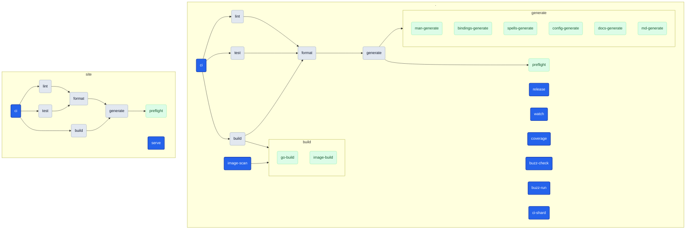

# Targets

<!-- Generated by `magus describe graph -o markdown`. Do not edit by hand. -->

A **target** is a named operation (build, test, lint, …) declared as an `export fun` in a project's magusfile. This cheat sheet (the per-target catalog and dependency graph below) is extracted statically from the magusfile source, so it stays in lockstep with how the project actually builds.

## Quick start

```sh
magus run <target>            # from inside the project directory
magus run <target> <path>     # from anywhere in the workspace
magus run <target>:<charm>    # change HOW it runs (e.g. lint:rw)
```

Unfamiliar with a term? See the [Glossary](#glossary).

## `magus`

<details>
<summary><b>Shared defaults</b>: inputs, outputs &amp; spells shared by every target in <code>magus</code></summary>

```text
sources  **/*.MD, **/*.buzz, **/*.bzz, **/*.go, **/*.markdown, **/*.md, .markdownlint.json, .markdownlint.yaml, go.mod, go.sum, go.work, go.work.sum, magusfile.bzz, magusfile.tl, magusfiles/**/*.bzz, magusfiles/**/*.tl
outputs  internal/std/gen/lua/*.go, internal/std/gen/buzz/*.go, docs/modules/*.md, docs/manpage/gen/*.md, manpage/gen/*.1, cmd/magus/manpages/*.1, MAGUS.md, dist/*
spells   magusfile, go, buzz, md (claims: **/*.md, **/*.mdx)
```

</details>

### `image-scan`

Scans the image with trivy; the `rw` charm writes SARIF and gates on HIGH/CRITICAL.

**Defaults**

```sh
magus run image-scan    # from the project directory
magus run image-scan .  # from the workspace root
```

**Charms**

```sh
magus run image-scan:rw  # mutate in place instead of checking
```

**Depends on:**

- [`image-build`](#image-build)

### `generate`

Regenerates every committed tree (the `*-generate` siblings), then gates on drift.

**Defaults**

```sh
magus run generate    # from the project directory
magus run generate .  # from the workspace root
```

**Charms**

```sh
magus run generate:rw  # mutate in place instead of checking
```

**Depends on:**

- [`preflight`](#preflight)
- [`man-generate`](#man-generate)
- [`bindings-generate`](#bindings-generate)
- [`spells-generate`](#spells-generate)
- [`config-generate`](#config-generate)
- [`docs-generate`](#docs-generate)
- [`md-generate`](#md-generate)

**Details:** uncached (always runs) · isolated (runs alone, no concurrent targets)

### `release`

Cross-compiles a static binary per platform into dist/ and archives each one.

**Defaults**

```sh
magus run release    # from the project directory
magus run release .  # from the workspace root
```

### `watch`

Rebuilds on every debounced change until interrupted (Ctrl-C).

**Defaults**

```sh
magus run watch    # from the project directory
magus run watch .  # from the workspace root
```

**Details:** uncached (always runs)

### `coverage`

Runs the suite with -coverprofile, reads the total off `go tool cover -func`, and writes the coverage.svg badge (color picked by threshold) via the shim.

**Defaults**

```sh
magus run coverage    # from the project directory
magus run coverage .  # from the workspace root
```

### `buzz-check`

Type-checks the repo's standalone Buzz with the upstream `buzz` toolchain.

**Defaults**

```sh
magus run buzz-check    # from the project directory
magus run buzz-check .  # from the workspace root
```

**Executes**

```sh
sh -c find . \( -name '*.buzz' -o -name '*.bzz' \) -print0 | xargs -0 -r -n1 buzz --check
```

### `buzz-run`

Type-checks the standalone Buzz with magus's own embedded engine (`$MAGUS buzz`).

**Defaults**

```sh
magus run buzz-run    # from the project directory
magus run buzz-run .  # from the workspace root
```

### `build`

Compiles one artifact: the host binary, or the container image under the `container` charm.

**Defaults**

```sh
magus run build    # from the project directory
magus run build .  # from the workspace root
```

**Charms**

```sh
magus run build:container  # build the container image instead of the host binary
```

**Depends on:**

- [`format`](#format)
- [`image-build`](#image-build)
- [`go-build`](#go-build)

### `test`

Formats first, then runs the Go test suite.

**Defaults**

```sh
magus run test    # from the project directory
magus run test .  # from the workspace root
```

**Depends on:**

- [`format`](#format)

### `lint`

Formats first, then runs golangci-lint, `go vet`, govulncheck, and markdownlint.

**Defaults**

```sh
magus run lint    # from the project directory
magus run lint .  # from the workspace root
```

**Depends on:**

- [`format`](#format)

### `format`

Regenerates, then formats Go, tidies `go.mod`, and prettifies the docs.

**Defaults**

```sh
magus run format    # from the project directory
magus run format .  # from the workspace root
```

**Depends on:**

- [`generate`](#generate)

### `ci`

Runs lint, build, and test read-only; the affected/pipeline anchor.

**Defaults**

```sh
magus run ci    # from the project directory
magus run ci .  # from the workspace root
```

**Depends on:**

- [`lint`](#lint)
- [`build`](#build)
- [`test`](#test)

### `ci-shard`

Translates a `magus affected --plan` document (read on stdin) into the GitHub Actions shard-matrix outputs and appends them to $GITHUB_OUTPUT (matrix, count, max_parallel) for the workflow's matrix job to fan out on.

**Defaults**

```sh
magus run ci-shard    # from the project directory
magus run ci-shard .  # from the workspace root
```

**Charms**

```sh
magus run ci-shard:gha  # apply the gha charm
```

**Details:** uncached (always runs)

### `go-build`

Compiles the version-stamped magus binary.

**Defaults**

```sh
magus run go-build    # from the project directory
magus run go-build .  # from the workspace root
```

**Executes**

```sh
go build
```

### `image-build`

Builds the Docker image (Dockerfile at the repo root, context = repo).

**Defaults**

```sh
magus run image-build    # from the project directory
magus run image-build .  # from the workspace root
```

**Charms**

```sh
magus run image-build:cd  # apply the cd charm
```

### `man-generate`

Renders the man pages and mirrors them into the embed dir so the shipped binary carries the current set for `magus self install`.

**Defaults**

```sh
magus run man-generate    # from the project directory
magus run man-generate .  # from the workspace root
```

### `bindings-generate`

Regenerates the Go host bindings (internal/std -> gen/{lua,buzz}) from the std.Module declarations.

**Defaults**

```sh
magus run bindings-generate    # from the project directory
magus run bindings-generate .  # from the workspace root
```

### `spells-generate`

Regenerates the compiled built-in spell bytecode (internal/spell/gen).

**Defaults**

```sh
magus run spells-generate    # from the project directory
magus run spells-generate .  # from the workspace root
```

### `config-generate`

Regenerates the CLI config-flag plumbing (cmd/magus/gen, schema fields, env bindings) from internal/config/config.go.

**Defaults**

```sh
magus run config-generate    # from the project directory
magus run config-generate .  # from the workspace root
```

### `docs-generate`

Regenerates the committed Markdown that feeds the docs site — module reference docs (from the host bindings) and man pages (from the CLI registry).

**Defaults**

```sh
magus run docs-generate    # from the project directory
magus run docs-generate .  # from the workspace root
```

### `md-generate`

Renders MAGUS.md (this catalog + dependency graph) via `magus describe graph`.

**Defaults**

```sh
magus run md-generate    # from the project directory
magus run md-generate .  # from the workspace root
```

### `preflight`

Gates the build on workspace health by running `magus doctor`.

**Defaults**

```sh
magus run preflight    # from the project directory
magus run preflight .  # from the workspace root
```

## `magus/site`

<details>
<summary><b>Shared defaults</b>: inputs, outputs &amp; spells shared by every target in <code>magus/site</code></summary>

```text
sources  magusfile.bzz, magusfile.tl, magusfiles/**/*.bzz, magusfiles/**/*.tl, site/magusfile.bzz, site/magusfile.tl, site/magusfiles/**/*.bzz, site/magusfiles/**/*.tl
outputs  site/gen/**
spells   magusfile
```

</details>

### `generate`

generate renders the site then gates on drift: a clean checkout only goes dirty when gen/ actually changed (i.e.

**Defaults**

```sh
magus run generate       # from the project directory
magus run generate site  # from the workspace root
```

**Charms**

```sh
magus run generate:rw  # mutate in place instead of checking
```

**Depends on:**

- [`preflight`](#preflight)

**Details:** uncached (always runs) · isolated (runs alone, no concurrent targets)

### `format`

**Defaults**

```sh
magus run format       # from the project directory
magus run format site  # from the workspace root
```

**Depends on:**

- [`generate`](#generate)

### `lint`

**Defaults**

```sh
magus run lint       # from the project directory
magus run lint site  # from the workspace root
```

**Depends on:**

- [`format`](#format)

### `build`

**Defaults**

```sh
magus run build       # from the project directory
magus run build site  # from the workspace root
```

**Depends on:**

- [`generate`](#generate)

### `test`

**Defaults**

```sh
magus run test       # from the project directory
magus run test site  # from the workspace root
```

**Depends on:**

- [`format`](#format)

### `ci`

'ci' is the conventional anchor `magus affected ci` keys off; it fans out lint/build/test, each of which waits for the render via generate.

**Defaults**

```sh
magus run ci       # from the project directory
magus run ci site  # from the workspace root
```

**Depends on:**

- [`lint`](#lint)
- [`build`](#build)
- [`test`](#test)

### `serve`

serve watches ../docs and re-renders gen/ on change — handy for local docs work.

**Defaults**

```sh
magus run serve       # from the project directory
magus run serve site  # from the workspace root
```

**Details:** uncached (always runs)

### `preflight`

**Defaults**

```sh
magus run preflight       # from the project directory
magus run preflight site  # from the workspace root
```

## Glossary

- **Workspace**: the magus root directory that owns a set of projects and shared config; the unit magus operates over.
- **Project**: a directory magus recognized as a unit of work (it has a magusfile); the unit of caching, scheduling, and dependency tracking.
- **Magusfile**: the `magusfile.bzz` / `magusfile.tl` that declares a project's targets (as `export fun`s) and binds its spells.
- **Target**: a named operation (`build`, `test`, …) you invoke with `magus run <target>`; it may compose a spell's tool-native operations and depend on other targets.
- **Spell**: a language/runtime adapter (e.g. `go`, `md`) that maps generic targets onto a toolchain's real commands.
- **Charm**: an execution modifier attached with `:` (`lint:rw`) that changes _how_ a target runs, not _which_ one; the built-in `rw` flips a check-only target to mutate in place, and `ci` always strips it.
- **Module**: a magus stdlib namespace a magusfile imports for host capabilities: filesystem, exec, vcs, and more.
- **Buzz**: one of the magusfile languages magus supports (the `.bzz` engine); Teal (`.tl`) is the other.

## Dependency graph


