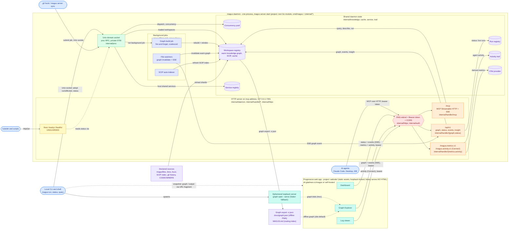

# magus

<p align="center">
  <picture>
    <source srcset="./assets/gopher.webp" type="image/webp">
    
  </picture>
</p>

<!-- Coverage is generated locally by `magus run coverage` (Go toolchain only, no third-party service); regenerate and commit to refresh. -->

<a href="https://github.com/egladman/magus/actions/workflows/ci.yaml"></a>  <a href="https://pkg.go.dev/github.com/egladman/magus"></a>

A fast cross-platform task orchestrator for polyglot (mono)repos.

Magus computes affected projects from your changes, caches the results, and runs the minimum rebuild set after a change.

It is a single statically typed binary that takes its configuration as code, with no second toolchain to install.

## Why magus exists

Monorepos outgrow the people and tools reading them. Humans grep; AI agents
grep faster and guess more confidently; both drown in generated files, legacy
patterns, and dependency chains nobody holds in their head. magus takes the
opposite bet: the build tool already has to know the repo precisely - every
project, every target's inputs and declared outputs, what a diff reaches - so
it should hand that knowledge over as answers instead of leaving everyone to
rediscover it.

That is the design rule for the whole surface: every verb answers a question,
deterministically, from declared sources - which projects does this change
affect, is this file generated and by what, where is this symbol used, how do
these two things relate. Nothing in magus decides for you, plans for you, or
injects itself into your workflow. Answering is the tool's job; deciding is
yours (or your agent's). Verbs and data, never ceremony.

The same discipline serves both audiences. A teammate on day one and an AI
agent in a fresh session have the same problem: a repo they cannot yet trust
their guesses about. magus gives them the same fix: query the
[knowledge graph](docs/knowledge.md) instead of grepping, run
[targets](docs/targets.md) instead of raw tools, and let
`magus affected ci` prove what a change touched. For agents specifically, see
[Agents](docs/agents.md).

---

## Documentation

Full docs live at **[eli.gladman.cc/magus](https://eli.gladman.cc/magus/)**.[^docs-source] The major sections:

- **Core concepts** - [Targets](docs/targets.md), [Spells](docs/spells.md), [Charms](docs/charms.md), [Operations](docs/operations.md), [Services](docs/services.md)
- **Running at scale** - [CI](docs/ci.md), [Daemon](docs/daemon.md), [Remote caching](docs/remote-cache.md), [MCP](docs/mcp.md), [Telemetry](docs/telemetry.md)
- **Reference** - [Man pages](docs/manpage/gen/magus.md), [Standard library modules](docs/buzz/modules/index.md), [Debugging](docs/debugging.md), [Output references](docs/output-refs.md), [Tips and tricks](docs/tips.md)

Inside a workspace, the entry point is the committed [`MAGUS.md`](MAGUS.md): a
generated routing index of the workspace's projects, targets, and the exact
knowledge-graph queries that answer questions about them. Projects can carry
their own (this repo commits one for `gopherbuzz/` and `website/`), scoped to
that project. They are generated by `magus describe graph -o markdown` via the
`generate` target - regenerate them, never hand-edit.

## Install

magus ships as a single self-contained binary. See the [Download guide](docs/download.md).

## Optional browser UI

magus is fully featured from the terminal - everything here is optional. Alongside the CLI, it can drive three read-only browser surfaces:

> **See it first:** [open the live demo](https://eli.gladman.cc/magus/console/dashboard/#demo) - no install, no daemon. It fills the dashboard with synthesized activity, streams a build into the log viewer, and lets you jump between all three apps in demo mode. Everything below runs against your own daemon instead.

- **[Dashboard](https://eli.gladman.cc/magus/console/dashboard/)** - live daemon health, the concurrency pool, running targets, and cache activity.
- **[Graph explorer](https://eli.gladman.cc/magus/console/graph/)** - navigate targets, spells, and their dependency graph (`magus graph open`).
- **[Log viewer](https://eli.gladman.cc/magus/console/logs/)** - read or stream any past run's captured output (`magus query output <ref> --open`).

These are complementary add-ons, not a runtime you depend on. Two things set them apart architecturally:

- **The binary serves no HTML.** magus never embeds a web server that ships a UI. The pages are a separate static site (built under [`website/gen/`](https://github.com/egladman/magus/tree/main/website/gen), hosted at [eli.gladman.cc/magus](https://eli.gladman.cc/magus/), or self-hosted from any file server). All the daemon exposes is a small read-only API over loopback (`/api/v1/...`) plus the MCP endpoint - no page serving, no write routes.
- **Your data never leaves your machine.** The hosted page talks only to `127.0.0.1`/`[::1]` - a loopback lock the page enforces before any request - or receives your graph inline through a URL fragment. Nothing is uploaded. You can drop the UI entirely: the daemon runs fine without it (`bridge.enabled: false`), and a binary built without `-tags mcp` has no browser API at all. See the [Console reference](https://eli.gladman.cc/magus/console/).

## Architecture

One process (`magus server start`) exposes the workspace through **two listeners**, one per audience, and every browser page is a **separate static asset** - the binary serves no HTML. The diagram below is the whole system: the clients, the two transports and their guards, the shared in-memory state, the background jobs and knowledge-graph pipeline that keep it warm, and how the progressive web app reaches (or does without) the daemon.



**How to read it, and where each part is documented:**

- **Green - the Unix domain socket** is the local control plane: it dispatches `run`/`affected` into one shared [concurrency pool](docs/daemon.md#concurrency), answers `magus status`, and adopts nested `magus` calls. Fast and private (`0700`); the local CLI and the `--probe=liveness`/`--probe=readiness` checks use it.
- **Orange - the HTTP server** on `mcp.address` is the plane for clients that cannot reach a Unix socket. It carries [MCP](docs/mcp.md) for agents at `/mcp`, the read-only [`/api/v1` console routes](docs/console.md#what-the-console-serves), and Connect services for the dashboard's metrics and [activity trail](docs/output-refs.md). Its request/response types are protobuf-defined under [`proto/magus`](proto/magus) - [status](proto/magus/status/v1/status.proto), [graph](proto/magus/graph/v1/graph.proto), [query](proto/magus/query/v1/query.proto), [metrics](proto/magus/metrics/v1/metrics.proto), [activity](proto/magus/activity/v1/activity.proto), and [viewer](proto/magus/viewer/v1/viewer.proto) (the log viewer) - generated by `buf` and served over Connect/JSON.
- **Red - every HTTP route except health passes one guard chain**: a [DNS-rebind](docs/console.md#how-it-is-secured) host check, a [bearer token](docs/mcp.md#security-keep-this-local) (the cli token plus named connector tokens), and CORS scoped to the site and loopback origins.
- **Yellow - the health routes are deliberately unguarded** so a kubelet can probe them; they answer by querying the same Unix socket. See [Kubernetes and container probes](docs/daemon.md#kubernetes-and-container-probes).
- **Purple - shared state is daemon-wide and warm**: the [knowledge graph](docs/knowledge.md) and SCIP index live in the workspace registry; runs, services, metrics, and the trail are daemon-wide registries. The same purple marks the graph's inputs and outputs - the declared sources it is extracted from, and the exports it produces.
- **Indigo - background jobs keep that state fresh** without a foreground command. File watchers invalidate the warm graph (and push an SSE `event: graph` to the console) and a throttled SCIP auto-indexer keeps symbols current; a branch switch fires the git hook, which calls [`magus server sync`](docs/daemon.md) to submit one fire-and-forget, coalesced graph-build job over the socket.
- **The graph pipeline (purple + indigo).** magus assembles the [knowledge graph](docs/knowledge.md) from declared sources as shards (the magusfile registry, docs, `@symbols` from SCIP, `@vcs` from git history, `CODEOWNERS`). `magus graph export -o json` serializes it to the committed `docs/graph.json` that the offline Graph Explorer loads, and `magus describe graph -o markdown` writes the `MAGUS.md` routing index. Live, the same graph is served byte-identical at [`/api/v1/graph`](docs/console.md#what-the-console-serves).
- **Teal - the PWA is three static apps**, each hitting only the endpoints it needs (all through the same guard chain, bearer header, loopback-locked):
  - **[Dashboard](https://eli.gladman.cc/magus/console/dashboard/)** - `/api/v1/status` + the `/api/v1/events` SSE stream, plus the metrics and activity Connect services.
  - **[Graph Explorer](https://eli.gladman.cc/magus/console/graph/)** - `/api/v1/graph` (and its `flavor`/`level`/`select` variants) + the SSE stream for change events.
  - **[Log viewer](https://eli.gladman.cc/magus/console/logs/)** - the activity Connect service for recent runs and their [output refs](docs/output-refs.md).

  That is **live** mode. In **snapshot** mode an app needs no daemon at all: the graph (`docs/graph.json`) or a run's output arrives inline through a URL fragment, or from the ephemeral `graph open --serve` loopback server (the Safari fallback). Nothing is ever uploaded. Full detail in the [Console reference](docs/console.md).

- **Boundaries.** Each region is tagged with the Go package or project that owns it, so the diagram doubles as a code map: the runtime is the root module (`cmd/magus` plus `internal/*`), the browser apps are the [`website/`](#project-layout) project, and the wire contracts are the [`proto/magus`](proto/magus) protobufs.

Because the two listeners are separate, they can diverge - the proc socket can be healthy while the HTTP/MCP endpoint failed to bind - which is exactly why `magus status` reports each one on its own line.

---

## Development

For the full contributor reference - the [Contributing guide](https://eli.gladman.cc/magus/development/contributing/), per-project target catalogs (run order + dependency graphs), and the config reference - see the [Development page](https://eli.gladman.cc/magus/development/).

Building magus needs Go. The full toolchain - Go itself, plus Node and esbuild for the docs site and TinyGo for the WebAssembly playground - is pinned in [`mise.toml`](https://github.com/egladman/magus/blob/main/mise.toml); [mise](https://mise.jdx.dev/) installs it in one step. From a fresh clone:

```sh
git clone https://github.com/egladman/magus
cd magus
mise install           # installs the pinned Go, Node, esbuild, and TinyGo
go build -o magus ./cmd/magus
```

Only building the `magus` binary? Go alone is enough and you can skip `mise install`; you need it for the docs site (`magus run generate website`) and the playground.

Run the tests through magus itself - the whole point is that magus builds and tests magus:

```sh
magus run ci
```

### Project layout

```text
magus/
├── cmd/
│   ├── magus/            CLI entry point
│   ├── magus-utils/      release signing + config-doc generators
│   ├── magus-docs/       stdlib module doc generator
│   └── magus-manpage/    man-page generator
├── internal/             core engine (~30 packages), the notable ones:
│   ├── depgraph/         affected-set computation over the project graph
│   ├── cache/            content-addressed build cache
│   ├── run/              target scheduling and the run hierarchy
│   ├── sandbox/          filesystem + exec isolation for target runs
│   ├── ward/             coded op diagnostics (the MGSxxxx wards)
│   ├── workspace/        project + magusfile discovery
│   ├── observability/    OpenTelemetry traces and metrics
│   ├── httpx/            loopback HTTP transport + composable middleware/guards
│   ├── handler/          domain<->proto wire mapping + HTTP route handlers (mirrors proto);
│   │                     includes handler/mcp (the Model Context Protocol server)
│   ├── service/          application logic: shared-service ops, and service/console (web UI)
│   ├── daemon/           assembles the daemon HTTP server (MCP + /api) from the above
│   ├── auth/             the daemon's bearer-token store
│   └── ...               (cache, proc, retry, selfupdate, render, report, doctor, describe, ...)
├── gopherbuzz/           the embedded Buzz interpreter
├── std/                  magusfile stdlib (fs, os, http, json, crypto, ...)
├── spells/               built-in language spells (go, rust, typescript, ...)
├── schema/               generated magus.yaml / MAGUS_* config inventory
├── docs/                 documentation source (rendered by `magus run generate website`)
└── website/              docs-site generator (Buzz-based static site)
```

[^docs-source]: Source: [website/](https://github.com/egladman/magus/tree/main/website).
