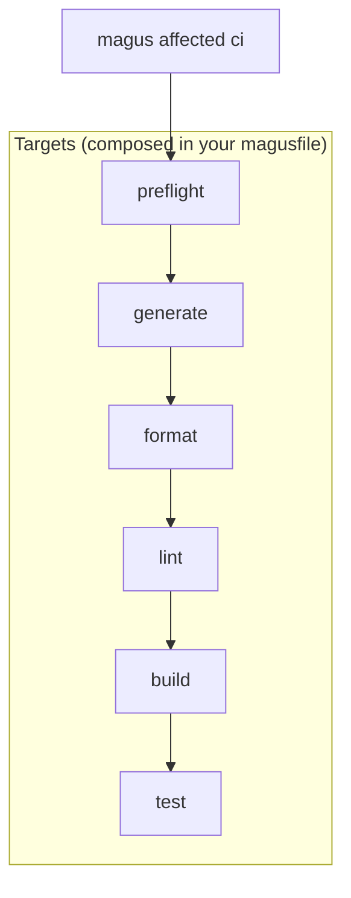
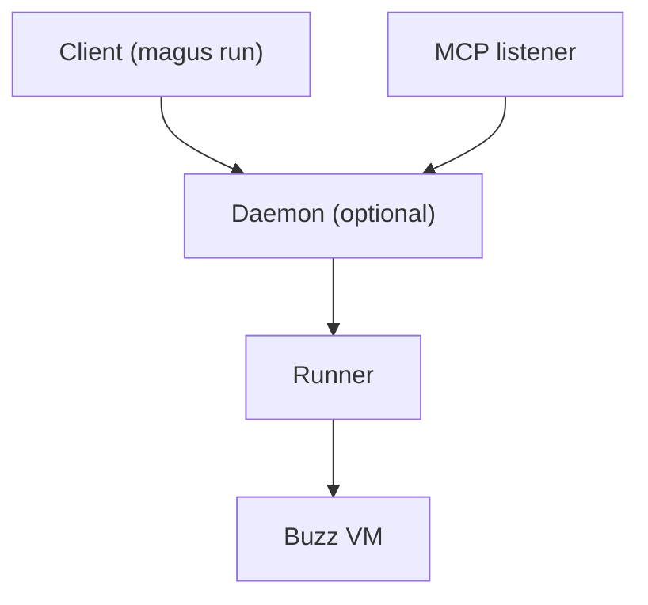

# magus

<p align="center">
  
</p>

<!-- Generated locally by `magus run coverage` (Go toolchain only, no third-party service); regenerate and commit to refresh. -->


A fast cross-platform task orchestrator for polyglot (mono)repos.

Magus computes affected projects from your changes, caches the results, and runs the minimum rebuild set after a change.

Single binary. Code as configuration. Statically typed. No second toolchain.

---

## Contents

**Get started.** [Install](#install) · [Quick start](#quick-start) · [Shell setup](#shell-setup)

**Build model.** [Philosophy](#philosophy) · [Concepts](#concepts) · [Spells vs Targets](docs/spells.md#spells-vs-targets) · [Workspace scope](#workspace-scope) · [Project dependencies](#project-dependencies)

**Running targets.** [Target syntax](#target-syntax) · [Argument forwarding](#argument-forwarding) · [Change detection](#change-detection) · [Concurrency](#concurrency) · [Recursion](#recursion) · [CI Pipeline](#ci-pipeline)

**Magusfiles.** [Magusfile.buzz](#magusfilebuzz) · [Runtime API](#runtime-api-three-tiers) · [Spells](#spells)

**CLI.** [Tips & Tricks](#tips--tricks) · [Commands](#commands) · [x: interactive picker](#x-interactive-picker) · [repl: interactive shell](#repl-interactive-shell) · [where: project path lookup](#where-project-path-lookup) · [affected --plan / --bisect: CI sharding and bisection](#affected---plan-and---bisect-ci-sharding-and-bisection) · [Output formats](#output-formats)

**Operations.** [Running magus as a daemon](#running-magus-as-a-daemon) · [MCP: driving magus from agents](#mcp-driving-magus-from-agents) · [Sandbox](#sandbox) · [Telemetry (OpenTelemetry)](#telemetry-opentelemetry) · [Debugging](#debugging)

**Project.** [License](#license)

---

## Philosophy

Build systems sit in the hot path of development. They get touched constantly, and small frictions compound fast.

Spells are **libraries of tool-native operations**. The `go` spell exposes `build`/`test`/`vet`/`fmt`/`lint`, the `rust` spell `build`/`test`/`clippy`/`fmt`, and your magusfile composes them into the runnable targets you want. Magus does not decide what "lint" or "format" means; it caches, computes affected sets, and orchestrates (see [Spells](#spells)).

The cache, the daemon socket, and the run log are all files on disk. Inspect them with `ls` and `cat`.

---

## Install

TODO

<!--
### From a release binary

Download the latest release for your platform from the [releases page](https://github.com/egladman/magus/releases), extract the archive, and run:

```sh
./magus self install
```

This installs the binary to `~/.local/bin/magus`, writes man pages to `~/.local/share/man/man1`, and prints next steps for PATH and shell completion. No dotfiles are modified.

Use `--bin-dir` and `--man-dir` to override the target directories:

```sh
./magus self install --bin-dir ~/bin --man-dir ~/share/man/man1
```

### From source

```sh
git clone https://github.com/egladman/magus
cd magus
go build -tags selfmanage -o magus ./cmd/magus
```

### Keeping up to date

Once installed, update in place with:

```sh
magus self update
```
-->

---

## Quick start

**1. Initialize the workspace**

From the root of your repo:

```sh
magus init
```

Writes `magus.yaml`, stubs `magusfile.buzz`, and wires the VCS merge driver. Config goes to `$XDG_CONFIG_HOME/magus/magus.yaml` by default; `--local` writes it into the repo instead.

**2. Edit the magusfile**

`magus init` drops a starter `magusfile.buzz` registering your project and wiring the CI pipeline. Targets are declared as exported functions, with no registration call needed:

```buzz
// magusfile.buzz (generated by `magus init`)
import "magus";
import "spells/hello";   // ./spells/hello/spell.buzz

magus.project({
    "spells": [hello],
});

// Each exported function becomes a runnable target.
// 'ci' is the canonical entry point for `magus affected ci`.
export fun preflight(args: [str]) > void {}
export fun generate(args: [str]) > void {}
export fun format(args: [str]) > void {}
export fun lint(args: [str]) > void {}
export fun build(args: [str]) > void { hello.build(); }
export fun test(args: [str]) > void {}
```

**3. Verify**

```sh
magus ls               # lists the registered project
magus run build        # delegates to hello's build target
magus run ci           # runs the ci target you composed, read-only
```

---

## Target syntax

Full reference: [Anatomy of a Target](docs/targets.md). New to the spell/target split? Start with [Spells vs Targets](docs/spells.md#spells-vs-targets).

The full form of a run target is:

```
magus run [<spell>::]<target-or-op>[:<charm>,...] [project...] [-- <extra args>]
```

The project is always a positional argument; the `:` after a target introduces
**charms**, not a project path.

**Basic**

```sh
magus run build          # build the cwd project (or all if not inside one)
magus run test api       # test the 'api' project specifically
magus run lint /         # lint every project in the workspace
```

**Spell-qualified (`::`)**

`spell::op` invokes a single spell's op **directly**, bypassing your composed targets. It is an escape hatch for ad-hoc runs and introspection. The token after `::` is a spell **op** (its CLI-command name), not a lifecycle target:

```sh
magus run typescript::eslint api    # the eslint op of the typescript spell on 'api'
magus run go::go-test /             # the go-test op of the go spell across all projects
```

The spell name matches one of the built-in identifiers (`go`, `typescript`, `python`, `rust`, etc.); op names are matched verbatim, so `go::go-vet` runs while `go::lint` is a graceful no-op (the go spell's linter op is `golangci-lint`). See [Naming operations](docs/spells.md#naming-operations).

**`::` works with `affected` too:**

```sh
magus affected typescript::eslint
```

**Charms (`:`)**

A charm is a shared, named execution modifier, an intent like `rw` that each
target interprets in its own way (`format` rewrites files, `generate` writes
outputs). Reuse charms across targets rather than defining them per-target.
Append a comma-separated list after the target with `:`; names use
the target charset (`[A-Za-z0-9_-]`).

`rw` is the built-in read→write charm, activated like any other with a `:rw` suffix:

```sh
magus run format:rw api    # the rw charm on format, in project api
```

Charms **stack**: pass several and they all apply (order- and
duplicate-insensitive), so orthogonal intents compose:

```sh
magus run lint:rw,debug    # autofix + verbose, together
```

The default (no `rw`) is read-only, and CI always runs read-only. Spells read
charms from context via `HasCharm`, so workspaces can introduce their own shared
charms. See [docs/charms.md](docs/charms.md).

---

## CI Pipeline

`ci` is an ordinary magusfile target; magus does not hardcode its steps. Export a `ci` function, wire the pipeline with `magus.needs`, and magus runs it read-only.

```buzz
export fun ci(args: [str]) > void {
    // declare the edges you want; independent steps run in parallel
    magus.needs(
        magus.target.literal("preflight"),
        magus.target.literal("generate"),
        magus.target.literal("format"),
        magus.target.literal("lint"),
        magus.target.literal("build"),
        magus.target.literal("test"),
    );
}
```

### Recommended order

We document this order; we don't enforce it. Chain steps with `magus.needs` where order matters (e.g. `test` depends on `build`).



### Shared cache trust: signing and read-only refs

**Who may write the cache is a trust boundary.** The primary defense is Ed25519 signing: a consumer replays a remote artifact only if it carries a signature from a key in `cache.remote.trusted_keys`. Wiring a remote backend without a trust set is refused.

```yaml
# magus.yaml  -  bind the backend in magusfile.buzz via magus.cache.remote(github)
cache:
  remote:
    trusted_keys:
      - "<base64 Ed25519 public key>"   # magus config cache key generate
```

A complementary defense is to open the cache **read-only on untrusted refs**: replay hits but never publish. Gate it on the event so only trusted pushes write, and apply the same rule to any persisted run history (the forecaster and flake detector read it): restore always, save only from trusted pushes.

```yaml
# PRs replay the cache and see main's history, but write neither
MAGUS_CACHE_IMMUTABLE: ${{ github.event_name == 'pull_request' }}
```

To set up a shared cache (GitHub Actions Cache, S3/MinIO/R2/B2, or your own backend) and generate signing keys, see [Remote caching](docs/remote-cache.md).

---

## Recursion

Targets can call `magus` recursively. Child invocations forward work to the parent process over a local socket; concurrency limits are shared, so nested calls draw from the same budget instead of each grabbing their own slots.

```buzz
magus.cmd(["run", "build", "api"]);
```

`magus.cmd` is the in-magusfile entry point for invoking magus recursively. When a [daemon](#running-magus-as-a-daemon) is running, the call rides the existing socket connection instead of spawning a new process.

---

## Change detection

`magus affected` computes the minimum rebuild set after a change.

By default it shells out to your VCS (`git`, `hg`, or `jj`), maps changed
files to projects, then walks the reverse dependency graph.

```sh
magus affected build
magus affected test -b origin/main
```

You can also pipe changed paths over stdin:

```sh
git diff --name-only HEAD~1 | magus affected --stdin test
```

---

## Concepts

### Build model

A **spell** is _how_ a tool does something (the `go-vet` op); a **target** is _what_ you run (`magus run lint`). You **bind** spells and **invoke** targets. See [Anatomy of a Spell](docs/spells.md) (and [Spells vs Targets](docs/spells.md#spells-vs-targets)) and [Anatomy of a Target](docs/targets.md).

### Runtime architecture



- **Client**: any `magus` CLI invocation
- **Daemon**: optional persistent process that holds workspace state and shares one concurrency pool across all clients
- **Runner**: in-process magusfile evaluator that runs the magusfile on the embedded Buzz VM
- **MCP listener**: HTTP endpoint that exposes a read-mostly subset of magus to agents (see [MCP](#mcp-driving-magus-from-agents))

---

## Workspace scope

magus scopes to the current working directory by default.

```sh
magus run build        # current project
magus run build api    # explicit project (workspace-relative)
magus run build ../web # relative to cwd: from web/studio this targets web/web
magus run build .      # the project containing the cwd
magus run build /      # entire workspace
```

Bare paths (`api`, `web/studio`) are always workspace-relative; dot-relative
paths (`./x`, `../x`) resolve against the current directory. Absolute paths and
paths that escape the workspace root are rejected, so magus never operates
outside the workspace it discovered. See [`docs/targets.md`](docs/targets.md#path-resolution-on-the-cli)
for the full rules, including how symlinks are treated.

### Scope: descend only, never ascend

Every spell runs with `cwd = project.Dir` and can only reach files below it. Sibling projects are structurally invisible: a formatter on `api` cannot touch `web` regardless of its glob pattern.

If a spell walks into a registered **descendant** project's directory, magus catches it at runtime (write-mode targets only) and emits diagnostic code **MGS3001**. See [`docs/codes/sandbox/MGS3001.md`](docs/codes/sandbox/MGS3001.md).

---

## Concurrency

Magus runs project builds in parallel up to a configurable limit.

```sh
magus run build --concurrency=4
magus config set key=concurrency,value=4
MAGUS_CONCURRENCY=4 magus run build
```

When a [daemon](#running-magus-as-a-daemon) is running, all clients share a single concurrency pool. Parallel CI steps and nested `magus` invocations all draw from the same budget.

`magus status` shows the live pool state and current slot usage.

---

## Argument forwarding

Append `--` after the project selector to forward extra arguments to the target function. Everything before `--` is parsed by magus (flags, project names). Everything after is passed verbatim as the `args` array in the target function; magus never touches it.

```sh
magus run go::go-test -- -run TestAuth
magus run go::go-test api -- -v -run TestFoo   # select project 'api', then forward
magus affected go::go-test -- -race            # affected projects, race detector on
```

Inside a magusfile target the forwarded args arrive as the first parameter:

```buzz
export fun test(args: [str]) > void {
    var argv = ["test", "./..."];
    for (a in args) { argv.append(a); }
    os.exec("go", argv);
}
```

```sh
magus run test -- -run TestAuth -count=1
# → go test ./... -run TestAuth -count=1
```

If no `--` is present, `args` is an empty array.

---

## Spells

### Built-in

Built-in spells are compiled into the magus binary.

```buzz
import "magus/spell/go";
magus.project({ "spells": [go] });
```

Available built-ins:
`go`, `typescript`, `python`, `rust`, `bash`, `buf`, `buzz`,
`docker`, `cosign`, `markdown`

---

### Spells expose tool-native operations

Full reference: [Anatomy of a Spell](docs/spells.md), including the [Spells vs Targets](docs/spells.md#spells-vs-targets) boundary and when to use each.

A spell is a **library of tool-native operations**. Binding one to a project contributes its `needs`/`claims`/`provides` to the cache key and affected set but runs nothing on its own: you wire ops to lifecycle targets in your magusfile:

Each op is named after the CLI command it runs ([Naming operations](docs/spells.md#naming-operations)):

- `go`: `go-build`, `go-test`, `go-vet`, `go-generate`, `go-clean`, `go-fmt`, `golangci-lint`, `go-mod-tidy`
- `rust`: `cargo-build`, `cargo-test`, `cargo-clippy`, `cargo-fmt`, `cargo-clean`
- `python`: `uv-build`, `pytest`, `ruff-check`, `ruff-format`, `uv-clean`
- `ts`: `tsc`, `eslint`, `prettier`, `vitest` · `js`: `eslint`, `prettier`, `vitest`

Lifecycle composition is yours. You decide which op backs
`build`/`test`/`lint`/`format`/`ci` by wiring targets in your magusfile. Op keys are
matched verbatim, so kebab names are reached by subscript:

```buzz
import "magus/spell/go";
magus.project({ "spells": [go] });

export fun build(args: [str])  > void { go["go-build"]({ "cwd": "." }); }
export fun lint(args: [str])   > void { go["golangci-lint"]({ "cwd": "." }); }
export fun format(args: [str]) > void { go["go-fmt"]({ "cwd": "." }); }
export fun test(args: [str])   > void { go["go-test"]({ "cwd": "." }); }
```

`magus run build <project>` runs the target your magusfile exported; until you
export one, it is a graceful no-op. You can also reach a single spell op directly
with the `::` hatch: `magus run go::go-vet <project>`.

The handle also exposes `handle.listTargets()` (returns the sorted op names) for
introspection; ops are invoked through the per-op methods above.

---

### Extending a built-in

**Override an op in your magusfile**

A spell's ops are fixed data, but a target is just a function. To back one step
with a different tool, write that target's body yourself and delegate the rest to
the spell:

```buzz
import "magus/spell/go";
import "os";
magus.project("api/", { "spells": [go] });

export fun build(args: [str]) > void { go["go-build"]({ "cwd": "api/" }); }
export fun lint(args: [str])  > void { go["golangci-lint"]({ "cwd": "api/" }); }

// use gotestsum instead of `go test` for this project
export fun test(args: [str]) > void {
    os.exec("gotestsum", ["--", "./..."], "api/");
}
```

---

### Custom Spells

Workspace-local spell files let you add any toolchain that isn't a built-in. A
spell file is a module that exposes the spell contract as `mgs_`-prefixed
functions: the required `mgs_getName`, plus optional `mgs_listRequiredGlobs`,
`mgs_listProvidedGlobs`, `mgs_listTargets`, and others. Each `mgs_listTargets`
entry names a command and its argv; magus forks it directly, with no shell and no
variable expansion, so invocations are deterministic and injection-safe.

#### File spell (`spells/ruby.buzz`)

```buzz
export fun mgs_getName() > str { return "ruby"; }
export fun mgs_listRequiredGlobs(_dir: str) > [str] {
    return ["**/*.rb", "Gemfile", "Gemfile.lock", "*.gemspec", ".rubocop.yml"];
}
export fun mgs_listProvidedGlobs() > [str] { return ["vendor/bundle/**/*"]; }
export fun mgs_listTargets() > any {
    return {
        "bundle":  { "cmd": "bundle", "args": ["install"] },
        "rspec":   { "cmd": "bundle", "args": ["exec", "rspec"] },
        "rubocop": { "cmd": "bundle", "args": ["exec", "rubocop", "--check"],
                     "charms": { "rw": {"ops": [{"op": "replace", "path": "/2", "value": "-A"}]} } },
    };
}
```

#### Consuming a file spell (`magusfile.buzz`)

Import the spell file by path: `import "spells/ruby"` resolves
`./spells/ruby.buzz` and binds its handle under the basename (use `as` to rename):

```buzz
import "spells/ruby" as rb;
magus.project("gems/", { "spells": [rb] });

export fun test(args: [str]) > void { rb.rspec({ "cwd": "gems/" }); }
export fun lint(args: [str]) > void { rb.rubocop({ "cwd": "gems/" }); }
```

The imported handle is pure: it registers nothing on its own. Binding happens
when the handle is listed in `magus.project`'s `spells`.

For a step that needs a shell or arbitrary logic, skip the spell and write the
target body directly with `extra.*` (see [Runtime API](#runtime-api-three-tiers)).

#### Best practices

The cache key is the SHA-256 of source file contents, so the globs you declare
are the contract for correctness:

- **List every file that can change the output in `mgs_listRequiredGlobs` (or `needs`).**
  A file read at build time but absent from the required globs is an invisible
  input: magus can't tell it changed and replays a stale hit. The usual
  culprits: lockfiles (`Gemfile.lock`), tool config (`.rubocop.yml`), metadata
  (`*.gemspec`), and build recipes (`Makefile`, `Rakefile`).
- **Declare `mgs_listProvidedGlobs` (or `provides`) so the cache can replay outputs.**
  Omit them and the spell reruns on every build. List only the workspace-relative
  paths your spell writes. Over-declaring (`**/*`) snapshots far more
  than necessary and slows every replay.
- **Toolchain version is not in the cache key by default.** Upgrade Ruby or
  Bundler without touching tracked files and magus replays output built with the
  old version. This is the single biggest footgun for custom spells. Best fix: commit
  the version to a source-hashed file (`.ruby-version`, `.tool-versions`, a
  `Dockerfile`) and add it to your required globs, so a bump is a natural miss.
  Escape hatch: `magus cache clean` after an upgrade. Skippable only when the
  version has no bearing on output.

The magusfile itself is already in the key: editing a target's argv (or any
file under `magusfiles/`) invalidates automatically, and upgrading magus remixes
the built-in spell fingerprint into every key (one rebuild on the next run).
Audit any key with `magus describe build`, which lists the sources, env vars,
and outputs that compose it.

---

## Project dependencies

Magus infers dependencies between projects automatically from language manifests: `go.mod` `require` directives, `Cargo.toml` `path = "..."` entries, and `package.json` `workspace:*` entries. You only need to declare dependencies explicitly when magus can't see the edge, typically cross-language relationships or codegen producers.

**In a magusfile.buzz:**

```buzz
magus.project("apps/ui", {
    "spell":      { "name": "typescript" },
    "depends_on": ["api", "internal/schema"],
});
```

Paths can be repo-relative (`"api"`) or relative to the declaring project (`"../api"`).

Declared dependencies affect `magus affected`: when `api` changes, `apps/ui` is included in the affected set and rebuilt downstream. They also appear in `magus describe` output and graph views.

---

## Tips & Tricks

Non-obvious ways to combine magus subcommands.

### Live pool snapshot in a multiplexer sidebar

`magus status` is a non-blocking, one-shot RPC snapshot: it returns immediately whether the daemon is running or not. Combine `--compact` (a single densely-packed line) with `--watch` to keep a tmux/screen sidebar pane current:

```sh
magus status --compact --watch=1s
```

Sample output:

```
daemon 3/8 busy · api:build(2.1s) · ui:test(0.5s) · 1 ws
```

When no daemon is running the line reads `daemon: off`, with no error and no hang. Drop `--compact` for the full grid view when you have a wider pane to spare.

### Step through a target to diagnose a flaky build

`magus run --step` pauses before every subprocess and lets you inspect state, skip commands, or open a REPL mid-run. Concurrency is forced to 1, so commands execute one at a time:

```sh
magus run build --step
magus affected build --step
```

See [`--step`](docs/debugging.md#--step) for the full prompt reference.

### Re-run only affected projects on each save

Pipe `magus watch` into `magus affected --stdin` for a tight inner loop that re-runs only the projects touched by each edit:

```sh
magus watch | while IFS= read -r path; do
    echo "$path" | magus affected --stdin test
done
```

### One-shot daemon health probe

`magus status` exits 0 even when the daemon is down (the pool block reads `daemon: off`). Use it as a cheap, non-blocking reachability probe in scripts or CI health checks, with no risk of hanging on a network timeout:

```sh
magus status
magus status -o json   # machine-readable output
```

---

## Commands

| Command        | Purpose                                                                                                                                                      |
| -------------- | ------------------------------------------------------------------------------------------------------------------------------------------------------------ |
| `ls`           | List discovered projects                                                                                                                                     |
| `where`        | Print the absolute path of a project (fuzzy match)                                                                                                           |
| `describe`     | Explain why a project is in the affected set                                                                                                                 |
| `run`          | Run a target for selected projects                                                                                                                           |
| `x`            | Interactive picker: choose project + target (TTY only)                                                                                                       |
| `affected`     | Run a target against VCS-affected projects; `--stdin` reads paths from stdin, `--plan` emits a CI shard plan, `--bisect` finds a regression's culprit commit |
| `watch`        | Emit changed paths to stdout                                                                                                                                 |
| `tail`         | Stream the most recent cached log for the cwd project                                                                                                        |
| `status`       | Show telemetry, cache settings, and the live concurrency pool                                                                                                |
| `doctor`       | Validate the workspace                                                                                                                                       |
| `config`       | View or update configuration (`init`, `view`, `set`, `history`, `cache`)                                                                                     |
| `server`       | Manage the persistent daemon (`start`, `stop`, `status`)                                                                                                     |
| `repl`         | Interactive Buzz REPL with the magusfile bindings preloaded                                                                                                  |
| `completion`   | Print a shell completion script (`bash`, `zsh`, `fish`)                                                                                                      |
| `self update`  | Update magus to the latest release (replaces running binary)                                                                                                 |
| `self install` | Install magus to `~/.local/bin` (fresh install with man pages)                                                                                               |
| `version`      | Print version, commit, and build date                                                                                                                        |

---

## x: interactive picker

`magus x` is a TTY shorthand for `magus run`. It presents a fuzzy project picker followed by a target picker, then executes the selection.

```sh
magus x           # browse all projects
magus x api       # pre-filter to projects matching 'api'
magus x web ui    # AND-filter: projects matching both 'web' and 'ui'
```

The target list is: `build`, `test`, `lint`, `format`, `clean`, `generate`, `ci`.

`x` remembers the last target used per project and pre-highlights it on the next run.

`magus x` refuses to run outside an interactive terminal. To override (e.g. in a wrapper script), set `assume_interactive: true` in `magus.yaml` or `MAGUS_ASSUME_INTERACTIVE=1`.

---

## repl: interactive shell

`magus repl` opens an interactive Buzz REPL with the same runtime environment available to a magusfile: the `magus` object (including the `extra` modules and spell bindings) is preloaded.

```sh
magus repl
```

If a `magusfile.buzz` is present at or above the current directory, it is executed automatically on startup so registered targets and locals are available.

### `--no-autoload`

Skip executing the magusfile on start.

Useful when you want a blank environment to experiment without side-effects from your project's startup code.

### `-C <dir>`

Set the working directory for `import` resolution (default: cwd).

```sh
magus repl -C internal/auth
```

See [docs/debugging.md](docs/debugging.md) for the full meta-command reference and multiline behavior.

---

## where: project path lookup

`magus where` prints the absolute path of a project **or file** to stdout. No TTY picker, no prompts. Designed for shell substitution.

```sh
cd "$(magus where api)"
code "$(magus where dash)"
```

Filters are AND-combined substrings with leaf-anchored scoring. A unique top match prints the path and exits 0. Ambiguity lists candidates on stderr and exits 2.

```sh
magus where api gateway   # must match both 'api' and 'gateway'
```

### File fallback

When no project matches the filters, `magus where` falls back to fuzzy file search across the workspace. The same AND-substring filters and leaf-anchored ranking apply to file paths.

```sh
vim "$(magus where readme.md)"
cat "$(magus where api server.go)"   # path must contain both 'api' and 'server.go'
magus where --all --glob '**/*.go' | xargs wc -l
```

Well-known build and vendor directories are pruned automatically (`.git`, `node_modules`, `vendor`, `target`, `gen`, and the rest of the `IgnoreDirs` list). Symlinks are skipped.

**Scoring and ambiguity:** when filter tokens are present, the top scorer wins as usual, unique or not. When only a pattern flag is given with no filter tokens, every matching file scores 0 (no basis for ranking); use `--all` and pipe to `fzf` in that case.

### `--all` / `-A` and pattern flags

`--all`/`-A` prints every match instead of erroring on ambiguity. Restrict the
file fallback to a pattern with `--glob`, `--regex`, or `--literal` (same
semantics as `magus watch --ignore`; one per invocation, `--filter` is the long
form for patterns containing a comma):

```sh
magus where -A server | fzf --select-1
magus where --glob '**/*_test.go' api    # test files with 'api' in path
magus where --literal Dockerfile web     # Dockerfile under a path containing 'web'
```

Full flag reference: [`magus where`](docs/manpage/gen/magus-where.md).

---

## affected --plan and --bisect: CI sharding and bisection

`magus affected` has two forensic modes that reason about the affected set from the outside rather than executing a target. They are siblings of `--explain`: `--plan` shards the set for CI fan-out, and `--bisect` hunts a regression's culprit commit. Neither executes the pipeline. Use `magus run ci` or `magus affected ci` for that. Full flag reference: [`magus affected`](docs/manpage/gen/magus-affected.md).

### `affected --plan`: shard the affected set

Emits a provider-neutral JSON shard plan for the affected project set, keyed off the `ci` anchor. `--max-shards` caps the shard count; `--max-parallel-budget` caps cross-shard parallelism. Adaptive sharding balances by past duration when `history_path` (or `MAGUS_HISTORY_PATH`) is set.

```sh
magus affected --plan
magus affected --plan --max-shards=8
```

```json
{
  "count": 3, "max_parallel": 3, "source": "git",
  "matrix": [
    { "shard": "0", "projects": "api auth" },
    { "shard": "1", "projects": "web" },
    { "shard": "2", "projects": "worker" }
  ]
}
```

A little glue adapts the output to a provider's job matrix. See the [magus github action](./.github/actions/magus):

```yaml
jobs:
  plan:
    runs-on: ubuntu-latest
    outputs:
      matrix: ${{ steps.plan.outputs.matrix }}
    steps:
      - uses: actions/checkout@v4
      - id: plan
        run: echo "matrix=$(magus affected --plan | jq -c)" >> "$GITHUB_OUTPUT"
  ci:
    needs: plan
    runs-on: ubuntu-latest
    strategy:
      matrix: ${{ fromJson(needs.plan.outputs.matrix) }}
    steps:
      - uses: actions/checkout@v4
      - run: magus run ci --shard=${{ matrix.shard }} ${{ matrix.projects }}
```

### `affected --bisect`: find the regression commit

Drives `git bisect` (or `hg bisect`) automatically to find the commit that introduced a test failure. Requires run history with a confirmed regression (clean passing history followed by consistent failures). Magus derives the last known-good commit from recorded pass timestamps (override with `--good`), runs `magus run test --no-flake-retry <project>` at each step (override the target with `--target`), and prints the culprit:

```sh
magus affected --bisect api
magus affected --bisect api --target=lint --good=abc1234
# → suspected culprit: d3f9a21  fix(auth): reuse connection pool
```

---

## Debugging

Two entry points into an interactive Buzz REPL, sharing one evaluator:

- [`magus repl`](#repl-interactive-shell): standalone shell with magusfile bindings preloaded.
- [`magus.pry()`](docs/debugging.md#maguspry-breakpoint-in-a-magusfile): `binding.pry`-style breakpoint that opens the same REPL mid-target with frame context (`.where`, `.locals`, `.up`/`.down`, `.step`, ...).

```buzz
export fun build(args: [str]) > void {
    os.exec("go", ["generate", "./..."]);
    magus.pry();   // execution pauses here; inspect or modify state
    os.exec("go", ["build", "./..."]);
}
```

`magus run build --step` pauses before every subprocess instead (concurrency forced to 1) so you can step, skip, or drop into a REPL command-by-command.

Full reference (meta-commands, pry stack navigation, `--step` keymap, multiline behavior) is in **[docs/debugging.md](docs/debugging.md)**.

---

## Running magus as a daemon

By default every `magus run` is a short-lived process with its own concurrency limiter, so parallel invocations oversubscribe the machine. A daemon fixes this: it holds workspace state in memory and enforces **one** concurrency pool across all clients.

```sh
magus server start &   # foreground process; & or a supervisor backgrounds it
magus server stop      # graceful shutdown; waits for in-flight work
magus status           # live pool + reachability check (reports the reason when down)
magus status -W 1s     # poll and reprint every second
```

### Configuring the socket address

The socket address is resolved in priority order:

1. `--daemon-address <unix://…>` flag
2. `MAGUS_DAEMON_ADDRESS` environment variable
3. `daemon.address` in `magus.yaml`
4. Stable per-workspace default (`unix://<sock-dir>/magus-daemon.sock`)

The default socket is named without a PID so `server stop` and `server status` can find it without discovery.

To pin a socket address in config:

```sh
magus config set key=daemon.address,value=unix:///run/user/1000/magus/daemon.sock
```

---

## MCP: driving magus from agents

When the daemon is running it also exposes an **MCP server** over Streamable HTTP so agents and IDE plugins (Claude Desktop, Cursor, VS Code Copilot, and others) can call magus directly. `magus server start` brings it up at `http://127.0.0.1:7391/mcp`; disable with `mcp.enabled: false` or `MAGUS_MCP_ENABLED=0`.

> **Warning:** the MCP endpoint is equivalent to shell access to your workspace. It requires a bearer token and binds to `127.0.0.1`, but **do not** expose the port over tunnels or shared port-forwards. To drive magus remotely, use the CLI over SSH.

Tool list, token management, and the full security policy are in **[docs/mcp.md](docs/mcp.md)**.

---

## Sandbox

Magus ships an optional sandbox that confines every subprocess and in-process spell to the workspace plus a curated allowlist, and strips secret-bearing env vars (`AWS_*`, `GITHUB_TOKEN`, `NPM_TOKEN`, `ANTHROPIC_API_KEY`, and more) from the inherited environment. On Linux ≥5.13 enforcement uses landlock; elsewhere the Buzz host bindings enforce the same policy.

Enable it in `magus.yaml`:

```yaml
sandbox: true
```

Or per-invocation:

```sh
MAGUS_SANDBOX_ENABLED=1 magus run build
```

See [`docs/codes/sandbox/`](./docs/codes/sandbox/) for the full policy, allowlist syntax, and `MGS2001`–`MGS2007` diagnostic codes.

---

## Telemetry (OpenTelemetry)

Magus can export metrics and traces to any OTLP collector you run. Telemetry is **OFF by default**: there is no magus-operated backend, the collector is yours.

Enable it in `magus.yaml`:

```yaml
telemetry:
  enabled: true
  endpoint: "localhost:4318" # host:port, no scheme
  protocol: "http" # "grpc" (default) or "http"
  insecure: true # plaintext for local collectors
```

Or via the environment:

```sh
MAGUS_TELEMETRY_ENABLED=true \
MAGUS_TELEMETRY_ENDPOINT=localhost:4317 \
MAGUS_TELEMETRY_INSECURE=true \
magus run build
```

### What gets exported

magus exports metrics for the local cache, the [remote cache](docs/remote-cache.md)
backend, graph queries, target runs, and the concurrency pool, plus build traces
(target runs, cache phases, and remote get/put). The **complete reference** (every
metric, span, unit, attribute, the config/env vars, and cardinality guidance) is
in **[docs/telemetry.md](docs/telemetry.md)**.

---

## Shell setup

### Shorthand: `mgs`

The de facto shorthand for `magus` is `mgs`: three left-hand keys, fast to type, and collision-free. Either alias it in your shell:

```sh
alias mgs=magus
```

or create a symlink:

```sh
ln -s "$(command -v magus)" ~/.local/bin/mgs
```

### Tab completion

Magus ships completion scripts for bash, zsh, and fish:

```sh
magus completion bash >> ~/.bashrc
magus completion zsh  >> ~/.zshrc
magus completion fish >> ~/.config/fish/config.fish
```

---

## Output formats

Every command takes `-o <format>` to switch its output shape.

| Format            | Use case                                                |
| ----------------- | ------------------------------------------------------- |
| `text`            | Default human-readable output                           |
| `json`            | One JSON document, structured                           |
| `jsonl`           | One JSON record per line, stream-friendly               |
| `yaml`            | YAML document                                           |
| `name`            | One name per line, ideal for `xargs`                    |
| `template=<tmpl>` | Custom Go `text/template` over the command's data model |

```sh
magus ls -o json
magus ls -o name | xargs -I{} echo "found project: {}"
magus ls -o 'template={{range .}}{{.Name}} ({{.Spell.Name}}){{"\n"}}{{end}}'
```

Graph-emitting commands (`describe`, `affected --graph`, etc.) additionally support `-o dot`, `-o mermaid`, and `-o tree`:

```sh
magus describe api -o tree
magus describe api -o mermaid | gh-mermaid
```

### Silent mode: `-s` / `--silent`

`-s` (or `MAGUS_LOG_SILENT=1`) suppresses all output from passing runs and caps failing output to 50 lines (full log path printed). Targets promote a line to visible output by prefixing it with `magus:notice:`:

```sh
os.exec("sh", ["-c", "echo 'magus:notice: deployed api v1.2.3'"]);
# → prints:  notice: services/api: deployed api v1.2.3
```

Cache hits never replay notice lines. `--silent` implies `--quiet`.

---

## Repository layout

Most of the tree is the `github.com/egladman/magus` module. The exception is
`gopherbuzz/`, the embedded scripting-language module (the Buzz VM that evaluates
`magusfile.buzz`). It is its own Go module (`github.com/egladman/gopherbuzz`)
developed in-tree and consumed via a local `replace` directive in `go.mod`; there
is no separate upstream repository to sync against, so the in-tree sources are the
source of truth.

---

## License

magus is licensed under GPL-3.0-or-later. See [LICENSE](./LICENSE).
