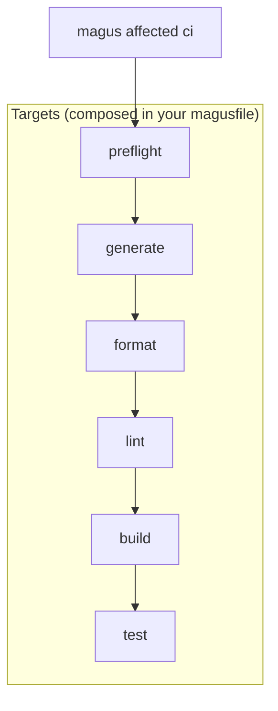
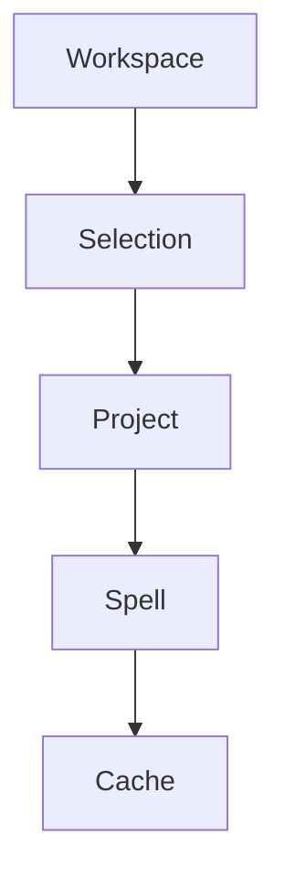
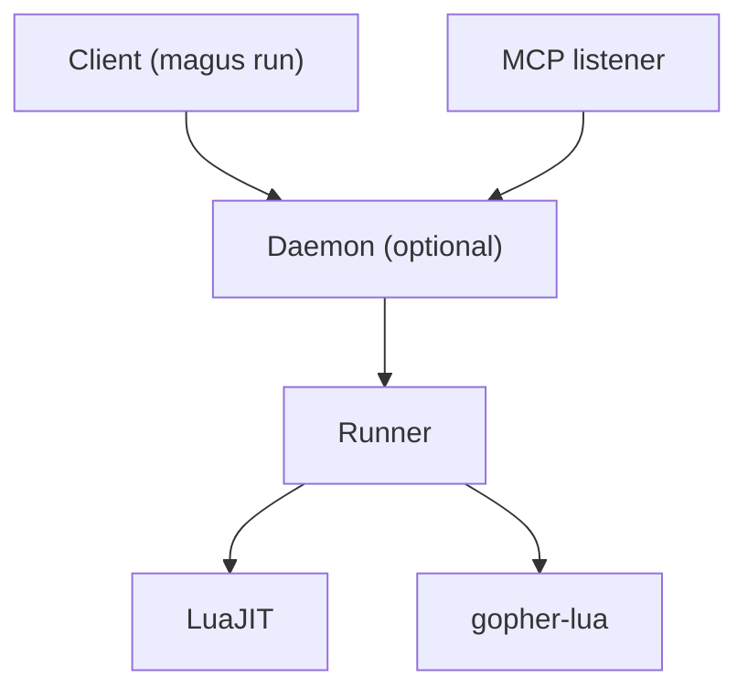

# magus

<p align="center">
  
</p>

<!-- Generated locally by `magus run coverage` (Go toolchain only, no third-party service); regenerate and commit to refresh. -->


A fast cross-platform task orchestrator for polyglot (mono)repos.

Magus computes affected projects from your changes, caches the results, and runs the minimum rebuild set after a change.

Single binary. Code as configuration. Statically typed. No second toolchain.

---

## Contents

**Get started.** [Install](#install) · [Quick start](#quick-start) · [Shell setup](#shell-setup)

**Build model.** [Philosophy](#philosophy) · [Concepts](#concepts) · [Spells vs Targets](docs/spells.md#spells-vs-targets) · [Workspace scope](#workspace-scope) · [Project dependencies](#project-dependencies)

**Running targets.** [Target syntax](#target-syntax) · [Argument forwarding](#argument-forwarding) · [Change detection](#change-detection) · [Concurrency](#concurrency) · [Recursive calls](#recursive-calls) · [CI Pipeline](#ci-pipeline)

**Magusfiles.** [Magusfile.tl](#magusfiletl) · [Runtime API](#runtime-api-three-tiers) · [Spells](#spells)

**CLI.** [Tips & Tricks](#tips--tricks) · [Commands](#commands) · [x: interactive picker](#x-interactive-picker) · [repl: interactive shell](#repl-interactive-shell) · [where: project path lookup](#where-project-path-lookup) · [affected --plan / --bisect: CI sharding and bisection](#affected---plan-and---bisect-ci-sharding-and-bisection) · [Output formats](#output-formats)

**Operations.** [Running magus as a daemon](#running-magus-as-a-daemon) · [MCP: driving magus from agents](#mcp-driving-magus-from-agents) · [Sandbox](#sandbox) · [Telemetry (OpenTelemetry)](#telemetry-opentelemetry) · [Debugging](#debugging)

**Project.** [License](#license)

---

## Philosophy

Build systems sit in the hot path of development. They get touched constantly, and small frictions compound fast.

Less time fighting abstractions, chasing framework churn, or debugging generated config means more time writing software. Or doomscrolling. Your call.

Magus tries to stay predictable by keeping a small footprint. It's not a remote cache, a release system, a plugin ecosystem, a web server, a code generator, a formatter, or a linter. Spells are **libraries of tool-native operations** — the `go` spell exposes `build`/`test`/`vet`/`fmt`/`lint`, the `rust` spell `build`/`test`/`clippy`/`fmt` — and your magusfile composes them into the runnable targets you want. Magus does not decide what "lint" or "format" means; it caches, computes affected sets, and orchestrates (see [Spells](#spells)).

Magus borrows from Unix: everything is a file. The cache is a tree of files on disk. The client/daemon socket is a file. Inspect any of it with `ls` and `cat`.

---

## Install

### From a release binary

Download the latest release for your platform from the [releases page](https://github.com/egladman/tack/releases), extract the archive, and run:

```sh
./magus self install
```

This installs the binary to `~/.local/bin/magus`, writes man pages to `~/.local/share/man/man1`, and prints next steps for PATH and shell completion. No dotfiles are modified.

Use `--bin-dir` and `--man-dir` to override the target directories:

```sh
./magus self install --bin-dir ~/bin --man-dir ~/share/man/man1
```

### From source

```sh
git clone https://github.com/egladman/tack
cd tack/magus
go build -tags selfmanage -o magus ./cmd/magus
```

### Keeping up to date

Once installed, update in place with:

```sh
magus self update
```

---

## Quick start

**1. Initialize the workspace**

From the root of your repo:

```sh
magus init
```

This writes a `magus.yaml` seeded with built-in defaults, stubs a starter `magusfile.tl` (with your project's language auto-detected), and wires the VCS merge driver so conflicts in declared outputs regenerate instead of leaving conflict markers. The VCS is auto-detected; pass `--vcs git|hg` to choose it in a non-interactive shell. By default the config is written to `$XDG_CONFIG_HOME/magus/magus.yaml`. Use `--local` to write it into the repo instead, or `--global` to write only the config (skip the workspace bootstrap).

Prefer Buzz? `magus init --lang buzz` scaffolds a `magusfile.bzz` instead of `magusfile.tl`.

**2. Edit the magusfile**

`magus init` drops a starter `magusfile.tl` registering your project and wiring the CI pipeline. Targets are declared as exported `global function`s — no registration call needed:

```lua
-- magusfile.tl (generated by `magus init`)
local hello = require("spells.hello")   -- ./spells/hello/spell.tl
magus.project.register(".", {
    spells = {hello},
})

-- Each exported global function becomes a runnable target.
-- 'ci' is the canonical entry point for `magus affected ci`.
global function preflight(_args: {string}) end
global function generate(_args: {string}) end
global function format(_args: {string}) end
global function lint(_args: {string}) end
global function build(_args: {string}) hello.build() end
global function test(_args: {string}) end
```

**3. Verify**

```sh
magus ls               # lists the registered project
magus run build        # delegates to hello's build target
magus run ci           # runs the ci target you composed, read-only
```

---

## Target syntax

Full reference: [Anatomy of a Target](docs/targets.md). New to the spell/target split? Start with [Spells vs Targets](docs/spells.md#spells-vs-targets).

The full form of a run target is:

```
magus run [<spell>::]<target-or-op>[:<charm>,...] [project...] [-- <extra args>]
```

The project is always a positional argument; the `:` after a target introduces
**charms**, not a project path.

**Basic**

```sh
magus run build          # build the cwd project (or all if not inside one)
magus run test api       # test the 'api' project specifically
magus run lint /         # lint every project in the workspace
```

**Spell-qualified (`::`)**

`spell::op` invokes a single spell's op **directly**, bypassing your composed targets — an escape hatch for ad-hoc runs and introspection. The token after `::` is a spell **op** (its CLI-command name), not a lifecycle target:

```sh
magus run typescript::eslint api    # the eslint op of the typescript spell on 'api'
magus run go::go-test /             # the go-test op of the go spell across all projects
```

The spell name matches one of the built-in identifiers (`go`, `typescript`, `python`, `rust`, etc.); op names are matched verbatim, so `go::go-vet` runs while `go::lint` is a graceful no-op (the go spell's linter op is `golangci-lint`). See [Naming operations](docs/spells.md#naming-operations).

**`::` works with `affected` too:**

```sh
magus affected typescript::eslint
```

**Charms (`:`)**

A charm is a shared, named execution modifier — an intent like `rw` that each
target interprets in its own way (`format` rewrites files, `generate` writes
outputs). Charms are meant to be **reused across targets, not defined
per-target**. Append a comma-separated list after the target with `:`; names use
the target charset (`[A-Za-z0-9_-]`).

`rw` is the built-in read→write charm, activated like any other with a `:rw` suffix:

```sh
magus run format:rw api    # the rw charm on format, in project api
```

Charms **stack** — pass several and they all apply (order- and
duplicate-insensitive), so orthogonal intents compose:

```sh
magus run lint:rw,debug    # autofix + verbose, together
```

The default (no `rw`) is read-only, and CI always runs read-only. Spells read
charms from context via `HasCharm`, so workspaces can introduce their own shared
charms. See [docs/charms.md](docs/charms.md).

---

## CI Pipeline

Magus keeps one conventional target as the anchor that the affected set keys off: `ci`. It is an **ordinary magusfile target** — magus does not hardcode its steps. Your magusfile exports a `ci` function and composes the pipeline with `magus.depends_on`; magus runs it read-only. Everything else is optional.

```lua
global function ci(_args: {string})
    -- declare the edges you want; independent steps run in parallel
    magus.depends_on({"preflight", "generate", "format", "lint", "build", "test"})
end
```

### Recommended order

We document this order; we don't enforce it. Chain steps with `magus.depends_on` where order matters (e.g. `test` depends on `build`).



### Shared cache trust: signing and read-only refs

The cache is replayable — a hit restores a previous build's outputs instead of rebuilding — so **who is allowed to write it is a trust boundary**. A pull request (especially from a fork, or one running a compromised dependency), a developer laptop, or anyone holding raw bucket credentials could seed a shared cache with poisoned outputs that later replay onto `main` or into another build.

The primary defense is **cryptographic signing**: every remote artifact must carry an Ed25519 signature over its manifest, and a consumer replays an artifact **only if** it is signed by a key in the configured trust set. The signing seed is a secret held only by trusted CI; the public verification keys are committed as `cache.remote.trusted_keys` in `magus.yaml`. A machine without the seed cannot produce an artifact any consumer will replay — and because verification runs on the consumer, this holds even against bytes written straight into the store out of band. **Wiring a remote backend without a trust set is refused.** The remote cache is CI-only, machine-to-machine infrastructure — not for developer laptops.

```buzz
// magusfile.bzz: bind the backend (a spell)
magus.cache.remote(github);
```

```yaml
# magus.yaml: declare its trust set (magus config cache key generate)
cache:
  remote:
    trusted_keys:
      - "<base64 Ed25519 public key>"
```

A complementary defense is to open the cache **read-only (immutable) on untrusted refs**: replay hits, but never publish new artifacts. Gate it on the event so only trusted pushes write:

```yaml
# PRs replay the cache but never write it; only pushes to main publish
MAGUS_CACHE_IMMUTABLE: ${{ github.event_name == 'pull_request' }}
```

The same flag gates the remote cache backend (the upload is suppressed when immutable), and the same rule should govern any cache the workflow persists across runs — e.g. the run history the forecaster and flake detector read: **restore on every run, save only from trusted pushes.** A PR sees `main`'s history but can't skew its timings or flake scores.

To set up a shared cache (GitHub Actions Cache, S3/MinIO/R2/B2, or your own backend) and generate signing keys, see [Remote caching](docs/remote-cache.md).

---

## Recursion

Targets can call `magus` recursively. Child invocations forward work to the parent process over a local socket instead of reloading the workspace from scratch. Concurrency limits are shared, so `magus` calls made from within a magusfile draw from the same budget rather than each spawning their own. This makes over-committing resource allocations implausible.

```lua
magus.cmd({"run", "build", "api"})
```

`magus.cmd` is the in-magusfile entry point for invoking magus recursively. When a [daemon](#running-magus-as-a-daemon) is running, the call rides the existing socket connection instead of spawning a new process.

---

## Change detection

`magus affected` computes the minimum rebuild set after a change.

By default it shells out to your VCS (`git`, `hg`, or `jj`), maps changed
files to projects, then walks the reverse dependency graph.

```sh
magus affected build
magus affected test -b origin/main
```

You can also pipe changed paths over stdin:

```sh
git diff --name-only HEAD~1 | magus affected --stdin test
```

---

## Concepts

### Build model



- **Workspace**: discovered projects under a root
- **Selection**: subset of the workspace chosen for a run (cwd, explicit list, or affected set)
- **Project**: a directory with marker files
- **Spell**: a library of tool-native operations (`build`, `vet`, `fmt`, `lint`, `tsc`, `eslint`, …) that the magusfile composes into targets
- **Cache**: local content-addressed cache of spell outputs

A **spell** is _how_ a tool does something (the `go-vet` op); a **target** is _what_ you run (`magus run lint`). You **bind** spells and **invoke** targets. See [Anatomy of a Spell](docs/spells.md) (and [Spells vs Targets](docs/spells.md#spells-vs-targets)) and [Anatomy of a Target](docs/targets.md).

### Runtime architecture



- **Client**: any `magus` CLI invocation
- **Daemon**: optional persistent process that holds workspace state and shares one concurrency pool across all clients
- **Runner**: in-process magusfile evaluator; chosen automatically based on file extension and build tags
- **MCP listener**: HTTP endpoint that exposes a read-mostly subset of magus to agents (see [MCP](#mcp-driving-magus-from-agents))

---

## Workspace scope

magus scopes to the current working directory by default.

```sh
magus run build        # current project
magus run build api    # explicit project (workspace-relative)
magus run build ../web # relative to cwd: from web/studio this targets web/web
magus run build .      # the project containing the cwd
magus run build /      # entire workspace
```

Bare paths (`api`, `web/studio`) are always workspace-relative; dot-relative
paths (`./x`, `../x`) resolve against the current directory. Absolute paths and
paths that escape the workspace root are rejected, so magus never operates
outside the workspace it discovered. See [`docs/targets.md`](docs/targets.md#path-resolution-on-the-cli)
for the full rules, including how symlinks are treated.

### Scope: descend only, never ascend

Every spell runs with `cwd = project.Dir` and walks **down** from there.
Sibling projects live in different subtrees and are structurally invisible
to each other — a formatter declared on `api` cannot reach files in `web`,
no matter how greedy its glob.

This is the inverse of build systems that run targets from the workspace
root, where one misconfigured glob (`**/*.md`) can reformat the entire
monorepo. In magus that bug is a category error: the formatter can't see
the other projects in the first place.

The one residual case — a spell walking down into a registered
**descendant** project's directory — is caught at runtime. Before any
write-mode dispatch (`format`, `generate`), magus snapshots the
descendant trees; afterwards it diffs them and warns if anything
crossed the boundary, attributing the violation to the project, spell,
and target. The warning carries diagnostic code **MGS3001**; see
[`magus/docs/codes/sandbox/MGS3001.md`](docs/codes/sandbox/MGS3001.md) for
resolution steps. Read-only targets and projects with no descendants skip
the audit entirely (zero cost on the hot path).

---

## Concurrency

Magus runs project builds in parallel up to a configurable limit.

```sh
magus run build --concurrency=4
magus config set key=concurrency,value=4
MAGUS_CONCURRENCY=4 magus run build
```

When a [daemon](#running-magus-as-a-daemon) is running, all clients share a single concurrency pool. Parallel CI steps and nested `magus` invocations all draw from the same budget.

`magus status` shows the live pool state and current slot usage.

---

## Magusfile.tl

Magusfiles are written in Teal and executed in-process through an embedded
Teal compiler and Lua interpreter.

No Go toolchain. No `go.mod`. No network access.

_Plain Lua (`.lua`) is also supported. Teal compiles to it, so anything Teal can do, Lua can too._

```lua
local os = require("magus.extra.os")
local go = require("magus.spell.go")

magus.project.register(".", {
    spells = {go},
})

global function build_server(_args: {string})
    os.exec("go", {"build", "-o", "bin/server", "./cmd/server"})
end
```

### Runtime API: three tiers

Magusfiles see three distinct namespaces:

| Tier                | Examples                                                                                                                | What it is                                                                                     |
| ------------------- | ----------------------------------------------------------------------------------------------------------------------- | ---------------------------------------------------------------------------------------------- |
| **Language stdlib** | `os`, `io`, `string`, `table`, `math`                                                                                   | Lua/Teal built-ins — untouched                                                                 |
| **`magus.*`**       | `magus.target.expand_globs`, `magus.project.register`, `magus.depends_on`, `magus.dispatch`, `magus.spell`, `magus.cmd` | Build DSL — the primary authoring surface; targets are declared as exported `global function`s |
| **Std modules**     | `require("magus.extra.os")`, `require("magus.extra.fs")`, …                                                             | Runtime utility library, imported per file                                                     |

Std modules are imported selectively — `require` each one you use at the top of the file, the same way built-in spells are required. There is no `magus.extra` aggregate; a file declares exactly the modules it touches, and a misspelled module is a compile error.

```lua
local os  = require("magus.extra.os")   -- process execution
local fs  = require("magus.extra.fs")   -- filesystem helpers
local vcs = require("magus.extra.vcs")  -- VCS introspection
```

> **`os` shadowing note:** `local os = require("magus.extra.os")` shadows Lua's stdlib `os` (e.g. `os.date`, `os.getenv`) within that file. If you need both, bind it under a different name (`local mos = require("magus.extra.os")`).

**`magus.extra.os`** — process execution. `os.exec` runs a command directly (no shell; args are never interpolated, so it's injection-proof); `os.exec_sh` runs a line through the shell for pipes, redirection, and globs. Both stream output live and return an `ExecResult` (`{stdout, stderr, code, ok}`), raising on a non-zero exit unless called with `{allow_failure = true}`. `os.which(cmd)` resolves a command on PATH (or `""`); `os.sleep(ms)` pauses for milliseconds (cancellable, matching Buzz's `os.sleep`); `os.exit(code)` aborts the run with an exit code.

| Method                                         | Behavior                                                                             |
| ---------------------------------------------- | ------------------------------------------------------------------------------------ |
| `exec(cmd, args?, dir?, opts?)` → `ExecResult` | Run directly, no shell. Raises on non-zero exit unless `opts.allow_failure == true`  |
| `exec_sh(line, dir?, opts?)` → `ExecResult`    | Run through the shell. Same result and raise semantics as `exec`                     |
| `with_env(env, fn)`                            | Run `fn()` with extra env vars added; subprocesses see the merged env                |
| `with_slots(n, fn)`                            | Reserve `n` slots from magus's concurrency budget for `fn` (e.g. wrapping `make -j`) |
| `platform()` → `string, string, string`        | Returns `(os, arch, variant)` OCI triple — e.g. `"linux", "arm64", "v8"`             |

**Other std modules:** `fs` (filesystem), `vcs` (git/hg/jj introspection), `env` (environment variables), `crypto` (SHA-256/512, plus SHA-1/MD5 for legacy-checksum interop), `http` (HTTP client), `json`, `platform` (OS/arch normalization), `charm` (spell `charms` constructor — RFC 6902 JSON Patches over a target's argv), `archive`.

Structured logging is on the `magus` namespace itself — `magus.info(msg, fields?)`, plus `magus.debug`/`magus.warn`/`magus.error` — so a magusfile can log into the process logger without an import. `magus.hint(msg)` prints a deduped, advisory nudge (honoring `MAGUS_HINTS_ENABLED`) without affecting the exit code; `magus.fatal(msg)` logs an error and aborts the run.

---

## Argument forwarding

Append `--` after the project selector to forward extra arguments to the target function. Everything before `--` is parsed by magus (flags, project names). Everything after is passed verbatim as the `args` array in the target function; magus never touches it.

```sh
magus run go::go-test -- -run TestAuth
magus run go::go-test api -- -v -run TestFoo   # select project 'api', then forward
magus affected go::go-test -- -race            # affected projects, race detector on
```

Inside a magusfile target the forwarded args arrive as the first parameter:

```lua
global function test(args: {string})
    local os = require("magus.extra.os")
    local argv = {"test", "./..."}
    for _, a in ipairs(args) do argv[#argv + 1] = a end
    os.exec("go", argv)
end
```

```sh
magus run test -- -run TestAuth -count=1
# → go test ./... -run TestAuth -count=1
```

If no `--` is present, `args` is an empty array.

---

## Spells

### Built-in

Built-in spells are compiled into the magus binary.

```lua
local go = require("magus.spell.go")
magus.project.register(".", { spells = {go} })
```

Available built-ins:
`go`, `typescript`, `javascript`, `python`, `rust`, `zig`, `bash`, `buf`, `buzz`,
`docker`, `compose`, `kind`, `terraform`, `kustomize`,
`json`, `yaml`, `toml`, `html`, `markdown`, `css`, `sql`

---

### Spells expose tool-native operations

Full reference: [Anatomy of a Spell](docs/spells.md), including the [Spells vs Targets](docs/spells.md#spells-vs-targets) boundary and when to use each.

A spell is a **library of tool-native operations** named in the tool's own
verbiage — it does not bind a canonical lifecycle. Binding a spell to a project
contributes its `needs`/`claims`/`provides` to that project's cache key and
affected set, but runs nothing on its own. Each operation is reachable as a method
on the spell handle:

Each op is named after the CLI command it runs ([Naming operations](docs/spells.md#naming-operations)):

- `go`: `go-build`, `go-test`, `go-vet`, `go-generate`, `go-clean`, `go-fmt`, `golangci-lint`, `go-mod-tidy`
- `rust`: `cargo-build`, `cargo-test`, `cargo-clippy`, `cargo-fmt`, `cargo-clean`
- `python`: `uv-build`, `pytest`, `ruff-check`, `ruff-format`, `uv-clean`
- `ts`: `tsc`, `eslint`, `prettier`, `vitest` · `js`: `eslint`, `prettier`, `vitest`

Lifecycle composition is yours — you decide which op backs
`build`/`test`/`lint`/`format`/`ci` by wiring targets in your magusfile. Op keys are
matched verbatim, so kebab names are reached by subscript:

```lua
local go = require("magus.spell.go")
magus.project.register(".", { spells = {go} })

global function build(_args: {string})  go["go-build"]({cwd = "."})      end
global function lint(_args: {string})   go["golangci-lint"]({cwd = "."}) end
global function format(_args: {string}) go["go-fmt"]({cwd = "."})        end
global function test(_args: {string})   go["go-test"]({cwd = "."})       end
```

`magus run build <project>` runs the target your magusfile exported; until you
export one, it is a graceful no-op. You can also reach a single spell op directly
with the `::` hatch: `magus run go::go-vet <project>`.

The handle also exposes `handle.listTargets()` (returns the sorted op names) for
introspection; ops are invoked through the per-op methods above.

---

### Extending a built-in

**Override an op in your magusfile**

A spell's ops are fixed data, but a target is just a function — to back one step
with a different tool, write that target's body yourself and delegate the rest to
the spell:

```lua
local go = require("magus.spell.go")
local os = require("magus.extra.os")
magus.project.register("api/", { spells = {go} })

global function build(_args: {string}) go["go-build"]({cwd = "api/"})      end
global function lint(_args: {string})  go["golangci-lint"]({cwd = "api/"}) end

-- use gotestsum instead of `go test` for this project
global function test(_args: {string})
    os.exec("gotestsum", {"--", "./..."}, "api/")
end
```

---

### Custom Spells

Workspace-local spell files let you add any toolchain that isn't a built-in. A
spell file is a module that exposes the spell contract as `mgs_`-prefixed
functions — the required `mgs_getName`, plus optional `mgs_listRequiredGlobs`,
`mgs_listProvidedGlobs`, `mgs_listTargets`, and others. Each `mgs_listTargets`
entry names a command and its argv; magus forks it directly — no shell, no
variable expansion, so invocations are deterministic and injection-safe.

#### File spell — Teal (`spells/ruby.tl`)

```lua
return {
   mgs_getName = function(): string return "ruby" end,
   mgs_listRequiredGlobs = function(_dir: string): {string}
      return {"**/*.rb", "Gemfile", "Gemfile.lock", "*.gemspec", ".rubocop.yml"}
   end,
   mgs_listProvidedGlobs = function(): {string}
      return {"vendor/bundle/**/*"}
   end,
   mgs_listTargets = function(): any
      return {
         bundle  = { cmd = "bundle", args = {"install"} },
         rspec   = { cmd = "bundle", args = {"exec", "rspec"} },
         rubocop = { cmd = "bundle", args = {"exec", "rubocop", "--check"},
                     charms = { rw = { ops = {{op = "replace", path = "/2", value = "-A"}} } } },
      }
   end,
}
```

#### File spell — Buzz (`spells/ruby.bzz`)

```buzz
export fun mgs_getName() > str { return "ruby"; }
export fun mgs_listRequiredGlobs(_dir: str) > [str] {
    return ["**/*.rb", "Gemfile", "Gemfile.lock", "*.gemspec", ".rubocop.yml"];
}
export fun mgs_listProvidedGlobs() > [str] { return ["vendor/bundle/**/*"]; }
export fun mgs_listTargets() > any {
    return {
        "bundle":  { "cmd": "bundle", "args": ["install"] },
        "rspec":   { "cmd": "bundle", "args": ["exec", "rspec"] },
        "rubocop": { "cmd": "bundle", "args": ["exec", "rubocop", "--check"],
                     "charms": { "rw": {"ops": [{"op": "replace", "path": "/2", "value": "-A"}]} } },
    };
}
```

#### Consuming a file spell (`magusfile.tl`)

```lua
local rb = magus.spell.load("spells/ruby.tl")
magus.project.register("gems/", { spells = {rb} })

global function test(_args: {string}) rb.rspec({cwd = "gems/"}) end
global function lint(_args: {string}) rb.rubocop({cwd = "gems/"}) end
```

`magus.spell.load` and `magus.spell.define` are pure: they return a handle and
register nothing. Binding happens when the handle is passed to
`magus.project.register`.

#### Inline spell (`magusfile.tl`)

For a spell used in only one magusfile, define it inline with
`magus.spell.define`. The data-table shape (`name`, `needs`, `provides`, `ops`)
is distinct from the `mgs_` function contract of a spell file:

```lua
local rb = magus.spell.define {
   name = "ruby",
   needs = function(_dir: string): {string}
      return {"**/*.rb", "Gemfile.lock"}
   end,
   provides = function(): {string} return {"vendor/bundle/**/*"} end,
   ops = {
      rspec   = { cmd = "bundle", args = {"exec", "rspec"} },
      rubocop = { cmd = "bundle", args = {"exec", "rubocop", "--check"},
                  charms = { rw = { ops = {{op = "replace", path = "/2", value = "-A"}} } } },
   },
}
magus.project.register("gems/", { spells = {rb} })
```

For a step that needs a shell or arbitrary logic, skip the spell and write the
target body directly with `magus.extra.*` (see [Runtime API](#runtime-api-three-tiers)).

#### Best practices

**Include every file that can change the output in `mgs_listRequiredGlobs` (or `needs` for an inline spell).**
The cache key is the SHA-256 of source file contents. A file that is read at
build time but absent from the required globs is an invisible input — magus
cannot tell it changed, so you get a stale hit that silently replays old output.

| Forget this…           | …and you'll get a stale hit when               |
| ---------------------- | ---------------------------------------------- |
| `Gemfile.lock`         | a gem version is pinned to a different release |
| `.rubocop.yml`         | lint config changes                            |
| `*.gemspec`            | gemspec metadata changes                       |
| `Makefile`, `Rakefile` | build recipe changes                           |

For the Ruby example the full required-globs list should be:

```lua
mgs_listRequiredGlobs = function(_dir: string): {string}
    return {
        "**/*.rb",
        "Gemfile",
        "Gemfile.lock",   -- ← essential: pinned versions are inputs
        "*.gemspec",
        ".rubocop.yml",   -- ← lint config is a lint input
        ".rubocop.yaml",
    }
end,
```

**Declare `mgs_listProvidedGlobs` (or `provides`) so the cache can replay outputs.**
If you omit provided globs, magus runs the spell on every build even when
nothing changed. Provide workspace-relative globs of files your spell writes:

```lua
mgs_listProvidedGlobs = function(): {string}
    return {"vendor/bundle/**/*", "tmp/build/**/*"}
end,
```

Only list files your spell actually writes. Over-declaring (globbing all of
`**/*`) causes the cache to snapshot and restore far more than necessary and
slows every replay.

**Toolchain version is not in the cache key by default.**
If you upgrade Ruby, Bundler, or a system library but touch no tracked source
files, magus will replay the cached output built with the old version. This is
the single biggest correctness footgun for custom spells. Until toolchain
probes are wired (Phase B of the cache-key completeness plan), your options are:

1. **Best:** Commit your toolchain version to a tracked file. `.ruby-version`,
   `.tool-versions` (mise/asdf), or a `Dockerfile` are all source-hashed if
   you include them in `mgs_listRequiredGlobs`. A version bump then produces a
   natural miss.

   ```lua
   mgs_listRequiredGlobs = function(_dir: string): {string}
       return {
           "**/*.rb", "Gemfile", "Gemfile.lock",
           ".ruby-version",    -- ← bump this when upgrading Ruby
           ".tool-versions",   -- ← or this (mise/asdf)
       }
   end,
   ```

2. **Escape hatch:** run `magus cache clean` after a toolchain upgrade to
   force a full rebuild. One-time cost, no code change required.

3. **Do nothing:** acceptable for tools whose version has no bearing on output
   correctness (linters configured for a stable rule set, formatters with a
   pinned version in `Gemfile.lock`).

**Magusfile changes automatically invalidate the cache.**
Editing a custom command in your `magusfile.tl` (or any file under
`magusfiles/`) now produces a cache miss — the magusfile is part of the cache
key. You do not need to do anything extra when you change a target's argv.

**Built-in spell command changes invalidate the cache on upgrade.**
When you upgrade magus itself, the fingerprint of the embedded built-in spell
definitions is remixed into every key. All projects rebuild exactly once on the
next run after the upgrade. This is expected and correct.

**Use `magus describe` to audit your cache key.**
`magus describe build` lists the sources, env vars, and outputs that compose
the key for each project. Run it after adding a new spell or changing required
globs to verify the inputs look right before trusting cache hits in CI.

---

## Project dependencies

Magus infers dependencies between projects automatically from language manifests: `go.mod` `require` directives, `Cargo.toml` `path = "..."` entries, and `package.json` `workspace:*` entries. You only need to declare dependencies explicitly when magus can't see the edge, typically cross-language relationships or codegen producers.

**In a magusfile.tl:**

```lua
magus.project.register("apps/ui", {
    spell      = { name = "typescript" },
    depends_on = {"api", "internal/schema"},
})
```

Paths can be repo-relative (`"api"`) or relative to the declaring project (`"../api"`).

Declared dependencies affect `magus affected`: when `api` changes, `apps/ui` is included in the affected set and rebuilt downstream. They also appear in `magus describe` output and graph views.

> **One concept, two granularities.** `depends_on` declares dependency _edges_, and magus resolves them into the build graph — independent dependencies run in **parallel**, and a node runs once all of its dependencies have completed. (magus never sequences tasks just because you listed them in a certain order; the graph decides what can overlap.) The only thing that changes between the two call sites is the namespace you draw from: `magus.project.register` names **projects** (a cross-project edge that also feeds the affected set and cache key), while `magus.depends_on` inside a `global function` target names **targets** in the same file:
>
> ```lua
> -- project-level: this project depends on ../api
> magus.project.register(".", { depends_on = {"../api"} })
>
> -- target-level: this target depends on every *-build target
> global function build(_args: {string})
>     magus.depends_on(magus.target.expand_globs("*-build"))
> end
> ```
>
> This mirrors Bazel, where a target's `deps` lists other targets: the function you call fixes whether you're naming projects or targets, so the same word stays unambiguous.

---

## Tips & Tricks

Non-obvious ways to combine magus subcommands.

### Live pool snapshot in a multiplexer sidebar

`magus status` is a non-blocking, one-shot RPC snapshot — it returns immediately whether the daemon is running or not. Combine `--compact` (a single densely-packed line) with `--watch` to keep a tmux/screen sidebar pane current:

```sh
magus status --compact --watch=1s
```

Sample output:

```
daemon 3/8 busy · api:build(2.1s) · ui:test(0.5s) · 1 ws
```

When no daemon is running the line reads `daemon: off` — no error, no hang. Drop `--compact` for the full grid view when you have a wider pane to spare.

### Step through a target to diagnose a flaky build

`magus run --step` pauses before every subprocess and lets you inspect state, skip commands, or open a REPL mid-run. Concurrency is forced to 1, so commands execute one at a time:

```sh
magus run build --step
magus affected build --step
```

See [`--step`](#--step) in [Debugging](#debugging) for the full prompt reference.

### Re-run only affected projects on each save

Pipe `magus watch` into `magus affected --stdin` for a tight inner loop that re-runs only the projects touched by each edit:

```sh
magus watch | while IFS= read -r path; do
    echo "$path" | magus affected --stdin test
done
```

### One-shot daemon health probe

`magus status` exits 0 even when the daemon is down (the pool block reads `daemon: off`). Use it as a cheap, non-blocking reachability probe in scripts or CI health checks — no risk of hanging on a network timeout:

```sh
magus status
magus status -o json   # machine-readable output
```

---

## Commands

| Command        | Purpose                                                                                                                                                      |
| -------------- | ------------------------------------------------------------------------------------------------------------------------------------------------------------ |
| `ls`           | List discovered projects                                                                                                                                     |
| `where`        | Print the absolute path of a project (fuzzy match)                                                                                                           |
| `describe`     | Explain why a project is in the affected set                                                                                                                 |
| `run`          | Run a target for selected projects                                                                                                                           |
| `x`            | Interactive picker: choose project + target (TTY only)                                                                                                       |
| `affected`     | Run a target against VCS-affected projects; `--stdin` reads paths from stdin, `--plan` emits a CI shard plan, `--bisect` finds a regression's culprit commit |
| `watch`        | Emit changed paths to stdout                                                                                                                                 |
| `tail`         | Stream the most recent cached log for the cwd project                                                                                                        |
| `status`       | Show telemetry, cache settings, and the live concurrency pool                                                                                                |
| `doctor`       | Validate the workspace                                                                                                                                       |
| `config`       | View or update configuration (`init`, `view`, `set`, `history`, `cache`)                                                                                     |
| `server`       | Manage the persistent daemon (`start`, `stop`, `status`)                                                                                                     |
| `repl`         | Interactive Teal/Lua REPL with the magusfile bindings preloaded                                                                                              |
| `completion`   | Print a shell completion script (`bash`, `zsh`, `fish`)                                                                                                      |
| `self update`  | Update magus to the latest release (replaces running binary)                                                                                                 |
| `self install` | Install magus to `~/.local/bin` (fresh install with man pages)                                                                                               |
| `version`      | Print version, commit, and build date                                                                                                                        |

---

## x: interactive picker

`magus x` is a TTY shorthand for `magus run`. It presents a fuzzy project picker followed by a target picker, then executes the selection.

```sh
magus x           # browse all projects
magus x api       # pre-filter to projects matching 'api'
magus x web ui    # AND-filter: projects matching both 'web' and 'ui'
```

The target list is: `build`, `test`, `lint`, `format`, `clean`, `generate`, `ci`.

`x` remembers the last target used per project and pre-highlights it on the next run.

`magus x` refuses to run outside an interactive terminal. To override (e.g. in a wrapper script), set `assume_interactive: true` in `magus.yaml` or `MAGUS_ASSUME_INTERACTIVE=1`.

---

## repl: interactive shell

`magus repl` opens an interactive REPL with the same runtime environment available to a magusfile: the `magus` object (including `magus.extra.*` and spell bindings) is preloaded. Teal and Lua are supported; switch languages mid-session with `.tl` or `.lua`. (Pass `--engine buzz` for a Buzz REPL.)

```sh
magus repl
```

If a `magusfile.tl`, `magusfile.lua`, or `magusfile.bzz` is present at or above the current directory, it is executed automatically on startup so registered targets and locals are available.

### `--no-autoload`

Skip executing the magusfile on start.

Useful when you want a blank environment to experiment without side-effects from your project's startup code.

### `-C <dir>`

Set the working directory for `require()` resolution (default: cwd).

```sh
magus repl -C internal/auth
```

See [Debugging](#debugging) for the full meta-command reference, multiline behavior, and per-language differences.

---

## where: project path lookup

`magus where` prints the absolute path of a project **or file** to stdout. No TTY picker, no prompts. Designed for shell substitution.

```sh
cd "$(magus where api)"
code "$(magus where dash)"
```

Filters are AND-combined substrings with leaf-anchored scoring. A unique top match prints the path and exits 0. Ambiguity lists candidates on stderr and exits 2.

```sh
magus where api gateway   # must match both 'api' and 'gateway'
```

### File fallback

When no project matches the filters, `magus where` falls back to fuzzy file search across the workspace. The same AND-substring filters and leaf-anchored ranking apply to file paths.

```sh
vim "$(magus where readme.md)"
cat "$(magus where api server.go)"   # path must contain both 'api' and 'server.go'
magus where --all --glob '**/*.go' | xargs wc -l
```

Well-known build and vendor directories are pruned automatically (`.git`, `node_modules`, `vendor`, `target`, `gen`, and the rest of the `IgnoreDirs` list). Symlinks are skipped.

**Scoring and ambiguity:** when filter tokens are present, the top scorer wins as usual, unique or not. When only a pattern flag is given with no filter tokens, every matching file scores 0 (no basis for ranking); use `--all` and pipe to `fzf` in that case.

### `--all` / `-A`

Print all matching paths to stdout instead of erroring on ambiguity. Works for both project and file results.

```sh
magus where -A server | fzf --select-1
magus where -A --glob '**/*_test.go' api
```

### Pattern flags

Restrict the file fallback to paths matching a pattern. Three types, with identical semantics to `magus watch --ignore`:

| Flag                | Type                         | Matches against                       |
| ------------------- | ---------------------------- | ------------------------------------- |
| `--glob <pattern>`  | Doublestar glob (`**`-aware) | Workspace-relative forward-slash path |
| `--regex <pattern>` | Go regexp                    | Workspace-relative forward-slash path |
| `--literal <value>` | Exact segment                | Any path segment at any depth         |

```sh
magus where --glob '**/*.go'                  # any Go source file
magus where --glob '**/*_test.go' api         # test files with 'api' in path
magus where --regex '_test\.go$'              # same, expressed as a regexp
magus where --literal Dockerfile              # any file named exactly 'Dockerfile'
magus where --literal Dockerfile web          # Dockerfile under a path containing 'web'
```

`--filter type=<glob|regex|literal>,pattern=<value>` is the long form. Use it when the pattern itself contains a comma (e.g. a regex quantifier like `{2,4}`).

Only one of `--glob`, `--regex`, `--literal`, or `--filter` may be specified per invocation.

---

## affected --plan and --bisect: CI sharding and bisection

`magus affected` has two forensic modes that reason about the affected set from the outside rather than executing a target. They are siblings of `--explain`: `--plan` shards the set for CI fan-out, and `--bisect` hunts a regression's culprit commit. Neither executes the pipeline — use `magus run ci` or `magus affected ci` for that.

### `affected --plan`: shard the affected set

Emits a provider-neutral JSON shard plan for the affected project set. It always keys off the `ci` anchor target.

A small amount of glue code is typically needed to adapt the output to a CI
provider's parallel job format. For an example, see the [magus github action](./.github/actions/magus)

```sh
magus affected --plan
magus affected --plan --max-shards=8
```

Output shape:

```json
{
  "count": 3,
  "max_parallel": 3,
  "source": "git",
  "matrix": [
    { "shard": "0", "projects": "api auth" },
    { "shard": "1", "projects": "web" },
    { "shard": "2", "projects": "worker" }
  ]
}
```

**GitHub Actions example**

```yaml
jobs:
  plan:
    runs-on: ubuntu-latest
    outputs:
      matrix: ${{ steps.plan.outputs.matrix }}
    steps:
      - uses: actions/checkout@v4
      - id: plan
        run: echo "matrix=$(magus affected --plan | jq -c)" >> "$GITHUB_OUTPUT"

  ci:
    needs: plan
    runs-on: ubuntu-latest
    strategy:
      matrix: ${{ fromJson(needs.plan.outputs.matrix) }}
    steps:
      - uses: actions/checkout@v4
      - run: magus run ci --shard=${{ matrix.shard }} ${{ matrix.projects }}
```

Adaptive sharding uses run-time history to balance shards by past duration. Set `history_path` in `magus.yaml` or `MAGUS_HISTORY_PATH` to enable it.

### `--max-shards` (default: from config)

Maximum number of shards emitted.

Increase to reduce per-shard duration at the cost of more parallel runners. Values below the number of affected projects are silently clamped up.

```sh
magus affected --plan --max-shards=8
```

### `--max-parallel-budget` (default: unlimited)

Cap the total number of shards allowed to run in parallel across CI runners.

Set this when your CI plan has a fixed concurrency quota and you want magus to bake that constraint into the shard count rather than oversubscribe.

```sh
magus affected --plan --max-parallel-budget=4
```

### `affected --bisect`: find the regression commit

Drives `git bisect` (or `hg bisect`) automatically to find the commit that introduced a test failure. Requires run history with a confirmed regression (clean passing history followed by consistent failures).

```sh
magus affected --bisect api
magus affected --bisect api --target=test --good=abc1234
```

Magus derives the last known-good commit from recorded pass timestamps, runs `magus run test --no-flake-retry <project>` at each bisect step, and prints the culprit:

```
suspected culprit: d3f9a21  fix(auth): reuse connection pool
```

### `--target` (default: `test`)

Target to bisect.

Override when the regression is in `build` or another target rather than `test`.

```sh
magus affected --bisect api --target=lint
```

### `--good` (default: auto)

Known-good commit SHA to start the bisect from.

When omitted, magus derives the baseline from recorded pass timestamps in run history. Provide it explicitly if automatic derivation picks the wrong commit.

```sh
magus affected --bisect api --good=abc1234
```

---

## Debugging

Magus has two entry points into an interactive debugging REPL:

- [`magus repl`](#repl-interactive-shell): standalone shell with magusfile bindings preloaded.
- [`magus.pry()`](#maguspry-breakpoint-in-a-magusfile): `binding.pry`-style breakpoint, opens the same REPL mid-target with frame context attached.

Both share the same evaluator and language switching. Pry adds stack-introspection commands (`.where`, `.locals`, `.up`/`.down`, `.step`, …) on top of the base REPL surface. The remaining subsections ([meta-commands](#meta-commands), [multiline input](#multiline-input), [stack introspection](#stack-introspection-by-engine), [engine selection](#engine-selection)) apply to both unless noted.

### Interactive REPL

The REPL accepts Lua or Teal expressions and evaluates them against the magusfile runtime. Output is pretty-printed (max depth 3).

```lua
-- example session
> require("magus.extra.os").exec_sh("git rev-parse --short HEAD").stdout
abc1234
> require("magus.spell.go").name
go
> require("magus.extra.os").exec("go", {"build", "./..."})
```

Lines starting with `--` are treated as comments and skipped. Type `.help` for the meta-command list, `.exit` (or Ctrl-D) to quit.

### `magus.pry()`: breakpoint in a magusfile

Call `magus.pry()` anywhere in a magusfile target to suspend execution and drop into the REPL at that exact point. The REPL inherits the calling Runner's bindings and exposes the surrounding scope.

```lua
global function build(_args: {string})
    local os = require("magus.extra.os")
    local outputs = {"bin/foo", "bin/bar"}
    os.exec("go", {"generate", "./..."})
    magus.pry()   -- execution pauses here; inspect or modify state
    os.exec("go", {"build", "./..."})
end
```

```sh
magus run build
# *** magus.pry at magusfile.tl:4 in build
# Type .help for pry commands, .continue (or .exit) to resume.
# pry>
```

The prompt is `pry>` at the innermost frame; `pry[N]>` after `.up`/`.down` to frame N.

`magus.pry()` is a no-op during `magus ls` and `magus describe` so it is safe to leave in place during development. Remove it before committing.

### Meta-commands

| Command                 | repl | pry | Notes                                                  |
| ----------------------- | :--: | :-: | ------------------------------------------------------ |
| `.help`                 |  ✓   |  ✓  | Print available commands                               |
| `.exit` / `.quit`       |  ✓   |  ✓  | Quit the REPL (or resume execution, for pry)           |
| `.continue`             |      |  ✓  | Resume execution                                       |
| `.load <path>`          |  ✓   |  ✓  | Execute a file in the current session                  |
| `.tl` / `.lua`          |  ✓   |  ✓  | Switch input language for subsequent lines             |
| `.history [N]`          |      |  ✓  | Show the last N (default 50) commands across sessions  |
| `.history!N`            |      |  ✓  | Print the Nth-most-recent command for copy-paste       |
| `.whereami`             |      |  ✓  | Print source lines surrounding the call site           |
| `.where` / `.backtrace` |      |  ✓  | Print the call stack                                   |
| `.up` / `.down`         |      |  ✓  | Move the inspected frame up or down                    |
| `.locals`               |      |  ✓  | List variables in scope of the selected frame          |
| `.globals`              |      |  ✓  | List user-defined globals (host bindings filtered out) |
| `.pp <expr>`            |      |  ✓  | Evaluate `<expr>` and pretty-print the result          |
| `.step`                 |      |  ✓  | Single-step into the next line                         |
| `.next`                 |      |  ✓  | Step over the current line                             |
| `.finish`               |      |  ✓  | Run until the current frame returns                    |

Pry history is persisted at `$XDG_STATE_HOME/magus/pry_history` (or `~/.local/state/magus/pry_history`) and is shared across pry sessions, including across language switches. The standalone `magus repl` does not record to or read from this file.

Color output is enabled when stdout is a TTY; set `NO_COLOR=1` to disable. The continuation prompt (`>>` / `pry>>`) is green-tinted on color terminals.

### Multiline input

Incomplete input is detected and the REPL reprompts with `>>` until the expression closes:

- **Lua / Teal**: error-based continuation. The parser is reinvoked on each newline; if it reports "unexpected symbol near `<eof>`" the input is treated as incomplete. Teal compiles to Lua on each accepted line; type errors surface immediately.

### Stack introspection by engine

Both Lua engines support `.locals`, `.up`/`.down`, and `.step`/`.next`/`.finish`. The implementation differs slightly under the hood:

- **LuaJIT**: native C debug hooks fire on every Runner instruction; frame walking and locals are fully live.
- **gopher-lua**: source-level instrumentation. A pre-pass injects `__magus_step_hook` calls before each statement at compile time, enabling the same line-level events without native hooks. Frame walking and locals use the real gopher-lua call stack.

Files without any `magus.pry()` call and without active stepping are not rewritten, so there is zero overhead on the hot path.

### `--step`

Pause before every subprocess and prompt for a keystroke. Concurrency is forced to 1 so commands execute one at a time.

```sh
magus run build --step
magus affected build --step
```

At each pause, magus prints the command and working directory, then waits:

```
→ go build ./...  (cwd: /workspace/api)
  [s]tep  [c]ontinue  s[k]ip  [r]epl  [a]bort:
```

| Key                | Action                                                        |
| ------------------ | ------------------------------------------------------------- |
| `s` / Enter        | Execute this command, then pause again before the next        |
| `c`                | Execute this command and stop pausing (run the rest normally) |
| `k`                | Skip this command without executing it                        |
| `r`                | Open a REPL in the current context, then re-prompt            |
| `a` / `q` / Ctrl-C | Abort the run                                                 |

### Engine selection

| Backend                      | When used       | Notes                                                 |
| ---------------------------- | --------------- | ----------------------------------------------------- |
| **LuaJIT** (`luajit`)        | cgo available   | Faster; native C debug hooks                          |
| **gopher-lua** (`gopherlua`) | `CGO_ENABLED=0` | Pure Go; slower startup; source-instrumented stepping |

`magus doctor` reports the active Lua backend. Both Lua backends run identical Impl functions. If a test passes on one, it passes on both.

---

## Running magus as a daemon

### Why

By default every `magus run` invocation is a short-lived process: it discovers the workspace, runs the work, and exits. That is fine in isolation, but it has two costs:

1. **Re-discovery on every call.** Workspace scanning and project enumeration repeat from scratch each time.
2. **Uncoordinated concurrency.** Each process owns its own concurrency limiter. Two parallel `magus` invocations think they can use `min(NumCPU, 8)` slots simultaneously, oversubscribing the machine.

A persistent daemon solves both: it holds workspace state in memory and enforces a single concurrency pool across all clients that connect to it. Nested calls (a target that calls `magus run` internally) automatically dial the daemon and contribute to the same pool instead of starting a new one.

### Starting the daemon

`magus server start` runs in the foreground. Use `&` or a process supervisor to run it in the background:

```sh
magus server start &
```

### Stopping the daemon

```sh
magus server stop    # graceful shutdown; waits for in-flight work to finish
```

### Inspecting the live pool

`magus status` shows the concurrency pool alongside telemetry and cache settings. It also serves as the daemon reachability check. When no daemon is running, the pool block is replaced with the reason:

```sh
magus status
magus status -W 1s   # poll and reprint every second
```

### Configuring the socket address

The socket address is resolved in priority order:

1. `--daemon-address <unix://…>` flag
2. `MAGUS_DAEMON_ADDRESS` environment variable
3. `daemon.address` in `magus.yaml`
4. Stable per-workspace default (`unix://<sock-dir>/magus-daemon.sock`)

The default socket is named without a PID so `server stop` and `server status` can find it without discovery.

To pin a socket address in config:

```sh
magus config set key=daemon.address,value=unix:///run/user/1000/magus/daemon.sock
```

---

## MCP: driving magus from agents

When the daemon is running, it also exposes an **MCP (Model Context Protocol) server** over Streamable HTTP. Agents and IDE plugins that speak MCP (Claude Desktop, Cursor, VS Code Copilot, and others) can call magus tools directly instead of shelling out.

Magus is built for humans first. MCP is an optional layer on top, that can be entirely omitted from the binary by setting the `!mcp` build tag.

### Starting the daemon starts MCP

No separate process is needed. Start the daemon as usual:

```sh
magus server start
```

The MCP endpoint comes up alongside it:

```
http://127.0.0.1:7391/mcp
```

`magus doctor` reports whether MCP is reachable and prints the endpoint URL.

### Available tools

| Tool                     | Purpose                                                            |
| ------------------------ | ------------------------------------------------------------------ |
| `magus_list_projects`    | List all projects discovered in the workspace                      |
| `magus_list_targets`     | List registered build targets for a project                        |
| `magus_where`            | Resolve a fuzzy project name to its absolute path                  |
| `magus_describe_project` | Explain why a project is in the affected set                       |
| `magus_run_target`       | Run a target (`build`, `test`, `lint`, …) for one or more projects |
| `magus_run_affected`     | Run a target for all VCS-changed projects                          |
| `magus_doctor`           | Validate workspace health                                          |
| `magus_status`           | Inspect the live concurrency pool                                  |
| `magus_affected_plan`    | Emit a CI shard plan for the affected set                          |
| `magus_config_get`       | Read the resolved workspace config (read-only)                     |
| `magus_tail_log`         | Retrieve the captured build log for a project                      |

Config mutation is not exposed over MCP. Use the CLI for `magus config set` and related commands.

### Enabling and disabling

MCP is on by default when the binary is built with `-tags mcp` (the default). To disable it without rebuilding:

```yaml
# magus.yaml
mcp:
  enabled: false
```

Or set `MAGUS_MCP_ENABLED=0` in the environment before starting the daemon.

To change the listen address:

```yaml
# magus.yaml
mcp:
  address: "127.0.0.1:9000"
```

Or `MAGUS_MCP_ADDRESS=127.0.0.1:9000`.

### Security: keep this local

> **Warning:** Reaching the MCP endpoint is equivalent to having shell access to your build workspace. Any authenticated caller can execute arbitrary build targets, which in turn invoke arbitrary toolchain commands defined in your magusfiles.
>
> The endpoint requires a **bearer token**. The daemon generates one on first start and stores it `0600` at `$XDG_CONFIG_HOME/magus/mcp_token`; the secret is never written to the daemon log — retrieve it with `magus config mcp token print`. Every `/mcp` request must carry `Authorization: Bearer <token>`; requests without it get `401 Unauthorized`. Manage the token with:
>
> ```
> magus config mcp token print      # show the current token
> magus config mcp token generate   # mint a new one (--force to rotate)
> magus config mcp token revoke     # delete it (daemon mints a fresh one on next start)
> ```
>
> Configure your client with the header, e.g.:
>
> ```json
> { "type": "streamable-http", "url": "http://127.0.0.1:7391/mcp",
>   "headers": { "Authorization": "Bearer <token>" } }
> ```
>
> Auth is **defense in depth**, not a license to expose the port. The server still binds to `127.0.0.1` by default and validates the `Host` and `Origin` headers on every `/mcp` request, returning `403 Forbidden` for non-loopback values to block browser-based DNS-rebinding attacks. Treat the token as a local secret — anyone who reads it gains the same workspace access.
>
> **Do not expose it over:**
>
> - Tailscale, Zerotier, or similar overlay networks where other devices can reach it
> - ngrok, localtunnel, or other public tunnels
> - SSH `-L` port-forwards shared with others
> - Kubernetes `port-forward` in shared clusters
> - Any network ACL that admits untrusted hosts
>
> If you need to drive magus remotely, run the CLI over SSH instead.

---

## Sandbox

Spells shell out to third-party toolchains, which makes the build a juicy supply-chain target. Magus ships an optional sandbox that confines every subprocess and in-process spell to the workspace plus a curated allowlist, and strips secret-bearing env vars (`AWS_*`, `GITHUB_TOKEN`, `NPM_TOKEN`, `ANTHROPIC_API_KEY`, …) from the inherited environment. On Linux ≥5.13 enforcement uses landlock; elsewhere the Teal and buzz host bindings (`os`, `fs`, `env`, …) enforce the same policy.

Enable it in `magus.yaml`:

```yaml
sandbox: true
```

Or per-invocation:

```sh
MAGUS_SANDBOX_ENABLED=1 magus run build
```

See [`docs/codes/sandbox/`](./docs/codes/sandbox/) for the full policy, allowlist syntax, and `MGS2001`–`MGS2007` diagnostic codes.

---

## Telemetry (OpenTelemetry)

Magus can export metrics and traces to any OTLP collector you run. Telemetry is **OFF by default** — there is no magus-operated backend, the collector is yours.

Enable it in `magus.yaml`:

```yaml
telemetry:
  enabled: true
  endpoint: "localhost:4318" # host:port, no scheme
  protocol: "http" # "grpc" (default) or "http"
  insecure: true # plaintext for local collectors
```

Or via the environment:

```sh
MAGUS_TELEMETRY_ENABLED=true \
MAGUS_TELEMETRY_ENDPOINT=localhost:4317 \
MAGUS_TELEMETRY_INSECURE=true \
magus run build
```

### What gets exported

magus exports metrics for the local cache, the [remote cache](docs/remote-cache.md)
backend, graph queries, target runs, and the concurrency pool, plus build traces
(target runs, cache phases, and remote get/put). The **complete reference** — every
metric, span, unit, attribute, the config/env vars, and cardinality guidance — is
in **[docs/telemetry.md](docs/telemetry.md)**.

---

## Shell setup

### Shorthand: `mgs`

The de facto shorthand for `magus` is `mgs`: three left-hand keys, fast to type, and collision-free. Either alias it in your shell:

```sh
alias mgs=magus
```

or create a symlink:

```sh
ln -s "$(command -v magus)" ~/.local/bin/mgs
```

### Tab completion

Magus ships completion scripts for bash, zsh, and fish:

```sh
magus completion bash >> ~/.bashrc
magus completion zsh  >> ~/.zshrc
magus completion fish >> ~/.config/fish/config.fish
```

---

## Output formats

Every command takes `-o <format>` to switch its output shape.

| Format            | Use case                                                |
| ----------------- | ------------------------------------------------------- |
| `text`            | Default human-readable output                           |
| `json`            | One JSON document, structured                           |
| `jsonl`           | One JSON record per line, stream-friendly               |
| `yaml`            | YAML document                                           |
| `name`            | One name per line, ideal for `xargs`                    |
| `template=<tmpl>` | Custom Go `text/template` over the command's data model |

```sh
magus ls -o json
magus ls -o name | xargs -I{} echo "found project: {}"
magus ls -o 'template={{range .}}{{.Name}} ({{.Spell.Name}}){{"\n"}}{{end}}'
```

Graph-emitting commands (`describe`, `affected --graph`, etc.) additionally support `-o dot`, `-o mermaid`, and `-o tree`:

```sh
magus describe api -o tree
magus describe api -o mermaid | gh-mermaid
```

---

## License

magus is licensed under GPL-3.0-or-later. See [LICENSE](./LICENSE).
