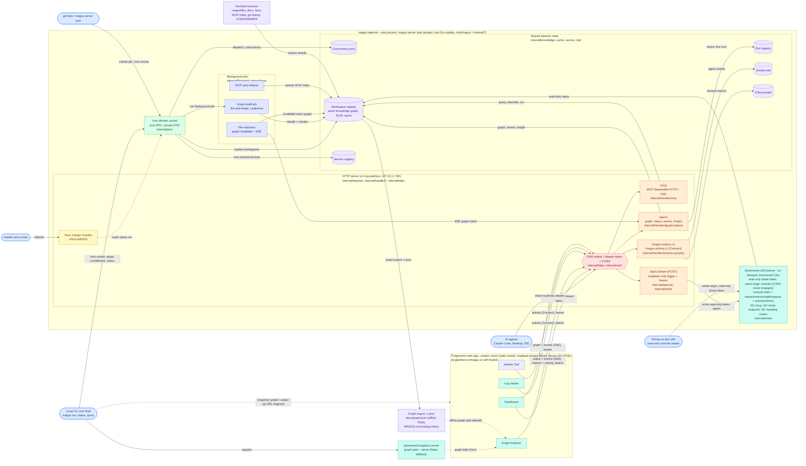

# magus

<p align="center">
  <picture>
    <source srcset="./assets/gopher.webp" type="image/webp">
    
  </picture>
</p>

<!-- Coverage is generated locally by `magus run coverage` (Go toolchain only, no third-party service); regenerate and commit to refresh. -->

<a href="https://github.com/egladman/magus/actions/workflows/ci.yaml"></a>  <a href="https://pkg.go.dev/github.com/egladman/magus"></a>

A fast, cross-platform task orchestrator for polyglot monorepos. One statically linked binary, config as code, no second toolchain to install.

Change a file and magus works out which projects it reaches, rebuilds only those, and caches every result so the same work never runs twice.

## Why magus exists

The tools you run in a monorepo, you run all day. Build, test, lint, switch
branches, do it again. So friction compounds fast. A few wasted seconds a run,
one flaky target, a teammate's botched merge that starts failing on your
checkout, and now you are babysitting the build instead of shipping the feature.
Tooling this central earns its place by getting out of the way. It should be
fast, and genuinely good at the narrow thing it does.

The other half of the job is knowledge. Monorepos outgrow the people and tools
reading them. Humans grep; AI agents grep faster and guess more confidently;
both drown in generated files, legacy patterns, and dependency chains nobody
holds in their head. magus takes the opposite bet. The build tool already has to
know the repo precisely, down to every project, every target's inputs and
declared outputs, and what a diff reaches, so it hands that knowledge back as
answers instead of leaving everyone to rediscover it.

That is the rule for the whole surface. Every verb answers a question,
deterministically, from declared sources: which projects a change affects,
whether a file is generated and by what, where a symbol is used, how two things
relate. Nothing in magus decides for you, plans for you, or injects itself into
your workflow. Answering is the tool's job; deciding is yours, or your agent's.

The same discipline serves both audiences. A teammate on day one and an AI agent
in a fresh session have the same problem: a repo they cannot yet trust their
guesses about. magus gives them the same fix. Query the
[knowledge graph](docs/concepts/knowledge.md) instead of grepping, run
[targets](docs/concepts/targets.md) instead of raw tools, and let `magus affected ci`
prove what a change touched. For agents, see [Agents](docs/guides/agents.md).

## How it works

Four ideas carry most of the tool. Each has a deeper page; this is the short version.

### Affected sets

magus keeps a dependency graph of your projects and knows which files each
target reads. Change a file and `magus affected <target>` runs only the
projects that change can reach, in dependency order. `magus affected ci` runs
the full pipeline over that set, so CI does the least work a change requires
and still catches breakage in a project you never opened. See [CI](docs/concepts/targets/ci.md).

### Content-addressed caching

Every target declares its inputs and outputs. magus hashes the inputs, and if
it has already seen that hash it replays the stored output instead of running
the work again. The cache is a plain content-addressed store on disk (SHA-256):
the input hash is the key, and the stored outputs are addressed by their own
content hash, so a replay is a byte-for-byte reproduction of the recorded run.

### The knowledge graph

Because magus already knows every project, target, spell, and how they relate,
it exposes that as a graph you can query. `magus query "kind:target lint"` finds
nodes, `magus explain <node>` shows a node's edges and what reaches it, and
`magus refs <symbol>` lists where a symbol is defined and used from a SCIP
index.[^scip] The same graph answers "is this file generated," "what does my diff
touch," and "how do these two things relate" without grepping. See the
[knowledge graph](docs/concepts/knowledge.md).

### One vocabulary

magus names a thing once and reuses the name everywhere, in the CLI, the config,
and the graph. A [target](docs/concepts/targets.md) is a unit of work such as build,
test, or lint. A [spell](docs/concepts/spells.md) is a language adapter that supplies a
target's operations (the `go` spell provides `go-test`; the `buf` spell provides
`buf-lint`). A [charm](docs/concepts/charms.md) is a modifier applied to a run, like `rw`
for read-write or `cd` for a working directory. An [op](docs/concepts/operations.md) is a
single tool invocation. Learn the four words and the rest of the surface reads
the same way.

## Getting started

### Install

magus ships as a single self-contained binary, so there is no second toolchain
to install. See the [Download guide](docs/guides/download.md).

### A first look

magus targets are written in [Buzz](https://buzz-lang.dev/), a small typed
scripting language it embeds. A `magusfile.buzz` at the repo root declares your
targets as exported functions - each one composes operations from the spells you
bind:[^playground]

<!-- magus-run-recorder -->

```buzz
import "magus";
import "magus/spell/go";

magus.project({ "spells": [go] });

// Every exported function is a runnable target. It receives a magus\Context,
// the handle it uses to declare what it needs. magus caches each target's
// result and runs it only when a change reaches this project.
export fun build(ctx: magus\Context, args: [str]) > void { go["go-build"](); }
export fun test(ctx: magus\Context, args: [str])  > void { go["go-test"](); }
export fun lint(ctx: magus\Context, args: [str])  > void { go["golangci-lint"](); }

// format is read-only by default: go-fmt reports files that need formatting, and
// go-mod-tidy runs with --diff so it fails if go.mod/go.sum have drifted. The `rw`
// (read-write) charm flips both to apply: `magus run format:rw` formats the code
// and tidies the modules in place.
export fun format(ctx: magus\Context, args: [str]) > void {
    go["go-fmt"]();
    go["go-mod-tidy"]();
}

// 'ci' is the anchor `magus affected ci` keys off: it composes the pipeline
// by declaring the targets it needs.
export fun ci(ctx: magus\Context, args: [str]) > void {
    ctx.needs(build, test, lint, format);
}
```

Point magus at that repo and each command returns an answer and stops:

```sh
magus ls                                  # which projects exist
magus run test                            # run a target, cache the result
magus affected ci                         # the pipeline, over only what your diff reaches
magus query "kind:spell"                  # what the graph knows
magus describe file docs/gen/index.html   # is this file generated, and by what
```

Nothing here plans a workflow or decides for you. `describe file` tells you a
path is a generated output so you skip its diff; `affected ci` tells you which
projects a change reaches so you run no more than that.

## Architecture

One process (`magus server start`) exposes the workspace through two standing listeners, one per audience, and every browser page is a separate static asset; the binary serves no HTML. A third listener is raised only on demand: "share to phone" opens a time-boxed LAN listener that serves the read-only console to a phone on the same network, then tears itself down. The diagram below is the whole system: the clients, the transports and their guards, the shared in-memory state, the background jobs and knowledge-graph pipeline that keep it warm, and how the browser console reaches (or does without) the daemon.



<details>
<summary>How to read the diagram</summary>

The colors group the system by role, and each region is tagged with the Go
package or project that owns it, so the diagram doubles as a code map: the
runtime is the root module (`cmd/magus` plus `internal/*`), the browser console
is the [`docs/`](https://github.com/egladman/magus/tree/main/docs) project, and
the wire contracts are the [`proto/magus`](https://github.com/egladman/magus/tree/main/proto/magus)
protobufs.

Green is the Unix domain socket, the local control plane: it dispatches
`run`/`affected` into one shared [concurrency pool](docs/guides/daemon.md#concurrency),
answers `magus status`, and adopts nested `magus` calls. Fast and private
(`0700`); the local CLI and the liveness/readiness probes use it.

Orange is the HTTP server on `mcp.address`, for clients that cannot reach a Unix
socket. It carries [MCP](docs/guides/mcp.md) for agents at `/mcp`, the read-only
[`/api/v1`](docs/reference/console.md#what-the-console-serves) console routes,
Connect services for metrics and the activity trail, and one bearer-gated
[job-control service](docs/reference/console.md#job-control) for maintenance
jobs - the daemon's only mutating surface. Its request and
response types are the [`proto/magus`](https://github.com/egladman/magus/tree/main/proto/magus)
protobufs, generated by `buf` and served over Connect/JSON.

Red is the guard chain every HTTP route but health passes through: a
[DNS-rebind](docs/reference/console.md#how-it-is-secured) host check, a
[bearer token](docs/guides/mcp.md#security-keep-this-local) (the cli token plus named
connector tokens), and CORS scoped to the site and loopback origins.

Yellow is the health routes, left unguarded so a kubelet can probe them; they
answer by querying the same socket. See
[container probes](docs/guides/daemon.md#kubernetes-and-container-probes).

Purple is shared, warm daemon state: the [knowledge graph](docs/concepts/knowledge.md)
and SCIP index in the workspace registry, plus the runs, services, metrics, and
trail registries, and the graph's own declared inputs and exports.

Indigo is the background jobs that keep that state fresh without a foreground
command: file watchers invalidate the warm graph and push an SSE event to the
console, a throttled SCIP indexer keeps symbols current, and a branch switch
fires the git hook, which submits one coalesced graph-build job over the socket.

Teal is the browser console, four static surfaces on the daemon, covered in
[The browser console](#the-browser-console) below.

The graph itself is assembled from declared sources as shards (the magusfile
registry, docs, `@symbols` from SCIP, `@vcs` from git history, `CODEOWNERS`).
`magus graph export -o json` writes the committed `docs/graph.json` that the
offline console loads, and `magus describe graph -o markdown` writes the
`MAGUS.md` routing index; live, the daemon serves the same graph byte-identical
at `/api/v1/graph`.

</details>

Because the two listeners are separate, they can diverge: the socket can be
healthy while the HTTP/MCP endpoint failed to bind, which is why `magus status`
reports each one on its own line.

## The browser console

magus is fully featured from the terminal, so everything here is optional. Alongside the CLI, the daemon can drive four read-only browser surfaces.

> Want to see it first? [Open the live demo](https://eli.gladman.cc/magus/console/): no install, no daemon. It fills the dashboard with synthesized activity, streams a build into the log viewer, and lets you jump between all four surfaces in demo mode. Everything below runs against your own daemon instead.

### The four surfaces

The four surfaces ship as one console app; each link below opens it on the
matching surface.

- [Dashboard](https://eli.gladman.cc/magus/console/) shows live daemon health, the concurrency pool, running targets, and cache activity.[^app-dashboard]
- [Graph Explorer](https://eli.gladman.cc/magus/console/) navigates targets, spells, and their dependency graph (`magus graph open`).[^app-graph]
- [Log Viewer](https://eli.gladman.cc/magus/console/) reads or streams any past run's captured output (`magus query output <ref> --open`).[^app-logs]
- [Activity Trail](https://eli.gladman.cc/magus/console/) shows the daemon's recent actions: MCP calls, background jobs, and config changes.[^app-activity]

### How it stays on your machine

These are add-ons, not a runtime you depend on. Two decisions keep them that way.

#### The binary serves no HTML

magus never embeds a web server that ships a UI. The pages are a separate static site (built under [`docs/gen/`](https://github.com/egladman/magus/tree/main/docs/gen), hosted at [eli.gladman.cc/magus](https://eli.gladman.cc/magus/), or self-hosted from any file server). All the daemon exposes over loopback is a small API - read-only views (`/api/v1/...`), one bearer-gated [job-control service](docs/reference/console.md#job-control) for maintenance jobs, and the MCP endpoint. There is no page serving.

#### Your data never leaves the loopback

The hosted page talks only to `127.0.0.1`/`[::1]`, a loopback lock it enforces before any request, or it receives your graph inline through a URL fragment. Nothing is uploaded. You can drop the UI entirely: set `console.enabled: false` and the daemon runs fine without it, serving no browser API at all. See the [Console reference](https://eli.gladman.cc/magus/console/).

## Working with AI agents

magus treats an AI agent and a new teammate as the same kind of user: someone who cannot yet trust their guesses about the repo. It ships an agent surface built on the knowledge graph, so an agent asks magus instead of grepping and guessing.

- **Installable skills** teach an agent to query the graph, run work through targets, and triage generated files. Install them into whatever directory your agent host reads: `magus agent install .claude/skills` (or `.opencode/skills`, `.agents/skills`, `--agents-md` for AGENTS.md hosts).
- **The committed `MAGUS.md`** is a routing index, regenerated from the graph, that points an agent at the exact query for a given question.
- **The MCP server** the daemon exposes lets an agent call magus tools directly over the protocol rather than shelling out.[^mcp]

Full detail, including which tools exist and how to connect, is on the [Agents](docs/guides/agents.md) page.

## Documentation

Full docs live at **[eli.gladman.cc/magus](https://eli.gladman.cc/magus/)**.[^docs-source] The major sections:

- Core concepts: [Targets](docs/concepts/targets.md), [Spells](docs/concepts/spells.md), [Charms](docs/concepts/charms.md), [Operations](docs/concepts/operations.md), [Services](docs/concepts/services.md)
- Running at scale: [CI](docs/concepts/targets/ci.md), [Daemon](docs/guides/daemon.md), [Remote caching](docs/concepts/remote-cache.md), [MCP](docs/guides/mcp.md), [Telemetry](docs/concepts/telemetry.md)
- Reference: [Man pages](docs/reference/manpage/magus.md), [Standard library modules](docs/reference/buzz/index.md), [Debugging](docs/guides/debugging.md), [Output references](docs/concepts/output-refs.md), [Tips and tricks](docs/guides/tips.md)

Inside a workspace, the entry point is the committed [`MAGUS.md`](https://github.com/egladman/magus/blob/main/MAGUS.md): a
generated routing index of the workspace's projects, targets, and the exact
knowledge-graph queries that answer questions about them. Projects can carry
their own (this repo commits one for `gopherbuzz/` and `docs/`), scoped to
that project. They are generated by `magus describe graph -o markdown` via the
`generate` target; regenerate them, never hand-edit.

## Contributing

For the full contributor reference, see the [Development page](https://eli.gladman.cc/magus/development/): the [Contributing guide](https://eli.gladman.cc/magus/development/contributing/), per-project target catalogs (run order and dependency graphs), and the config reference. The architecture diagram above tags each runtime component with the package it lives in, which is the quickest map of where code goes.

### Building from source

Building magus needs Go. The full toolchain (Go itself, plus Node and esbuild for the docs site and TinyGo for the WebAssembly playground) is pinned in [`mise.toml`](https://github.com/egladman/magus/blob/main/mise.toml); [mise](https://mise.jdx.dev/) installs it in one step. From a fresh clone:

```sh
mise install           # installs the pinned Go, Node, esbuild, and TinyGo
go build -o magus ./cmd/magus
```

Only building the `magus` binary? Go alone is enough and you can skip `mise install`; you need it for the docs site (`magus run generate docs`) and the playground.

### Running the tests

Run the tests through magus itself, since the whole point is that magus builds and tests magus:

```sh
magus run ci
```

[^docs-source]: Source: [docs/](https://github.com/egladman/magus/tree/main/docs).

[^playground]: Magusfiles are written in Buzz. You can run it in your browser, no install, at the [Playground](https://eli.gladman.cc/magus/playground/); the [standard library modules](docs/reference/buzz/index.md) are the API reference.

[^scip]: [SCIP](https://sourcegraph.com/docs/code-search/code-navigation/writing_an_indexer) is Sourcegraph's code-index format. magus indexes on its own once a project uses the `scip` op, stores the index in the cache, and refreshes it in the background; the [knowledge graph](docs/concepts/knowledge.md) page covers the symbol layer and the `@symbols` shard.

[^app-dashboard]: What the tiles mean, and the metrics behind them: [Telemetry](docs/concepts/telemetry.md) and the [daemon](docs/guides/daemon.md) page.

[^app-graph]: The same graph the CLI queries, drawn. See [`magus graph`](docs/reference/manpage/magus-graph.md) for the verbs and [knowledge graph](docs/concepts/knowledge.md) for the schema.

[^app-logs]: A run's output is addressed by a short reference ID, which is what `<ref>` is above. See [output references](docs/concepts/output-refs.md).

[^mcp]: Tool list, transport, and how to connect an agent: [MCP](docs/guides/mcp.md).

[^app-activity]: The trail is the daemon's own record, kept in memory per workspace. See the [daemon](docs/guides/daemon.md) page.
