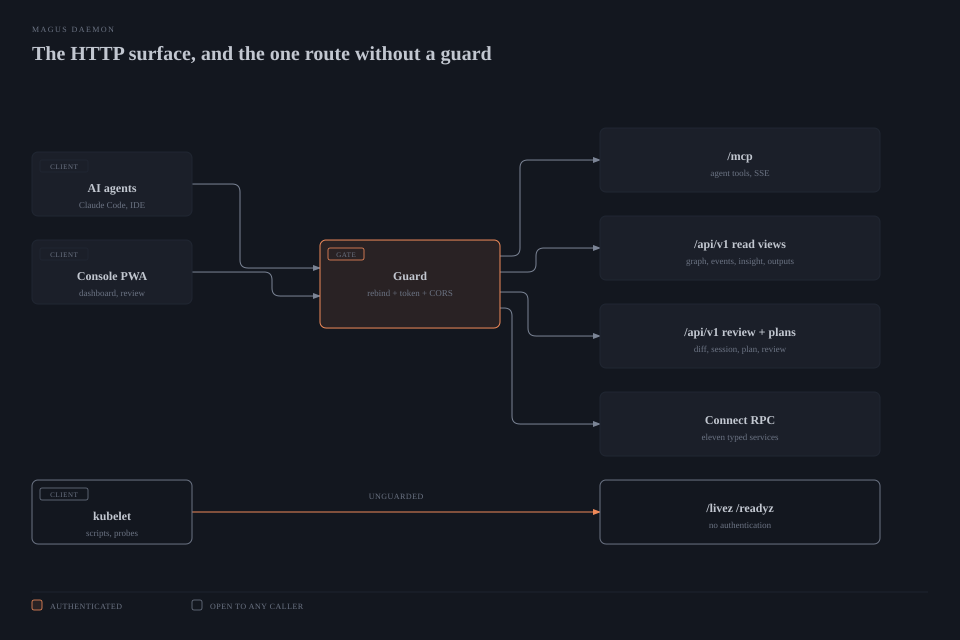
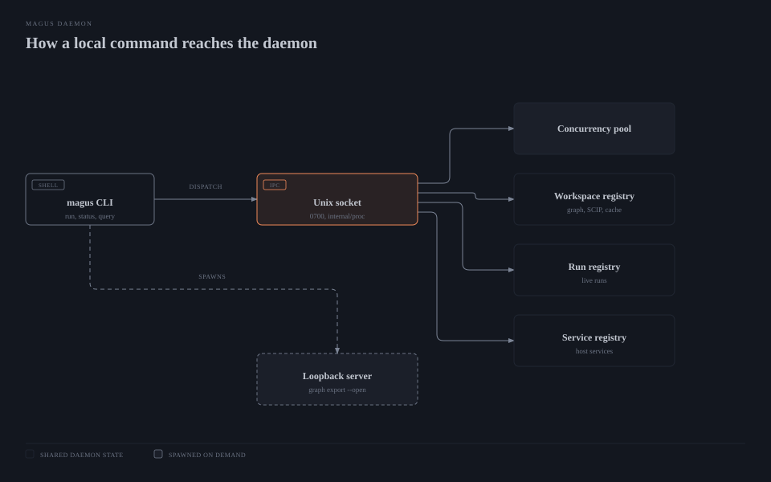
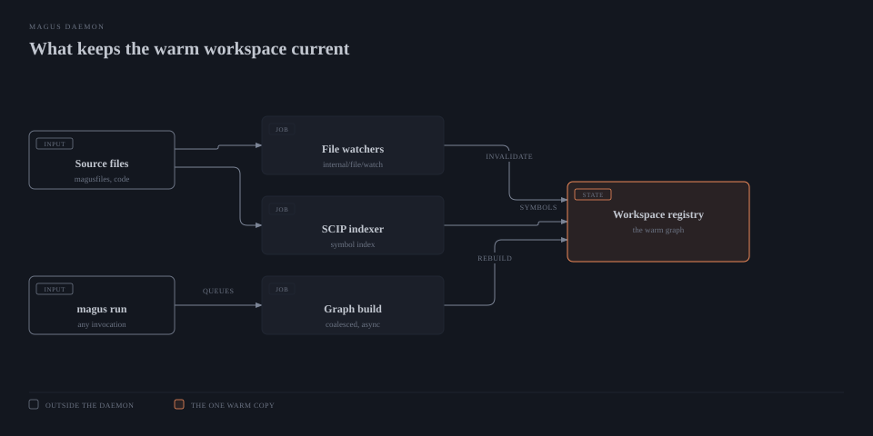
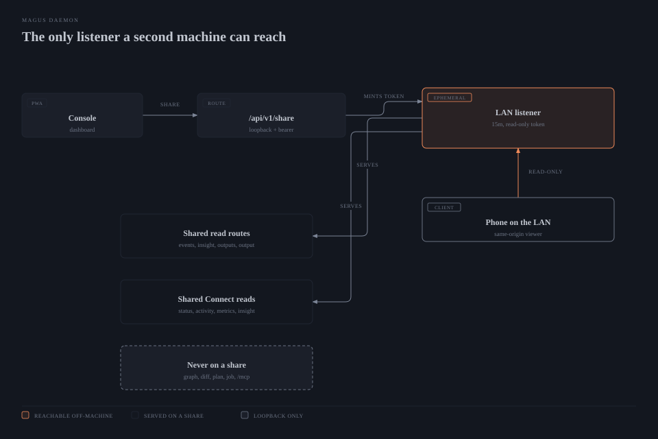
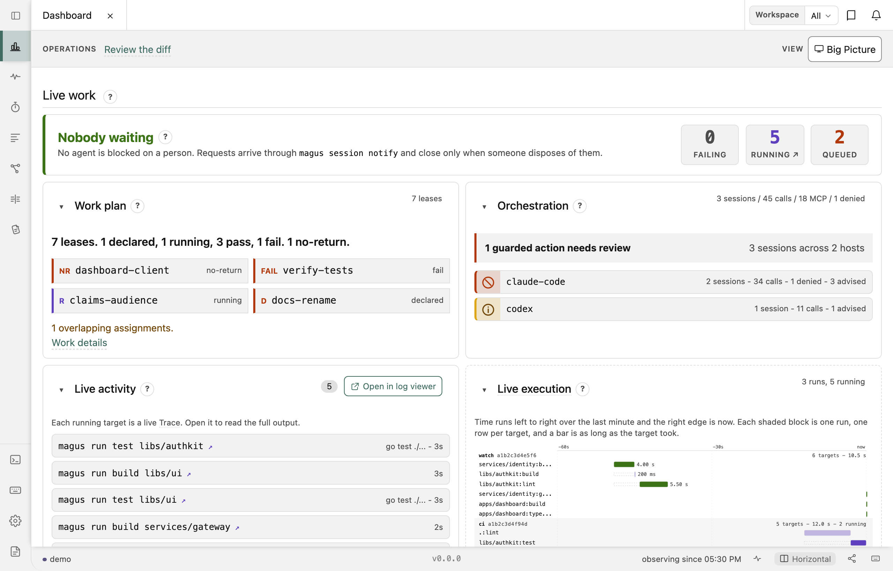
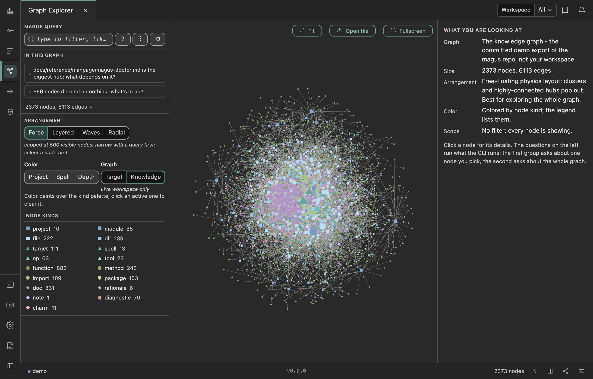
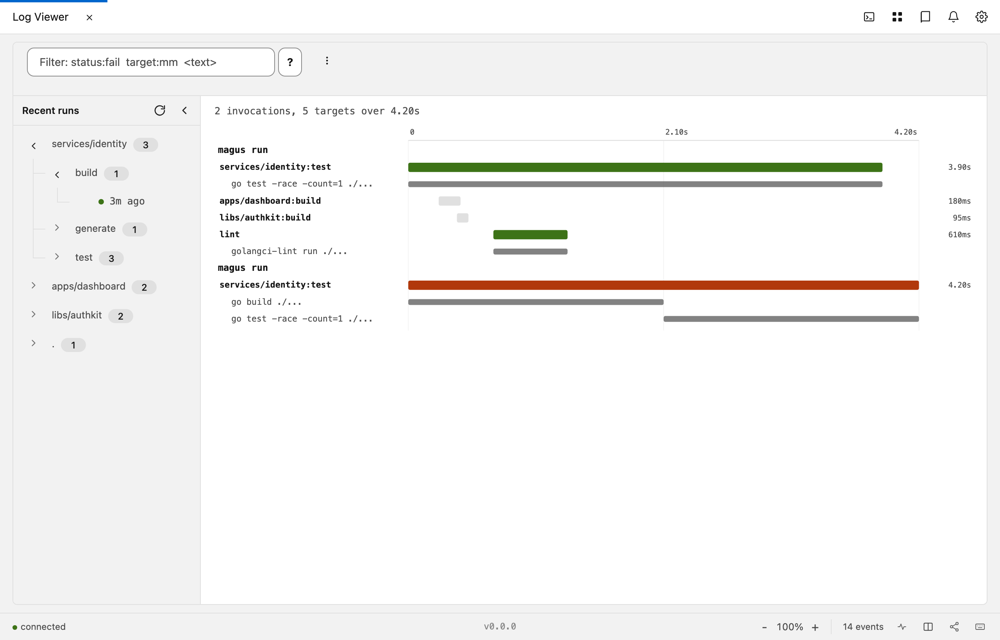
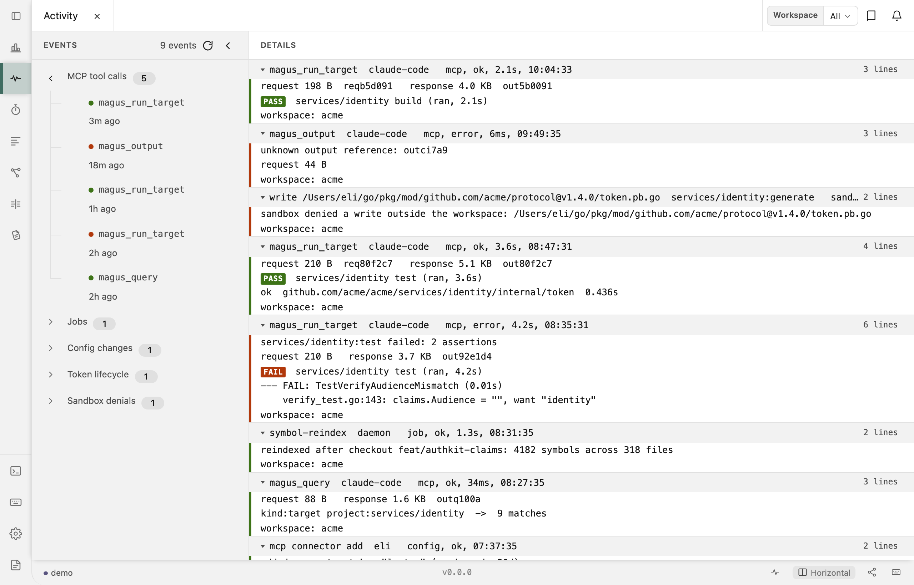
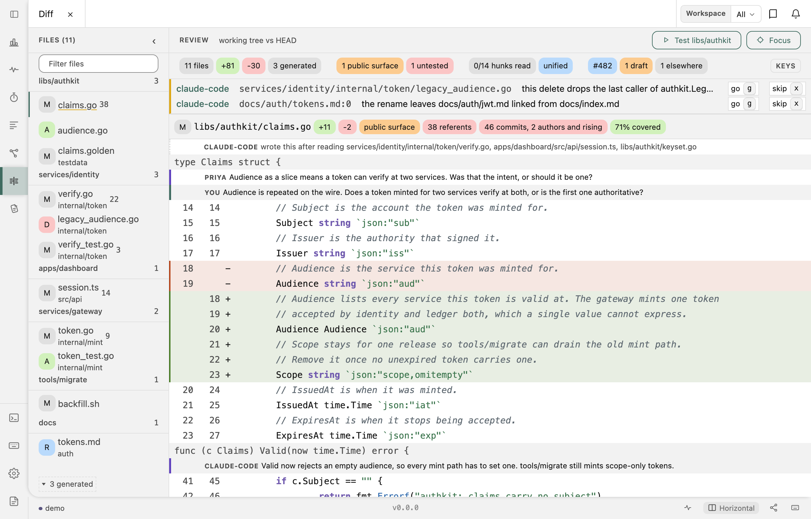

# magus

<p align="center">
  <picture>
    <source srcset="./assets/gopher.webp" type="image/webp">
    
  </picture>
</p>

<!-- Coverage is generated locally by `magus run coverage` (Go toolchain only, no third-party service); regenerate and commit to refresh. -->

<a href="https://github.com/egladman/magus/actions/workflows/ci.yaml"></a>   <a href="https://pkg.go.dev/github.com/egladman/magus"></a>

A fast, cross-platform task orchestrator for polyglot monorepos. One binary, no second toolchain to install. Targets are programs, not YAML.

Change a file and magus works out which projects it reaches, rebuilds only those, and caches every result so the same work never runs twice.

magus informs; it never decides. It hands you everything it knows about your repository - what a change reaches, which files are generated, where a symbol is used - and the call stays yours. It was built for humans, not for agents: agents drive it well anyway, because an interface legible to a person is legible to anything, and that ordering is the design.

<!-- Rendered by `magus run termcast-generate` from tapes/core-loop.capture, the raw
     bytes a real magus printed to a real terminal. Re-record with `magus run
     termcast-record` when the CLI's output changes; both files commit together. -->

<p align="center">
  <picture>
    <source media="(prefers-color-scheme: light)" srcset="./assets/gen/core-loop-light.svg">
    
  </picture>
</p>

<p align="center"><em>One command, three runs: cold, fully cached, then narrowed to what a change reached.</em></p>

## Why magus exists

magus is the tool you type all day: build, test, lint, and ask the repo a
question. Two problems shape everything else on this page. The first is what
those commands cost you in time. The second is what they need you to already
know.

The tools you run in a monorepo, you run all day. Build, test, lint, switch
branches, do it again. So friction compounds fast. A few wasted seconds a run,
one flaky target, a teammate's botched merge that starts failing on your
checkout, and now you are babysitting the build instead of shipping the feature.
Tooling this central earns its place by getting out of the way. It should be
fast, and genuinely good at the narrow thing it does.

The other half of the job is knowledge. Monorepos outgrow the people and tools
reading them. Humans grep; AI agents grep faster and guess more confidently;
both drown in generated files, unfamiliar patterns, and dependency chains nobody
holds in their head. magus takes the opposite bet. The build tool already has to
know the repo precisely, down to every project, every target's inputs and
declared outputs, and what a diff reaches, so it hands that knowledge back as
answers instead of leaving everyone to rediscover it.

That is the rule for the whole surface. Every verb answers a question,
deterministically, from declared sources: which projects a change affects,
whether a file is generated and by what, where a symbol is used, how two things
relate. Nothing in magus decides for you, plans for you, or injects itself into
your workflow. Answering is the tool's job; deciding is yours, or your agent's.

The same discipline serves both audiences. A teammate on day one and an AI agent
in a fresh session have the same problem: a repo they cannot yet trust their
guesses about. magus gives them the same fix. Query the
[knowledge graph](docs/concepts/knowledge.md) instead of grepping, run
[targets](docs/concepts/targets.md) instead of raw tools, and let `magus affected ci`
prove what a change touched. For agents, see [Agents](docs/guides/integrations/agents.md).

The longer argument behind that position, and what it was a reaction to, is in
[I think our tools are the problem](https://eli.gladman.cc/magus/blog/2026/08/03/the-tools-were-the-problem/).

## Who this is for

If any of these is your week, the rest of this page is worth your time:

- **You came back to your own project after three months** and cannot remember
  which command is the real one.
- **Your CI runs everything on every commit**, you know most of it was pointless,
  and you cannot prove which part.
- **You inherited the build.** Whoever wrote it has gone, and you need to change
  one step without discovering what else it fed.
- **You run more than one language in one repo**, and your task runner was built
  for one of them.
- **Your agent greps and guesses.** It is fast, it is confident, and it is wrong
  in ways that take longer to catch than to fix.
- **You have a `.env` full of tokens** you keep meaning to clean up, in a shell
  where everything you launch inherits them.
- **Someone asked why a target rebuilt** and the honest answer was a shrug.
- **You stopped trusting the cache** and turned it off, and now everything is
  slow and at least it is honest.
- **A merge changed the lockfile and nothing told you.** Your next command ran
  against stale dependencies and failed somewhere unrelated, and the fix was a
  command nobody printed.
- **Your task runner installs through the package manager it is supposed to be
  running.** When it breaks you fix it by upgrading the toolchain you were using
  it to pin.
- **Generated files keep landing in review** and nobody agrees which are safe to
  edit by hand.
- **Getting the build working is its own project**, and it was supposed to be
  the thing that let you work on the other one.

There is one shape under all of them: a question about your own repository that
something already knows and nothing will tell you.

Two of those waste whole afternoons, so here is what magus does about them.

**The stale install.** magus runs your package manager's install as a _step of
the build_, not as something you are expected to remember after a merge. It does
not try to work out whether the install is needed, and that is deliberate: the
obvious check - does `node_modules` exist - is wrong in the case that matters,
because an interrupted install leaves a directory that exists and is incomplete.
So the install runs every time and lets the package manager be the judge. That
costs about a second on a warm tree and fails loudly when the lockfile and the
manifest disagree.

**The bootstrap loop.** magus is one binary and installs
through none of the toolchains it drives. A task orchestrator that arrives
through the package manager it orchestrates has put itself downstream of the
thing it is meant to control: the failures arrive oblique, there is rarely
anywhere sensible to attach an error explaining them, and the repair is to
upgrade the runtime you adopted the tool to pin. That boundary is stated as a
rule in [Scope](docs/scope.md), not as a preference.

### If you only have one project

Most of what is above does not depend on having several. A target's cache key is
built from that target's own declared inputs, so a warm re-run skips work in a
one-project repo exactly as it does in this repository's ten. The knowledge graph
indexes symbols, docs and generated files, not just the edges between projects.
One vocabulary is worth more on your own, not less, because there is nobody else
to ask what the build step was called.

What does thin out is the affected set. With one project, "what did this change
reach" has only one answer, and the shard planning behind `magus affected ci` has
nothing to plan. That is the part that starts paying when you split out a second
project, which is also why `magus init` scaffolds exactly one and expects to be
right for a while.

### Who it is not for

Stated plainly, because a list of strengths on its own is advertising:

- **You need a build farm.** There is no remote execution. magus caches results
  and shares them; it does not run your work on someone else's machine.
- **You want your toolchain versions installed for you.** magus compares what
  ran against what you declared and stops there. It will not select, install, or
  switch a version - see [Scope](docs/scope.md).
- **You need a sandbox that fails on undeclared reads.** magus's sandbox is a
  supply-chain defense: off by default, with no kernel layer on macOS. If you
  want Bazel's hermeticity guarantee, magus does not offer it and should not be
  read as claiming it - see [Sandbox](docs/concepts/sandbox.md).
- **You want your build steps to run in containers.** magus will not require a
  container runtime, because a task orchestrator that needs one cannot be used to
  bootstrap the machine it runs on - and it offers no opt-in container isolation
  either. (The `container` charm changes what a target _produces_, an image
  instead of a binary; the build still runs on the host.) If a fixed execution
  environment is what you are buying, a container-native runner is the better
  tool - the reasoning is in [Scope](docs/scope.md).

## How it works

Four ideas carry most of the tool. Each has a deeper page; this is the short version.

### Affected sets

magus keeps a dependency graph of your projects and knows which files each
target reads. Change a file and `magus affected <target>` runs only the
projects that change can reach, in dependency order. `magus affected ci` runs
the full pipeline over that set, so CI does the least work a change requires
and still catches breakage in a project you never opened. See [CI](docs/concepts/targets/ci.md).

### Content-addressed caching

Every target declares its inputs and outputs. magus hashes the inputs, and if
it has already seen that hash it replays the stored output instead of running
the work again. The cache is a plain content-addressed store on disk (SHA-256):
the input hash is the key, and the stored outputs are addressed by their own
content hash, so a replay is a byte-for-byte reproduction of the recorded run.

### The knowledge graph

Most tools that offer you a codebase graph are observers: a separate indexer
scans the repo, infers the structure, and can be wrong in ways nothing warns you
about. magus is not observing - it is the thing that builds the repo, so it
already has to know every project, every target's declared inputs and outputs,
and what a diff reaches, and getting any of that wrong breaks builds loudly.
The graph is that same knowledge handed back: a byproduct of being the source
of truth, never an inference about it. No LLM pass, no fuzzy linking; every
edge traces to a declaration you can open.

`magus query "kind:target lint"` finds
nodes, `magus explain <node>` shows a node's edges and what reaches it, and
`magus refs <symbol>` lists where a symbol is defined and used from a SCIP
index.[^scip] The same graph answers "is this file generated," "what does my diff
touch," and "how do these two things relate" without grepping. See the
[knowledge graph](docs/concepts/knowledge.md), including
[what this graph deliberately is not](docs/concepts/knowledge.md#what-this-graph-is-not).

### One vocabulary

magus names a thing once and reuses the name everywhere, in the CLI, the config,
and the graph. A [target](docs/concepts/targets.md) is a unit of work such as build,
test, or lint. A [spell](docs/concepts/spells.md) is a language adapter that supplies a
target's operations (the `go` spell provides `go-test`; the `buf` spell provides
`buf-lint`). A [charm](docs/concepts/charms.md) is a modifier applied to a run, like `rw`
for read-write or `cd` for continuous delivery. An [op](docs/concepts/operations.md) is a
single tool invocation. Learn the four words and the rest of the surface reads
the same way.

### There is a terminal UI. It stays out of your way

<!-- Recorded by `magus run termcast-showcase` - a real interactive session driven
     by real keystrokes - and rendered by `magus run termcast-generate`. Both files
     commit together. -->

<p align="center">
  <picture>
    <source media="(prefers-color-scheme: light)" srcset="./assets/gen/showcase-light.svg">
    
  </picture>
</p>

<p align="center"><em>A run pins its progress, failures group by project beside their output, and the picker searches the graph as you type.</em></p>

The band at the bottom holds still while your output scrolls past it. Nothing is
cleared, the alternate screen is never touched, and your scrollback survives -
so selection, copy and paste keep working the way they always did. Every one of
these surfaces degrades to plain text when there is no terminal to draw on.

## Getting started

### Install

magus ships as a single self-contained binary, so there is no second toolchain
to install.

```sh
curl --proto '=https' --tlsv1.2 -sSf https://eli.gladman.cc/magus/install -o install.sh
less install.sh
sh install.sh
```

Reviewing the downloaded script before executing it lets you audit the URL, verification,
and installation steps instead of piping an unreviewed network response directly to your shell.
See the [Install guide](docs/setup.md) for platform details, verification, and updates.

### A first look

magus targets are written in [Buzz](https://buzz-lang.dev/), a small typed
scripting language it embeds. A `magusfile.buzz` at the repo root declares your
targets as exported functions - each one composes operations from the spells you
bind:[^playground]

<!-- magus-run-recorder -->

```buzz
import "magus";
import "magus/spell/go";

magus\project({ "spells": [go] });

// Every exported function is a runnable target. It receives a magus\Context,
// the handle it uses to declare what it needs and hands to every op it runs.
// magus caches each target's result and runs it only when a change reaches
// this project.
export fun build(ctx: magus\Context, args: [str]) > void { go["go-build"](ctx); }
export fun test(ctx: magus\Context, args: [str])  > void { go["go-test"](ctx); }
export fun lint(ctx: magus\Context, args: [str])  > void { go["golangci-lint"](ctx); }

// format is read-only by default: go-fmt reports files that need formatting, and
// go-mod-tidy runs with --diff so it fails if go.mod/go.sum have drifted. They take
// DIFFERENT write charms, because they are not the same risk. gofmt is offline, so
// the same tree always yields the same bytes - `magus run format:rw` rewrites the
// code. Tidy resolves against the module proxy, so what it writes depends on what
// upstream serves today; that is a second, deliberate ask:
//   magus run format:rw          formatting only; go mod tidy still just reports
//   magus run format:rw,relock   also let go mod tidy amend go.mod and go.sum
export fun format(ctx: magus\Context, args: [str]) > void {
    go["go-fmt"](ctx);
    go["go-mod-tidy"](ctx);
}

// 'ci' is the anchor `magus affected ci` keys off: it composes the pipeline
// by declaring the targets it needs.
export fun ci(ctx: magus\Context, args: [str]) > void {
    ctx.needs(build, test, lint, format);
}
```

Point magus at that repo and each command returns an answer and stops:

```sh
magus ls                                  # which projects exist
magus run test                            # run a target, cache the result
magus affected ci                         # the pipeline, over only what your diff reaches
magus query "kind:spell"                  # what the graph knows
magus describe file docs/gen/index.html   # is this file generated, and by what
```

Nothing here plans a workflow or decides for you. `magus describe file` tells you a
path is a generated output so you skip its diff; `magus affected ci` tells you which
projects a change reaches so you run no more than that.

## Architecture

One process (`magus server start`) exposes the workspace through two standing listeners, one per audience, and every browser page is a separate static asset; the binary serves no HTML. A third listener is raised only on demand: "share to phone" opens a time-boxed LAN listener that serves the read-only console to a phone on the same network, then tears itself down.

Four figures, one subject each. They were one flowchart until it carried roughly thirty-five boxes, which is the point at which a diagram stops being read and starts being skipped.

### The HTTP surface

Agents and the console share one guarded front door: a DNS-rebind check, a bearer token and a CORS policy sit in front of `/mcp`, `/api/v1`, the Connect services and the share endpoint. The health endpoints are the deliberate exception, so a probe never needs a credential.

<picture>
  <source media="(prefers-color-scheme: light)" srcset="docs/assets/gen/diagram-daemon-http-light.svg">
  
</picture>

### The local path

A CLI invocation never goes over HTTP. It dispatches across a private unix domain socket into the concurrency pool and the three registries the daemon keeps warm. Sharing a graph is the one case that spawns a separate short-lived loopback server.

<picture>
  <source media="(prefers-color-scheme: light)" srcset="docs/assets/gen/diagram-daemon-socket-light.svg">
  
</picture>

### What keeps it warm

File watchers, the SCIP auto-indexer and a coalesced graph-build job all exist to keep one thing current: the workspace registry, which holds the daemon's only warm copy of the knowledge graph.

<picture>
  <source media="(prefers-color-scheme: light)" srcset="docs/assets/gen/diagram-daemon-jobs-light.svg">
  
</picture>

### Sharing to a phone

The LAN listener is the only part of magus a second machine can reach. It is minted by a loopback-only endpoint, time-boxed to fifteen minutes, carries a read-only token, and serves no MCP, share or mutating route at all.

<picture>
  <source media="(prefers-color-scheme: light)" srcset="docs/assets/gen/diagram-daemon-share-light.svg">
  
</picture>

<details>
<summary>How to read the diagram</summary>

The colors group the system by role, and each region is tagged with the Go
package or project that owns it, so the diagram doubles as a code map: the
runtime is the root module (`cmd/magus` plus `internal/*`), the browser console
is the [`docs/`](https://github.com/egladman/magus/tree/main/docs) project, and
the wire contracts are the [`proto/magus`](https://github.com/egladman/magus/tree/main/proto/magus)
protobufs.

Green is the Unix domain socket, the local control plane: it dispatches
`magus run`/`magus affected` into one shared [concurrency pool](docs/guides/integrations/daemon.md#concurrency),
answers `magus status`, and adopts nested `magus` calls. Fast and private
(`0700`); the local CLI and the liveness/readiness probes use it.

Orange is the HTTP server on `mcp.address`, for clients that cannot reach a Unix
socket. It carries [MCP](docs/guides/integrations/mcp.md) for agents at `/mcp`, the read-only
[`/api/v1`](docs/reference/console.md#what-the-console-serves) console routes,
Connect services for metrics and the activity trail, and one bearer-gated
[job-control service](docs/reference/console.md#job-control) for maintenance
jobs - the daemon's only mutating surface. Its request and
response types are the [`proto/magus`](https://github.com/egladman/magus/tree/main/proto/magus)
protobufs, generated by `buf` and served over Connect/JSON.

Red is the guard chain every HTTP route but health passes through: a
[DNS-rebind](docs/reference/console.md#how-it-is-secured) host check, a
[bearer token](docs/guides/integrations/mcp.md#security-keep-this-local) (the cli token plus named
connector tokens), and CORS scoped to the site and loopback origins.

Yellow is the health routes, left unguarded so a kubelet can probe them; they
answer by querying the same socket. See
[container probes](docs/guides/integrations/daemon.md#kubernetes-and-container-probes).

Purple is shared, warm daemon state: the [knowledge graph](docs/concepts/knowledge.md)
and SCIP index in the workspace registry, plus the runs, services, metrics, and
trail registries, and the graph's own declared inputs and exports.

Indigo is the background jobs that keep that state fresh without a foreground
command: file watchers invalidate the warm graph and push an SSE event to the
console, a throttled SCIP indexer keeps symbols current, and a branch switch
fires the git hook, which submits one coalesced graph-build job over the socket.

Teal is the browser console, four static apps on the daemon, covered in
[The browser console](#the-browser-console) below.

The graph itself is assembled from declared sources as shards (the magusfile
registry, docs, `@symbols` from SCIP, `@vcs` from git history, `CODEOWNERS`).
`magus graph export -o json` writes the graph data copied into the console's
offline demo, and `magus describe graph -o markdown` writes the
`MAGUS.md` routing index; live, the daemon serves the same graph byte-identical
at `/api/v1/graph`.

</details>

Because the two listeners are separate, they can diverge: the socket can be
healthy while the HTTP/MCP endpoint failed to bind, which is why `magus status`
reports each one on its own line.

## The browser console

magus is fully featured from the terminal, so everything here is optional. Alongside the CLI, the daemon can drive a set of read-only browser apps.

> Want to see it first? [Open the live demo](https://eli.gladman.cc/magus/console/): no install, no daemon. It fills the dashboard with synthesized activity, streams a build into the log viewer, and lets you jump between every app in demo mode. Everything below runs against your own daemon instead.

### The apps

The apps ship as one console; each link below opens it on the
matching app.

<!-- Grid layout after cathrynlavery/diagram-design's README gallery. Screenshots are
     regenerated by ./hacks/screenshots.sh against each surface's #demo showcase. -->
<table>
  <tr>
    <td align="center" width="33%"><br><b>Dashboard</b><br><sub>Pool, cache and daemon health, live</sub></td>
    <td align="center" width="33%"><br><b>Graph Explorer</b><br><sub>Targets, spells and their dependencies</sub></td>
    <td align="center" width="33%"><br><b>Log Viewer</b><br><sub>Any run's captured output, streamed or replayed</sub></td>
  </tr>
  <tr>
    <td align="center" width="33%"><br><b>Activity Trail</b><br><sub>What agents did, and when</sub></td>
    <td align="center" width="33%"><br><b>Diff</b><br><sub>Review the working tree, paired with an agent</sub></td>
    <td align="center" width="33%"></td>
  </tr>
</table>

- [Dashboard](https://eli.gladman.cc/magus/console/) shows live daemon health, the concurrency pool, running targets, and cache activity.[^app-dashboard]
- [Graph Explorer](https://eli.gladman.cc/magus/console/) navigates targets, spells, and their dependency graph (`magus graph export --open`).[^app-graph]
- [Log Viewer](https://eli.gladman.cc/magus/console/) reads or streams any past run's captured output (`magus query output <ref> --open`).[^app-logs]
- [Activity Trail](https://eli.gladman.cc/magus/console/) shows recent MCP calls, agent-command observations, background jobs, and config changes.[^app-activity]
- [Diff](https://eli.gladman.cc/magus/console/) annotates the working tree's uncommitted changes - generated vs source, blast radius, coverage - and hosts the human half of a paired review.
- [Plan](https://eli.gladman.cc/magus/console/) draws the delegation ledger an orchestrating agent declared beside the target DAG a plain run derives.

### How it stays on your machine

These are add-ons, not a runtime you depend on. Two decisions keep them that way.

#### The binary serves no HTML

magus never embeds a web server that ships a UI. The pages are a separate static site (built under [`docs/gen/`](https://github.com/egladman/magus/tree/main/docs/gen), hosted at [eli.gladman.cc/magus](https://eli.gladman.cc/magus/), or self-hosted from any file server). All the daemon exposes over loopback is a small API - read-only views (`/api/v1/...`), one bearer-gated [job-control service](docs/reference/console.md#job-control) for maintenance jobs, and the MCP endpoint. There is no page serving.

#### Your data never leaves the loopback

The hosted page talks only to `127.0.0.1`/`[::1]`, a loopback lock it enforces before any request, or it receives your graph inline through a URL fragment. Nothing is uploaded. You can drop the UI entirely: set `console.enabled: false` and the daemon runs fine without it, serving no browser API at all. See the [Console reference](https://eli.gladman.cc/magus/console/).

## Working with AI agents

A tighter feedback loop does more for an agent working in your code base than a larger model does, and most of that loop already exists: the build, test, lint, format, and cache scripts you wrote so developers could set up an environment. magus is the hookup. Those same scripts become what the agent runs, deterministic and fast.

magus treats an AI agent and a new teammate as the same kind of user: someone who cannot yet trust their guesses about the repo. It ships an agent surface built on the knowledge graph, so an agent asks magus instead of grepping and guessing.

- **Installable skills** teach an agent to query the graph, run work through targets, and triage generated files. For Codex, run `magus agent install .agents/skills` and paste the always-on `AGENTS.md` block it prints. Claude Code uses `.claude/skills`; there is a setup page per host behind [Agents](docs/guides/integrations/agents.md).
- **The committed `MAGUS.md`** is a routing index, regenerated from the graph, that points an agent at the exact query for a given question.
- **The MCP server** the daemon exposes lets an agent call magus tools directly over the protocol rather than shelling out.[^mcp]

Full detail, including which tools exist and how to connect, is on the [Agents](docs/guides/integrations/agents.md) page.

## Documentation

Full docs live at **[eli.gladman.cc/magus](https://eli.gladman.cc/magus/)**.[^docs-source] The major sections:

- Core concepts: [Targets](docs/concepts/targets.md), [Spells](docs/concepts/spells.md), [Charms](docs/concepts/charms.md), [Operations](docs/concepts/operations.md), [Services](docs/concepts/services.md)
- Running at scale: [CI](docs/concepts/targets/ci.md), [CI providers](docs/concepts/ci/providers.md), [Daemon](docs/guides/integrations/daemon.md), [Remote caching](docs/concepts/cache/remote.md), [MCP](docs/guides/integrations/mcp.md), [Telemetry](docs/concepts/telemetry.md)
- Reference: [Man pages](docs/reference/manpage/magus.md), [Standard library modules](docs/reference/buzz/index.md), [Testing](docs/guides/testing.md), [Debugging](docs/guides/debugging.md), [Output references](docs/concepts/output-refs.md), [Tips and tricks](docs/guides/tips.md)

Inside a workspace, the entry point is the committed [`MAGUS.md`](https://github.com/egladman/magus/blob/main/MAGUS.md): a
generated routing index of the workspace's projects, targets, and the exact
knowledge-graph queries that answer questions about them. Projects can carry
their own (this repo commits one for `docs/` and for each project under
`libs/`), scoped to that project. They are generated by
`magus describe graph -o markdown` via the `generate` target; regenerate them,
never hand-edit.

## Development

magus is built and tested by magus, so this repository is a magus workspace like any other. That means parts of the contributor reference are generated from the workspace's own graph rather than written, and can show things a hand-maintained page cannot:

- **[Project catalogs](https://eli.gladman.cc/magus/development/projects/)** - one page per project: every runnable target, what it depends on, which toolchains it drives, and a run-order diagram built from the real `ctx.needs` edges.
- **[Workspace dependencies](https://eli.gladman.cc/magus/development/projects/)** - the projects in dependency order, with each one's blast radius: how many projects a change there can reach. Read it before you touch `libs/gopherbuzz`.
- **[Contributing guide](https://eli.gladman.cc/magus/development/contributing/)** - the conventions worth knowing before opening a pull request, including the benchmark-evidence rule for performance changes.
- **[Configuration reference](https://eli.gladman.cc/magus/reference/config/)** - the `magus.yaml` keys and the `MAGUS_*` environment inventory.

The architecture diagram above tags each runtime component with the package it lives in, which is the quickest map of where code goes.

### Building from source

Building magus needs Go. The full toolchain (Go itself, plus Node and esbuild for the docs site) is pinned in [`mise.toml`](https://github.com/egladman/magus/blob/main/mise.toml); [mise](https://mise.jdx.dev/) installs it in one step. From a fresh clone:

```sh
mise install           # installs the pinned Go, Node, and esbuild
go build -o magus ./cmd/magus
```

Only building the `magus` binary? Go alone is enough: run `GOEXPERIMENT=jsonv2 go build -o magus ./cmd/magus`. Use `mise install` for the docs site (`magus run generate docs`) and the playground.

### Running the tests

Run the tests through magus itself, since the whole point is that magus builds and tests magus:

```sh
magus run ci
```

[^docs-source]: Source: [docs/](https://github.com/egladman/magus/tree/main/docs).

[^playground]: Magusfiles are written in Buzz. You can run it in your browser, no install, at the [Playground](https://eli.gladman.cc/magus/playground/); the [standard library modules](docs/reference/buzz/index.md) are the API reference.

[^scip]: [SCIP](https://sourcegraph.com/docs/code-search/code-navigation/writing_an_indexer) is Sourcegraph's code-index format. magus indexes on its own once a project uses the `scip` op, stores the index in the cache, and refreshes it in the background; the [knowledge graph](docs/concepts/knowledge.md) page covers the symbol layer and the `@symbols` shard.

[^app-dashboard]: What the tiles mean, and the metrics behind them: [Telemetry](docs/concepts/telemetry.md) and the [daemon](docs/guides/integrations/daemon.md) page.

[^app-graph]: The same graph the CLI queries, drawn. See [`magus graph`](docs/reference/manpage/magus-graph.md) for the verbs and [knowledge graph](docs/concepts/knowledge.md) for the schema.

[^app-logs]: A run's output is addressed by a short reference ID, which is what `<ref>` is above. See [output references](docs/concepts/output-refs.md).

[^mcp]: Tool list, transport, and how to connect an agent: [MCP](docs/guides/integrations/mcp.md).

[^app-activity]: The trail is the daemon's own record, kept in memory per workspace. See the [daemon](docs/guides/integrations/daemon.md) page.
