# large-monorepo dependency graph

The project dependency graph magus sees for the benchmark workspace: 5 Next.js
apps (`apps/*`), each with a `build` target depending on its 20 feature
libraries (`packages/<app>/important-feature-*`, bound to the `tslib` spell with
a no-op `build`). The `packages/shared/*` packages are leaf nodes: no app's
`package.json` lists them, so, like every other tool, magus sees no edge to them.

This is the same set of nodes and edges turbo/nx/lage derive from `package.json`;
see `README.md` ("How magus is wired") for why the edges are declared twice
(`depends_on` for affected, `magus.needs` for ordering + caching).

Regenerate (after `./setup.sh`):

```sh
cd gen/repo && magus describe graph -o mermaid
```

```mermaid
---
config:
  flowchart:
    nodeSpacing: 50
    rankSpacing: 80
---
graph LR
  subgraph p0["apps/crew"]
    p0_build("build")
  end
  subgraph p1["apps/flight-simulator"]
    p1_build("build")
  end
  subgraph p2["apps/navigation"]
    p2_build("build")
  end
  subgraph p3["apps/ticket-booking"]
    p3_build("build")
  end
  subgraph p4["apps/warp-drive-manager"]
    p4_build("build")
  end
  subgraph p5["packages/crew/important-feature-0"]
    p5_build("build")
  end
  subgraph p6["packages/crew/important-feature-1"]
    p6_build("build")
  end
  subgraph p7["packages/crew/important-feature-10"]
    p7_build("build")
  end
  subgraph p8["packages/crew/important-feature-11"]
    p8_build("build")
  end
  subgraph p9["packages/crew/important-feature-12"]
    p9_build("build")
  end
  subgraph p10["packages/crew/important-feature-13"]
    p10_build("build")
  end
  subgraph p11["packages/crew/important-feature-14"]
    p11_build("build")
  end
  subgraph p12["packages/crew/important-feature-15"]
    p12_build("build")
  end
  subgraph p13["packages/crew/important-feature-16"]
    p13_build("build")
  end
  subgraph p14["packages/crew/important-feature-17"]
    p14_build("build")
  end
  subgraph p15["packages/crew/important-feature-18"]
    p15_build("build")
  end
  subgraph p16["packages/crew/important-feature-19"]
    p16_build("build")
  end
  subgraph p17["packages/crew/important-feature-2"]
    p17_build("build")
  end
  subgraph p18["packages/crew/important-feature-3"]
    p18_build("build")
  end
  subgraph p19["packages/crew/important-feature-4"]
    p19_build("build")
  end
  subgraph p20["packages/crew/important-feature-5"]
    p20_build("build")
  end
  subgraph p21["packages/crew/important-feature-6"]
    p21_build("build")
  end
  subgraph p22["packages/crew/important-feature-7"]
    p22_build("build")
  end
  subgraph p23["packages/crew/important-feature-8"]
    p23_build("build")
  end
  subgraph p24["packages/crew/important-feature-9"]
    p24_build("build")
  end
  subgraph p25["packages/flight-simulator/important-feature-0"]
    p25_build("build")
  end
  subgraph p26["packages/flight-simulator/important-feature-1"]
    p26_build("build")
  end
  subgraph p27["packages/flight-simulator/important-feature-10"]
    p27_build("build")
  end
  subgraph p28["packages/flight-simulator/important-feature-11"]
    p28_build("build")
  end
  subgraph p29["packages/flight-simulator/important-feature-12"]
    p29_build("build")
  end
  subgraph p30["packages/flight-simulator/important-feature-13"]
    p30_build("build")
  end
  subgraph p31["packages/flight-simulator/important-feature-14"]
    p31_build("build")
  end
  subgraph p32["packages/flight-simulator/important-feature-15"]
    p32_build("build")
  end
  subgraph p33["packages/flight-simulator/important-feature-16"]
    p33_build("build")
  end
  subgraph p34["packages/flight-simulator/important-feature-17"]
    p34_build("build")
  end
  subgraph p35["packages/flight-simulator/important-feature-18"]
    p35_build("build")
  end
  subgraph p36["packages/flight-simulator/important-feature-19"]
    p36_build("build")
  end
  subgraph p37["packages/flight-simulator/important-feature-2"]
    p37_build("build")
  end
  subgraph p38["packages/flight-simulator/important-feature-3"]
    p38_build("build")
  end
  subgraph p39["packages/flight-simulator/important-feature-4"]
    p39_build("build")
  end
  subgraph p40["packages/flight-simulator/important-feature-5"]
    p40_build("build")
  end
  subgraph p41["packages/flight-simulator/important-feature-6"]
    p41_build("build")
  end
  subgraph p42["packages/flight-simulator/important-feature-7"]
    p42_build("build")
  end
  subgraph p43["packages/flight-simulator/important-feature-8"]
    p43_build("build")
  end
  subgraph p44["packages/flight-simulator/important-feature-9"]
    p44_build("build")
  end
  subgraph p45["packages/navigation/important-feature-0"]
    p45_build("build")
  end
  subgraph p46["packages/navigation/important-feature-1"]
    p46_build("build")
  end
  subgraph p47["packages/navigation/important-feature-10"]
    p47_build("build")
  end
  subgraph p48["packages/navigation/important-feature-11"]
    p48_build("build")
  end
  subgraph p49["packages/navigation/important-feature-12"]
    p49_build("build")
  end
  subgraph p50["packages/navigation/important-feature-13"]
    p50_build("build")
  end
  subgraph p51["packages/navigation/important-feature-14"]
    p51_build("build")
  end
  subgraph p52["packages/navigation/important-feature-15"]
    p52_build("build")
  end
  subgraph p53["packages/navigation/important-feature-16"]
    p53_build("build")
  end
  subgraph p54["packages/navigation/important-feature-17"]
    p54_build("build")
  end
  subgraph p55["packages/navigation/important-feature-18"]
    p55_build("build")
  end
  subgraph p56["packages/navigation/important-feature-19"]
    p56_build("build")
  end
  subgraph p57["packages/navigation/important-feature-2"]
    p57_build("build")
  end
  subgraph p58["packages/navigation/important-feature-3"]
    p58_build("build")
  end
  subgraph p59["packages/navigation/important-feature-4"]
    p59_build("build")
  end
  subgraph p60["packages/navigation/important-feature-5"]
    p60_build("build")
  end
  subgraph p61["packages/navigation/important-feature-6"]
    p61_build("build")
  end
  subgraph p62["packages/navigation/important-feature-7"]
    p62_build("build")
  end
  subgraph p63["packages/navigation/important-feature-8"]
    p63_build("build")
  end
  subgraph p64["packages/navigation/important-feature-9"]
    p64_build("build")
  end
  subgraph p65["packages/shared/alerts"]
    p65_build("build")
  end
  subgraph p66["packages/shared/buttons"]
    p66_build("build")
  end
  subgraph p67["packages/shared/components"]
    p67_build("build")
  end
  subgraph p68["packages/shared/dialogs"]
    p68_build("build")
  end
  subgraph p69["packages/shared/icons"]
    p69_build("build")
  end
  subgraph p70["packages/ticket-booking/important-feature-0"]
    p70_build("build")
  end
  subgraph p71["packages/ticket-booking/important-feature-1"]
    p71_build("build")
  end
  subgraph p72["packages/ticket-booking/important-feature-10"]
    p72_build("build")
  end
  subgraph p73["packages/ticket-booking/important-feature-11"]
    p73_build("build")
  end
  subgraph p74["packages/ticket-booking/important-feature-12"]
    p74_build("build")
  end
  subgraph p75["packages/ticket-booking/important-feature-13"]
    p75_build("build")
  end
  subgraph p76["packages/ticket-booking/important-feature-14"]
    p76_build("build")
  end
  subgraph p77["packages/ticket-booking/important-feature-15"]
    p77_build("build")
  end
  subgraph p78["packages/ticket-booking/important-feature-16"]
    p78_build("build")
  end
  subgraph p79["packages/ticket-booking/important-feature-17"]
    p79_build("build")
  end
  subgraph p80["packages/ticket-booking/important-feature-18"]
    p80_build("build")
  end
  subgraph p81["packages/ticket-booking/important-feature-19"]
    p81_build("build")
  end
  subgraph p82["packages/ticket-booking/important-feature-2"]
    p82_build("build")
  end
  subgraph p83["packages/ticket-booking/important-feature-3"]
    p83_build("build")
  end
  subgraph p84["packages/ticket-booking/important-feature-4"]
    p84_build("build")
  end
  subgraph p85["packages/ticket-booking/important-feature-5"]
    p85_build("build")
  end
  subgraph p86["packages/ticket-booking/important-feature-6"]
    p86_build("build")
  end
  subgraph p87["packages/ticket-booking/important-feature-7"]
    p87_build("build")
  end
  subgraph p88["packages/ticket-booking/important-feature-8"]
    p88_build("build")
  end
  subgraph p89["packages/ticket-booking/important-feature-9"]
    p89_build("build")
  end
  subgraph p90["packages/warp-drive-manager/important-feature-0"]
    p90_build("build")
  end
  subgraph p91["packages/warp-drive-manager/important-feature-1"]
    p91_build("build")
  end
  subgraph p92["packages/warp-drive-manager/important-feature-10"]
    p92_build("build")
  end
  subgraph p93["packages/warp-drive-manager/important-feature-11"]
    p93_build("build")
  end
  subgraph p94["packages/warp-drive-manager/important-feature-12"]
    p94_build("build")
  end
  subgraph p95["packages/warp-drive-manager/important-feature-13"]
    p95_build("build")
  end
  subgraph p96["packages/warp-drive-manager/important-feature-14"]
    p96_build("build")
  end
  subgraph p97["packages/warp-drive-manager/important-feature-15"]
    p97_build("build")
  end
  subgraph p98["packages/warp-drive-manager/important-feature-16"]
    p98_build("build")
  end
  subgraph p99["packages/warp-drive-manager/important-feature-17"]
    p99_build("build")
  end
  subgraph p100["packages/warp-drive-manager/important-feature-18"]
    p100_build("build")
  end
  subgraph p101["packages/warp-drive-manager/important-feature-19"]
    p101_build("build")
  end
  subgraph p102["packages/warp-drive-manager/important-feature-2"]
    p102_build("build")
  end
  subgraph p103["packages/warp-drive-manager/important-feature-3"]
    p103_build("build")
  end
  subgraph p104["packages/warp-drive-manager/important-feature-4"]
    p104_build("build")
  end
  subgraph p105["packages/warp-drive-manager/important-feature-5"]
    p105_build("build")
  end
  subgraph p106["packages/warp-drive-manager/important-feature-6"]
    p106_build("build")
  end
  subgraph p107["packages/warp-drive-manager/important-feature-7"]
    p107_build("build")
  end
  subgraph p108["packages/warp-drive-manager/important-feature-8"]
    p108_build("build")
  end
  subgraph p109["packages/warp-drive-manager/important-feature-9"]
    p109_build("build")
  end
  p5 --> p0
  p6 --> p0
  p7 --> p0
  p8 --> p0
  p9 --> p0
  p10 --> p0
  p11 --> p0
  p12 --> p0
  p13 --> p0
  p14 --> p0
  p15 --> p0
  p16 --> p0
  p17 --> p0
  p18 --> p0
  p19 --> p0
  p20 --> p0
  p21 --> p0
  p22 --> p0
  p23 --> p0
  p24 --> p0
  p25 --> p1
  p26 --> p1
  p27 --> p1
  p28 --> p1
  p29 --> p1
  p30 --> p1
  p31 --> p1
  p32 --> p1
  p33 --> p1
  p34 --> p1
  p35 --> p1
  p36 --> p1
  p37 --> p1
  p38 --> p1
  p39 --> p1
  p40 --> p1
  p41 --> p1
  p42 --> p1
  p43 --> p1
  p44 --> p1
  p45 --> p2
  p46 --> p2
  p47 --> p2
  p48 --> p2
  p49 --> p2
  p50 --> p2
  p51 --> p2
  p52 --> p2
  p53 --> p2
  p54 --> p2
  p55 --> p2
  p56 --> p2
  p57 --> p2
  p58 --> p2
  p59 --> p2
  p60 --> p2
  p61 --> p2
  p62 --> p2
  p63 --> p2
  p64 --> p2
  p70 --> p3
  p71 --> p3
  p72 --> p3
  p73 --> p3
  p74 --> p3
  p75 --> p3
  p76 --> p3
  p77 --> p3
  p78 --> p3
  p79 --> p3
  p80 --> p3
  p81 --> p3
  p82 --> p3
  p83 --> p3
  p84 --> p3
  p85 --> p3
  p86 --> p3
  p87 --> p3
  p88 --> p3
  p89 --> p3
  p90 --> p4
  p91 --> p4
  p92 --> p4
  p93 --> p4
  p94 --> p4
  p95 --> p4
  p96 --> p4
  p97 --> p4
  p98 --> p4
  p99 --> p4
  p100 --> p4
  p101 --> p4
  p102 --> p4
  p103 --> p4
  p104 --> p4
  p105 --> p4
  p106 --> p4
  p107 --> p4
  p108 --> p4
  p109 --> p4
  classDef anchor fill:#2563eb,color:#ffffff,stroke:#1e40af,stroke-width:2px
  classDef target fill:#e2e8f0,color:#0f172a,stroke:#94a3b8
  class p0_build,p100_build,p101_build,p102_build,p103_build,p104_build,p105_build,p106_build,p107_build,p108_build,p109_build,p10_build,p11_build,p12_build,p13_build,p14_build,p15_build,p16_build,p17_build,p18_build,p19_build,p1_build,p20_build,p21_build,p22_build,p23_build,p24_build,p25_build,p26_build,p27_build,p28_build,p29_build,p2_build,p30_build,p31_build,p32_build,p33_build,p34_build,p35_build,p36_build,p37_build,p38_build,p39_build,p3_build,p40_build,p41_build,p42_build,p43_build,p44_build,p45_build,p46_build,p47_build,p48_build,p49_build,p4_build,p50_build,p51_build,p52_build,p53_build,p54_build,p55_build,p56_build,p57_build,p58_build,p59_build,p5_build,p60_build,p61_build,p62_build,p63_build,p64_build,p65_build,p66_build,p67_build,p68_build,p69_build,p6_build,p70_build,p71_build,p72_build,p73_build,p74_build,p75_build,p76_build,p77_build,p78_build,p79_build,p7_build,p80_build,p81_build,p82_build,p83_build,p84_build,p85_build,p86_build,p87_build,p88_build,p89_build,p8_build,p90_build,p91_build,p92_build,p93_build,p94_build,p95_build,p96_build,p97_build,p98_build,p99_build,p9_build anchor
```


