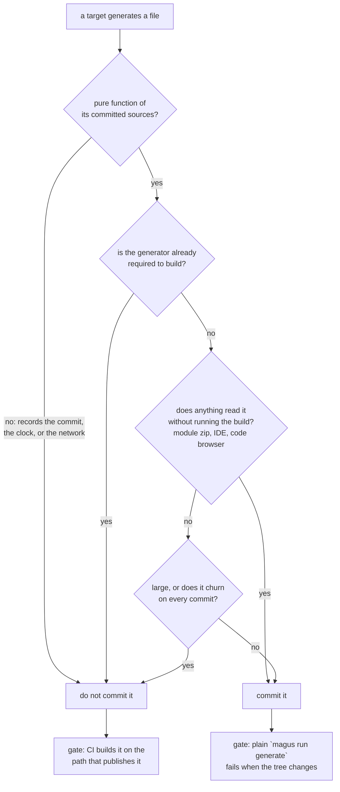

# Cache model

magus's build cache is **content-addressed**: a target's outputs are keyed by the
SHA-256 of its inputs, so an unchanged target replays its previous outputs instead
of rerunning. This page is the **local** model: what magus hashes, what invalidates
a key, what "replay" restores, and where it all lives on disk. The [remote
cache](cache/remote.md) shares these same artifacts across machines and layers a
signed trust model on top; this page is the substrate it references, so we describe
it once here and link there for the distributed story.

## Design intent

- **Correctness is a declaration contract.** magus caches what a target _declares_,
  not what it _touches_. A target's `needs`, `provides`, and `claims` (see below)
  define its whole cache footprint. Under-declare an input and a stale hit slips
  through; over-declare an output and every replay snapshots more than necessary.
  The cache is only as correct as those declarations, which is why the vocabulary
  is explicit rather than inferred from a traced filesystem.
- **Identical inputs replay.** The key is a pure function of the inputs. Two runs
  with byte-identical sources, tool versions, charms, and dependency keys produce
  the same key and so the same hit. Nothing about wall-clock time, machine, or run
  order enters the key.
- **A hit never runs the body.** On a hit magus restores the recorded outputs and
  emits the result event; the target's `export fun` never executes. The saved work
  _is_ the point.
- **It is just files.** The store is a directory of blobs, JSON manifests, and
  captured logs under `.magus/`. There is no database and no daemon in the read
  path. You can `ls` it, `cat` a manifest, and reason about a hit or miss with
  ordinary tools.

## needs, provides, claims: a target's cache footprint

A bound [spell](spells.md) contributes three glob sets to its project. Only
operations are runnable; these three are metadata that make caching and the
affected set correct (see [What a spell provides](spells.md#what-a-spell-provides)).
Binding a spell contributes its `needs`/`provides`/`claims` to a project's cache
key and affected set even before you wire a target.

| Declaration    | What it is                | Role in the cache                                                  |
| -------------- | ------------------------- | ------------------------------------------------------------------ |
| **`needs`**    | input globs (the sources) | hashed into the cache key; also seed the affected set              |
| **`provides`** | output globs              | snapshotted into the cache on a miss and replayed on a hit         |
| **`claims`**   | files the spell owns      | affected-set attribution only; **not** hashed, **not** snapshotted |

Internally these map to a `Step` the cache hashes and replays: `needs` become
`Step.Sources`, `provides` become `Step.Outputs`. `claims` do not appear in the
`Step` at all: they attribute changed files to a project for affected-set
computation and never touch the cache key or the snapshot. Two rules follow
directly:

- **Declare every input in `needs`.** A source file that isn't matched by a `needs`
  glob doesn't enter the key, so editing it produces no miss and you replay a stale
  build.
- **Keep `provides` tight and complete.** Under-declare and the cache can't replay
  an output it never recorded; over-declare and every hit restores files that
  were never outputs.

The output tree is never treated as an input: source expansion excludes the
`provides` globs and prunes their static directory prefixes, so a generated file
can't feed back into its own key.

### Per-target inputs and outputs

A spell contributes its globs to _every_ target on the project. To attach a glob
to _one_ target, declare it in that target's body with `ctx.readsFiles(...)` /
`ctx.writesFiles(...)`:

```buzz
export fun build(ctx: magus\Context, args: [str]) > void {
    ctx.readsFiles("schema/**", "codegen.config.json");
    ctx.writesFiles("dist/**");
    go["go-build"](ctx);
}
```

An explicit `ctx.readsFiles(...)` declaration defines that target's source footprint;
an explicit `ctx.writesFiles(...)` declaration defines its snapshot/replay footprint.
Magus retains the
magusfiles and any spell sources specific to that target, but it does not inherit
the broad project baseline. This is what lets one target be precise without making
its siblings under-declared (see [Granularity](#granularity-project-wide-vs-per-target)).

### Files a target edits rather than produces

The declaration names encode ownership, not merely direction:

| Declaration | File relationship | Cache and clean behavior |
| --- | --- | --- |
| `ctx.readsFiles(...)` | the target reads the named files | hashes their current bytes into the cache key |
| `ctx.writesFiles(...)` | the target creates or replaces complete generated files | snapshots and replays them; `magus clean` may remove them |
| `ctx.modifiesExistingFiles(...)` | the files already exist and the target changes only part of each one | hashes their current bytes, but never snapshots, replays, or removes them |

That last case is for a hand-written page with a generated region between markers,
or a manifest a tool rewrites in place. It is deliberately not an output Magus owns.

```buzz
export fun content_generate(ctx: magus\Context, args: [str]) > void {
    ctx.writesFiles("reference/buzz/*.md");          // created and fully owned
    ctx.modifiesExistingFiles("concepts/spells.md"); // existing page; only the table changes
}
```

`ctx.modifiesExistingFiles` is **never deleted** by `magus clean` and **never replayed** from a
snapshot, because the bytes magus produced are only part of the file. It still folds
into the target's cache key exactly as an input does - so editing the prose _around_
a generated region invalidates the target that maintains that region, which declaring
the file as an output could not do (an output is excluded from its own source hash).

Unlike reads and writes, a modification infers no ordering edge in either direction:
"I edit one region of a file someone else authored" says nothing about build order.
Declare `ctx.needs` if you need it.

The globs are read **statically**, before the target runs - a cache hit skips the
body, so the run can't be the source of truth. magus recovers them from the
source: it walks each target body and the helpers it calls by name, collecting the
**string-literal** globs. Two disciplines follow, both enforced:

- A **non-literal argument** (`ctx.readsFiles(someVar)`) is a magusfile load error -
  a computed glob is invisible to the static read, and silently dropping it would
  risk a stale hit.
- A call the walk **can't reach** (in an unreferenced helper, or the identifier
  used as a value) never enters a key; `magus doctor` flags it as
  [MGS1004](../reference/codes/magusfile/MGS1004.md).

This shares the literal-first discipline of [`magus\needs`](dependencies.md):
declare the footprint at the target, in literals magus can see.

## The cache key

The key is the hex SHA-256 of a deterministic, newline-delimited serialization of
the `Step`. magus writes these lines, in this order, into one hash:

- **`keyVersion`** - an internal schema version. Bumping it (when the set of hashed
  fields changes) forces a global rebuild.
- **`projectPath`** and **`target`** - so the same sources under different targets
  key separately.
- **`charm:` lines** - the active [charms](charms.md), sorted by name. A
  charm-variant run (`lint:rw`) hashes differently from the bare run, because the
  charm changes behavior. Empty charms add nothing, so charm-less runs are
  unaffected.
- **`arg:` lines** - one per argument after `--` (`magus run test -- -run
  TestFoo`), in the order given. Unlike charms and env these are never sorted,
  since `-run X` is not `X -run`; a run with different trailing args must not
  replay another run's result. Empty when no args are forwarded, so an ordinary
  run hashes unaffected.
- **`src:` lines** - for every file matched by `needs`, its workspace-relative path,
  its content SHA-256, and its executable bit. Files are discovered by a single
  walk, sorted by path, and hashed in parallel. Only the executable bit of the mode
  is folded in (not the full permissions, which would differ across machines with
  different umasks), so `chmod +x` on a script - which changes no content -
  still invalidates the key.
- **`env:` lines** - each allow-listed environment variable name and its value,
  sorted, distinguishing unset from set-to-empty. A variable's value contributes to
  the key only if the spell opted it in.
- **`exec:` lines** - per-op `ctx.withEnv`/`ctx.withCwd` execution overrides,
  sorted. Unlike `env:` lines, which read a variable's live process value at hash
  time, an override's value is fixed in the magusfile source itself, so it hashes
  directly - two runs differing only by a derived override must not share an entry.
- **`dep:` lines** - the resolved cache keys of upstream dependencies, sorted. This
  is how a change ripples: a dependency's new key becomes an input line here, so a
  dependent misses transitively.
- **`spellDefVersion`** - a binary fingerprint of the spell definition, so a magus
  upgrade that changes a spell forces a miss.
- **`tool:` lines** - `spell:version` strings, sorted, so a toolchain upgrade
  (a new `go` or `prettier`) invalidates the key even when no source changed.

Because the serialization is stable and sorted, the key is reproducible: identical
inputs anywhere yield the identical key. A `src` file's content hash uses an
mtime + size fast path (a per-file memo persisted under the cache dir), so an
unchanged tree re-keys without re-reading every byte; the memo is a performance
cache for the hash, never a substitute for it.

## Invalidation: what busts a key

A miss is "no manifest stored under this key." Anything that changes a
hashed line above yields a new key, and thus a new (empty) slot:

- editing, adding, or removing a file matched by `needs`;
- toggling the executable bit on a needed file;
- changing the value of an allow-listed env var (or setting/unsetting it);
- an upstream dependency's key changing (transitive invalidation);
- a spell definition change (`spellDefVersion`) or a tool-version bump;
- applying or dropping a charm;
- renaming the project or target.

What does **not** invalidate: a file's mtime alone (content is what's hashed), a
`claims`-only file, or anything outside the declared `needs`.

Old keys are never mutated - a miss writes a _new_ entry beside the old one - so
invalidation is additive. Reverting a change restores the earlier key and replays
its still-present entry. Disk is reclaimed separately by eviction and pruning (see
[On disk](#on-disk-just-files)).

### Anti-pattern: a shared manifest as an input

The commonest way to wreck a cache is to reach for the file that pins your tools -
`mise.toml`, `package.json`, `go.mod`, a lockfile - and declare it an input,
usually project-wide.

The intent is right: a tool version really is part of what produced the output, and
a bump really should invalidate. The result is not. A manifest pins _many_ tools,
and it moves for reasons unrelated to most of them. Wire it into every project and
one linter bump rebuilds the entire graph - in CI, the difference between an
affected run and a from-scratch build, for a change that could not have altered
almost any of it. Do that a few times and people stop trusting the affected set,
which is the actual loss: a cache nobody believes is worse than no cache.

**Declare what changed, not what contains it.** The blast radius should match the
tools a project genuinely uses:

- **a tool with a version probe** (`mgs_getVersionProbe`, or
  `mgs_getVersionProbes` for a spell driving several binaries) contributes
  `spell:tool:version` to the key of every project binding that spell, and
  _nothing_ to any other. Bumping hadolint moves projects using the docker spell;
  a Go project's key never notices. This is almost always the right answer for an
  external binary.
- **a manifest that is genuinely a source** of one project - `go.mod` for a Go
  project whose build reads it - belongs in that project's `sources`, where it
  already is. That is not this anti-pattern: the file really does feed those
  targets.
- **a pin that reaches one target only** wants a per-target declaration, not a
  project-wide one. `magus\inputs` in that target's body keeps a sibling target's
  key still.

If you find yourself adding a manifest to `sources` to fix a staleness bug, the
question to ask first is _which tool_ went stale, and whether it can be probed
instead. A probe invalidates the projects that use the tool. A manifest
invalidates everyone who happens to live near it.

### The opposite failure: tools outside the key entirely

Over-invalidating is loud and annoying. Under-invalidating is quiet and much
worse, and it is the more common default: most build caches key on file contents
and nothing else, so **the tools themselves are invisible**.

The failure does not look like a cache bug. A linter upgrades, and suddenly code
that passed yesterday fails - or worse, code that should fail passes, because the
verdict was replayed from an entry the old linter wrote. A formatter upgrades and
a "clean" tree starts failing a drift gate on a file nobody touched. A codegen
plugin upgrades and the committed output no longer matches what the generator
would emit, but the generate step is a cache hit, so it never runs to notice.

What makes it expensive is that every one of those looks like a bug in _your_
change. You bisect, you re-run, you blame the flaky test, you diff the branch -
and the answer was never in the repository at all. Someone's toolchain moved.

magus keys on the tool versions for this reason. Each spell declares how to ask:

```buzz
export fun mgs_getVersionProbe() > [str] { return ["go", "version"]; }

// A spell driving more than one binary declares each, so all of them move the key.
export fun mgs_getVersionProbes() > {str: [str]} {
    return {"golangci-lint": ["golangci-lint", "--version"]};
}
```

Their output lands in the key as `spell:version` and `spell:tool:version`, so a
tool that upgrades invalidates exactly the projects that bind that spell - the
precise middle between the two failures. `magus describe spells` reports which
spells probe.

A tool pinned by a manifest the project already reads needs no probe: `go.mod` is
a source of the go spell, so bumping a `go tool` pin invalidates on its own. Probes
are for binaries that live outside the project's declared inputs - a linter from
PATH, a formatter from a version manager - which is precisely the set nothing else
would catch.

**Where the declaration lives is the whole point.** Most build systems can express
this - Nx, for instance, makes tool-version tracking technically possible through
executors, but shifts the burden entirely to developers to implement it
consistently. Correctness then depends on each of them remembering, in every
project, in every repository. One person skips it and that project silently caches
across toolchains, and the failure surfaces somewhere else entirely.

magus does not infer this. Nothing sniffs your PATH or guesses which binaries a
target touched - the probe is a declaration someone wrote by hand, and
`mgs_getVersionProbe` is as explicit as it looks. What differs is its
**location**: it sits on the SPELL, the adapter that already knows it drives
`golangci-lint`, rather than being restated by every project that uses one. A
project binding `spells: [go]` inherits that declaration the same way it inherits
the spell's sources and ops.

So the trade is not magic against discipline. It is declaring a fact once, where
it is true, instead of once per consumer - the same reason a spell declares its
`needs` globs rather than each project re-listing `**/*.go`.

Set `MAGUS_CACHE_TOOL_VERSION=off` to drop probes from keys, or `=workspace` to
probe once per workspace instead of per project.

### Opting out and busting

Four controls, at four different scopes:

| Control                                     | Scope                       | Semantics                                                                                                                                                                                                                               |
| ------------------------------------------- | --------------------------- | --------------------------------------------------------------------------------------------------------------------------------------------------------------------------------------------------------------------------------------- |
| `skip_cache` target policy                  | one target, every run       | Always runs; never replays **or** snapshots (a long-running `fs\watch` loop, a service op).                                                                                                                                             |
| `magus run <target> --no-cache`             | one target, one invocation  | Skips replay for this run only, but still snapshots on success - the entry is refreshed, not left stale, unlike `skip_cache`.                                                                                                           |
| `magus\bust_cache(path?)`                   | runtime, one magusfile call | Clears manifests (one project, or the whole cache if `path` is omitted) from inside a target body. An escape hatch that logs a warning every time - the fix is usually to model the missing input as a declared `needs` source instead. |
| `magus clean --cache`                       | CLI, whole cache            | Wipes the on-disk store from outside any run.                                                                                                                                                                                           |
| `cache.immutable` (`MAGUS_CACHE_IMMUTABLE`) | whole cache, whole run      | Read-only mode: replays hits, but a miss runs the target and does **not** write a new manifest.                                                                                                                                         |

`skip_cache` states that **replaying this target would be wrong**: it signs a
fresh artifact, records a screen capture, mutates `go.mod`, rewrites a badge, or
never returns at all. It is a claim about the target's nature, which is why it
lives in the magusfile rather than in the operator's fingers. `--no-cache` says
something entirely different and far weaker: _I do not trust the cache for this
one run._ That is a session-level judgment, so it belongs on the command line.

The two are not interchangeable, and collapsing them breaks in both directions.
Move a `skip_cache` target to `--no-cache` and correctness now depends on
everyone remembering a flag, so a forgotten one replays a cached signature into
a release. Reach for `skip_cache` when you merely wanted a fresh run and the
target stops caching forever, for everyone.

`skip_cache` is **not** how you handle a target that produces no files. A pure
orchestration target - a `ci` that only composes `lint`, `build`, and `test` -
caches correctly with no policy at all: it snapshots an empty manifest and
replays as a hit, while its stages keep their own entries. Output globs
_inherited_ from the project or a bound spell are allowed to match nothing, and
only a glob the target declared itself via `ctx.writesFiles` must produce a file.
If a no-output target ever fails at snapshot time, that is a bug to report, not a
reason to opt out of the cache. Opting out instead costs the replay AND is
indistinguishable from a real never-replays defect, which is what
[MGS1009](../reference/codes/magusfile/MGS1009.md) exists to catch.

Both `skip_cache` and `--no-cache` force a genuine re-execution; the mechanical
difference is what happens to the cache entry afterward (never snapshot vs.
snapshot-and-refresh). `bust_cache` and `clean --cache` both delete entries, at
different granularities and from different sides of a run. `cache.immutable` is
the odd one out: it does not force anything to re-run, it just stops the cache
from ever writing - the common case is a read-only CI runner or a shared cache
mirror that must not accumulate local entries.

### Granularity: project-wide vs per-target

Without a target declaration, `baseStep` seeds the cache key with the project
sources, every bound spell's claims, and the magusfile. That conservative default
keeps an undeclared target safe, but it can make unrelated work invalidate together.

An explicit [`ctx.readsFiles(...)`](#per-target-inputs-and-outputs) call changes that
contract. It is the target's exact source footprint: magus keeps the magusfiles
and that target's spell inputs, then hashes only the declared inputs. A
`ctx.readsFiles("src/**")` build therefore does not re-run for a sibling Dockerfile.
Use it when a target has a genuinely narrower domain, and name every source that
domain reads.

That gives a clean rule for **where to declare a glob**:

- **affects every target** (a shared schema, a project-wide config) -> project-wide
  `magus\project({sources = [...]})`, declared once;
- **affects one target** -> `ctx.readsFiles(...)`, `ctx.writesFiles(...)`, or
  `ctx.modifiesExistingFiles(...)` in that target's body, according to the file relationship above.

Outputs are almost always target-specific (`build` -> `dist/`, `test` ->
`coverage/`), so a project-wide `outputs` - which makes every target snapshot
it - is usually the wrong tool; prefer `ctx.writesFiles(...)`.

## Replay: a hit restores outputs, not execution

On a run, magus computes the key, then looks for a manifest stored under it:

1. **Hit.** The manifest is read and its outputs are restored into the workspace.
   The target's body **does not run** - the `export fun` never executes on a hit.
   Each output is materialized from the content-addressed store by reflink (a
   copy-on-write clone) where the filesystem supports it, falling back to a byte
   copy. (Hard-linking is deliberately avoided: it would alias the shared blob and
   a later in-place rewrite would silently poison the cache.) Symlink outputs are
   restored as symlinks. Any captured build log recorded on the original run is
   replayed to stdout, so a cached pass looks like the real one.
2. **Miss.** The body runs. On success, magus **snapshots** the `provides` outputs:
   each file's content is hashed, its bytes are stored once in the content-addressed
   store (deduplicated by hash), and a manifest is written atomically recording
   every output's path, content hash, mode, and size. A subsequent identical run
   hits.

This is why the target result is _emitted, not returned_. A return value can't
exist on a hit, since the body never ran - but a hit is exactly what you most want
to report. So the dispatcher emits a **`target.result`** event
(`{project, target, status, cache_hit, duration_ms}`) for **both** the ran and the
cached case, sourced from the cache's per-run callback. See
[Results](operations.md#results-what-each-layer-produces) for how the event fits
the run hierarchy.

A run that "wins the race" against a cancellation is neither snapshotted nor
published: its outputs may be incomplete, so magus surfaces the cancellation
instead of recording a poisoned entry.

## One owner per generated file

A generated file has exactly one owning target: the one that declares it. Two
targets writing the same bytes is the most common way to get a build that never
settles, and it is worth being blunt about why, because the instinct it provokes
is wrong.

Say `generate` writes `gen/**` and a formatter rewrites the same tree. The
instinct is to call this a race and fix it with a dependency edge. It is not a
race, and ordering cannot fix it:

- Generate, then format: the formatter's bytes land. The next `generate`
  regenerates unformatted output, sees it differ from what is committed, and
  fails its drift gate.
- Format, then generate: the formatting is immediately undone, and the
  formatter's own check fails instead.

Whichever runs last wins, and the loser's gate fails on the next run, at every
possible ordering. A dependency edge resolves a producer and a consumer. Two
producers of one file is an ownership violation, and there is no order that
makes both correct.

**If generated output needs formatting, the generator formats it**, as the last
thing it does. It still owns the final bytes, so its drift gate compares
formatted output against formatted output and settles. Generated Go needs no
special handling here for exactly this reason: `mockery` and `protoc` emit
gofmt-clean output already.

Excluding generated trees from a formatter is the weaker fallback, and it is
correct when nothing else needs to read that output. Every formatter in this
workspace does it, and `.markdownlintignore` states the reasoning: a lint rule
"fixed" in generated output is a fix in the wrong place, because the generator
overwrites the edit on its next run. The fix belongs in the generator.

Declaring the same output glob from two targets is
[MGS1020](../reference/codes/magusfile/MGS1020.md); the cross-project shape,
where two projects claim one glob under the same target, is
[MGS4002](../reference/codes/race/MGS4002.md). Neither can see an undeclared
write, which is why formatters are excluded by configuration as well as caught
by a diagnostic. When a target genuinely needs to amend part of a file it does
not own, that is
[`ctx.modifiesExistingFiles`](#files-a-target-edits-rather-than-produces), not a
second output declaration.

## The two roles of an output (maintainer note)

An output glob answers two different questions, and magus keeps them on two
different code paths. Confusing them is the easiest way to introduce a stale-hit
or a broken `magus clean`, so the model is worth stating once.

| Role                         | Question it answers                            | Scope         | Where it lives                                                                                                            |
| ---------------------------- | ---------------------------------------------- | ------------- | ------------------------------------------------------------------------------------------------------------------------- |
| **Cache footprint**          | "what does _this target_ snapshot and replay?" | one target    | `cache.Step.Outputs`, assembled per-target in `buildStep`: project-wide `Outputs` when no target output is declared, otherwise that target's `magus\outputs`. |
| **Generated-files manifest** | "what files does _this project_ generate?"     | whole project | `types.Project.AllOutputs()`: the project-wide `Outputs` unioned with _every_ target's `magus\outputs`.                   |

The cache role is per-target on purpose. A miss snapshots exactly the outputs in
that target's `Step`, and a hit replays exactly those - so an output must be
declared on the target that **produces** it. This is the **producer-ownership
rule**, and violating it is a real bug, not a style nit: a glob declared
project-wide is in _every_ cacheable target's `Step.Outputs`, including targets
that never write it. When one of those unrelated targets gets a cache hit, its
replay restores the file to whatever it was when _that_ target last ran - so a
`go-build` hit can silently **revert** a freshly regenerated `MAGUS.md`. Scoping
the output to its producer with `magus\outputs` means only the producer's hit
replays it. Project-wide `outputs` is correct only when every target genuinely
produces the glob, which is rare - most outputs belong to one generator.

The generated-files role is the union, because "clean everything this project
generates" and "which project owns this path?" don't care which target produced
what. A consumer that asks a generated-files question goes through `AllOutputs()`,
never raw `p.Outputs`, or it silently misses per-target declarations. Today that
means `magus clean --outputs` (`CleanOutputs`), output-ownership
(`FindOutputOwner`), and the git merge driver (`workspaceOutputGlobs`). The cache
path is the one place that stays per-target.

Inputs have just the one role (the cache key), so there is no `AllInputs`: a
source glob that isn't in a given target's `Step.Sources` simply doesn't key that
target, which is a footprint question, never a "what does the project consume"
one.

## Should generated output be committed?

Two ecosystems answer this in opposite directions, and each answer follows from
its own build model. Go projects commit generated code - `*.pb.go`, `stringer`
output, mocks - and a clean clone then builds with only the Go toolchain.
TypeScript projects regenerate at build time and gitignore the result, since you
cannot build without `node_modules` in the first place, so the committed copy
would duplicate something the build already produces.

Both follow the same rule applied to different starting conditions: **is the
generator already required to build?** Ask that first.



The first question is the one that decides it outright. A file recording its own
commit cannot be committed and stay correct, whatever the other answers are - that
is [the next section](#the-self-staling-output-generated-files-that-record-vcs-state).
The rest trade cost against reach:

| Question | Commit it | Regenerate it |
| --- | --- | --- |
| Is the generator already required to build? | No - committing removes a dependency | Yes - committing adds churn, removes nothing |
| Does anything read it without running the build? | Yes - IDEs, `pkg.go.dev`, a downstream module | No |
| Is it a pure function of committed sources? | Yes | No - see the next section |
| Is it small and slow-churning? | Yes | No - large or per-commit churn |

**Commit it when a consumer cannot regenerate it.** A Go module's generated code
ships in the module zip. Leave it out and everyone importing your package needs
`protoc` and your `buf.gen.yaml` to build. Committing moves that dependency from
every consumer onto you, which is what the Go convention buys.

**Regenerate it when the build already needs the generator.** A generated
TypeScript client is the usual case: the package manager and the bundler are
prerequisites either way, so the committed copy duplicates them. It also churns,
since bundled output shifts on a dependency bump.

**Regenerate it when it is large or churns per commit.** Every clone pays for
committed output, CI included, and it pays forever. Untracking the rendered docs
site and the console here removed 27% of this repository's blob history. Untracking
does not shrink what earlier commits already hold, which is a separate problem that
a [blobless clone](../guides/integrations/ci.md) solves.

### What each choice costs, and where magus sits

Not committing turns an artifact into a **build-order dependency**. Something has
to regenerate the client before the code importing it compiles, and a repository
without a build graph records that ordering in a README or a script. A committed
file carries no such edge: it is present before anything runs.

magus lets you declare the edge instead. A generator states what it writes
(`magus\outputs`), a consumer states what it depends on, and the run order comes
from those declarations - `magus affected` reruns codegen when a `.proto` changes,
`FindOutputOwner` resolves which project owns a generated path, and
[MGS4004](../reference/codes/race/MGS4004.md) reports a project reading a path
another project wrote without declaring the dependency.

That is a deliberate bias: magus prefers a coupling you write down to one you
remember, so it invests in making the "regenerate it" option checkable. Where the
ordering is declared, the main argument for committing falls away, and the reasons
that remain are about consumers outside the workspace and readers who never run
a build.

**Either way, gate it.** Committed output needs a plain `magus run generate` that
fails when the tree changes, so review catches a forgotten regeneration. Untracked
output needs CI to build it on the path that publishes it, or a broken generator
ships the last good copy without anyone noticing.

## The self-staling output: generated files that record VCS state

There is one combination of ordinary decisions that produces a build which can
never be clean. Each half of it reads as sound practice on its own:

1. A generator records **VCS state** in its output - a "Last updated" line, the
   commit that produced a page, a build stamp.
2. That output is **committed**, because generated files are usually committed so
   a reader can see them and CI can drift-gate them.

Each is defensible. Together they cannot converge. Committing the source changes
the commit, the commit is an input to the output, so the output you just
committed is now stale. Regenerate and commit that, and the new commit stales the
output again. Amending does not escape it either: a new hash restales the footer
that recorded the previous one.

The only stable resting point is a **second commit containing nothing but
regenerated output**, because a commit that does not touch a page's source does
not change the commit that page records. That is why repositories in this state
grow a trail of "refresh generated metadata" commits after every real one. Those
commits are not sloppiness; they are the fixed point of the loop.

### How to recognize it

The tell is a drift gate that passes before you commit and fails immediately
after, with a diff containing only timestamps, hashes, or "last updated" lines.
If `magus run generate` is clean, you commit, and `magus run generate` is
suddenly dirty again, you are in this loop.

magus does not diagnose this today. It is genuinely hard to detect without a
false positive: after the fix below, the same generator still writes the same
commit hash into the same files, and the only thing that changed is whether those
files are tracked. Distinguishing the broken state from the fixed one needs a
"is this path tracked?" primitive that `types.VCSDriver` does not currently
expose. Until it does, this section is the diagnostic.

### The fix: stop committing the output, or stop recording the state

Two ways out, and they are not equally good.

**Untrack the output and render at publish time.** The generator keeps its
provenance line, and the deploy renders from source with the final commit already
known, so there is nothing to restale. This is what this repository does: the
rendered docs site is generated into `docs/gen/` and never committed
(`.github/workflows/publish-site.yaml` renders it on every push to `main`). Cost: the
output is no longer reviewable in a diff, and a broken generator now blocks a
deploy that a file copy could never fail.

**Or drop the VCS state from the output.** If the provenance line is not worth
the cycle, remove it and the output becomes a pure function of its sources, which
is what a drift gate wants anyway.

What does _not_ work is keeping both and being disciplined about it. The loop is
structural, so "remember to regenerate and commit again" is a rule that has to
hold forever, and the failure mode when it lapses is a silent one: the committed
output simply describes a commit that is no longer the one it sits in.

### The narrower rule this is an instance of

A committed generated file must be a **pure function of its committed sources**.
Anything else in its inputs - the clock, the machine, the branch, the commit -
turns "regenerate and diff" from a correctness check into noise. magus's drift
gate assumes that purity, which is why the `tapes` target here is deliberately
kept out of the `generate` umbrella: it screen-records the CLI, so its bytes are
never the same twice and a drift gate over it would fail every run by
construction.

## On disk: just files

The cache lives at **`.magus/`** in the workspace root (override with
`MAGUS_CACHE_DIR`, or `cache.dir` in `magus.yaml`). Its layout is three
directories plus a hash memo:

```text
.magus/
├── cas/         content-addressed blobs, sharded by the first two hex chars
│   └── ab/ab34...f0      one file per unique output content (deduplicated)
├── manifests/   one JSON manifest per cache entry
│   └── api/<key>.json     project path flattened; file named by cache key
├── logs/        captured build output, replayed on a hit
│   └── api/<key>.log
└── mtimes/      the per-file hash fast-path memo
```

A **manifest** is plain JSON you can read directly. It records the project path, the
cache key, the target, and one record per output - path, content-address (`blob`),
mode, size, and (for symlinks) the link target:

```json
{
  "projectPath": "api",
  "hash": "ab34...f0",
  "target": "build",
  "outputs": [
    {
      "path": "api/dist/server.js",
      "blob": "9c1f...",
      "mode": 420,
      "size": 20481
    }
  ],
  "createdAt": "2026-07-07T12:00:00Z"
}
```

That transparency is deliberate: a hit or miss is answerable with `ls` and `cat`,
and a build log for any entry is a file you can open. magus never mutates an
existing manifest, and a manifest read back under the wrong key or project (copied
or renamed onto the wrong slot) is treated as a miss rather than trusted.

Space is bounded two ways. An optional size cap (`cache.size_mb` /
`MAGUS_CACHE_SIZE_MB`) drives **LRU eviction** of the oldest manifests after a
build, and orphaned blobs are garbage-collected once no surviving manifest
references them (blobs are shared, so a blob's bytes are only reclaimed when its
last referencing manifest is evicted). Out of band, `magus config cache prune`
evicts entries older than a cutoff. To force a clean rebuild of specific projects,
`magus clean --cache <project>` drops their entries. The whole store is portable:
`magus config cache export` / `import` move it as a gzip-tar.

## Connecting to the remote cache

Everything above is local to one machine. A [remote cache](cache/remote.md) shares
these exact artifacts across CI runners: on a **local** miss magus asks the remote
backend for the artifact keyed by the same `(projectPath, hash)`, and if found
imports it into the local store so the ordinary hit path replays it - no rebuild.
After a genuine build, magus uploads the artifact so the next machine hits.

The artifact is the same content: the manifest, its blobs, and the build log,
packed as a gzip-tar. The key computation, the replay path, and the manifest format
are identical - the remote layer only moves those bytes between machines. On top of
that it adds a **signed trust model**: because a replayed artifact injects files
into a consumer's build, every remote artifact is verified against an Ed25519 trust
set before it is allowed to replay, and an unsigned or untrusted one falls back to a
local build. That trust boundary, the backend contract, and CI wiring are covered
in full in [remote-cache.md](cache/remote.md); this page's model is what it builds
on.

## Glossary

| Term                  | Definition                                                                                                                        |
| --------------------- | --------------------------------------------------------------------------------------------------------------------------------- |
| **needs**             | A spell's declared input globs. Hashed into the cache key (`Step.Sources`); also seed the affected set.                           |
| **provides**          | A spell's declared output globs. Snapshotted on a miss and replayed on a hit (`Step.Outputs`).                                    |
| **claims**            | Files a spell owns, for affected-set attribution only. Never hashed and never snapshotted.                                        |
| **Cache key**         | The hex SHA-256 of the serialized `Step`: sources, env, deps, tool versions, spell version, charms, project, and target.          |
| **Content-addressed** | Stored by content hash: identical output bytes are stored once, and a blob's name is its own SHA-256.                             |
| **Manifest**          | The JSON record of one cache entry: project, key, target, and one record (path, blob, mode, size, symlink) per output.            |
| **Blob**              | One unique output content, stored once under `cas/`, sharded by the first two hex chars of its hash.                              |
| **Replay**            | Restoring a manifest's outputs on a hit (reflink then copy) without running the target body.                                      |
| **Snapshot**          | Recording a miss's outputs into the store and writing its manifest.                                                               |
| **target.result**     | The emitted report event for one target run (`{project, target, status, cache_hit, duration_ms}`); fires on both hits and misses. |
| **`.magus/`**         | The on-disk cache in the workspace root: `cas/` + `manifests/` + `logs/` + the mtime memo.                                        |

## See also

- [spells.md](spells.md): where `needs`/`provides`/`claims` are declared, and what a bound spell contributes.
- [dependencies.md](dependencies.md): how `depends_on`'s `dep:` propagation and a `magus\needs` call each interact with this cache key.
- [operations.md](operations.md): the run hierarchy and the `target.result` event that fires on a hit.
- [targets.md](targets.md): what a Target is - the unit a cache key is computed and replayed for.
- [charms.md](charms.md): the execution modifiers that key into the cache as `charm:` lines.
- [cache/output-refs.md](cache/output-refs.md): how the key's hex digest becomes a
  portable reference id, what is deliberately excluded from it, and a known leak
  that puts a tool's database timestamp in the key.
- [remote-cache.md](cache/remote.md): sharing these artifacts across machines under a signed trust model.
