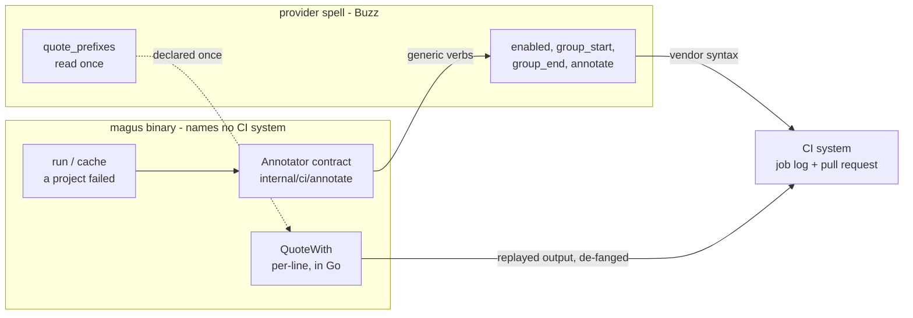

# CI providers

A CI system renders a job log with structure a plain terminal has no notion of:
foldable sections, and annotations that surface on a pull request rather than in
the log. Every system spells that differently, and several have no syntax for it
at all.

magus emits that structure through a **provider spell**. The binary knows the
generic shape - open a section, close it, raise a notice - and a spell knows one
vendor's syntax. This is the same arrangement as [remote caching](cache/remote.md):
the extension point is a spell so a provider magus has never heard of is
something you write, not something you wait for.



The dotted line is the one performance-shaped seam: quoting runs over every
replayed line, so the spell declares its command prefixes once and magus does the
matching. Everything else crosses into the spell at most once per failure.

## Wiring one up

A provider is an ordinary spell, selected in your magusfile:

```buzz
import "spells/github/actions" as github;

magus\ci.provider(github);
```

magus ships two: `spells/github/actions` (which also carries the Actions remote
cache backend - one spell per vendor, two contracts) and `spells/gitlab/ci`.

Wiring one unconditionally is the intended usage. A provider reports whether it
is active, magus probes that once per run, and an inactive provider costs
nothing - so the same magusfile works on your laptop, in GitHub Actions, and on a
system neither of them knows about.

## What magus does with it

Only two things today, both on failure:

- The failing project's output is wrapped in a section, so a fan-out log stays
  navigable.
- The failure is raised as an error annotation, so it reaches a reviewer without
  anyone opening the log.

Sections request **expanded** for a failure. That is a request, not a guarantee -
see the capability table below - and a provider that cannot honor it leaves the
output inline rather than folding it. A collapsed failure is a failure nobody
sees, which is worse than no fold at all.

## The contract

Every op is optional. A spell implements the verbs its provider supports and
omits the rest; magus treats an undeclared op as "this provider does not do
that", which is the normal case rather than an error.

| Op                                                                            | Returns | Called                   |
| ----------------------------------------------------------------------------- | ------- | ------------------------ |
| `enabled()`                                                                   | bool    | once per run, cached     |
| `group_start({id, title, collapsed})`                                         | bool    | once per failing project |
| `group_end({id})`                                                             | bool    | once per failing project |
| `annotate({level, message, title, code, file, line, end_line, col, end_col})` | bool    | once per failure         |
| `quote_prefixes()`                                                            | [str]   | once per run, cached     |

Nothing here is called per log line. That is deliberate: crossing into a spell's
VM for every line of a failing build's output would cost more than the whole
feature is worth. `quote_prefixes` is the shape that keeps the one per-line job
affordable - the spell declares its command prefixes once and magus does the
matching itself.

### Why the arguments look the way they do

The vocabulary is the **union** of what real systems need, not the intersection -
the intersection is nearly empty:

| System                  | Section open                       | Section close             | Collapse           | Annotations                                            |
| ----------------------- | ---------------------------------- | ------------------------- | ------------------ | ------------------------------------------------------ |
| GitHub Actions          | `::group::TITLE`                   | `::endgroup::`            | always collapsed   | `::error/warning/notice::` with file, line, col, title |
| GitLab CI               | `section_start:<unix>:<id>`        | `section_end:<unix>:<id>` | `[collapsed=true]` | none in-log (report artifacts)                         |
| Azure Pipelines         | `##[group]TITLE`                   | `##[endgroup]`            | -                  | `##vso[task.logissue ...]` with a `code` field         |
| Buildkite               | `--- TITLE` / `+++` / `~~~`        | none - implicit           | three modes        | out-of-band: `buildkite-agent annotate`                |
| TeamCity                | `##teamcity[blockOpened name=...]` | `blockClosed name=...`    | -                  | `message status='ERROR'`                               |
| AWS CodeBuild, CircleCI | none                               | none                      | -                  | none                                                   |

Hence: a section carries an `id` distinct from its `title`, because GitLab and
TeamCity key sections by name while GitHub and Azure use only a title.
`group_end` may legitimately do nothing, because Buildkite has no end marker - a
new section closes the previous one. Annotations carry a source location and a
`code`, because every system that supports annotations at all supports those, and
`code` is where magus's `MGSxxxx` diagnostics belong. And nothing assumes the
output is a stream, because Buildkite raises annotations by running a binary.

`id` is opaque. magus passes something readable, such as a project path, and does
**not** normalize the character set - what is legal differs per system, and
encoding one system's rule into the shared contract would put that system back
into the layer that is supposed to name nobody. GitLab's spell folds the id with
`strings\kebabCase` because GitLab rejects slashes; that rule lives in the spell
that needs it.

## Security

A provider spell is third-party code running in your magus process, and the
values magus hands it are influenced by whatever your build printed. Read this
before writing or adopting one.

> [!WARNING]
> `message` and `title` are **untrusted**. They carry a failing process's own
> output, so their content is whatever some test, compiler, or transitive
> dependency chose to print. Never interpolate them into a shell command, a URL,
> or anywhere else their content becomes syntax. A dependency that printed a
> payload would otherwise be executing it on every machine that builds the
> project.

What magus guarantees at the boundary:

- **Bounded.** Messages are truncated (with the cut marked) and short fields
  clamped, so a process that printed megabytes cannot make a spell's string
  handling a denial-of-service vector.
- **De-fanged.** Control characters are stripped before a value reaches a spell,
  keeping tab and newline. A message cannot smuggle escape sequences that
  re-take control of a terminal when echoed.
- **Time-bounded.** Every op runs under a short deadline. A spell that blocks on
  a network call costs one timeout, not the build.
- **Clamped prefixes.** `quote_prefixes` is capped in count and length, and an
  empty prefix is rejected - it would match every line.

What magus does **not** guarantee: a spell has the full host module surface,
including `proc\exec` and `http`. Loading a spell is trusting it, exactly as with a
[remote cache backend](cache/remote.md). Spells are not individually sandboxed;
they run with the magus process's privileges, constrained only by the
process-wide [sandbox](sandbox.md) policy where that applies. If your build
output can contain secrets, a hostile provider spell could exfiltrate them.

### Replayed output is quoted

magus captures a failing process's output and replays it into the job log. Left
alone, a test printing `::error::` would have the runner execute it - forging
annotations, or closing a section magus opened. Providers declare their command
prefixes via `quote_prefixes`, and magus neutralizes matching lines before replay
by dropping the prefix's first character, leaving text a reader can still read.

## One exception: concurrency

magus caps build concurrency on GitHub-hosted runners, which report their host's
CPU count while giving the job a slice of it. That check lives in Go
(`internal/cache/defaults.go`) rather than in the GitHub spell, and it is the only
place magus names a CI system outside a spell.

The reason is ordering, not preference: the concurrency limiter is built before
the magusfile is evaluated, so no provider spell is loaded in time to answer.
Anything a spell _can_ answer, a spell does.

## Writing a provider

> The shared spell contract, and the cache and secret provider variants alongside this
> one, are in [Writing a spell](../guides/authoring-spells.md).

Start from `spells/gitlab/ci/spell.buzz` - it is the shorter of the two and
exercises the parts of the contract GitHub does not (an id distinct from the
title, a timestamp per marker, collapse as a flag, and no annotation support at
all).

Reach for the host modules rather than reimplementing them: `strings\kebabCase`
folds an id, `os\env` reads the runner environment, `std\print` writes a marker.
Method names are `camelCase` even where the [module reference](../reference/buzz/index.md)
declares them otherwise, and namespace access is a backslash.

Gate everything on `enabled()`. A provider that returns false outside its own
system makes an unconditional `magus\ci.provider(...)` free everywhere else.
