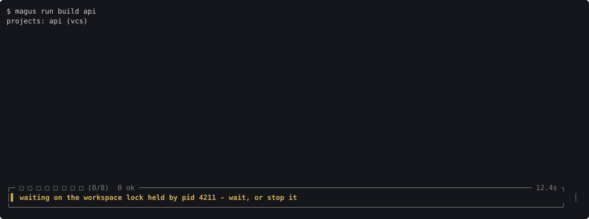

# Concurrency

magus coordinates parallel work at two distinct scopes, and it helps to keep them
apart:

- **Within one run** - the scheduler fans a single invocation out across projects
  and targets, ordered by the dependency graph. This is [dependencies](dependencies.md)
  and per-target policy (`slots`, `exclusive`) doing their job.
- **Across separate runs** - the **workspace lock** stops two _independent_ `magus`
  processes from mutating the same project at the same time.

The first is about _ordering and fan-out_; the second is about _mutual exclusion_.
They solve different problems and neither replaces the other.

## Within one run: the scheduler

A single `magus run`/`magus affected` invocation builds the dependency graph, then
runs targets concurrently where the graph allows. `magus\needs` edges order the work
([dependencies](dependencies.md)); a target's `slots` and `exclusive` policy tune how
much of it runs at once ([targets](targets.md)). When a daemon is present, that
fan-out draws from **one shared concurrency pool** across every client
([daemon](../guides/integrations/daemon.md)).

All of this lives inside one process. It has no bearing on a _second_ `magus` you
start in another terminal - the two invocations have separate graphs and separate
schedulers, and neither can see the other.

## Across separate runs: the workspace lock

That second invocation is the problem the workspace lock exists for. Two `magus`
processes running at once - two terminals, or two agents - can collide: one running
`generate` or `clean` rewrites or deletes a project's declared outputs while the
other is reading or writing them, and work is lost. Both also write the project's
[cache](cache.md). Serializing that is **mutual exclusion**, which is why `needs`
cannot solve it: `needs` orders targets _inside one run_ and has no visibility into a
separate process. Only a lock does.

So before a non-dry run begins mutating, magus takes a **per-project advisory lock**
for every project the run will touch, holds it for the whole invocation, and releases
it at the end. A second `magus` that wants the same project waits for the first to
finish, then proceeds automatically.

Key properties:

- **Per project, not per workspace.** Runs on _different_ projects proceed in
  parallel; only runs on the _same_ project serialize. The lock is not directory- or
  target-scoped - a project's outputs and cache are the unit being protected, and
  that is exactly a project.
- **Advisory.** It serializes _magus_ processes and nothing else. A raw `git clean`,
  an `rm`, or any other tool ignores it. The guarantee is "no two magus invocations
  mutate the same project at once," not "the tree is untouchable."
- **Crash-safe.** It is an OS file lock (`flock`), which the kernel releases when the
  holding process exits or crashes - never a stale PID file that would wedge a project
  after a `Ctrl-C`.
- **Taken by every real run**, not just `generate`/`clean`. Even `magus test` writes
  the project's cache and run log, so two concurrent runs on one project are
  serialized regardless of whether either touches the source tree.

### When a run is waiting

If another magus holds the lock, your run does not fail and does not hang silently -
it prints one line up front and starts the moment the other finishes:

```text
magus: project web is being changed by another magus process; waiting for it to
finish. This run starts automatically once it does; set MAGUS_NO_WAIT=1 to fail
fast instead.
magus: lock on project web released; starting.
```

On a terminal the wait is also pinned as a notification, so it stays visible
instead of scrolling away behind the run it is queued behind:



It is a condition rather than an event - true until the lock clears - so it is
pinned rather than given a countdown, and it is retracted once the lock is
acquired. See [Terminal](terminal.md).

Set `MAGUS_NO_WAIT=1` to make a contended run **fail fast** instead of blocking -
useful in CI or a script that would rather error than queue behind another process.
It names the holder the same way the wait message does, and exits **75**
(`EX_TEMPFAIL`) rather than 1:

```text
magus: project web is locked by another magus process (pid 4821 (magus run ci .),
running 12s, in /Users/me/src/acme); not waiting (MAGUS_NO_WAIT set)
```

75 is the transient-failure convention, so a caller can branch on "the machine is
busy, retry later" without treating a genuinely broken build the same way. Nothing
ran, and the same invocation succeeds once the holder finishes.

The wait happens at the very start of the invocation, before the concurrency pool is
even set up, so a blocked run does not yet appear in `magus status` (there is nothing
running to report - it is queued behind the lock). The stderr line above is how you
know why.

## Relationship to the daemon

The [daemon](../guides/integrations/daemon.md) is the long-lived process that hosts the shared pool and
serves clients. When it is coordinating your work, it is the natural single point
that knows what is running. The workspace lock is what protects the case the daemon
does _not_ cover: two plain `magus` invocations with no daemon in the loop. The two
compose - the lock is the floor that holds even when nothing else is watching.

## See also

- [Dependencies](dependencies.md): `magus\needs` and `depends_on`, how a single run is ordered.
- [Targets](targets.md): per-target `slots` and `exclusive` policy.
- [Daemon](../guides/integrations/daemon.md): the persistent process and the shared concurrency pool.
- [Cache](cache.md): what a run writes, and why concurrent writers are serialized.
