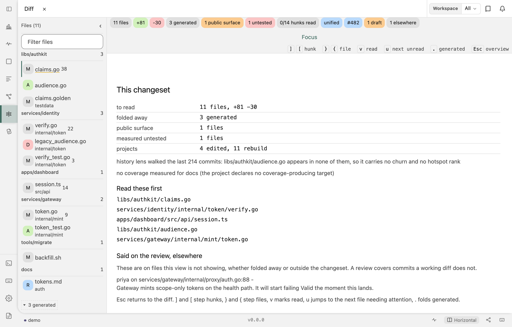

# Review

## Why this exists

You read your own change before sending it, and that is a different job from reading a diff.
Some of what you notice is for you. The rest is for whoever reviews it next, and that half
has nowhere to go: you are in a terminal, and your colleagues will read it on a web page you
have not opened. So you retype the remark later from memory, or you drop it.

magus already knows the change: which files a target generated, how far each changed symbol
reaches, which hunks you have read. Tell it one more thing, where the change is
**discussed**, and you can finish a self-review with the remarks already sent.

## What it does

- **You see the review's comments beside the code.** They render under the hunk they were
  written about, in the console and in `magus diff`'s viewer.
- **Your own remarks stay drafts until you send them.** You write them as you read, then send
  the set once.
- **You answer a thread from the same surface.**
- **`magus notes capture`** keeps both halves of the conversation as a note in your knowledge
  graph.

Wire no provider and the diff surface behaves exactly as it did before. Most branches have no
pull request open, and that costs you nothing here.

## Wiring a provider

magus knows nothing about any forge. It calls four reserved function names on a spell a
magusfile selected, and reads what comes back:

```buzz
import "spells/github/review" as ghReview;

magus\review.provider(ghReview);
```

| Op               | Answers                                                      |
| ---------------- | ------------------------------------------------------------ |
| `find_review`    | which review this branch has, and whether it has merged      |
| `review_threads` | the remarks already on it                                    |
| `publish_review` | send a batch of drafts as one review                         |
| `reply_review`   | answer one thread                                            |

A spell may implement a **subset**. A host with no comment API can still take a review body,
so a missing op means that provider lacks the capability, not that the spell is broken. See
[Authoring spells](../guides/authoring-spells.md) for the shape of a provider op.

### GitHub, including Enterprise

`spells/github/review` talks to the REST API over plain HTTP with a token; no `gh` binary is
involved. It reads `GITHUB_TOKEN` through whatever [secret provider](secrets.md) the
workspace wired.

The endpoint comes from `GITHUB_API_URL` and defaults to `https://api.github.com`, so GitHub
Enterprise Server needs one variable and nothing else:

```sh
export GITHUB_API_URL=https://github.example.com/api/v3
```

magus **derives** the git remote's host from that endpoint instead of asking you for it
separately. Your installation has one host, and a second setting would only give you a way to
disagree with the first.

This is a second GitHub spell, beside `spells/github/actions`, and the runtime is what splits
them rather than the vendor. Every op in that one checks for the Actions runtime token first,
which suits a cache that exists only on a runner. A review happens on your laptop, where that
token never exists, so folding these ops in there would leave them inert. Import both when
you want both.

## Reading

In the console's Diff surface:

| Key   | Does                                        |
| ----- | ------------------------------------------- |
| `c`   | write a remark on the hunk under the cursor |
| `a`   | answer the thread under the cursor          |
| `r`   | resolve the comment under the cursor        |
| `s`   | read the batch of drafts, then send it      |
| `f`   | read one hunk at a time                     |
| `Esc` | the changeset overview                      |

### One hunk at a time

A changeset arrives as everything at once: eleven files, a dozen chips, a rail, and somewhere in
it the hunk you were going to judge. `f` puts one hunk on screen and takes the rest away - the
file index, the counts, all of it one key from coming back.

What replaces them is a line saying where you are: a bar, the position, how many hunks you have
read, and how many remarks the pass has produced so far. That last number is the one worth
having. It is the evidence that reading is turning into something.

- `v` marks this hunk read **and moves to the next one**. It is one key because it is one act,
  and a pass that costs two keystrokes a hunk is a pass that gets abandoned halfway.
- `]` and `[` move without marking, for reading something twice.
- Reading the last hunk opens the batch you drafted. A pass ends in the decision it was for,
  rather than running out.

Stop halfway and the marks persist, so opening the diff again puts you back at the first hunk
you have not read. The mode is remembered too: it is how you read, not a thing to re-enter every
time.

### Writing one

A remark is markdown, and the box you write it in is a real one: **Enter is a line break**, so a
paragraph, a list or a fenced block all survive being typed. Committing takes a deliberate act -
Cmd or Ctrl with Enter, or the button beside the field - because a field where Enter commits
cannot hold a remark worth writing, and because sending is not something to do by reflex.

**Write** and **Preview** sit above the field. What a remark looks like rendered is what your
colleague will read, and until you can see it here you are typing blind: a fence reads as three
backticks, a list as a row of hyphens. Threads render the same way, so a colleague's markdown
arrives as markdown rather than as its own syntax.

Remote images are not fetched. A markdown image renders as its alt text, because an image in a
remark is a request your browser would make to a host you did not choose.

### Sending the batch

`s` lists the drafts and offers a summary line before anything leaves. You often change your
mind about the first remark by the time you write the fifth, which is why they wait. The
summary is optional; the list of what is about to go is not.


The box names the repository, the review and the host before you commit to any of them, and
says plainly that nothing has gone yet. A remark you have changed your mind about is discarded
from this list.

`magus diff`'s terminal viewer renders those threads under the same hunks, re-placed against
the patch it is showing. It cannot publish, and no review command carries a `--publish` flag:
you send with the batch in front of you or you do not send.

### Where a remark lands

A colleague anchors a thread to a line of the **review**, which is not the changeset in front
of you. Your working tree moves after they write, and a pull request covers commits a working
diff does not. So each thread lands in one of three places, and the console drops none of them:

- on the hunk holding its line;
- under the file heading, when this changeset no longer contains that line;
- listed as **elsewhere** (press `Esc` for the overview), when the file is not on screen at
  all - either outside this changeset, or folded away, as a generated file is by default.

The third bucket is keyed on what the surface is showing rather than on what the changeset
holds, because a thread rendered nowhere and a thread on a folded file look identical to the
reader: absent. The terminal viewer has no elsewhere list, so it shows the first two.



The overview reads those remarks out rather than counting them. A chip saying "1 elsewhere"
tells you something was said and withholds what, which leaves you to open a browser to find
out - the one errand this whole surface exists to save you.

## After it merges

A merged pull request is where a review stops being live and becomes the only record of why the
code is the way it is - and that record is on somebody else's website. So when the diff surface
opens on a review the host says has landed, it offers once to keep the conversation:

> This review merged on acme/acme, and its 3 remarks live only on the host. Run
> `magus notes capture` to keep the conversation in your knowledge graph.

**Only when there was a conversation.** A pull request nobody remarked on has nothing worth
preserving, and a prompt that fires on every merge is one you learn to dismiss without reading -
which spends the attention it was saving for the merge that mattered.

It names the command rather than running it. Notes are human-authored by construction, which is
a [standing decision](../doctrine.md#manual-on-purpose) rather than an omission here.

magus asks the provider whether a review merged rather than working it out from git, and that is
not a preference. A squash merge rewrites a branch into one new commit, so the branch tip is
neither an ancestor of the base nor patch-equivalent to what landed; a workspace that
squash-merges would never see its own merges. A provider answers `state` on `find_review`, and a
provider that does not answer reads as open.

## What magus will not do

- **An agent cannot publish.** An agent pairing over MCP reads the review's threads and may
  draft a comment into the shared session. You send it. magus stamps authorship from the
  transport a write arrived on rather than from the payload, so nothing can claim to be you.
- **A self-review is always a `COMMENT`.** The API would accept your change approving itself;
  magus does not offer it.
- **A draft with no line never moves to a line magus guessed.** The send box marks those
  before you send, because a remark that arrives against the wrong code costs more than one
  the host refused.

## See also

- [Authoring spells](../guides/authoring-spells.md) - the provider-op shape and every
  contract magus detects by name.
- [Secrets](secrets.md) - how the token reaches the spell without being written down.
- [Knowledge](knowledge.md) - where a captured review conversation lives afterwards.
