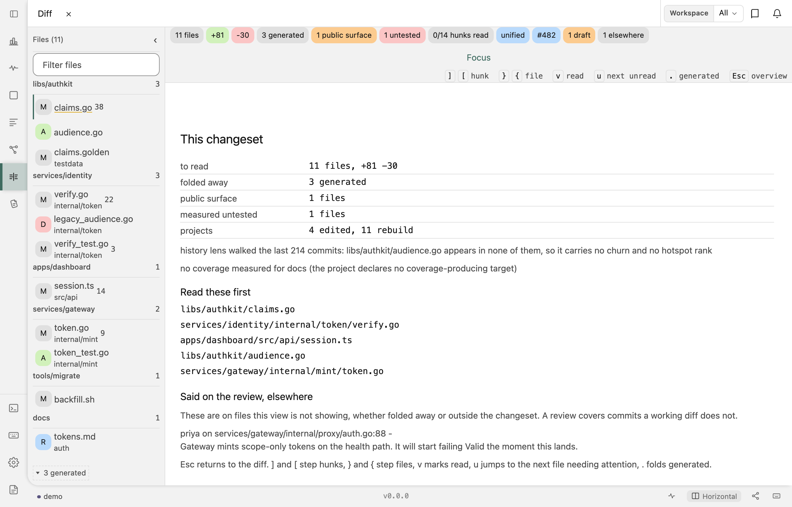

# Review

## Why this exists

You read your own change before sending it, and that is a different job from reading a diff.
Some of what you notice is for you. The rest is for whoever reviews it next, and that half
has nowhere to go: you are in a terminal, and your colleagues read it on a web page you
have not opened. So you retype the remark later from memory, or you drop it.

magus already knows the change: which files a target generated, how far each changed symbol
reaches, which hunks you have read. Tell it one more thing, where the change is
**discussed**, and you can finish a self-review with the remarks already sent.

## What it does

- **You see the review's comments beside the code.** They render under the hunk they were
  written about, in the console and in `magus diff`'s viewer.
- **Your own remarks stay drafts until you send them.** You write them as you read, then send
  the set once.
- **You answer a thread from the same page.**
- **`magus notes capture`** keeps both halves of the conversation as a note in your knowledge
  graph.

Wire no provider and the Diff page behaves exactly as it did before. Most branches have no
pull request open, and that costs you nothing here.

## Wiring a provider

magus knows nothing about any forge. It calls four reserved function names on a spell a
magusfile selected, and reads what comes back:

```buzz
import "magus";
import "spells/github/review" as ghReview;

magus\review.provider(ghReview);
```

| Op               | Answers                                                 |
| ---------------- | ------------------------------------------------------- |
| `find_review`    | which review this branch has, and whether it has merged |
| `review_threads` | the remarks already on it                               |
| `publish_review` | send a batch of drafts as one review                    |
| `reply_review`   | answer one thread                                       |

A spell may implement a **subset**. A host with no comment API can still take a review body,
so a missing op means that provider lacks the capability, not that the spell is broken. See
[Authoring spells](../guides/authoring-spells.md) for the shape of a provider op.

### GitHub, including GitHub Enterprise

`spells/github/review` talks to the REST API over plain HTTP with a token; no `gh` binary is
involved. It reads `GITHUB_TOKEN` through whatever [secret provider](secrets.md) the
workspace wired.

The endpoint comes from `GITHUB_API_URL` and defaults to `https://api.github.com`, so GitHub
Enterprise Server needs one variable and nothing else:

```sh
export GITHUB_API_URL=https://github.example.com/api/v3
```

magus **derives** the git remote's host from that endpoint instead of asking you for it
separately. Your installation has one host, and a second setting would only give you a way to
disagree with the first.

This is a second GitHub spell, beside `spells/github/actions`, and the runtime is what splits
them rather than the vendor. Every op in that one checks for the Actions runtime token first,
which suits a cache that exists only on a runner. A review happens on your laptop, where that
token never exists, so folding these ops in there would leave them inert. Import both when
you want both.

## The reading order

`magus diff` ends its report with the order to read the hunks in. File order puts a test
ahead of the code it exercises and an implementation ahead of the interface it satisfies,
so you meet each hunk before you know what it is for. The reading order puts a definition
before its uses.

magus builds it from the symbol index, not from paths:

- A hunk that defines a changed symbol comes before the hunks that use it.
- An interface comes before its implementations, using the `implements` relation the
  indexer records (see [Knowledge](knowledge.md#schema)).
- Tests come after the code they exercise.
- Hunks linked this way form a group. Larger groups come first, and between groups of one
  size the one whose symbols reach more files comes first.

Each hunk carries one sentence naming the relationship that placed it, such as `uses Parse,
defined in step 2` or `tests Parse, defined above`. Consecutive hunks from one file share a
step, and so do hunks that use each other, because neither can go first. Generated output
sits in a folded group of its own (`--generated` shows it), and a hunk magus cannot place
goes in a final group named `unranked` that says why: no symbol index covers the file, the
hunk defines and uses no changed symbol, or the working tree no longer matches the range
you are reading.

The last line is a completeness line, such as `14 hunks, 14 placed`. It names any hunk
placed twice or not placed, and any changed file with no hunk to show (a binary file, a
rename), so a short list is never mistaken for a whole one.

The same diff and the same index always give the same order. No model chooses it. A change
made of many small unconnected hunks gains little, because each lands in a group of one.

When a project the change touches can be indexed and has no index built, magus leaves the
order out and adds a note naming that project and the `magus graph build` that fixes it.
Another project's index does not stand in: the uses of a changed symbol that live in the
unindexed one are unknown, and an order drawn without them would read as "nothing is related".

The order reaches every place you read a change:

- the text report prints it under the file summary;
- the terminal viewer walks the hunks in it;
- `-o json` carries it under `order`, with the completeness line as `order.count`;
- the console's focus mode (`f`) walks it one step at a time.

When the symbol index cannot be brought current, magus prints no order and a note says to run
`magus graph build`. An order drawn without the uses would read as "nothing is related",
which is a claim it cannot back.

## Reading

On the console's Diff page:

| Key   | Does                                        |
| ----- | ------------------------------------------- |
| `c`   | write a remark on the hunk under the cursor |
| `a`   | answer the thread under the cursor          |
| `r`   | resolve the comment under the cursor        |
| `s`   | read the batch of drafts, then send it      |
| `f`   | read one hunk at a time                     |
| `Esc` | the changeset overview                      |

### One hunk at a time

A changeset arrives as everything at once: eleven files, a dozen chips, a rail, and somewhere in
it the hunk you were going to judge. `f` puts one hunk on screen and takes the rest away: the
file index, the counts, all of it one key from coming back.

What replaces them is a line saying where you are: a bar, the position, how many hunks you have
read, and how many remarks the pass has produced so far. That last number is the one worth
having. It is the evidence that reading is turning into something.


The toolbar collapses with the rest of it: the counts row goes entirely rather than emptying, and
the key legend moves onto the progress line, which is the one row a mode about less chrome can
still afford.

- `v` marks this hunk read **and moves to the next one**. It is one key because it is one act,
  and a pass that costs two keystrokes a hunk is a pass that gets abandoned halfway.
- `]` and `[` move without marking, for reading something twice.
- Reading the last hunk opens the batch you drafted. A pass ends in the decision it was for,
  rather than running out.

When the change has a [reading order](#the-reading-order), focus mode follows it, one step at
a time, rather than file by file.

Stop halfway and the marks persist, so opening the diff again puts you back at the first hunk
you have not read. The mode is remembered too: it is how you read, not a thing to re-enter every
time.

### Writing one

A remark is markdown, and the box you write it in is a real one: **Enter is a line break**, so a
paragraph, a list or a fenced block all survive being typed. Committing takes a deliberate act:
Cmd or Ctrl with Enter, or the button beside the field, because a field where Enter commits
cannot hold a remark worth writing, and because sending is not something to do by reflex.

**Write** and **Preview** sit above the field. What a remark looks like rendered is what your
colleague reads, and until you can see it here you are typing blind: a fence reads as three
backticks, a list as a row of hyphens. Threads render the same way, so a colleague's markdown
arrives as markdown rather than as its own syntax.

Remote images are not fetched. A markdown image renders as its alt text, because an image in a
remark is a request your browser would make to a host you did not choose.

### Sending the batch

`s` lists the drafts and offers a summary line before anything leaves. You often change your
mind about the first remark by the time you write the fifth, which is why they wait. The
summary is optional; the list of what is about to go is not.


The box names the repository, the review and the host before you commit to any of them, and
says plainly that nothing has gone yet. A remark you have changed your mind about is discarded
from this list.

`magus diff`'s terminal viewer renders the same threads under the same hunks, re-placed against
the patch it is showing. It cannot publish, and no review command carries a `--publish` flag:
you send with the batch in front of you or you do not send.

Two things the console has that the terminal viewer does not yet: reading one hunk at a time
(`f`), and the run control below. Both are read-side and nothing about a terminal prevents them;
they are missing, not withheld, unlike publishing.

### Where a remark lands

A colleague anchors a thread to a line of the **review**, which is not the changeset in front
of you. Your working tree moves after they write, and a pull request covers commits a working
diff does not. So each thread lands in one of three places, and the console drops none of them:

- on the hunk holding its line;
- under the file heading, when this changeset no longer contains that line;
- listed as **elsewhere** (press `Esc` for the overview), when the file is not on screen at
  all: either outside this changeset, or folded away, as a generated file is by default.

The third bucket is keyed on what the page is showing rather than on what the changeset
holds, because a thread rendered nowhere and a thread on a folded file look identical to the
reader: absent. `magus diff`'s viewer lists the same third bucket at the end of the changeset,
so neither the viewer nor the console drops one.



The overview reads those remarks out rather than counting them. A chip saying "1 elsewhere"
tells you something was said and withholds what, which leaves you to open a browser to find
out, the one errand this whole page exists to save you.

### Threads

A comment and the replies to it are one thread, and the id of its first comment is the
thread id. The host's comments say which thread they belong to: `root` is the thread id (empty
on the first comment), `outdated` says the commented line has left the head, and `diff_hunk`
is the host's copy of the hunk the comment was made on. magus places the whole thread under
the hunk of its first comment, in the console and in `magus diff`'s viewer, and answering a
thread sends your reply into it.

magus does not fetch whether the host marks a thread resolved. `outdated` is the only
state of that kind a thread carries.

## When somebody says something

A remark arriving on your review is the one thing here that interrupts you. The bell rings, and
the reason it earns that is not that something happened; it is that **somebody is waiting on
you**, and a question left sitting for a day costs your colleague their day too.

The threads that arrived since you last read the conversation are marked **new** where they sit
in the diff, so opening it shows you where to look instead of making you re-read.

What counts as new is decided by threads you have had on screen, not by a timestamp and
not by anything the watcher recorded for itself. That is the same rule as a read mark: it is the
reader's claim, and nothing else may make it on your behalf.

## Who else is changing this

A file heading says **also on 2 branches** when other branches are changing the same file. It is
a report, not a prediction: two branches touching one file is ordinary and usually fine, and
"conflict likely" would be magus guessing at an outcome it cannot see.

Both your own branches and the remote-tracking copies of everyone else's. Local ones matter most
where they are least visible: several agents in several worktrees of one repository are all on
branches nobody has pushed, and a lookup that read only remote-tracking refs answered nothing
there, which reads exactly like nothing competing.

magus never fetches to answer this, so the two kinds are as fresh as different moments and the
tooltip says which: a local branch is **here now**, and a remote-tracking one is true **as of your
last fetch** and no fresher. Nothing here goes to the network on its own.

A branch and its remote-tracking copy are one line of work under two names, so they are reported
once, under the local side.

A backend that cannot answer says nothing at all, which is deliberately different from saying
nothing competes; those are different facts, and only one of them is reassuring.

## Saying you are reading

With one approval required, a pull request can merge while a second reviewer is halfway
through it. That reader's time is gone and nobody counts it.

The console's reading toggle marks the open review as being read. The mark is local, and it
changes nothing about the merge queue: it is a notice, not a hold. For a GitHub pull request
the console also shows a line to run if you want the others to know:

```sh
gh pr comment 482 --repo acme/acme --body 'octocat is reading this now'
```

magus prints that line and never runs it, so the one sentence that leaves your machine is
one you sent. For any other host the line is empty. A review that has already merged refuses
the mark.

If the review merges while the mark is set, the `check-review` job reports `review.merged`,
even when nobody commented, and clears the mark. Two opt-in telemetry metrics count what it
cost: `magus.review.merged_while_reading` and `magus.review.merged_while_reading.duration`.
They carry no attribute and reach a backend only when telemetry export is on; see
[Telemetry](telemetry.md#agents-and-review).

## After it merges

A merged pull request is where a review stops being live and becomes the only record of why the
code is the way it is, and that record is on somebody else's website. So when the host says a
review you took part in has landed, magus offers once to keep the conversation:

> This review merged on acme/acme, and its 3 remarks live only on the host. Run
> `magus notes capture` to keep the conversation in your knowledge graph.

It arrives two ways, and neither interrupts you. Open the diff on a merged review and it is a
strip under the toolbar. Merge while you are elsewhere in the console and it is recorded in the
notification panel, silently: a merge changes nothing you were relying on, so it is worth keeping
and not worth ringing a bell for.

That second one asks the host on a slow clock and only for a branch you reviewed:
opening a review is what opts it in. magus does not go asking a forge about branches you never
looked at.

**Only when there was a conversation.** A pull request nobody remarked on has nothing worth
preserving, and a prompt that fires on every merge is one you learn to dismiss without reading,
which spends the attention it was saving for the merge that mattered.

It names the command rather than running it. Notes are human-authored by construction, which is
a [standing decision](../doctrine.md#manual-on-purpose) rather than an omission here.

magus asks the provider whether a review merged rather than working it out from git, and that is
not a preference. A squash merge rewrites a branch into one new commit, so the branch tip is
neither an ancestor of the base nor patch-equivalent to what landed; a workspace that
squash-merges would never see its own merges. A provider answers `state` on `find_review`, and a
provider that does not answer reads as open.

## Does it still pass

The toolbar carries one run control, for the project of the file you are reading. Press it and
magus runs that project's `test` target here, on the machine the code is on.

This is the one review capability that has no provider behind it, and so no capability gap: it
asks the local workspace rather than a host, and behaves identically on GitHub, GitLab, git, hg,
or no forge at all. It is also the thing a forge structurally cannot offer, because a forge does
not know your build.

Three things keep it honest:

- **It runs what the magusfile declares, and nothing else.** The console names a target and a
  project, never a command. The server admits the run only if that project declares that target,
  so a browser-reachable button is strictly less capable than a terminal.
- **A verdict is about a TREE STATE.** Edit anything and the answer greys out and says
  `passed - since edited`, because a green tick over code you have since changed is a wrong
  answer delivered confidently. A cache hit is not stale, though: magus keys the cache on the
  target's sources, so a replayed verdict is a true statement about the tree it was computed
  from.
- **A run already in flight is joined, not duplicated.** If your own terminal is running the same
  target, the control says it is running rather than appearing to have started it.

There is one button, not one per file. The question is asked about one place at a time, and a
control on every file heading would answer it n times in a column.

## Before you push

```sh
magus diff --unread --rev main...HEAD
```

narrows the review of that range to the hunks no read mark covers. A mark belongs to a hunk's
content, context lines included, so a hunk you read and then edited is unread again. At a
terminal the viewer opens on just those hunks; printed, it is the usual report, filtered, under
every `-o`: `-o name` prints one `path:start-end` per unread hunk, and `-o json` is the same
document with an `unread` record saying how many of how many were kept. It exits 0 whatever it
finds: a push held up by a read count would make the count the goal. Where the marks cannot be
read it says the read state is unknown, on stderr and as `"read_state": "unknown"`, and calls
no hunk unread.

The push itself asks the same question without doing the work. The `pre-push` hook magus
installs hands off to the `check-drift` job, and that job adds one line counting the unread
hunks of the range being pushed; see [the drift
notice](../guides/integrations/git.md#the-drift-notice). Nothing blocks the push.

## The report

It reads the working tree by default, and a patch file when you hand it one. Against a patch
with a single changed file:

<!-- example:diff-report -->

```console
$ magus diff --no-tui --patch change.patch
1 files to read; 1 projects edited, 1 projects rebuild

  main.go
      in .

reading order

group 1 of 1: unranked (1 hunk)
  step 1
    main.go:1-3
        the working tree no longer matches the range head for this file

1 hunks, 1 placed

conformance did not check .: no symbol indexer

note: no symbol index loaded: changed-symbol callers and coverage overlays are unavailable (build it with `magus graph build`)
```

<!-- /example -->

While the server runs, each thread on the pull request is named beside the hunk it sits on, as
`thread <id>`, and `-o json` carries the same ids under each file's `threads`. The report takes
them from the server's session and never asks the host itself, so with no server it lists no
threads and prints one line naming `magus server start`.

### One thread

```sh
magus diff --thread 2193847561
```

narrows the review to one thread, the way a path narrows it to one file. The id is the thread
id, the id of its first comment, or any reply's; the report above is where you find it. At a
terminal the viewer opens on the thread's hunk. Printed, with `--no-tui` or into a pipe, it is
the conversation oldest first, the hunk it is about (the host's copy when the comment is
outdated), and what the change there reaches: the symbols changed in that hunk with how many
files reference them, which projects they are public to and the callers that cross a boundary,
the coverage, the conformance findings, the notes anchored to the file, and one line on the
change as a whole. Whatever could not be measured is listed, so an empty answer is never read
as a clean one. The comments are quoted as other people's words.

`-o json` carries the same record. The console's `GET /api/v1/diff/thread?id=` route and the
diff MCP tool's read-only `thread` op return it too.

### An outline from an agent

An agent pairing over MCP can leave an outline beside a thread, with the diff tool's
`outline` op: at most five topics of 60 characters, one line each. The console shows it
beside the thread. It cannot be copied or pasted into the reply box, and it is held in
memory for the session, never saved, and a second outline of the same thread replaces the
first. A longer topic is refused with a message that you type the reply. The outline is
something to think with while you write.

## What magus does not do

- **An agent cannot publish.** An agent pairing over MCP reads the review's threads and may
  draft a comment into the shared session. You send it. magus stamps authorship from the
  transport a write arrived on rather than from the payload, so nothing can claim to be you.
- **An agent cannot reply to a person.** A remark is addressed to whoever reads the review; a
  reply is addressed to the colleague who asked, by name. There is no agent-reachable op that
  produces one; replying lives on the human route alone, so an answer to your colleague is
  something you wrote. Receiving generated text where you asked a question is how the human half
  of a review dies, and this is the one place magus spends a refusal to prevent it. The nearest
  thing an agent can leave is an [outline](#an-outline-from-an-agent) of topics, which cannot be
  copied into a reply.
- **A review never approves a change its own credential opened.** Reviewing a colleague's
  branch, you may approve or request changes; on your own, the verdict is silently downgraded
  to remarks and the page says so. The API would happily let your change approve itself,
  which is why the rule lives in magus rather than in a spell you could edit, and why
  "magus could not tell who opened this" resolves the same way as "you did". Not knowing is
  not permission.
- **A draft with no line never moves to a line magus guessed.** The send box marks those
  before you send, because a remark that arrives against the wrong code costs more than one
  the host refused.

## See also

- [Authoring spells](../guides/authoring-spells.md): the provider-op shape and every
  contract magus detects by name.
- [Secrets](secrets.md): how the token reaches the spell without being written down.
- [Knowledge](knowledge.md): where a captured review conversation lives afterwards.
- [Reviewing your changes](../guides/reviewing-changes.md): the commands for the reading
  order, the unread filter and one thread.
- [ADR 0006: the person drives review](../decisions/0006-the-person-drives-review.md): why a
  person types every reply, merges, and decides when a review is done.
- [Telemetry](telemetry.md#agents-and-review): the metrics that count review time lost to a
  merge.
