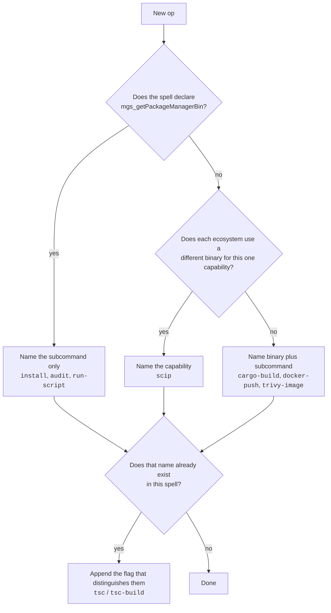

# Naming spells and ops

Two names have to be chosen every time a spell grows: what the spell is called,
and what each op inside it is called. Both are public API. A magusfile writes
`typescript["eslint"](ctx)`, so a rename breaks every workspace that composed it.

The rule below is a formula rather than taste, because the failure it prevents is
one taste cannot see. `oci["docker-push"]` reads as "docker docker push" and
nobody notices while writing it; the stutter only becomes obvious once fifty of
them exist and none can be changed cheaply.

## The formula

For a spell adapting domain `D`, and an op that runs binary `B` with subcommand
chain `C`:

```
spell name = D                     D is a domain, never a binary

op name    = kebab(C)              if B is substitutable per project
           = kebab(capability)     if B varies by ecosystem
           = kebab(B + C)          otherwise
```

Everything below is that formula, spelled out.



## The spell name is a domain

A spell is named for the domain it adapts, never for the binary it happens to
drive today. `rust`, not `cargo`. `python`, not `uv`. `typescript`, not `pnpm`.
`oci`, not `docker`.

This is not cosmetic. A spell named after a binary tells a lie the moment a
second binary joins it, and a second binary always joins:

| domain | binaries it already drives |
| --- | --- |
| `golang` | `go`, `gofmt`, `gofumpt`, `golangci-lint`, `govulncheck`, `scip-go` |
| `rust` | `cargo`, `rust-analyzer` |
| `python` | `uv`, `ruff`, `mypy`, `pyright`, `black`, `pip-audit`, `scip-python` |
| `typescript` | the project's package manager, `tsc`, `eslint`, `biome`, `vitest`, `jest`, `node` |
| `oci` | `docker`, `trivy`, `hadolint` |
| `markdown` | `markdownlint`, `prettier`, `typos` |

`rust` never stuttered because it was named for the ecosystem while its binary is
`cargo`. The spells that stuttered were exactly the ones named after their own
binary, and the fix is to name the domain, not to mangle the ops.

There is no exception, not even for a language whose command shares its name. The
Go spell is `golang`, not `go`, and that is the rule earning its keep rather than
bending: when the spell was `go`, the formula dropped the redundant prefix and
produced ops called `build`, `test`, `clean`, `generate` and `run` - five of the
eight canonical TARGET names. `magus explain build` then resolved to the op and
stopped finding the target at all. A domain name is always available, and
reaching for one is cheaper than the ambiguity a binary name creates.

## The op name is the command

An op is named for the command a person would type, kebab-cased, without flags.
`cargo build` is `cargo-build`. `docker push` is `docker-push`. This is what
makes a spell self-documenting: a developer who knows the toolchain can read
`rust["cargo-clippy"]` and know exactly what runs.

Three clauses refine it.

**A runner is plumbing, not the binary.** `uv run ruff check` has `B = ruff`, not
`uv`; `pnpm exec eslint` has `B = eslint`. The runner is how the tool is reached
in that ecosystem, not what is being run. This is why `python["pytest"]` is
correct and `python["uv-run-pytest"]` would not be.

**A substitutable binary is omitted.** When a spell declares
`mgs_getPackageManagerBin`, magus swaps the binary for whatever the project
actually uses, so naming it would be false under the others: `typescript["install"]`
runs `pnpm install` here and `npm install` in a workspace that uses npm.
Substitutability is declared, not guessed, so this branch is decidable. Note the
contrast with `python`: `uv` is not substitutable there, so `uv-sync` correctly
keeps its binary.

**A per-ecosystem capability takes the capability's name.** `scip` is
`scip-go`, `scip-python`, `rust-analyzer`, and `scip-typescript` in four spells.
Naming each after its binary would make one capability unfindable under four
names.

## When two ops collide

Applying the formula can produce the same name twice inside a spell, because two
ops differ only by a flag that selects a mode. Append the distinguishing flag:

| commands | names |
| --- | --- |
| `docker build`, `docker build --check` | `docker-build`, `docker-build-check` |
| `go mod edit -print`, `go mod edit -json` | `go-mod-edit`, `go-mod-json` |
| `tsc`, `tsc --build`, `tsc --build --clean` | `tsc`, `tsc-build`, `tsc-build-clean` |

A flag only enters a name to break a tie. `prettier --check` is still `prettier`,
because nothing else in `markdown` claims that name and the `rw` charm is what
turns the check into a write.

## Deviating on purpose

The formula does not decide every case. `node --test` reduces to `node` by the
letter of the rule, and `node` names a runtime rather than an action, so the op
is `node-test`. That is a real deviation, and it is allowed - but it has to be
declared, not silently taken:

```buzz
// naming: the formula yields `node`, which names the runtime rather than the
// action. --test selects the mode and no sibling op claims the name.
fun nodeTest(target: Target) > Command { ... }
```

The ward reads that marker. An op whose name does not match the formula and
carries no `// naming:` line is a finding; one that carries a reason is not. The
point is not to make deviation impossible, it is to make it visible and argued.

## What the ward checks

`MGS1024` fires on a spell op whose name the formula does not produce and which
declares no reason. It is a doctor rail, so it runs over the resolved spell
surface rather than the source text, which means it sees the argv after charms
and package-manager substitution - the same thing a caller runs.

It checks three things:

1. The spell name is not the name of any binary the spell forks, with no exception.
2. Each op name is what the formula yields from its own argv, or carries a
   `// naming:` reason.
3. No two ops in a spell resolve to the same canonical name without a
   distinguishing flag.

Run it directly with `magus doctor`, or see the op surface it reads with
`magus describe spell <name>`.

## See also

- [Spells](spells.md): what a spell is and how a magusfile binds one.
- [Authoring spells](../guides/authoring-spells.md): writing one, including the
  op table and probes.
- [Operations](operations.md): how an op becomes a command at run time.
