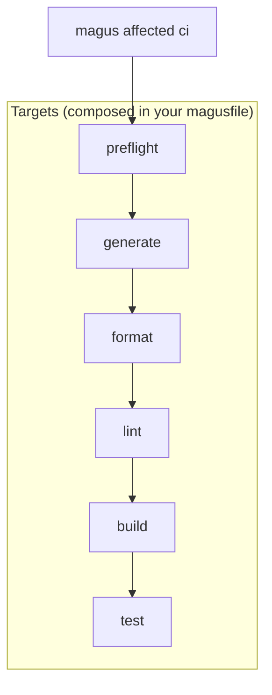

# CI

`ci` is an ordinary magusfile target; magus does not hardcode its steps. Export a `ci` function, wire the flow with `magus.needs`, and magus runs it read-only.

```buzz
export fun ci(ctx: magus\Context, args: [str]) > void {
    // declare the edges you want; independent steps run in parallel
    ctx.needs(preflight, generate, format, lint, build, test);
}
```

## Recommendations

We document this order; we don't enforce it. Chain steps with `magus.needs` where order matters (e.g. `test` depends on `build`).



## Shared cache trust

**Who may write the cache is a trust boundary.** The primary defense is Ed25519 signing: a consumer replays a remote artifact only if it carries a signature from a key in `cache.remote.trusted_keys`. Wiring a remote backend without a trust set is refused.

```yaml
# magus.yaml  -  bind the backend in magusfile.buzz via magus.cache.remote(github)
cache:
  remote:
    trusted_keys:
      - "<base64 Ed25519 public key>" # magus config cache key generate
```

A complementary defense is to open the cache **read-only on untrusted refs**: replay hits but never publish. Gate it on the event so only trusted pushes write, and apply the same rule to any persisted run history (the forecaster and volatility detector read it): restore always, save only from trusted pushes.

```yaml
# PRs replay the cache and see main's history, but write neither
MAGUS_CACHE_IMMUTABLE: ${{ github.event_name == 'pull_request' }}
```

To set up a shared cache (GitHub Actions Cache, S3/MinIO/R2/B2, or your own backend) and generate signing keys, see [Remote caching](../remote-cache.md).
