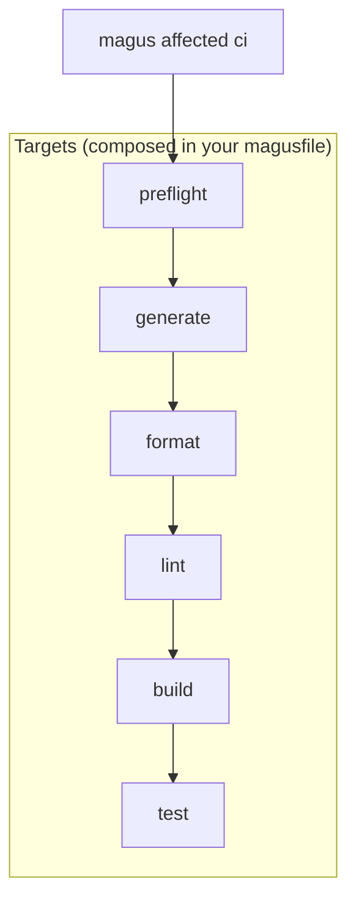

# CI

`ci` is an ordinary magusfile target; magus does not hardcode its steps. Export a `ci` function, wire the flow with `magus.needs`, and magus runs it read-only.

```buzz
export fun ci(ctx: magus\Context, args: [str]) > void {
    // declare the edges you want; independent steps run in parallel
    ctx.needs(preflight, generate, format, lint, build, test);
}
```

## Recommendations

We document this order; we don't enforce it. Chain steps with `magus.needs` where order matters (e.g. `test` depends on `build`).


```mermaid
flowchart TD
    cmd["magus affected ci"] --> preflight
    subgraph targets["Targets (composed in your magusfile)"]
        preflight --> generate
        generate --> format
        format --> lint
        lint --> build
        build --> test
    end
```

## Keep the workflow thin

The most valuable property of a `ci` target is not what it runs. It is that the
workflow file stops changing.

A workflow that names steps directly - build here, test there, lint with these
flags - encodes the shape of the repository at the moment it was written. That
shape then drifts, and on a long-lived release branch it drifts without anyone
looking. The failure is familiar: a `v2` branch that has not been touched in
months gets a security backport, CI fails for reasons unrelated to the patch, and
the cherry-pick grows to include workflow and infrastructure changes nobody
wanted in a maintenance release. Now the release contains CI plumbing that was
never reviewed as part of it.

A thin workflow does not have that problem, because there is nothing in it to
drift:

```yaml
- run: magus affected ci
```

Everything that varies moves into the magusfile - which is versioned with the
code it builds, and *should* be. A `v2` branch legitimately builds differently
from `v4`: different toolchain, different steps, maybe different projects
entirely. Keeping that in the magusfile means each branch describes its own build
and no branch needs the other's.

The contract is one line: **every branch exports a `ci` target**. What it composes
is that branch's business.

### magus refuses to gate nothing

The pattern only works if a branch that falls out of the contract fails loudly.
It does. `magus affected ci` errors when no project in scope declares a `ci`
target, rather than exiting 0 having run nothing:

```
no "ci" target defined in the selected project(s); it is the anchor
"magus affected ci" and "magus affected --plan" key off, so this run
would do nothing
```

A silently-green gate that gated nothing is the one failure this pattern could
otherwise introduce, so it is an error rather than a warning.

### Fan-out stays data, not workflow

Sharding is the other thing that usually hardcodes repository shape into a
workflow. `magus affected --plan` emits the shard matrix as JSON, so the workflow
consumes a value instead of listing projects. A branch that gains or loses a
project changes its plan output, not its workflow.

### Running the workflow from another branch

A related pattern: have a release branch check out `main` for its CI logic, so
workflow fixes never need backporting at all. It does deliver that, and if your
workflows are thin you rarely need it.

Know the trade before adopting it. You lose the ability to reproduce what a
release actually passed - re-running `v2`'s pipeline a year later runs today's
logic, not the logic that approved it, which is exactly the property an audit or
a regression hunt wants. It also makes the pinned magus version ambiguous: the
branch's magusfile may target a version the shared workflow no longer installs.

Thin workflows get most of the benefit without that cost, which is why they are
what this page recommends. Reach for the shared-workflow variant when a fix must
reach many branches at once and you accept that old pipelines are no longer
reproducible.

### Pinning still belongs to the branch

Whatever else is shared, pin the magus version per branch and verify its
checksum. A maintenance branch that silently picks up a newer magus is the same
class of drift this section exists to avoid, just moved one layer down.

## Shared cache trust

**Who may write the cache is a trust boundary.** The primary defense is Ed25519 signing: a consumer replays a remote artifact only if it carries a signature from a key in `cache.remote.trusted_keys`. Wiring a remote backend without a trust set is refused.

```yaml
# magus.yaml  -  bind the backend in magusfile.buzz via magus.cache.remote(github)
cache:
  remote:
    trusted_keys:
      - "<base64 Ed25519 public key>" # magus config cache key generate
```

A complementary defense is to open the cache **read-only on untrusted refs**: replay hits but never publish. Gate it on the event so only trusted pushes write, and apply the same rule to any persisted run history (the forecaster and volatility detector read it): restore always, save only from trusted pushes.

```yaml
# PRs replay the cache and see main's history, but write neither
MAGUS_CACHE_IMMUTABLE: ${{ github.event_name == 'pull_request' }}
```

To set up a shared cache (GitHub Actions Cache, S3/MinIO/R2/B2, or your own backend) and generate signing keys, see [Remote caching](../remote-cache.md).
