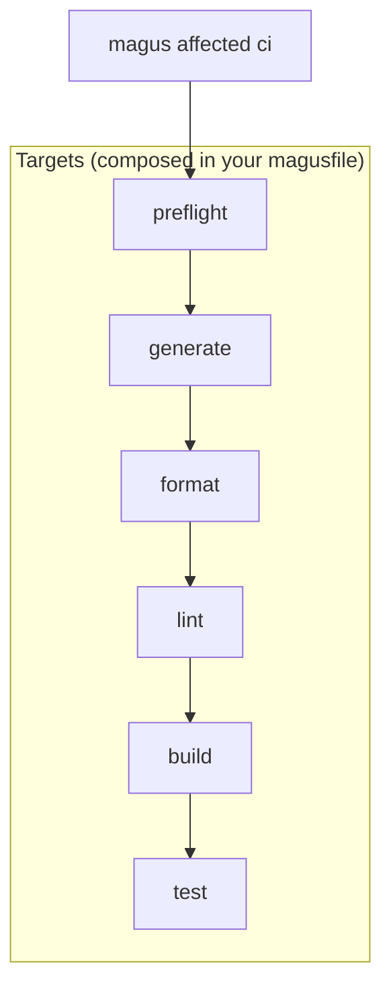

# CI

`ci` is an ordinary magusfile target; magus does not hardcode its steps. Export a `ci` function, wire the flow with `magus\needs`, and magus runs it read-only.

```buzz
export fun ci(ctx: magus\Context, args: [str]) > void {
    // declare the edges you want; independent steps run in parallel
    ctx.needs(preflight, generate, format, lint, build, test);
}
```

## Recommendations

We document this order; we don't enforce it. Chain steps with `magus\needs` where order matters (e.g. `test` depends on `build`).


```mermaid
flowchart TD
    cmd["magus affected ci"] --> preflight
    subgraph targets["Targets (composed in your magusfile)"]
        preflight --> generate
        generate --> format
        format --> lint
        lint --> build
        build --> test
    end
```

## Common pitfalls

Each of these is a way a pipeline goes wrong slowly enough that nobody notices
until it is expensive. magus does not prevent all of them, but it makes each one
either impossible or loud.

### The workflow drifts out from under a release branch

A workflow that names steps directly - build here, test there, lint with these
flags - encodes the shape of the repository at the moment it was written. That
shape drifts, and on a long-lived release branch it drifts unwatched. Months
later a security backport fails CI for reasons unrelated to the patch, and the
cherry-pick grows to carry workflow and infrastructure changes nobody wanted in a
maintenance release. The release now contains CI plumbing that was never reviewed
as part of it.

**magus:** reduce the workflow to one contract and it has nothing left to drift.

```yaml
- run: magus affected ci
```

Everything that varies moves into the magusfile, which is versioned with the code
it builds - and should be. A `v2` branch legitimately builds differently from
`v4`: different toolchain, different steps, possibly different projects. Each
branch describes its own build, and no branch needs another's. The contract is
one line: every branch exports a `ci` target. What it composes is that branch's
business.

### The gate goes green having run nothing

The failure mode a thin workflow could otherwise introduce: a branch falls out of
the contract, `ci` resolves to nothing, and the pipeline passes without gating
anything.

**magus:** this is an error, not a warning. `magus affected ci` refuses to run
when no project in scope declares a `ci` target.

```
no "ci" target defined in the selected project(s); it is the anchor
"magus affected ci" and "magus affected --plan" key off, so this run
would do nothing
```

### The workflow hardcodes the project list

Sharding is the other place repository shape leaks into a workflow. A matrix
listing projects by name is wrong the moment one is added or removed, and the
branch that notices is whichever one fails next.

**magus:** `magus affected --plan` emits the shard matrix as JSON, so the
workflow consumes a value instead of a list. A branch that gains or loses a
project changes its plan output, not its workflow.

### Generated files pass locally and fail in CI

Codegen that runs locally and rewrites the tree makes a dirty checkout look
clean, so drift ships and CI catches it later - or does not.

**magus:** [charms](../charms.md) make writing and verifying the same target with
different intent. Locally a `generate` target carries `rw` and writes; in CI the
default charm is stripped (`--no-default-charms`) and the same target acts as a
pure drift gate. A target can also set `FailOnDrift` to fail outright when it
leaves the tree dirty.

### A volatile test fails the pipeline

Reruns-until-green is how a suite decays into one nobody trusts, because a real
regression looks the same as a volatile failure from the outside.

**magus:** [volatility](../volatility.md) detection decides statistically from
per-target history rather than by rerunning blindly, and only targets that opt in
with `RetryOnVolatile` are eligible.

### A maintenance branch silently upgrades magus

The same drift as the first pitfall, one layer down: a branch that picks up a
newer magus than it was validated against.

**magus:** pin the version per branch and verify its checksum. Whatever else is
shared between branches, this should not be.

### Sharing CI logic across branches, and what it costs

A related pattern: have a release branch check out `main` for its CI logic, so
workflow fixes never need backporting. It does deliver that, and with thin
workflows you rarely need it.

Know the trade before adopting it. You lose the ability to reproduce what a
release actually passed - re-running `v2`'s pipeline a year later runs today's
logic, not the logic that approved it, which is exactly the property an audit or
a regression hunt wants. It also makes the pinned version ambiguous, since the
branch's magusfile may target a magus the shared workflow no longer installs.

It is also the harder pattern to read: nothing in the branch says where its CI
logic lives, so anyone - or any agent - reading only that branch cannot tell. If
you adopt it, say so in the branch's `AGENTS.md` or `MAGUS.md`.

## Shared cache trust

**Who may write the cache is a trust boundary.** The primary defense is Ed25519 signing: a consumer replays a remote artifact only if it carries a signature from a key in `cache.remote.trusted_keys`. Wiring a remote backend without a trust set is refused.

```yaml
# magus.yaml  -  bind the backend in magusfile.buzz via magus\cache.remote(github)
cache:
  remote:
    trusted_keys:
      - "<base64 Ed25519 public key>" # magus config cache key generate
```

A complementary defense is to open the cache **read-only on untrusted refs**: replay hits but never publish. Gate it on the event so only trusted pushes write, and apply the same rule to any persisted run history (the forecaster and volatility detector read it): restore always, save only from trusted pushes.

```yaml
# PRs replay the cache and see main's history, but write neither
MAGUS_CACHE_IMMUTABLE: ${{ github.event_name == 'pull_request' }}
```

To set up a shared cache (GitHub Actions Cache, S3/MinIO/R2/B2, or your own backend) and generate signing keys, see [Remote caching](../remote-cache.md).
