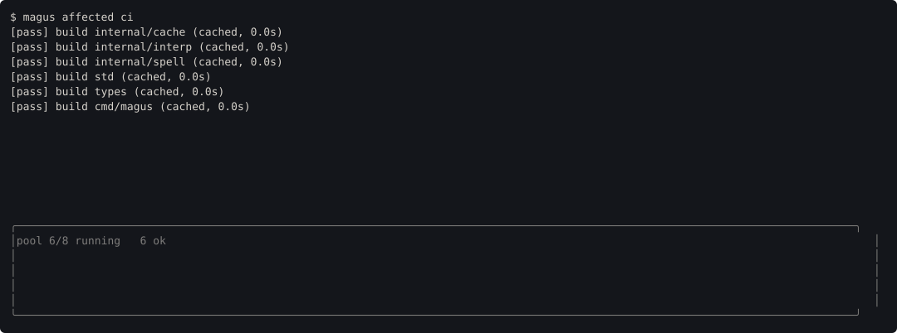
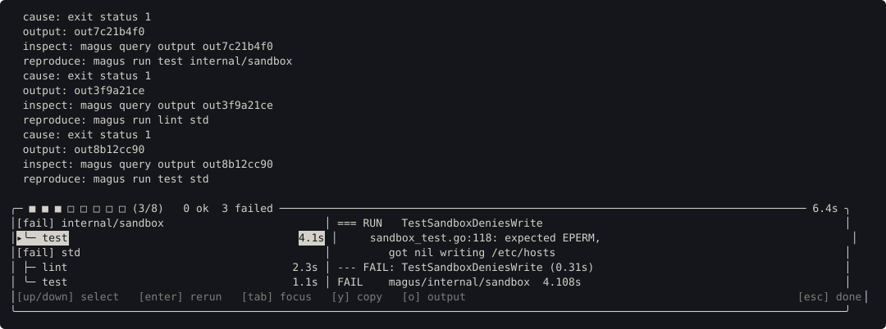
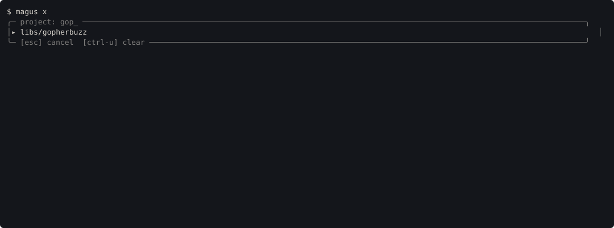

# Terminal

magus draws in your terminal without taking it over. There is no alternate
screen, nothing is cleared, and your scrollback survives: ordinary output keeps
scrolling exactly as it would, while a few rows at the bottom hold still and
show what is happening right now.

Every surface on this page degrades to plain output when there is no terminal to
draw on, so a piped run, a CI log and a `magus` inside another tool all behave
the way they always did. `magus doctor` reports which way your terminal
degraded, if it does.

## The pinned band

The bottom rows of the terminal are reserved. Output above them scrolls
normally - selectable, copyable, in real scrollback - and the reserved rows do
not move with it.



A dim box encloses the band, so it is obvious at a glance which lines will
scroll away and which are being repainted in place. It is drawn with
box-drawing runes, and the same box is drawn by every interactive surface -
the band, the failure list, the `magus x` picker - because two surfaces that
frame themselves differently read as two different products.

Those runes are multi-byte, so a terminal whose locale is not UTF-8 renders
them as mojibake. That is a deliberate trade rather than an oversight: the
border is only ever drawn when there is an interactive terminal to draw it on,
and the environments that still run non-UTF-8 locales - CI, cron, minimal
containers, `LANG=C` scripts - are the ones where output is piped and no border
is drawn at all. Choosing per locale would also make a committed screenshot a
function of whichever shell recorded it.

So magus draws one box everywhere and reports the locale instead of silently
changing what it draws. If yours is not UTF-8, `magus doctor` says so:

```text
locale is not UTF-8 (none of LC_ALL, LC_CTYPE or LANG is set), so the band's
border may render as stray characters; set LANG to a UTF-8 value
```

The top row of the band is a live status line: pool occupancy, how many targets
have passed, how long the run has been going. It repaints in place rather than
printing again, so it costs nothing to watch and never fills the transcript.

The band claims rows only when there is something to put in them, gives them
back when the run ends, and stands down entirely on a terminal too short to
leave a useful scrolling area above it.

## Notifications

A notification is for something you have to ACT on. That rule is strict, and it
leaves magus itself raising almost none: a cache hit is passive, a summary is
already on screen, and a failure is already pinned where it cannot scroll away.

What qualifies is a run that has stopped and will not continue until you do
something:


That one is a _condition_, not an event - it is true until the lock clears - so
it is pinned rather than given a countdown, and it is retracted when the lock is
acquired rather than expiring on a timer.

A magusfile can raise its own with
[`term\notify`](../reference/buzz/term.md). Those expire on their own clock, and
are dropped rather than replayed when there is no terminal - so log anything
that also has to survive the run.

## Failures you can act on

When a run ends with failures, they stay on screen instead of being cleared,
because that is the moment they become actionable:



Click a failure, or select it with the arrow keys, and:

- **enter** reruns just that target with `--step`, pausing before each command
  so you can look at what is about to happen
- **o** prints its captured output into the scrolling transcript
- **esc**, **q** or **ctrl-c** leaves

The way out is always on screen. It is pinned to the right edge so that on a
narrow terminal it is the last thing clipped rather than the first.

## Clicking

The picker behind `magus x`, and the failure list above, both take a mouse.
Hovering moves the highlight, so what a click would take is never a guess:



Keys still do everything the mouse does. The mouse is captured only while magus
is genuinely waiting on you - never during a run - so drag-to-select and your
scroll wheel keep working the rest of the time.

Clicking needs your terminal to answer a cursor-position query. Most do; one
that does not leaves the picker keyboard-only, and `magus doctor` says so rather
than leaving you to wonder.

## Copying

Your transcript is ordinary scrollback and always was: no frame, no padding, no
box characters. Selection, copy and paste work there exactly as they do for any
other command, and that is where magus prints the things worth taking - a
failure's cause, its output reference, and the `magus run <target> <project>`
that reproduces it.

The pinned band is different, and the difference is worth stating plainly rather
than leaving you to discover it. It is a box with two columns, so a drag down
one column takes the other column and the divider with it. That is not a bug we
can arrange away: terminals select LINEARLY, and rectangular selection is
modifier-gated, missing from several terminals, and something you would have to
already know about.

So magus does not ask you to select. Press **y** and the selected failure's
captured output goes straight to your system clipboard - the bytes the tool
emitted, with no frame, no padding and no escape sequences - through a sequence
that survives ssh and tmux. Press **o** and the same output is printed into the
transcript, where it copies like anything else.

The band is for reading. The clipboard and the transcript are for taking.

A terminal that refuses clipboard writes (some disable them) says so in a
notification rather than failing the run, and **o** still works.

## When there is no terminal

Nothing above happens on a pipe, in CI, or under a tool that captures output.
The band is never reserved, notifications are dropped, color and hyperlinks are
omitted, and every message that matters is printed as an ordinary line. The
distinction magus keeps is between a RECORD and a VIEW: a failure is a record
and is always printed somehow, while a repainted status line is a view and is
simply not shown when there is nowhere to repaint it.

`magus doctor` reports what it found:

```text
[pass] terminal capabilities: interactive terminal, fully capable
    TERM="xterm-256color"
    display is a terminal: yes
    input is a terminal: yes
    mouse: yes
    log format: "pretty" (from config)
    size: 120x40
    color: yes
    hyperlinks: yes
```

The log format is reported first because it decides the question before your
terminal gets a say: `text` and `json` emit structured records and draw no
interactive surface at all, however capable the terminal is.
