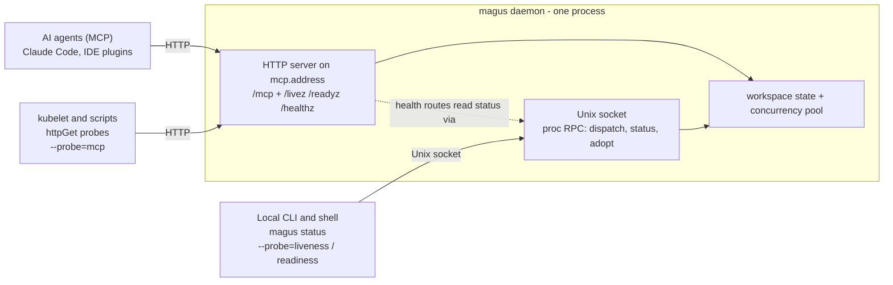

# Daemon and concurrency

## Concurrency

Magus runs project builds in parallel up to a configurable limit.

```sh
magus run build --concurrency=4
magus config set key=concurrency,value=4
MAGUS_CONCURRENCY=4 magus run build
```

When a [daemon](#daemon) is running, all clients share a single concurrency pool. Parallel CI steps and nested `magus` invocations all draw from the same budget.

`magus status` shows the live pool state and current slot usage.

## Daemon

By default every `magus run` is a short-lived process with its own concurrency limiter, so parallel invocations oversubscribe the machine. A daemon holds workspace state in memory and enforces **one** concurrency pool across all clients.

```sh
magus server start &        # foreground process; & or a supervisor backgrounds it
magus server stop           # graceful shutdown; waits for in-flight work
magus server stop --services # stop the daemon's hosted services, leave the daemon up
magus status                # live pool + MCP endpoint health (reports the reason when down)
magus status -W 1s          # poll and reprint every second
```

`magus server start` runs in the **foreground** and blocks. It does not daemonize itself;
you background it with `&`, `nohup`, or - better - a process supervisor so it stays up
across shells and reboots (see [Keeping the daemon running](#keeping-the-daemon-running)).

## Two transports

The daemon is a single process with two listeners, one per audience. A **Unix domain
socket** is the local control plane (the proc RPC that dispatches jobs, answers status,
and adopts nested calls into one concurrency pool); it is fast and private (`0700`), and
the local CLI - including the `--probe=liveness` and `--probe=readiness` checks - uses it.
An **HTTP server** on `mcp.address` serves the clients that cannot reach a Unix socket:
agents over [MCP](mcp.md) at `/mcp`, and orchestrators or scripts at the `/livez`,
`/readyz`, and `/healthz` probe routes.



The Unix socket is the source of truth for daemon state; the HTTP health routes are a thin
wrapper that answers by querying that same socket. But only an actual HTTP request proves
the agent-facing endpoint is bound and serving - a socket check cannot detect an HTTP bind
failure - so the two listeners can diverge, which is why `magus status` reports each
separately.

This page zooms in on the two transports; the HTTP server also carries the agent-facing
[MCP tools](mcp.md), the read-only [console routes](reference/console.md) the browser apps use
(all reading the same warm [knowledge graph](knowledge.md)), and one bearer-gated
[job-control service](reference/console.md#job-control) for maintenance jobs - the daemon's only
mutating HTTP surface. The full-system view - clients,
guards, shared state, and the progressive web app - is the architecture diagram in the
[README](https://github.com/egladman/magus#architecture).

## Sharing the console to a phone

The console can serve a read-only live view to a phone on the same network. The
"Share to phone" action in the console opens a small dialog with a QR code; a phone
that scans it loads the console and gets a read-only view of the dashboard, status,
activity, and logs. It is opt-in and off by default: no listener faces the network
until you click it.

How it works, and where the guards sit:

- **Loopback-only trigger.** The share button POSTs `/api/v1/share` on the daemon's
  loopback HTTP server. That route requires the local peer and the existing bearer
  token (the cli or a connector token), so only the already-authenticated console on
  your own machine can open a share. A network client cannot reach it.
- **Ephemeral, time-boxed LAN listener.** On success the daemon picks the machine's
  private LAN IPv4, binds a NEW listener on an ephemeral port, and serves ONLY the read
  surface there: the console static assets, the read JSON routes
  (`status`, `events`, `insight`, `outputs`, `output`), and the read-only Connect
  services (activity, metrics). It does NOT serve `/mcp`, the share endpoint, or any
  mutating route. The listener closes automatically after 15 minutes, and on daemon
  shutdown.
- **Short-lived, read-scoped token.** Each share mints a fresh token in the `mgs_`
  family, hashed at rest and stamped with a read-only scope. The listener is bound 1:1
  to that one token: it accepts nothing else. The cli token, connector tokens, an
  expired share token, and a share token from any previous share session are all
  rejected. Every share supersedes the last - a repeat click revokes the old token and
  closes its listener before returning a new one, so there is only ever one live share.
- **The daemon verifier never accepts a share token.** The verifier that guards `/mcp`
  and every mutating console route matches only the cli and connector tiers, so a share
  token is refused there. The read scope cannot reach a mutating surface.
- **Same-origin, so CORS never engages.** The phone loads the console FROM the share
  listener, then its data fetches go back to the same origin. No cross-origin request is
  made, so the daemon's CORS middleware is never involved and is untouched by this
  feature. The standing loopback server stays bound to `127.0.0.1` as before.

What a leaked QR or URL is worth: at most a few minutes of read-only visibility into
one workspace's dashboard, status, activity, and logs, from a device already on your
LAN, and only until the share expires or you open a new one (which kills the old token).
It cannot run a build, mutate the cache, reach `/mcp`, or read anything the loopback
console does not already show. There is no standing exposure: when the timer fires the
listener is gone and the token validates nowhere.

## Health: what `magus status` reports

`magus status` is the health surface. It reports two listeners separately, because they
can diverge:

- the **daemon** (`daemon pid ...` with the live pool, or `daemon: off`) - the socket the
  daemon dispatches build jobs on;
- the **MCP endpoint** (`mcp endpoint` block with `state: serving | not-ready | unreachable
| disabled`) - the HTTP endpoint agent hosts connect to. Nothing starts this on its own,
  so an `unreachable` MCP endpoint is the usual reason "the magus tools disappeared" from an
  agent. See [MCP](mcp.md#is-mcp-actually-reachable).

For scripts and Kubernetes probes, `magus status --probe=<kind>` exits `0` healthy / `1`
unhealthy. The kinds are `liveness` (the daemon answers), `readiness` (a workspace is
loaded), and `mcp` (the MCP endpoint is reachable), and they are comma-combinable -
`--probe=liveness,mcp` fails if either the daemon or the endpoint is down. The daemon also
serves `/livez`, `/readyz`, and `/healthz` over HTTP on the MCP port.

## Kubernetes and container probes

The daemon exposes both HTTP endpoints (for `httpGet` probes) and an exec form (for `exec`
probes), split along the standard liveness/readiness lines:

| K8s probe   | endpoint                        | passes when                                     |
| ----------- | ------------------------------- | ----------------------------------------------- |
| `liveness`  | `GET /livez` (alias `/healthz`) | the daemon answers - independent of warm-up     |
| `readiness` | `GET /readyz`                   | the daemon answers AND a workspace is loaded    |
| `startup`   | `GET /livez`                    | the daemon has come up (reuse the liveness URL) |

Liveness is deliberately **independent of warm-up state**: it returns `200` as soon as the
daemon answers, even before any workspace is loaded, so a slow first index never crash-loops
the pod. Readiness gates on a loaded workspace, and `GET /readyz?workspace=<root>` pins it to
one specific workspace (returns `503` until that workspace is warm). Because these endpoints
are served by the MCP HTTP server itself, a successful probe also proves the MCP endpoint is
listening.

The **status code is the signal** - a kubelet reads only that. Because these routes are
unguarded, their bodies carry nothing identifying: `/livez` and `/healthz` answer a bare
`ok` or `unavailable`, and `/readyz` returns a JSON `{"ready": ..., "components": [...]}`
where each component has a coarse `status` (`ok`, `degraded`, `down`, `disabled`) plus a
generic, quantitative `detail` such as `1 loaded` or `0 of 4 up to date` - counts and state
phrases only, never workspace roots, project or service names, filesystem paths, or the
daemon PID. For the identifying per-subsystem view (workspace roots, per-project
symbol-index freshness, named service state), read the bearer-authenticated
`GET /api/v1/status` instead.

The endpoints bind to `127.0.0.1` by default, which the kubelet cannot reach; set
`MAGUS_MCP_ADDRESS=0.0.0.0:7391` (or `mcp.address`) so probes can hit the pod IP.

```yaml
# pod spec
env:
  - { name: MAGUS_MCP_ADDRESS, value: "0.0.0.0:7391" }
startupProbe:
  httpGet: { path: /livez, port: 7391 }
  failureThreshold: 30
  periodSeconds: 2
livenessProbe:
  httpGet: { path: /livez, port: 7391 }
  periodSeconds: 10
readinessProbe:
  httpGet: { path: /readyz, port: 7391 }
  periodSeconds: 10
```

The endpoint requires no auth token (health routes are exempt); keep the port on the pod
network, not the public internet - see [MCP security](mcp.md#security-keep-this-local).

## Keeping the daemon running

The daemon is a local process, and the MCP endpoint is only up while it runs. Pick one way
to keep it alive:

**A shell profile (simplest, good while iterating on magus itself).** Ensure a daemon is up
whenever you open a shell by adding this to `~/.zprofile`, `~/.bashrc`, or equivalent:

```sh
magus status --probe=liveness >/dev/null 2>&1 || (magus server start &)
```

It is a no-op when a daemon is already running. This is the least durable option - the
daemon dies when the last shell that started it exits - but it needs no system integration
and always runs whatever `magus` is on your `PATH`, which is convenient when you rebuild
magus often.

**A systemd user service (Linux).** Supervised, survives logout and reboot:

```ini
# ~/.config/systemd/user/magus.service
[Unit]
Description=magus daemon

[Service]
ExecStart=%h/.local/bin/magus server start
Restart=on-failure

[Install]
WantedBy=default.target
```

```sh
systemctl --user daemon-reload
systemctl --user enable --now magus
loginctl enable-linger "$USER"   # keep it running when you are not logged in
```

**A launchd LaunchAgent (macOS).** The launchd equivalent, loaded at login and kept alive:

```xml
<!-- ~/Library/LaunchAgents/com.magus.daemon.plist -->
<?xml version="1.0" encoding="UTF-8"?>
<!DOCTYPE plist PUBLIC "-//Apple//DTD PLIST 1.0//EN" "http://www.apple.com/DTDs/PropertyList-1.0.dtd">
<plist version="1.0">
  <dict>
    <key>Label</key><string>com.magus.daemon</string>
    <key>ProgramArguments</key>
    <array>
      <string>/usr/local/bin/magus</string>
      <string>server</string>
      <string>start</string>
    </array>
    <key>RunAtLoad</key><true/>
    <key>KeepAlive</key><true/>
  </dict>
</plist>
```

```sh
launchctl load ~/Library/LaunchAgents/com.magus.daemon.plist
```

Point `ProgramArguments` at your actual `magus` path (`which magus`). With a supervised
service, restart it after upgrading magus (`systemctl --user restart magus` /
`launchctl kickstart -k gui/$UID/com.magus.daemon`) so it runs the new binary.

## Hosting shared services

The daemon is also the host for **shared services** (see [services.md](services.md)).
When a `magus run` needs a [service op](operations.md) as a dependency and a daemon is
running, the daemon starts that service once and keeps it **warm** across separate
invocations, so a shared Postgres stays up between `magus run test:a` and a later
`magus run test:b` instead of restarting each time. Services are keyed by a
configuration fingerprint, so identical definitions in different projects resolve to
one instance. A per-process daemon (the one an unattended `magus run` spawns for
itself) does not host services; only the stable `magus server` daemon does, which is
why cross-invocation sharing needs it running.

The daemon reaps a service after an idle window once its last dependent releases (a
30 minute default, overridable per service via `Service.idle`), and it records each
hosted service's stop command so a **new daemon reaps orphans** a previous one left
behind if it was killed uncleanly. `magus server stop --services` clears every hosted
service on demand (to drop stale state or free held ports) without shutting the daemon
down.

## Configuring the socket address

The socket address is resolved in priority order:

1. `--daemon-address <unix://...>` flag
2. `MAGUS_DAEMON_ADDRESS` environment variable
3. `daemon.address` in `magus.yaml`
4. Stable per-workspace default (`unix://<sock-dir>/magus-daemon.sock`)

The default socket is named without a PID so `server stop` and `server status` can find it without discovery.

To pin a socket address in config:

```sh
magus config set key=daemon.address,value=unix:///run/user/1000/magus/daemon.sock
```
