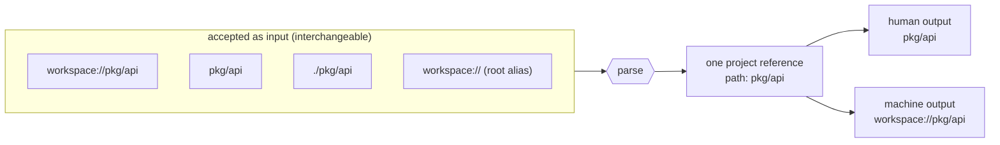

# Agents

magus knows more about a workspace than any agent can rediscover by reading
files: the project DAG, every target's inputs and declared outputs, which files
are generated, what a diff affects, where churn and coupling concentrate. The
agent surface exposes that knowledge through three artifacts that divide
cleanly. One rule governs all of it: every tool answers a question from
declared sources; none of them decides, plans, or injects itself into the
agent's context. Answering is the tool's job; deciding is the model's.
The three artifacts:

| artifact          | answers                                              | freshness                                                           |
| ----------------- | ---------------------------------------------------- | ------------------------------------------------------------------- |
| `MAGUS.md`        | WHAT is in this workspace (targets, counts, anchors) | regenerated with the workspace (`magus describe graph -o markdown`) |
| Agent Skills      | HOW to use the magus tool surface                    | ships with the binary; versioned, drift-checked                     |
| MCP daemon        | live answers (query, run, explain, logs)             | always current; `magus server start`                                |

The split is deliberate: skills never mention workspace specifics, so they only
go stale when the tool surface changes - and that staleness is detectable (see
drift, below).

`MAGUS.md` is per-project as well as per-workspace: a nested project can commit
its own (generated by its `generate` target), scoped to that project's targets,
so an agent working inside one project gets a routing index sized to it.

## The skills

`magus agent install <dir>...` writes the skills into every destination
directory you name. Commit them so every teammate's agent shares the same
instructions. magus is agent-host agnostic: the skills are one shared source
embedded in the binary in the cross-agent Agent Skills format (SKILL.md with
name and description frontmatter), every destination receives identical bytes,
and naming the directory your host discovers skills in is the only
host-specific step:

| destination         | read by                                 |
| ------------------- | --------------------------------------- |
| `.agents/skills/`   | Codex and other Agent Skills hosts      |
| `.claude/skills/`   | Claude Code                             |
| `.opencode/skills/` | OpenCode                                |
| `AGENTS.md`         | Codex and other instruction-file hosts  |

`--agents-md` maintains a marker-delimited magus section inside `AGENTS.md`
(created if absent, replaced in place on re-install, other content untouched).
For Codex, `AGENTS.md` and `.agents/skills/` are complementary: the first is
always-on repository guidance; the second exposes focused workflows on demand.
There are no per-model skill bodies anywhere - supporting a new host means
naming a destination, not writing new instructions.

- `magus-query`: find and relate domain entities with
  `query`/`explain`/`path`/`refs`/`stats` instead of grepping - the query
  grammar, reading node IDs and edge provenance, ownership, cross-workspace
  queries.
- `magus-run`: run work through top-level targets (`build`, `test`, `lint`,
  `format`, `generate`) rather than raw language tools; `ci` as the anchor;
  `magus affected ci` as the final gate before handing work back; spell-op
  granularity (`go::go-test`) when one op is genuinely needed; fetching a
  failure's captured output by ref.
- `magus-vcs`: triage changed files against declared target outputs -
  generated files are regenerated, never hand-edited, never worth reading a
  diff of, and committed alongside the sources that produced them.
- `magus-architecture`: ground refactoring proposals in graph evidence -
  hotspots, affinity (undeclared coupling), blast radius, symbol fan-in,
  CODEOWNERS - and verify impact with `magus graph diff`.
- `magus-memory`: a user-owned handoff journal over CLI, MCP, and console. Each
  entry points to something magus can reopen; it is not automatic agent memory.
  Use named decisions and plans when a later person needs the why, then verify
  stale or malformed entries instead of silently carrying them forward.
- `magus-docs`: navigate magus's own documentation to answer a how-does-magus-do-X
  question instead of guessing - the doc URL and section scheme, the in-page
  navigation axes, and when to reach for it over the workspace graph.

### Where guidance belongs

The skills teach the magus tool surface and nothing else. Keep each kind of
guidance at the one layer that owns it, because agents pay for every
duplicated line in every session:

- Your agent harness already covers generic behavior (when to ask, how to
  report). Do not restate it anywhere.
- Your repo's own instruction file (CLAUDE.md, AGENTS.md) carries repo
  conventions and team working style.
- The installed skills carry the magus HOW; the committed MAGUS.md carries
  the workspace WHAT. Both are generated - edit neither by hand.

## Install and update

`magus agent` is a pure data generator: it writes nothing to disk by default
unless you pass a destination directory. Two subcommands and two output modes
cover every install case.

```sh
magus agent install .claude/skills          # write to repo-relative dir; refuses to overwrite
magus agent install .claude/skills --force  # overwrite after a magus upgrade
magus agent install-agents-md               # write/refresh the AGENTS.md managed section
magus agent install --tar                   # stream a tar of every skill to stdout
magus agent install-agents-md --tar         # stream a tar containing AGENTS.md to stdout
magus graph verify                          # are the installed skills current? (per location)
magus graph verify --strict                 # CI gate: non-zero exit when stale
```

The `--tar` form is the supported way to install skills anywhere your shell
can reach. Pipe to `tar -xf - -C <dir>` and the shell does the file writes -
so the guard hook, the sandbox, and your audit log all see the same operation
the user typed:

```sh
magus agent install --tar | tar -xf - -C .claude/skills
magus agent install --tar | tar -xf - -C ~/.config/opencode/skills
magus agent install-agents-md --tar | tar -xf - -C ~/my-project
```

Write-mode destinations are paths relative to `--dir` (default `.`). Absolute
paths and `~` prefixes are refused unless `--global` is set, to keep magus
from silently writing outside the working tree. The supported escape hatch
for absolute destinations is `--tar`:

```sh
magus agent install /tmp/skills              # refused: "outside the working tree"
magus agent install /tmp/skills --global     # accepts; you take responsibility
magus agent install --tar | tar -xf - -C /tmp/skills   # preferred
```

A host discovers skills at session start, so restart the agent session after a
fresh install (or a `--force` refresh) before it can invoke the new skills - an
already-open session keeps the skill set it launched with. The same launch-time
rule applies to MCP tools; see [MCP](mcp.md) for connecting the daemon.

Every installed file (and the AGENTS.md section marker) carries a generated
stamp with the agent-skill version and the knowledge schema version.
`magus graph verify` compares those stamps against the running binary for
every well-known location it finds installed (`.agents/skills`,
`.claude/skills`, `.opencode/skills`, and the AGENTS.md section), so a magus
upgrade that changes the tool surface shows up as actionable drift instead of
silently wrong instructions. Do not hand-edit installed skills; change flows
through re-running install.

### Codex

Codex needs both the focused skills and the repository guidance:

```sh
magus agent install .agents/skills
magus agent install-agents-md
magus server start
```

Register the local Streamable HTTP server in your user-level
`~/.codex/config.toml`, never in the repository:

```toml
[mcp_servers.magus]
url = "http://127.0.0.1:7391/mcp"
bearer_token_env_var = "MAGUS_MCP_TOKEN"
enabled = true
```

For Codex CLI, set `MAGUS_MCP_TOKEN` in the shell that launches it, then verify
registration and endpoint health:

```sh
export MAGUS_MCP_TOKEN="$(magus config mcp token print)"
codex mcp list
magus server start
magus status --probe=liveness,mcp
```

For a dedicated, revocable credential, create a connector token named `codex`
instead and store the value it prints in your local secret manager as
`MAGUS_MCP_TOKEN`. For the ChatGPT desktop app or Codex IDE extension, make that
variable available through the OS environment before launching or restarting the
client; an `export` in an unrelated terminal cannot modify an existing app.
Start a new Codex task after installing skills, changing `AGENTS.md`, changing
MCP configuration, or starting the daemon: Codex discovers all of those at task
start. `codex mcp list` confirms configuration only; the status probe confirms
the endpoint is actually serving. If `mcp.address` changes, update the URL in
your user-level Codex configuration as well.

### Daemon optional, agent surface preferred

The CLI works without a daemon. It still reads the workspace, runs targets,
uses the cache, and answers graph queries. What it lacks is MCP tool discovery,
the daemon's warm graph and background indexes, structured output retrieval,
and MCP-only capabilities such as scratchpad and memory. An agent must not turn
that into a blocker: at task start, or after an MCP error, it should run
`magus status --probe=mcp`; if unavailable, tell the user once to run
`magus server start`, then use the CLI fallback. The next task picks up the
full surface after the daemon is running and the client is restarted.

## Project references

Every magus command that names a project accepts the same two forms, and
every command that prints one picks the form that suits its audience. Agents
sit on both sides of that line, so it is worth knowing which is which.



The scheme is metadata, not content. It behaves like `https://` in a browser
bar: present in the canonical reference, hidden when a human is reading.

| Form                    | Where it appears                                                  |
| ----------------------- | ----------------------------------------------------------------- |
| `workspace://pkg/api`   | Structured output (`-o json`), error messages, generated docs      |
| `pkg/api`               | Human-facing logs, run output, Mermaid node labels                 |
| `workspace://`          | Alias for the workspace root, equivalent to `.`                    |

Two rules cover the whole surface:

- **Reading magus output**: never string-strip the scheme yourself. Wherever a
  command takes a project path - `magus run`, `magus affected` - both forms
  parse identically, so `magus run build workspace://pkg/api` and
  `magus run build pkg/api` are the same invocation. Commands that take fuzzy
  search tokens rather than paths, such as `magus where`, match on the bare
  name; give those the path without the scheme.
- **Quoting a project back to a user**: prefer whatever magus printed. The
  workspace root is the case that bites, because it is the one project whose
  path is a bare `.`; magus renders it as the repository's directory name in
  human output and as `workspace://.` in machine output, so a `.` never leaks
  into a sentence where it reads as punctuation.

> [!NOTE]
> The root alias exists because `.` is ambiguous in almost every context an
> agent works in: a shell argument, a JSON value, the end of a sentence.
> magus has already made that choice in whichever form it handed you, so
> passing the value through unmodified is always correct.

## Guard hooks

Most agent hosts can run a hook before executing a shell command. magus
supplies the rule evaluation; the host supplies the hook that calls it.
`magus agent hook` reads one command, applies the guard rules, and returns a
neutral verdict.

- `deny`, with a `reason` written for the model: destructive whole-tree VCS
  operations (`git stash`, `git reset --hard`, `git checkout .`,
  `git restore .`, `git clean -f`) that permanently destroy uncommitted and
  untracked work, including a concurrent agent's.
- `advise`, with `context` to inject while the call proceeds: `git commit` and
  `git add` (classify the dirty tree first) and raw language tools like
  `go test` or `pytest` (a magus target covers the work).
- `pass`: everything else.

That verdict is the whole contract. The command arrives however your host can
produce it: as arguments, as raw stdin, or extracted from a JSON event on
stdin with `--from-json <dot.path>`. The verdict leaves through the standard
output arm: `-o json` (a schema-versioned envelope), `-o yaml`, `-o name` (the
bare decision word), or `-o template=<go-template>` to render your host's
response dialect directly. Bare `-o template` lists the fields. A host
integration is therefore a few lines of configuration you own, with no
host-specific code in magus. An unreadable event fails open as a `pass`, since
a guard that errors on every tool call is worse than no guard.

This split is deliberate. magus owns the guard rules and the verdict, not
integration code for each host. Maintaining a codec per host as the tools keep
changing would be a lot to manage for little gain. So the host-specific part
stays in a template or a few lines of config you control: adding a host, or
fixing one that changed, is your edit, not a new magus release. What follows
are examples, not a fixed list of supported hosts. Any host that can run a
command and read its output fits.

```sh
magus agent hook -- git stash                 # deny: whole-tree git stash destroys ...
echo "go test ./..." | magus agent hook -     # advise: a magus target covers this ...
magus agent hook -o template                  # list the fields -o json / -o template see
```

### Claude Code

A `PreToolUse` hook on the `Bash` tool in `.claude/settings.json`. The
`command -v` prefix fails open when magus is not on PATH; the template renders
Claude Code's response dialect, emitting nothing on a `pass`:

```json
{
  "hooks": {
    "PreToolUse": [
      {
        "matcher": "Bash",
        "hooks": [
          {
            "type": "command",
            "command": "command -v magus >/dev/null 2>&1 || exit 0; exec magus agent hook --from-json tool_input.command -o 'template={{if eq .decision \"deny\"}}{\"hookSpecificOutput\":{\"hookEventName\":\"PreToolUse\",\"permissionDecision\":\"deny\",\"permissionDecisionReason\":{{toJson .reason}}}}{{else if eq .decision \"advise\"}}{\"hookSpecificOutput\":{\"hookEventName\":\"PreToolUse\",\"additionalContext\":{{toJson .context}}}}{{end}}'",
            "timeout": 10
          }
        ]
      }
    ]
  }
}
```

### Other agents

> [!NOTE]
> Only the Claude Code setup above is tested end-to-end; it is the guard this
> repository dogfoods. For the OpenCode and Cursor examples below, the magus
> half is verified - the `magus agent hook -o json` verdict shape each one
> parses is checked against this repository's binary. The host half (plugin
> loading, hook registration, whether a thrown `reason` reaches the model) is
> written against each product's published spec and has not been run here, so
> double-check it against the upstream docs:
> [OpenCode plugins](https://opencode.ai/docs/plugins) and
> [Cursor hooks](https://docs.cursor.com/agent/hooks).

A full setup is two steps: install the guidance where the host reads it, then
wire the guard hook. The hook step is always the same shape - pull the command
out of the host's event with `--from-json <dot.path>`, let `magus agent hook`
judge it, and render the verdict into the host's response with `-o template`;
only the dot-path and the response field names change. The examples below were
written against each product's published hook and instruction-file docs in
mid-2026, with the confidence caveats called out inline. Those docs are the
products' own and move on their schedule, so confirm each against the host's
current docs and expect to adjust.

Not every host reads the Agent Skills format. Claude Code and OpenCode discover
`SKILL.md` directories. Codex reads both `.agents/skills/` and `AGENTS.md`;
Cursor and most other hosts use only `AGENTS.md`.

#### Codex

Codex uses the setup above: `.agents/skills/` for the focused workflows,
`AGENTS.md` for durable repository guidance, and `.codex/config.toml` for MCP.
The installed guidance and the MCP server instructions are the right way to
teach discovery-first behavior. Do not try to enforce a graph query with a
hook: a hook can observe a tool call, but cannot prove the agent asked the
right prior question. Reserve hooks for concrete safety rules such as the
destructive-VCS guard, and keep the workflow guidance visible and testable with
`magus graph verify --strict`.

#### OpenCode

OpenCode discovers Agent Skills from `.opencode/skills/` (and also reads
`.claude/skills/`, so if you already installed there for Claude Code, OpenCode
picks those up and this step is optional):

```sh
magus agent install .opencode/skills
```

The guard is a `.opencode/plugins/` TypeScript plugin. OpenCode has no
shell-command hook config, but a plugin gets Bun's `$` shell handle to call the
binary. Throwing from `tool.execute.before` reliably blocks the command. Note
that OpenCode's docs confirm the throw blocks but do not promise the `reason`
reaches the model, so treat this as a hard stop whose explanation is
best-effort. Bun's `$` escapes the interpolated command, so passing it as one
argument is injection-safe:

```ts
import type { Plugin } from "@opencode-ai/plugin"

export const MagusGuard: Plugin = async ({ $ }) => ({
  "tool.execute.before": async (input, output) => {
    if (input.tool !== "bash") return
    const command = output.args.command ?? ""
    const res = await $`magus agent hook -o json -- ${command}`.nothrow()
    // Fail closed: a missing binary, a non-zero exit, or unparseable output
    // must block, not wave the command through. `.nothrow()` keeps Bun from
    // throwing on exit status so this decision stays ours to make.
    if (res.exitCode !== 0) {
      throw new Error(`magus agent hook unavailable (exit ${res.exitCode}); blocking`)
    }
    let verdict: { schema_version?: number; decision?: string; reason?: string }
    try {
      verdict = JSON.parse(res.text())
    } catch {
      throw new Error("magus agent hook returned unparseable output; blocking")
    }
    if (verdict.schema_version !== 1) {
      throw new Error(`unsupported hook schema ${verdict.schema_version}; blocking`)
    }
    if (verdict.decision === "deny") throw new Error(verdict.reason)
  },
})
```

The verdict contract this plugin codes against is verified against the binary
in this repository: `magus agent hook -o json` exits 0 whether or not it
blocks, and prints `{"schema_version": 1, "decision": "pass"}` or
`{"schema_version": 1, "decision": "deny", "reason": "..."}`. Because a pass
and a deny are both exit 0, the `decision` field is the only signal - a plugin
that branches on exit status alone would never block anything.

> [!NOTE]
> The failure handling above is the part worth copying even if you rewrite the
> rest. A guard that treats "magus is not installed" as "allowed" silently
> stops guarding the first time a PATH changes, and nothing in the agent's
> output says so.

#### Cursor

Cursor does not read Agent Skills directories; it reads an `AGENTS.md` at the
repo root. Install the managed section there:

```sh
magus agent install --agents-md
```

The guard is a `beforeShellExecution` hook in `.cursor/hooks.json`. Cursor runs
the hook as a program (not an inline shell string), so point it at a small
wrapper script. The command is at the event's top-level `command`
(`--from-json command`). One documented limit: Cursor delivers `agent_message`
to the model only on a denial, not on an allow, so `advise` collapses to a
plain allow here. The block is what reaches the model, and the advisory nudges
live in the installed guidance instead. Cursor fails open on a hook crash or bad
JSON unless the hook sets `failClosed`.

```json
{
  "version": 1,
  "hooks": {
    "beforeShellExecution": [{ "command": "./.cursor/hooks/magus-guard.sh" }]
  }
}
```

```sh
#!/bin/sh
# .cursor/hooks/magus-guard.sh  (chmod +x)
command -v magus >/dev/null 2>&1 || { echo '{"permission":"allow"}'; exit 0; }
exec magus agent hook --from-json command -o 'template={{if eq .decision "deny"}}{"permission":"deny","agent_message":{{toJson .reason}}}{{else}}{"permission":"allow"}{{end}}'
```

Note that this script and the OpenCode plugin above take opposite stances when
magus itself is missing: this one allows the command, the plugin blocks it.
That is a real choice, not an oversight. Cursor's hook contract already fails
open on a crash or malformed JSON unless you set `failClosed`, so a wrapper
that pretended otherwise would give false assurance; OpenCode's plugin throws,
so blocking is the natural default there. If you want the strict behaviour in
Cursor, set `failClosed` on the hook and swap the first line for an explicit
denial:

```sh
command -v magus >/dev/null 2>&1 || { echo '{"permission":"deny","agent_message":"magus not on PATH; guard cannot evaluate"}'; exit 0; }
```

## The MCP daemon

`magus server start` brings up the daemon, and the MCP server with it. Agents
connected over MCP get the same verbs as the CLI plus run/log/scratchpad tools;
`magus describe mcp-tools` lists all of them with parameters. See
[MCP](mcp.md) for transport and token setup, and
[Knowledge graph](../concepts/knowledge.md) for the graph the query tools read.

Skills prefer the MCP tools and fall back to the CLI, so they work in both
connected and daemon-less sessions.

Two tools deserve a callout because they carry state across sessions:
`magus_scratchpad` (a disposable per-workspace working file) and `magus_memory`
(a deliberate, user-owned handoff journal of per-repository records, each
pointing into the codebase, kept in the user state directory outside the repo,
and shared across branches and worktrees). Both are pull-based: nothing is
injected into an agent's context. The journal is also available through `magus
memory list|get|put|delete|verify`; use `verify` to surface stale, malformed,
or broken linked entries. Captured build output is addressed by
[output references](../concepts/output-refs.md).

## Why a daemon, not a wrapper

The skeptical read is reasonable. If an agent can already run `magus query` in a
shell, what does an MCP server add? If the server only ran the CLI and handed back
its stdout, the answer would be nothing, plus a round trip. That is not what this
server does, and the difference is the context the agent has to work with.

An agent working through a shell falls back on the habits it learned everywhere
else: grep and cat over the files. Those return text matches. They do not return
the project DAG, the declared outputs, the affected set, or the blast radius of a
symbol, because none of that is written in the files. It lives in the graph the
daemon keeps warm. So the agent reasons one layer below the structure it is trying
to understand, and it fills the gap by guessing: this file looks generated, these
two packages probably change together. Those guesses are frequently wrong, and the
agent has no way to check them.

The tools answer from what the workspace declares. Ask `magus_describe_file` about
a path and it does not read the filename and infer; it checks the project's own
globs and reports `role: output` with the note "generated: never hand-edit,
regenerate." In one case an agent spent close to an hour working out whether a
committed `gen/` file was safe to edit, running generate repeatedly, planting
sentinel writes, and diffing file timestamps, when one call to that tool would have
answered it in a line. The fact was available the whole time. The shell path never
retrieved it, because grep has no way to ask that question.

The server adds three things a shell-out leaves on the floor. The first is
discovery: the tools arrive in the model's context with their descriptions and
parameters, so the agent knows they exist and how to call them without reading
`--help` first. A shelled command only helps an agent that already knew to run it.
The second is shape: results come back structured and sized for a model, carrying
the fields that answer the question rather than a human-formatted table wrapped in
color codes and pagination the model has to scrape and pay for by the token. The
third is ground truth: the daemon reports what the workspace declares, which the
agent can rely on, rather than what a text pattern happened to match, which it
cannot.

None of this comes from the protocol itself. A server that only shelled out would
be a wrapper whether or not it spoke MCP. It earns its place by holding the warm
graph and answering in the terms the agent reasons in. MCP is how that reaches the
model; the value is in the graph and the curation.
