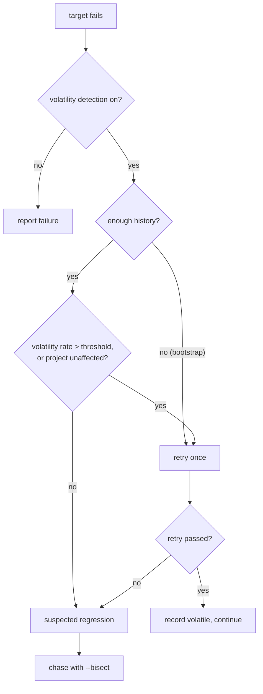

# Volatility

A test that fails once and passes on rerun is volatile; a test that started failing
and stays failing is a regression. Telling them apart by hand is guesswork, so
magus keeps per-target pass/fail history and decides statistically. This page is
the decision it makes and the tools for the cases it hands back to you.

## How magus decides a failure is volatile

Volatility detection is on by default (`volatility.enabled`) and applies to targets
that opt in with the `RetryOnVolatile` policy. On a failure, magus looks at that
target's history:

- **Bootstrap phase.** Below `volatility.bootstrap_samples` outcomes (default 20),
  there is not enough history to judge, so magus retries every failure once.
- **Scored phase.** With enough history (`volatility.min_samples`), magus computes a
  Wilson-score volatility rate and retries when it exceeds `volatility.threshold`. A
  stable target that suddenly fails is _not_ retried - that looks like a regression.
- **Unaffected prior.** A failure in a project the diff did not touch carries a
  strong prior on volatility (its code did not change), so magus leans toward retry.

If the retry passes, the outcome is recorded as volatile and the run continues. If it
fails again, magus flags a **suspected regression** and stops treating it as noise.



## When it is a real regression

A suspected regression means the failure survived a retry and does not look like
noise. Find the commit that introduced it with VCS bisect driven by run history:

```sh
magus affected --bisect ./apps/myapp
```

magus uses recorded outcomes to seed the known-good end (`--good` overrides it) and
bisects the target across commits until it isolates the break. See
[affected.md](affected.md#forensic-modes).

## Chasing a genuine intermittent break

When a failure is real but only sometimes, narrow the cause:

- **Data races** - `magus run test --race` turns on the toolchain race detector for
  the run. A race is the most common source of "passes locally, fails in CI."
- **Order and isolation** - run the single target alone (`magus run test api`) and
  compare to the full run. A difference points to shared state or test ordering.
- **Under-declared inputs** - if a target passes fresh but fails from cache (or the
  reverse), its `needs`/`provides` may be wrong, so the cache replays a stale
  result. `magus describe target <path:target>` shows the declared inputs; see
  [cache.md](cache.md).
- **Disable retry to see raw behavior** - `magus run --no-volatility-retry` (and
  `magus affected --bisect` internally) runs without the retry cushion so you
  observe the failure directly.

## Configuration

The `volatility.*` keys tune detection; see the [config reference](config.md#volatility).
`RetryOnVolatile` is a per-target policy, so a workspace opts specific targets
(usually `test`) into retry rather than the whole tree. `volatility.annotate_gha`
surfaces retried and regression outcomes as GitHub Actions annotations.

## See also

- [affected.md](affected.md) - the `--bisect` regression hunt.
- [cache.md](cache.md) - why an under-declared input reads as volatility.
- [debugging.md](debugging.md) - the interactive REPL and `magus.pry` breakpoints.
