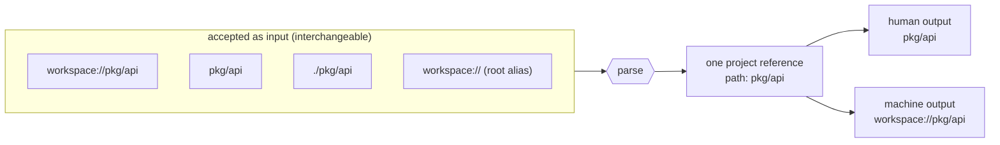

# Agents

magus knows more about a workspace than any agent can rediscover by reading
files: the project DAG, every target's inputs and declared outputs, which files
are generated, what a diff affects, where churn and coupling concentrate. The
agent surface exposes that knowledge through three artifacts that divide
cleanly. One rule governs all of it: every tool answers a question from
declared sources; none of them decides, plans, or injects itself into the
agent's context. Answering is the tool's job; deciding is the model's.
The three artifacts:

| artifact          | answers                                              | freshness                                                           |
| ----------------- | ---------------------------------------------------- | ------------------------------------------------------------------- |
| `MAGUS.md`        | WHAT is in this workspace (targets, counts, anchors) | regenerated with the workspace (`magus describe graph -o markdown`) |
| Agent Skills      | HOW to use the magus tool surface                    | ships with the binary; versioned, drift-checked                     |
| MCP daemon        | live answers (query, run, explain, logs)             | always current; `magus server start`                                |

The split is deliberate: skills never mention workspace specifics, so they only
go stale when the tool surface changes - and that staleness is detectable (see
drift, below).

`MAGUS.md` is per-project as well as per-workspace: a nested project can commit
its own (generated by its `generate` target), scoped to that project's targets,
so an agent working inside one project gets a routing index sized to it.

## The skills

`magus agent install <dir>...` writes the skills into every destination
directory you name. Commit them so every teammate's agent shares the same
instructions. magus is agent-host agnostic: the skills are one shared source
embedded in the binary in the cross-agent Agent Skills format (SKILL.md with
name and description frontmatter), every destination receives identical bytes,
and naming the directory your host discovers skills in is the only
host-specific step:

| destination         | read by                                 |
| ------------------- | --------------------------------------- |
| `.agents/skills/`   | Codex and other Agent Skills hosts      |
| `.claude/skills/`   | Claude Code                             |
| `.opencode/skills/` | OpenCode                                |
| `AGENTS.md`         | Codex and other instruction-file hosts  |

`--agents-md` maintains a marker-delimited magus section inside `AGENTS.md`
(created if absent, replaced in place on re-install, other content untouched).
For Codex, `AGENTS.md` and `.agents/skills/` are complementary: the first is
always-on repository guidance; the second exposes focused workflows on demand.
There are no per-model skill bodies anywhere - supporting a new host means
naming a destination, not writing new instructions.

- `magus-query`: find and relate domain entities with
  `query`/`explain`/`path`/`refs`/`stats` instead of grepping - the query
  grammar, reading node IDs and edge provenance, ownership, cross-workspace
  queries.
- `magus-run`: run work through top-level targets (`build`, `test`, `lint`,
  `format`, `generate`) rather than raw language tools; `ci` as the anchor;
  `magus affected ci` as the final gate before handing work back; spell-op
  granularity (`go::go-test`) when one op is genuinely needed; fetching a
  failure's captured output by ref.
- `magus-vcs`: triage changed files against declared target outputs -
  generated files are regenerated, never hand-edited, never worth reading a
  diff of, and committed alongside the sources that produced them.
- `magus-architecture`: ground refactoring proposals in graph evidence -
  hotspots, affinity (undeclared coupling), blast radius, symbol fan-in,
  CODEOWNERS - and verify impact with `magus graph diff`.
- `magus-memory`: a user-owned handoff journal over CLI, MCP, and console. Each
  entry points to something magus can reopen; it is not automatic agent memory.
  Use named decisions and plans when a later person needs the why, then verify
  stale or malformed entries instead of silently carrying them forward.
- `magus-docs`: navigate magus's own documentation to answer a how-does-magus-do-X
  question instead of guessing - the doc URL and section scheme, the in-page
  navigation axes, and when to reach for it over the workspace graph.

### Where guidance belongs

The skills teach the magus tool surface and nothing else. Keep each kind of
guidance at the one layer that owns it, because agents pay for every
duplicated line in every session:

- Your agent harness already covers generic behavior (when to ask, how to
  report). Do not restate it anywhere.
- Your repo's own instruction file (CLAUDE.md, AGENTS.md) carries repo
  conventions and team working style.
- The installed skills carry the magus HOW; the committed MAGUS.md carries
  the workspace WHAT. Both are generated - edit neither by hand.

## Install and update

`magus agent` is a pure data generator: it writes nothing to disk by default
unless you pass a destination directory. Two subcommands and two output modes
cover every install case.

```sh
magus agent install .claude/skills          # write to repo-relative dir; refuses to overwrite
magus agent install .claude/skills --force  # overwrite after a magus upgrade
magus agent install .claude/skills --simple # the shorter permutation (see below)
magus agent install-agents-md               # write/refresh the AGENTS.md managed section
magus agent install --tar                   # stream a tar of every skill to stdout
magus agent install-agents-md --tar         # stream a tar containing AGENTS.md to stdout
magus graph verify                          # are the installed skills current? (per location)
magus graph verify --strict                 # CI gate: non-zero exit when stale
```

The `--tar` form is the supported way to install skills anywhere your shell
can reach. Pipe to `tar -xf - -C <dir>` and the shell does the file writes -
so the guard hook, the sandbox, and your audit log all see the same operation
the user typed:

```sh
magus agent install --tar | tar -xf - -C .claude/skills
magus agent install --tar | tar -xf - -C ~/.config/opencode/skills
magus agent install-agents-md --tar | tar -xf - -C ~/my-project
```

Write-mode destinations are paths relative to `--dir` (default `.`). Absolute
paths and `~` prefixes are refused unless `--global` is set, to keep magus
from silently writing outside the working tree. The supported escape hatch
for absolute destinations is `--tar`:

```sh
magus agent install /tmp/skills              # refused: "outside the working tree"
magus agent install /tmp/skills --global     # accepts; you take responsibility
magus agent install --tar | tar -xf - -C /tmp/skills   # preferred
```

A host discovers skills at session start, so restart the agent session after a
fresh install (or a `--force` refresh) before it can invoke the new skills - an
already-open session keeps the skill set it launched with. The same launch-time
rule applies to MCP tools; see [MCP](mcp.md) for connecting the daemon.

### Two permutations: `--simple`

Every skill ships in two forms, and `--simple` picks the shorter one:

| | what it carries | who it is for |
| --- | --- | --- |
| default | the imperative steps, plus the rationale for each - why it is the right move, and what goes wrong otherwise | a reader that benefits from the why, or any model you have not measured |
| `--simple` | the imperative steps alone | a capable model that infers the why, when the context is better spent on the task |

**Both are curated.** The simple form is not a summary and not generated by a
model. There is exactly one hand-written body per skill, and its author marks the
spans that only the full form keeps. So the two cannot come to describe different
behavior: one source of truth to edit, and one to review.

They also version together. The installed file's stamp names which form you have:

```yaml
metadata:
  agent-skill-version: 19
  knowledge-schema-version: 6
  skill-content: 45653b90928c
  skill-variant: simple
```

`skill-content` is the digest of the **source** body, so it is identical for both
forms. That is deliberate: a per-form digest would let a `--simple` install look
current against a source its full sibling had already outgrown. `magus graph
verify` compares the version and the digest, so it reports staleness the same way
whichever form is installed, and switching between them is an ordinary
`--force` reinstall:

```sh
magus agent install .claude/skills --simple --force   # switch to the short form
magus agent install .claude/skills --force            # switch back
```

#### Why the choice exists at all

A skill guesses at what its reader cannot work out alone, and that guess dates.
Models keep getting better at inferring the why, so rationale that pays for its
context today may be dead weight next year. Left unrevisited, a skill becomes
bytes every session pays for and nobody reads.

The flag makes that checkable. Install one form, use it against the models you
actually run, and compare: you find out whether the rationale is still doing work
without rewriting anything. If the simple form holds up, the rationale in the full
one is documentation for people rather than instruction for the model.

Start with the default. Switch to `--simple` when you have a reason for it: a
context budget you have measured, or a model you have watched succeed without the
rationale.

Every installed file (and the AGENTS.md section marker) carries a generated
stamp with the agent-skill version and the knowledge schema version.
`magus graph verify` compares those stamps against the running binary for
every well-known location it finds installed (`.agents/skills`,
`.claude/skills`, `.opencode/skills`, and the AGENTS.md section), so a magus
upgrade that changes the tool surface shows up as actionable drift instead of
silently wrong instructions. Do not hand-edit installed skills; change flows
through re-running install.

### Codex

Codex needs both the focused skills and the repository guidance:

```sh
magus agent install .agents/skills
magus agent install-agents-md
magus server start
```

Register the local Streamable HTTP server in your user-level
`~/.codex/config.toml`, never in the repository:

```toml
[mcp_servers.magus]
url = "http://127.0.0.1:7391/mcp"
bearer_token_env_var = "MAGUS_MCP_TOKEN"
enabled = true
```

For Codex CLI, set `MAGUS_MCP_TOKEN` in the shell that launches it, then verify
registration and endpoint health:

```sh
export MAGUS_MCP_TOKEN="$(magus config mcp token print)"
codex mcp list
magus server start
magus status --probe=liveness,mcp
```

For a dedicated, revocable credential, create a connector token named `codex`
instead and store the value it prints in your local secret manager as
`MAGUS_MCP_TOKEN`. For the ChatGPT desktop app or Codex IDE extension, make that
variable available through the OS environment before launching or restarting the
client; an `export` in an unrelated terminal cannot modify an existing app.
Start a new Codex task after installing skills, changing `AGENTS.md`, changing
MCP configuration, or starting the daemon: Codex discovers all of those at task
start. `codex mcp list` confirms configuration only; the status probe confirms
the endpoint is actually serving. If `mcp.address` changes, update the URL in
your user-level Codex configuration as well.

### Daemon optional, agent surface preferred

The CLI works without a daemon. It still reads the workspace, runs targets,
uses the cache, and answers graph queries. What it lacks is MCP tool discovery,
the daemon's warm graph and background indexes, structured output retrieval,
and MCP-only capabilities such as the handoff journal. An agent must not turn
that into a blocker: at task start, or after an MCP error, it should run
`magus status --probe=mcp`; if unavailable, tell the user once to run
`magus server start`, then use the CLI fallback. The next task picks up the
full surface after the daemon is running and the client is restarted.

## Project references

Every magus command that names a project accepts the same two forms, and
every command that prints one picks the form that suits its audience. Agents
sit on both sides of that line, so it is worth knowing which is which.



The scheme is metadata, not content. It behaves like `https://` in a browser
bar: present in the canonical reference, hidden when a human is reading.

| Form                    | Where it appears                                                  |
| ----------------------- | ----------------------------------------------------------------- |
| `workspace://pkg/api`   | Structured output (`-o json`), error messages, generated docs      |
| `pkg/api`               | Human-facing logs, run output, Mermaid node labels                 |
| `workspace://`          | Alias for the workspace root, equivalent to `.`                    |

Two rules cover the whole surface:

- **Reading magus output**: never string-strip the scheme yourself. Wherever a
  command takes a project path - `magus run`, `magus affected` - both forms
  parse identically, so `magus run build workspace://pkg/api` and
  `magus run build pkg/api` are the same invocation. Commands that take fuzzy
  search tokens rather than paths, such as `magus where`, match on the bare
  name; give those the path without the scheme.
- **Quoting a project back to a user**: prefer whatever magus printed. The
  workspace root is the case that bites, because it is the one project whose
  path is a bare `.`; magus renders it as the repository's directory name in
  human output and as `workspace://.` in machine output, so a `.` never leaks
  into a sentence where it reads as punctuation.

> [!NOTE]
> The root alias exists because `.` is ambiguous in almost every context an
> agent works in: a shell argument, a JSON value, the end of a sentence.
> magus has already made that choice in whichever form it handed you, so
> passing the value through unmodified is always correct.

## Guard hooks

Most agent hosts can run a hook before executing a shell command. magus
supplies the rule evaluation; the host supplies the hook that calls it.
`magus hook` reads one command, applies the guard rules, and returns a
neutral verdict.

magus denies only what cannot be undone, and explains everything else. That is
the whole rule, and it is worth stating plainly because the temptation runs the
other way: a guard that CAN prove something is wrong is tempted to block it.

A whole-tree `git reset --hard` destroys uncommitted and untracked work, including
a concurrent agent's, and nothing recovers it - so it is denied. A hand-edited
generated file is wasteful, not destructive: regenerating erases it. magus knows
definitively that the file is generated, and still only explains, because
blocking would treat the agent as unable to learn when the classification it
needs is one `magus describe file` away. An agent told why an edit was futile
does not repeat it; an agent whose call was rejected has only lost a turn.

The practical effect is that magus stays out of the way. It is the same standard
the tool holds itself to everywhere else - never get between someone and the
work - extended to the agent doing it.

### The guard is not a security boundary

It reads a command string and returns an opinion. That catches a habit and does
nothing against intent. `TestGuardKnownHoles` records what it misses: a command
inside a script file, a program name from `$(...)` or a variable, a shell alias,
a recipe behind `make`.

You own the hook script and its response template. Edit them so denials stop
arriving and you have configured your tool, the same way you can turn off every
rule in `.eslintrc`.

`magus affected ci` is the gate that holds. It is committed, it passes through
review, and no local config edit changes what it runs.

Ask where a config came from rather than who can edit it. One you wrote is
yours. One that arrived in a cloned repository is a stranger's code your host
may run, the same standing risk as that repo's `Makefile` or git hooks, and
older than agents. Read it before you run it.

A command is denied on either of two independent triggers. It cannot be UNDONE,
or it has an EXACT WORKING EQUIVALENT. The second is not about danger: a raw
`go test` is harmless and reversible, and it is denied because magus does the
same thing plus caching, sandboxing, and affected tracking, so the deny costs the
caller nothing. Where no equivalent exists the rule must only advise - magus has
no raw-text search, which is why a repo-wide `grep` is explained rather than
blocked, and why an earlier attempt to deny it had to be reverted.

- `deny`, with a `reason` written for the model:
  - destructive whole-tree VCS operations (`git stash`, `git reset --hard`,
    `git checkout .`, `git restore .`, `git clean -f`) that permanently destroy
    uncommitted and untracked work, including a concurrent agent's. **These rules
    are git-shaped.** magus also drives Mercurial and Jujutsu, where
    recoverability differs - jj snapshots the working copy and keeps an operation
    log, so its nearest equivalents are undoable and would not meet this bar.
    Their commands are not matched today.
  - raw language tools (`go test`, `pytest`, `cargo build`, `eslint`, `ruff`,
    `gofmt -w`, ...). The reason names the escalation ladder: a top-level target,
    then a single spell op (`magus run go::go-test <project>`), which still runs
    through magus. Exempt: `go build -o <path>` and `gofmt -l|-d`, which bypass
    nothing.
  - staging everything (`git add -A`, `git add .`, `git add -u`). A magus target
    writes its declared outputs as it runs, so a tree is routinely dirty with
    generated files you did not edit; sweeping them into a commit about something
    else is how a focused change becomes unreviewable.
  - piping OR redirecting magus's own output (`| tail`, `> file`, `>> file`,
    `2>&1`). The equivalent is exact: `-o name|json|template=` returns the field
    the filter was reaching for, and every run already persists its full log, so
    a failure prints that path with the ref. A pipe additionally REPLACES the exit
    status with the last stage's, so `magus affected ci | tail` reports tail's
    success and a failing gate reads as exit 0. `magus query output <ref>` is the
    one exemption - a raw captured tool log has no schema to project.
  - running magus from a COPY of the workspace in a temp or scratchpad directory
    (`cd /tmp/... && magus ...`, including via a variable assigned earlier on the
    same line). The verdict would describe a tree nobody ships: generated files
    land in the copy, the cache is split, and duplicated spell sources trip
    MGS1002. A genuinely different workspace is `--root <path>`.
- `advise`, with `context` to inject while the call proceeds:
  - `git commit` / `git add <paths>` - classify the dirty tree first. Deliberate
    staging is the replacement the rule above points at, so it is never denied.
  - a path-scoped `git checkout -- <paths>` / `git restore` - regenerated output
    is a declared target output; reverting it because you did not hand-edit it is
    what makes CI fail on drift.
  - a repo-wide text search (`grep -r`, `rg`, `find -name`) - the graph answers
    structural questions from declared sources (`magus refs` for a code symbol,
    `magus query` for a domain entity).
  - `cd <dir> && magus ...` WITHIN the workspace - magus is CWD-relative, and the
    project is always an explicit argument, so the `cd` is how the right command
    lands on the wrong project. (A `cd` into a temp or scratchpad copy is denied
    outright, above: that one changes what the answer means, not just where it
    runs.)
- `pass`: everything else.

`magus hook --path <file>` is the one rule that is not a heuristic. It
classifies the path against every target's DECLARED outputs, so it knows
definitively which files a target regenerates. It ADVISES rather than blocks -
see the rule above - and says nothing on any uncertainty, since an advisory
fired on a guess trains the reader to ignore it. Wire it to your host's
file-editing tool, not its shell tool.

That verdict is the whole contract. The command arrives however your host can
produce it: as arguments, as raw stdin, or extracted from a JSON event on
stdin as plain command text. The verdict leaves through the standard
output arm: `-o json` (a schema-versioned envelope), `-o yaml`, `-o name` (the
bare decision word), or `-o template=<go-template>` to render your host's
response dialect directly. Bare `-o template` lists the fields. A host
integration is therefore a few lines of configuration you own, with no
host-specific code in magus. An unreadable event fails open as a `pass`, since
a guard that errors on every tool call is worse than no guard.

### Agent command telemetry

Every `magus hook` invocation with a readable command or path also appends
one `agent_command` event to the existing Activity Trail. This is product
telemetry for improving agent support: it shows which host tool an agent
selected, whether it reached a Magus surface or a raw command, and which guard
guidance would help move that workflow onto Magus. It is not a security feature
and it is never an execution gate: recording is best-effort, local, and cannot
change the hook verdict.

The hook writes a normalized request and response as content-addressed blobs,
not the opaque host event. The request is schema-versioned and contains only
the stable fields Magus needs for usage analysis:

```json
{
  "schema_version": 1,
  "host": "claude-code",
  "session": "abc123",
  "event": "PreToolUse",
  "tool": "Bash",
  "command": "magus run test ."
}
```

For a file-edit hook, `path` replaces `command`. The response contains the
same schema version plus `decision` (`pass`, `advise`, or `deny`) and, where
applicable, the guard's `reason` or `context`. The Activity event uses the
host's tool name as `action`, a host-provided agent/session identifier as
`actor` when one exists, and the workspace root. The command itself remains in
the request blob rather than the list row, so the Activity view can group and
scan safely while an operator can inspect the exact invocation when needed.

`host` and `session` are also carried on the event row itself, not only in the
blob, so a view can group a page of observations by host without fetching a
payload per row. No local process can discover which agent host started it, so
the wrapper passes the name in (`magus hook --host`); a wrapper that does not
leaves the field empty rather than guessing. An MCP call has no wrapper to ask,
and is attributed from its HTTP `User-Agent` into the same field instead.

`agent_command` means **observed invocation**, not successful execution. A
pre-tool hook runs before the host decides whether to call the tool, so an
`OUTCOME_OK` event means Magus recorded and evaluated the observation; it does
not say that a shell process started, exited zero, or even ran at all. This is
why direct MCP calls remain `mcp_tool_call` events: their central wrapper sees
the actual result and records its duration and success or failure. Skills do
not need a separate producer: they only tell an agent what to do, and the
resulting shell, editor, or MCP call is captured at that real execution
surface.

The documented Claude Code, Codex, Cursor, and OpenCode templates all call
`magus hook`, so their configured shell and file-tool surfaces flow into
the same trail automatically. A host without a hook cannot be observed by
Magus; no local CLI can discover commands another process did not report. The
coverage boundary is explicit rather than guessed. An unreadable host event or
a workspace/cache lookup failure still fails open and produces no command
event, preserving the host session over telemetry.

Events live alongside the rest of the local trail at
`<cache-dir>/activity/events.jsonl`; their blobs live under
`<cache-dir>/activity/blobs`. They follow the trail's existing bounded
retention (10,000 newest events, with unreferenced blobs collected on rotate).
Commands and paths are intentionally retained because they are the evidence
needed to improve adoption, so do not put credentials or other secrets in a
command line. The authenticated Activity view is the supported way to inspect
them; there is no new network exporter, scoring system, or instrumentation
inside a Magus target or Buzz execution path.

### Parity across hosts

Every host gets the same RULES - they come from one binary, and none of them is
per-host. What differs is how much of a verdict a host's hook surface can carry.

| | command rules | declared-output rule | `deny` reaches the model | `advise` reaches the model |
| --- | --- | --- | --- | --- |
| Claude Code | yes (verified) | yes (verified) | yes | yes (`additionalContext`) |
| Codex | yes (verified) | yes, per OpenAI's docs (unverified here) | yes | yes (`additionalContext`) |
| Cursor | yes (verified) | yes, reported after the write (verified) | yes (`user_message` + `agent_message`) | no - collapses to allow |
| OpenCode | yes (verified) | yes (verified) | yes (thrown) | no - logged for the human |

"Verified" means executed against this binary with a real event on stdin.

Codex needs no new script. Its PreToolUse event carries the command at
`tool_input.command` and it replies with the same
`hookSpecificOutput.permissionDecision` envelope Claude Code uses, so the two
generic templates run unmodified - only the wiring file differs. Two Codex
caveats: hooks are experimental and OFF by default (opt in with
`[features].codex_hooks = true` in `~/.codex/config.toml`), and they are not
available on Windows. Reporting also disagrees on whether `apply_patch` /
`Edit` / `Write` fire PreToolUse - OpenAI's hooks page says they do, at least one
third-party reference says Bash only - so treat the second matcher as
provisional and confirm it against the current docs. Note that `apply_patch`
delivers a PATCH in `tool_input.command`, not a path, so the declared-output
guard wants the `Edit`/`Write` matcher rather than `apply_patch`.

OpenCode's tool identifiers were confirmed against an installed OpenCode
1.18.5: `bash`, `edit`, `write`, `read`, `patch` and `glob` all appear in its
binary, and `filePath` is the field its edit tools carry. `opencode debug config`
confirms a plugin in `~/.config/opencode/plugins/` is loaded.

Cursor has no pre-write file hook - its documented events are `beforeReadFile`
(blocks) and `afterFileEdit` (fires after the write) - and under this rule that
no longer matters. The declared-output rule only ever explains, so reporting
after the write is the intended behavior on every host, not a Cursor concession.
What differs between hosts is the CHANNEL the explanation travels on: injected
context where the host has one, stderr prose where it does not.

Cursor did shape one thing genuinely: its `advise` on a shell command collapses
to a plain allow, because it delivers `agent_message` only on a denial. Those
nudges live in the installed skills instead, which is why the skills and the
guard say the same things.

Everything else is additive: a host missing a file-write hook still gets every
command rule, and adding one later changes no magus code, because the rules and
the verdict already exist and only the wrapper is host-shaped.

This split is deliberate. magus owns the guard rules and the verdict, not
integration code for each host. Maintaining a codec per host as the tools keep
changing would be a lot to manage for little gain. So the host-specific part
stays in a template or a few lines of config you control: adding a host, or
fixing one that changed, is your edit, not a new magus release. What follows
are examples, not a fixed list of supported hosts. Any host that can run a
command and read its output fits.

```sh
magus hook -- git stash                 # deny: whole-tree git stash destroys ...
echo "go test ./..." | magus hook -     # advise: a magus target covers this ...
magus hook -o template                  # list the fields -o json / -o template see
```

### Claude Code

Two `PreToolUse` hooks in `.claude/settings.json`: one on `Bash` for the command
rules, one on the file-editing tools for the declared-output rule. This is the
configuration this repository dogfoods, kept in sync with it.

Resolve the binary rather than testing PATH alone. A bare
`command -v magus || exit 0` looks safe but fails SILENTLY when magus is not on
PATH - the guard simply never runs, and nothing says so. Emitting a visible
notice instead is the difference between an unguarded session you know about and
one you do not.

```json
{
  "hooks": {
    "PreToolUse": [
      {
        "matcher": "Bash",
        "hooks": [
          {
            "type": "command",
            "command": "MAGUS_BIN=\"$([ -x ./magus ] && printf %s ./magus || command -v magus 2>/dev/null)\"; if [ ! -x \"$MAGUS_BIN\" ]; then printf '%s' '{\"hookSpecificOutput\":{\"hookEventName\":\"PreToolUse\",\"additionalContext\":\"magus guard is NOT running: no magus on PATH and no /tmp/magus, so the destructive-VCS deny rules and the magus usage rules are unenforced right now. Build it once per session: magus run build .\"}}'; exit 0; fi; jq -r '.tool_input.command' | \"$MAGUS_BIN\" hook -o 'template={{if eq .decision \"deny\"}}{\"hookSpecificOutput\":{\"hookEventName\":\"PreToolUse\",\"permissionDecision\":\"deny\",\"permissionDecisionReason\":{{toJson .reason}}}}{{else if eq .decision \"advise\"}}{\"hookSpecificOutput\":{\"hookEventName\":\"PreToolUse\",\"additionalContext\":{{toJson .context}}}}{{end}}'",
            "timeout": 10
          }
        ]
      },
      {
        "matcher": "Edit|Write|NotebookEdit",
        "hooks": [
          {
            "type": "command",
            "command": "MAGUS_BIN=\"$([ -x ./magus ] && printf %s ./magus || command -v magus 2>/dev/null)\"; [ -x \"$MAGUS_BIN\" ] || exit 0; jq -r '.tool_input.file_path' | \"$MAGUS_BIN\" hook --path -o 'template={{if eq .decision \"deny\"}}{\"hookSpecificOutput\":{\"hookEventName\":\"PreToolUse\",\"permissionDecision\":\"deny\",\"permissionDecisionReason\":{{toJson .reason}}}}{{end}}'",
            "timeout": 10
          }
        ]
      }
    ]
  }
}
```

The template renders the host's response dialect and emits nothing on a `pass`.
The `--path` hook only ever denies, so it needs no `advise` arm.

## Hook templates

These are files, not snippets. They sit beside this page in [`docs/guides/integrations/agents/`](https://github.com/egladman/magus/tree/main/docs/guides/integrations/agents):
download them from there, or copy any block below. magus's own repository invokes these same files
rather than keeping a private copy, so what it dogfoods is what you get - and two tests fail if the
config stops referencing them or a block here drifts from the file.

They are a magus project of their own, so the TypeScript is held to the same gates as the rest of
the workspace (`magus run lint docs/guides/integrations/agents` runs `tsc --noEmit` and Biome).

### How they fit together

One implementation per guard; a host file sets overrides and delegates:

| variable | what it is |
| --- | --- |
| `HOST_EVENT_PATH` | dot-path to the command or file path inside your host's event JSON |
| `HOST_SESSION_PATH` | dot-path to the session id inside your host's event JSON |
| `HOST_RESPONSE` | Go template rendering your host's reply from the verdict |
| `GUARD_HOST` | the agent host name recorded on the activity event (`claude-code`, `codex`, ...) |
| `GUARD_UNAVAILABLE_RESPONSE` | what to print when magus is missing, so each host picks its own fail-open or fail-closed stance |
| `GUARD_MAGUS_BIN` | absolute path to magus when it is not on PATH |

`GUARD_HOST` and `HOST_SESSION_PATH` feed `magus hook --host` and `--session`, which are pure
attribution: they label the recorded observation with the host and session that produced it and
cannot change a verdict. A host that supplies neither is judged identically and simply records
less about itself.

`GUARD_MAGUS_BIN` deliberately avoids the `MAGUS_*` prefix: that space is magus's own configuration
surface, and a variable these templates invent must not look like a setting magus reads.

#### `magus-guard-command.sh`

The command guard. Claude Code, Codex and OpenCode all run this one file; a host file sets its
overrides and execs it, so there is one implementation to reason about.

```sh
#!/usr/bin/env sh
# magus guard hook: judges ONE shell command an agent is about to run.
#
# This file is the source of truth. The docs site embeds it, magus's own
# repository invokes it, and you can download it and do the same. POSIX sh, no
# bashisms; nothing in it is magus-internal.
#
# Contract: reads the host's event as JSON on stdin, selects its command with
# jq, then pipes the command into magus hook. It writes the host's response on
# stdout and exits 0 either way. Override any of the variables below:
#
#   HOST_EVENT_PATH  dot-path to the command inside your host's event
#   HOST_SESSION_PATH  dot-path to the session id inside your host's event
#   HOST_RESPONSE    Go template rendering your host's reply
#   GUARD_HOST       the agent host name recorded alongside the observation
#   GUARD_MAGUS_BIN  path to the binary, when it is not on PATH
#   GUARD_UNAVAILABLE_RESPONSE  what to print when magus cannot be found, so a
#                    host can choose its own fail-open or fail-closed stance
#
# The defaults are Claude Code's event and response shape.
#
# GUARD_HOST and the session are ATTRIBUTION, not policy. magus records them on
# its activity event so a reader can tell which host produced an observation;
# neither one can change the verdict, and a host whose event carries no session
# id records none and is judged exactly the same.
#
# GUARD_MAGUS_BIN is deliberately NOT called MAGUS_BIN: the whole MAGUS_* space is
# magus's own configuration surface, so a variable this template invents must stay
# out of it rather than look like a setting magus reads.
#
# On a missing magus this prints a visible notice rather than exiting quietly. A
# bare `command -v magus || exit 0` fails SILENTLY - the guard never runs and
# nothing says so - and an unguarded session you know about beats one you do not.

# Plain assignment, NOT ${VAR:=default}: the response template is full of `}` and
# the first one would terminate a ${...} expansion, silently truncating it.
[ -n "$HOST_EVENT_PATH" ] || HOST_EVENT_PATH='tool_input.command'
[ -n "$HOST_SESSION_PATH" ] || HOST_SESSION_PATH='session_id'
[ -n "$GUARD_HOST" ] || GUARD_HOST='claude-code'
[ -n "$HOST_RESPONSE" ] || HOST_RESPONSE='{{if eq .decision "deny"}}{"hookSpecificOutput":{"hookEventName":"PreToolUse","permissionDecision":"deny","permissionDecisionReason":{{toJson .reason}}}}{{else if eq .decision "advise"}}{"hookSpecificOutput":{"hookEventName":"PreToolUse","additionalContext":{{toJson .context}}}}{{end}}'
[ -n "$GUARD_MAGUS_BIN" ] || GUARD_MAGUS_BIN=$(command -v magus 2>/dev/null)
[ -n "$GUARD_UNAVAILABLE_RESPONSE" ] || GUARD_UNAVAILABLE_RESPONSE='{"hookSpecificOutput":{"hookEventName":"PreToolUse","additionalContext":"magus guard is NOT running: magus is not on PATH, so its deny and advise rules are unenforced right now. Install magus, or set GUARD_MAGUS_BIN to its path, to restore the guard."}}'

if [ -z "$GUARD_MAGUS_BIN" ] || [ ! -x "$GUARD_MAGUS_BIN" ]; then
  printf '%s' "$GUARD_UNAVAILABLE_RESPONSE"
  exit 0
fi

# stdin is a pipe and can only be drained once, so the event is read into a
# variable and selected from twice - the command to judge, and the session id to
# attribute it to. `// empty` keeps a host without that field at the empty
# string rather than the literal "null".
event=$(cat)
session=$(printf '%s' "$event" | jq -r ".$HOST_SESSION_PATH // empty")

# Attribution is BEST EFFORT; the verdict is not.
#
# --host and --session postdate the current magus release, and this template is downloaded and run
# against whatever binary a reader already has. Passing them unconditionally does not degrade the
# guard, it BREAKS it: an older binary rejects the unknown flag, prints its usage to stdout, and
# exits non-zero, so the host receives no verdict at all and every deny and advise rule silently
# stops being enforced. A guard that fails because of a metadata flag has its priorities backwards.
#
# So: try with attribution, and on any failure re-run without it - exactly the call this script made
# before attribution existed. One extra process only on an older binary, and none once the flags are
# in a release.
guard() {
  printf '%s' "$event" | jq -r ".$HOST_EVENT_PATH" | "$GUARD_MAGUS_BIN" hook "$@" -o "template=$HOST_RESPONSE"
}
verdict=$(guard --host "$GUARD_HOST" --session "$session" 2>/dev/null) || verdict=$(guard 2>/dev/null)
printf '%s' "$verdict"
```

#### `magus-guard-path.sh`

The declared-output guard. Wire to your host's file-editing tool. It explains rather than blocks -
editing a generated file is wasteful, not destructive.

```sh
#!/usr/bin/env sh
# magus guard hook: judges ONE file path an agent is about to write.
#
# Companion to magus-guard-command.sh, wired to your host's file-editing tool
# rather than its shell tool. POSIX sh, no bashisms.
#
# This is the only guard rule that is not a heuristic: magus reads every target's
# DECLARED outputs, so a generated file is generated by definition and an edit to
# it would be overwritten by the next run.
#
# It ADVISES rather than blocks. magus denies only what cannot be undone; a
# hand-edited generated file is wasteful, not destructive, since regenerating
# erases it. So this explains that the edit will be overwritten and lets the
# agent correct itself, rather than treating it as unable to learn. It says
# nothing on any uncertainty - no magus, no workspace, an unclaimed path -
# because an advisory fired on a guess trains the reader to ignore it.
#
# A host with no file-write hook still gets the command rules; it just misses
# this one. That is a coverage difference to record, not a reason to skip it.
#
# GUARD_HOST and HOST_SESSION_PATH work exactly as they do in
# magus-guard-command.sh: attribution recorded on the activity event, never an
# input to the verdict.

# Plain assignment, NOT ${VAR:=default}: the response template is full of `}`
# and the first one would terminate a ${...} expansion.
[ -n "$HOST_EVENT_PATH" ] || HOST_EVENT_PATH='tool_input.file_path'
[ -n "$HOST_SESSION_PATH" ] || HOST_SESSION_PATH='session_id'
[ -n "$GUARD_HOST" ] || GUARD_HOST='claude-code'
[ -n "$HOST_RESPONSE" ] || HOST_RESPONSE='{{if eq .decision "advise"}}{"hookSpecificOutput":{"hookEventName":"PreToolUse","additionalContext":{{toJson .context}}}}{{end}}'
[ -n "$GUARD_MAGUS_BIN" ] || GUARD_MAGUS_BIN=$(command -v magus 2>/dev/null)

if [ -z "$GUARD_MAGUS_BIN" ] || [ ! -x "$GUARD_MAGUS_BIN" ]; then
  # Prints nothing by default: for most hosts an empty response means "allow".
  # Set GUARD_UNAVAILABLE_RESPONSE for a host that needs an explicit verdict.
  [ -n "$GUARD_UNAVAILABLE_RESPONSE" ] && printf '%s' "$GUARD_UNAVAILABLE_RESPONSE"
  exit 0
fi

# One drain of stdin, two selections from it: the path to judge, and the session
# id to attribute it to. `// empty` keeps a host without that field at the empty
# string rather than the literal "null".
event=$(cat)
session=$(printf '%s' "$event" | jq -r ".$HOST_SESSION_PATH // empty")

# Attribution is BEST EFFORT; the verdict is not. --host and --session postdate the current magus
# release, and an older binary rejects the unknown flag outright - printing usage to stdout and
# exiting non-zero - which leaves the host with no verdict rather than an unattributed one. Try with
# attribution, fall back to the call this script made before it existed.
guard() {
  printf '%s' "$event" | jq -r ".$HOST_EVENT_PATH" | "$GUARD_MAGUS_BIN" hook --path "$@" -o "template=$HOST_RESPONSE"
}
verdict=$(guard --host "$GUARD_HOST" --session "$session" 2>/dev/null) || verdict=$(guard 2>/dev/null)
printf '%s' "$verdict"
```

#### `codex-hooks.json`

Codex wiring. Codex's event and reply match Claude Code's, so both scripts above run unmodified.
Save as `~/.codex/hooks.json` (or `.codex/hooks.json`) and enable hooks with
`[features].codex_hooks = true` in `~/.codex/config.toml`.

```json
{
  "hooks": {
    "PreToolUse": [
      {
        "matcher": "Bash",
        "hooks": [
          {
            "type": "command",
            "command": "GUARD_HOST=codex sh docs/guides/integrations/agents/magus-guard-command.sh",
            "statusMessage": "magus guard: checking command"
          }
        ]
      },
      {
        "matcher": "Edit|Write",
        "hooks": [
          {
            "type": "command",
            "command": "GUARD_HOST=codex sh docs/guides/integrations/agents/magus-guard-path.sh",
            "statusMessage": "magus guard: checking file"
          }
        ]
      }
    ]
  }
}
```

#### `cursor-guard.sh`

Cursor: ONE file covering both of its events. Download only this - it is self-contained, because
needing three files to install a guard is how a guard ends up not installed.

```sh
#!/usr/bin/env sh
# magus guard for Cursor. ONE file, both hooks - download only this.
#
# Cursor runs a hook as a PROGRAM rather than an inline shell string, and its two
# relevant events carry different payloads, so this reads the event once and
# branches on what it finds instead of needing a wrapper per event:
#
#   beforeShellExecution  {"command": "...", "cwd": "...", "sandbox": false}
#   afterFileEdit         {"file_path": "<absolute>", "edits": [...]}
#
# Save to .cursor/hooks/cursor-guard.sh, chmod +x, and point both events at it:
#
#   {"version": 1, "hooks": {
#     "beforeShellExecution": [{"command": "./.cursor/hooks/cursor-guard.sh"}],
#     "afterFileEdit":        [{"command": "./.cursor/hooks/cursor-guard.sh"}]}}
#
# Self-contained on purpose. The other hosts' templates delegate to
# magus-guard-command.sh, but Cursor would then need three files downloaded to
# work, and a guard nobody finishes installing guards nothing.
#
# Two Cursor facts shape the behavior:
#
#   - A denial carries BOTH user_message (shown to you) and agent_message (sent
#     to the model); neither is delivered on an allow, so `advise` collapses to a
#     plain allow here. Those nudges live in the installed skills instead.
#   - There is NO pre-write file hook, and it does not matter: magus advises on
#     generated files rather than blocking them, so reporting after the write is
#     the intended behavior everywhere, not a Cursor concession. What Cursor
#     shaped is only the CHANNEL - stderr prose here, injected context elsewhere.
#
# Both calls pass --host cursor so the observation magus records says which host
# produced it. Neither Cursor event carries a session id, so none is sent; that
# is attribution missing, not a verdict changing.

[ -n "$GUARD_MAGUS_BIN" ] || GUARD_MAGUS_BIN=$(command -v magus 2>/dev/null)

event=$(cat)

case "$event" in
*'"file_path"'*)
    # afterFileEdit: cannot block, so a missing magus costs a warning, not safety.
    if [ -z "$GUARD_MAGUS_BIN" ] || [ ! -x "$GUARD_MAGUS_BIN" ]; then
        exit 0
    fi
    # -o name prints the bare decision word, which is all this needs. magus
    # re-roots the absolute path Cursor sends onto the workspace itself.
    verdict=$(printf '%s' "$event" | jq -r '.file_path' | "$GUARD_MAGUS_BIN" hook --path --host cursor -o name 2>/dev/null)
    [ "$verdict" = "advise" ] || exit 0
    # Cursor surfaces a non-blocking hook's stderr, so the message goes there as
    # prose rather than as a verdict it would not read.
    printf '%s\n' \
        "magus: that file is a DECLARED OUTPUT of a magus target - it is generated." \
        "The edit you just made will be overwritten by the next run of its producing target." \
        "Change the SOURCE instead, then regenerate and commit both together." \
        "Cursor has no pre-write hook, so this could only be reported after the fact." >&2
    exit 0
    ;;
esac

# beforeShellExecution. Allow on a missing magus: Cursor already fails open on a
# hook crash or malformed JSON unless the hook sets failClosed, so pretending
# otherwise would give false assurance. For strict behavior, set failClosed on
# the hook and change this to a deny.
if [ -z "$GUARD_MAGUS_BIN" ] || [ ! -x "$GUARD_MAGUS_BIN" ]; then
    printf '%s' '{"permission":"allow"}'
    exit 0
fi

printf '%s' "$event" | jq -r '.command' | "$GUARD_MAGUS_BIN" hook --host cursor \
    -o 'template={{if eq .decision "deny"}}{"permission":"deny","user_message":{{toJson .reason}},"agent_message":{{toJson .reason}}}{{else}}{"permission":"allow"}{{end}}'
```

#### `opencode-plugin.ts`

OpenCode plugin. OpenCode has no shell-hook config, so this is a plugin covering both surfaces.
Save to `~/.config/opencode/plugins/` or `.opencode/plugins/`; confirm with `opencode debug config`.

```ts
// magus guard hook for OpenCode. OpenCode has no shell-command hook config: a
// plugin intercepts tool calls instead, and throwing from tool.execute.before
// blocks the call.
//
// This file is the source of truth. Copy it to ~/.config/opencode/plugins/ (or
// .opencode/plugins/) and adjust to taste; nothing in it is magus-internal.
//
// It encodes no magus rule. Every decision comes from `magus hook`, so
// this stays host-only glue rather than a second rule set that drifts out of
// step with the other hosts' templates. `--host opencode` only labels the
// observation magus records; it cannot change a verdict.
//
// Covers BOTH guard surfaces, so OpenCode gets the same rules Claude Code does:
//   bash          the command rules (deny; advise surfaced to the human)
//   edit | write  the declared-output rule (deny only)
//
// PATH contract: this shells out to `magus` by name, inheriting PATH from the
// opencode process. If magus lives in a prefix PATH does not include (mise,
// brew, asdf, ~/.local/bin), set GUARD_MAGUS_BIN to an absolute path. That name
// deliberately avoids the MAGUS_* space, which is magus's own config surface.

import type { Plugin } from "@opencode-ai/plugin";

/** The verdict schema this plugin understands; a bump means re-read the docs. */
const SUPPORTED_SCHEMA = 1;

/**
 * magus's guard verdict. A discriminated union on `decision`, so the compiler
 * enforces that `reason` is only read on a deny and `context` on an advise.
 */
type Verdict =
  | { schema_version: number; decision: "pass" }
  | { schema_version: number; decision: "advise"; context: string }
  | { schema_version: number; decision: "deny"; reason: string };

/**
 * Narrows untrusted JSON to a Verdict. A type guard rather than a cast because
 * this is another process's stdout: a cast would let a malformed payload reach
 * the branches below as though it had been checked.
 */
function isVerdict(value: unknown): value is Verdict {
  if (typeof value !== "object" || value === null) return false;
  const fields = value as Record<string, unknown>;
  if (typeof fields.schema_version !== "number") return false;
  switch (fields.decision) {
    case "pass":
      return true;
    case "advise":
      return typeof fields.context === "string";
    case "deny":
      return typeof fields.reason === "string";
    default:
      return false;
  }
}

/** First non-empty string among `keys` in a tool's untyped args, else "". */
function argString(args: unknown, keys: readonly string[]): string {
  if (typeof args !== "object" || args === null) return "";
  const fields = args as Record<string, unknown>;
  for (const key of keys) {
    const value = fields[key];
    if (typeof value === "string" && value.length > 0) return value;
  }
  return "";
}

export const MagusGuard: Plugin = async () => {
  const magus = process.env.GUARD_MAGUS_BIN ?? "magus";

  /**
   * One `magus hook` invocation. `ran` says whether the process completed
   * successfully at all, which is what separates "magus judged this and the
   * verdict is unusable" from "this binary could not run that call" - the
   * second is retryable, the first is not.
   */
  type Attempt = { ran: boolean; verdict: Verdict | null };

  /**
   * Runs one guard query. `magus hook` reads the command or file path from
   * STDIN and takes no positional arguments, so the subject is piped rather
   * than appended to argv.
   *
   * Failing OPEN is deliberate. Throwing is OpenCode's only way to stop a call,
   * so a guard that threw whenever magus was missing would block every tool
   * call and make the session unusable - worse than no guard. The failure is
   * logged rather than swallowed, so an unguarded session stays visible.
   */
  const run = async (subject: string, args: readonly string[]): Promise<Attempt> => {
    let stdout: string;
    let code: number;
    try {
      const proc = Bun.spawn([magus, "hook", ...args, "-o", "json"], {
        stdin: new Blob([subject]),
        stdout: "pipe",
        stderr: "ignore",
      });
      stdout = await new Response(proc.stdout).text();
      code = await proc.exited;
    } catch {
      console.warn(
        `[magus guard] could not run ${magus}; this call is UNGUARDED. ` +
          "Install magus, or set GUARD_MAGUS_BIN to its path.",
      );
      return { ran: false, verdict: null };
    }
    // A non-zero exit is magus declining the call itself - an unknown flag is
    // the case this plugin plans for - and it prints usage on stdout, which
    // would otherwise be reported as a malformed verdict.
    if (code !== 0) return { ran: false, verdict: null };

    let parsed: unknown;
    try {
      parsed = JSON.parse(stdout);
    } catch {
      console.warn("[magus guard] verdict was not JSON; allowing");
      return { ran: true, verdict: null };
    }
    if (!isVerdict(parsed)) {
      console.warn("[magus guard] unrecognized verdict shape; allowing");
      return { ran: true, verdict: null };
    }
    if (parsed.schema_version !== SUPPORTED_SCHEMA) {
      console.warn(
        `[magus guard] verdict schema ${parsed.schema_version} differs from the expected ` +
          `${SUPPORTED_SCHEMA}; allowing. Update this plugin from the magus docs.`,
      );
      return { ran: true, verdict: null };
    }
    return { ran: true, verdict: parsed };
  };

  /**
   * Judges one subject, with attribution when the binary supports it.
   *
   * Attribution is BEST EFFORT; the verdict is not. `--host` postdates the
   * current magus release, and this file is copied and run against whatever
   * binary a reader already has. Passing it unconditionally does not degrade
   * the guard, it BREAKS it: an older binary rejects the unknown flag, prints
   * usage and exits non-zero, so no verdict comes back and every deny rule
   * silently stops being enforced. So: try with attribution, and on a failed
   * run retry without it - exactly the call this plugin made before
   * attribution existed. One extra process only on an older binary.
   */
  const judge = async (subject: string, args: readonly string[]): Promise<Verdict | null> => {
    const attributed = await run(subject, [...args, "--host", "opencode"]);
    if (attributed.ran) return attributed.verdict;
    return (await run(subject, args)).verdict;
  };

  /** Throws on a deny; logs an advise, which OpenCode cannot inject as context. */
  const apply = (verdict: Verdict | null): void => {
    if (verdict === null) return;
    switch (verdict.decision) {
      case "deny":
        throw new Error(`[magus guard] ${verdict.reason}`);
      case "advise":
        // OpenCode has no context-injection arm, so this cannot reach the
        // model. Logging keeps it in front of the human instead of dropping it;
        // the same guidance ships in the installed skills, which is why the
        // skills and the guard say the same things.
        console.warn(`[magus guard] ${verdict.context}`);
        return;
      case "pass":
        return;
    }
  };

  return {
    "tool.execute.before": async (input, output) => {
      if (input.tool === "bash") {
        const command = argString(output.args, ["command"]);
        if (command === "") return;
        apply(await judge(command, []));
        return;
      }

      if (input.tool === "edit" || input.tool === "write") {
        // OpenCode names this filePath; the fallbacks cost nothing and keep the
        // plugin working if a future tool spells it differently.
        const path = argString(output.args, ["filePath", "file_path", "path"]);
        if (path === "") return;
        apply(await judge(path, ["--path"]));
      }
    },
  };
};

export default MagusGuard;
```

### Other agents

> [!NOTE]
> Only the Claude Code setup above is tested end-to-end; it is the guard this
> repository dogfoods. For the OpenCode and Cursor examples below, the magus
> half is verified - the `magus hook -o json` verdict shape each one
> parses is checked against this repository's binary. The host half (plugin
> loading, hook registration, whether a thrown `reason` reaches the model) is
> written against each product's published spec and has not been run here, so
> double-check it against the upstream docs:
> [OpenCode plugins](https://opencode.ai/docs/plugins) and
> [Cursor hooks](https://docs.cursor.com/agent/hooks).

A full setup is two steps: install the guidance where the host reads it, then
wire the guard hook. The hook step is always the same shape - select the command
from the host event in its wrapper, pipe that plain command to `magus hook`, and
render the verdict into the host's response with `-o template`. The examples use
`jq` for selection; only the selector and response field names change. The examples below were
written against each product's published hook and instruction-file docs in
mid-2026, with the confidence caveats called out inline. Those docs are the
products' own and move on their schedule, so confirm each against the host's
current docs and expect to adjust.

Not every host reads the Agent Skills format. Claude Code and OpenCode discover
`SKILL.md` directories. Codex reads both `.agents/skills/` and `AGENTS.md`;
Cursor and most other hosts use only `AGENTS.md`.

#### Codex

Codex uses the setup above: `.agents/skills/` for the focused workflows,
`AGENTS.md` for durable repository guidance, and `.codex/config.toml` for MCP.
The installed guidance and the MCP server instructions are the right way to
teach discovery-first behavior. Do not try to enforce a graph query with a
hook: a hook can observe a tool call, but cannot prove the agent asked the
right prior question. Reserve hooks for concrete safety rules such as the
destructive-VCS guard, and keep the workflow guidance visible and testable with
`magus graph verify --strict`.

#### OpenCode

OpenCode discovers Agent Skills from `.opencode/skills/` (and also reads
`.claude/skills/`, so if you already installed there for Claude Code, OpenCode
picks those up and this step is optional):

```sh
magus agent install .opencode/skills
```

The guard is a `.opencode/plugins/` TypeScript plugin. OpenCode has no
shell-command hook config, but a plugin gets Bun's `$` shell handle to call the
binary. Throwing from `tool.execute.before` reliably blocks the command. Note
that OpenCode's docs confirm the throw blocks but do not promise the `reason`
reaches the model, so treat this as a hard stop whose explanation is
best-effort. Bun's `$` escapes the interpolated command, so passing it as one
argument is injection-safe:

```ts
import type { Plugin } from "@opencode-ai/plugin"

export const MagusGuard: Plugin = async ({ $ }) => ({
  "tool.execute.before": async (input, output) => {
    if (input.tool !== "bash") return
    const command = output.args.command ?? ""
    const res = await $`magus hook -o json -- ${command}`.nothrow()
    // Fail closed: a missing binary, a non-zero exit, or unparsable output
    // must block, not wave the command through. `.nothrow()` keeps Bun from
    // throwing on exit status so this decision stays ours to make.
    if (res.exitCode !== 0) {
      throw new Error(`magus hook unavailable (exit ${res.exitCode}); blocking`)
    }
    let verdict: { schema_version?: number; decision?: string; reason?: string }
    try {
      verdict = JSON.parse(res.text())
    } catch {
      throw new Error("magus hook returned unparsable output; blocking")
    }
    if (verdict.schema_version !== 1) {
      throw new Error(`unsupported hook schema ${verdict.schema_version}; blocking`)
    }
    if (verdict.decision === "deny") throw new Error(verdict.reason)
  },
})
```

The verdict contract this plugin codes against is verified against the binary
in this repository: `magus hook -o json` exits 0 whether or not it
blocks, and prints `{"schema_version": 1, "decision": "pass"}` or
`{"schema_version": 1, "decision": "deny", "reason": "..."}`. Because a pass
and a deny are both exit 0, the `decision` field is the only signal - a plugin
that branches on exit status alone would never block anything.

> [!NOTE]
> The failure handling above is the part worth copying even if you rewrite the
> rest. A guard that treats "magus is not installed" as "allowed" silently
> stops guarding the first time a PATH changes, and nothing in the agent's
> output says so.

#### Cursor

Cursor does not read Agent Skills directories; it reads an `AGENTS.md` at the
repo root. Install the managed section there:

```sh
magus agent install --agents-md
```

The guard is a `beforeShellExecution` hook in `.cursor/hooks.json`. Cursor runs
the hook as a program (not an inline shell string), so point it at a small
wrapper script. The command is at the event's top-level `command`
(selected with `jq -r '.command'`). One documented limit: Cursor delivers `agent_message`
to the model only on a denial, not on an allow, so `advise` collapses to a
plain allow here. The block is what reaches the model, and the advisory nudges
live in the installed guidance instead. Cursor fails open on a hook crash or bad
JSON unless the hook sets `failClosed`.

```json
{
  "version": 1,
  "hooks": {
    "beforeShellExecution": [{ "command": "./.cursor/hooks/magus-guard.sh" }]
  }
}
```

```sh
#!/bin/sh
# .cursor/hooks/magus-guard.sh  (chmod +x)
command -v magus >/dev/null 2>&1 || { echo '{"permission":"allow"}'; exit 0; }
printf '%s' "$event" | jq -r '.command' | magus hook -o 'template={{if eq .decision "deny"}}{"permission":"deny","agent_message":{{toJson .reason}}}{{else}}{"permission":"allow"}{{end}}'
```

Note that this script and the OpenCode plugin above take opposite stances when
magus itself is missing: this one allows the command, the plugin blocks it.
That is a real choice, not an oversight. Cursor's hook contract already fails
open on a crash or malformed JSON unless you set `failClosed`, so a wrapper
that pretended otherwise would give false assurance; OpenCode's plugin throws,
so blocking is the natural default there. If you want the strict behavior in
Cursor, set `failClosed` on the hook and swap the first line for an explicit
denial:

```sh
command -v magus >/dev/null 2>&1 || { echo '{"permission":"deny","agent_message":"magus not on PATH; guard cannot evaluate"}'; exit 0; }
```

## Attention hooks: knowing when an agent needs you

An agent that is blocked on a permission prompt, or that finished twenty minutes
ago, is only useful if you find out. `magus notify` normalizes one host event
into the shared attention record and, with `--desktop`, a desktop notification.

**MCP cannot do this job, and it is worth being clear why.** An MCP server only
ever observes tool *calls*. A blocked agent makes no call at all - the blockage
*is* the silence, and silence is precisely what MCP has no way to report. The
host's own hook system is the only surface that fires on it. So this is a hook
sink, not a tool, and it stays that way regardless of whether the daemon is up.

The command is host-neutral in the same way `magus hook` is: one envelope,
and each host's dialect expressed as a documented invocation rather than as code
inside magus.

```sh
printf '%s\n' "needs your approval" | magus notify --outcome Notification --desktop
printf '%s\n' "finished" | magus notify --outcome Stop -o json
```

`--outcome` takes whatever the host calls the event. It is classified by substring,
case-insensitively, into canonical outcomes such as `waiting`, `finished`,
`permission`, and `failed`. An unrecognized outcome becomes `other` and still notifies:
a missed alert is the failure this exists to prevent.

When a host provides JSON, shape it into the canonical envelope before piping it
to magus. The command itself deliberately does not know host field names:

```sh
jq -c '{schema_version: 1, outcome: .hook_event_name, source: {kind: "agent"}, message: .message}' \
  | magus notify --desktop
```

### Wiring it per host

The event names below are the ones each host documents; check yours against its
current documentation, because these move. The magus side never changes.

| host | event(s) to wire | notes |
| --- | --- | --- |
| Claude Code | `Notification`, `Stop`, `SubagentStop` | `Notification` fires on a permission prompt and on idle-waiting-for-input; the event JSON carries `hook_event_name`, `message`, and `session_id` |
| Codex | its hook/notify program setting | hooks are experimental and off by default; see the guard-hook section above for the same caveat |
| opencode | its plugin/hook surface | same envelope, invoked from the plugin |
| Cursor | its agent hook surface | same envelope |
| anything else | any event that means "a human is needed" | if the host can run a command on that event, this works |

Claude Code, in `.claude/settings.json`:

```json
{
  "hooks": {
    "Notification": [
      {
        "hooks": [
          {
            "type": "command",
            "command": "GUARD_MAGUS_BIN=\"$([ -x ./magus ] && printf %s ./magus || command -v magus 2>/dev/null)\"; [ -n \"$GUARD_MAGUS_BIN\" ] && jq -c '{schema_version: 1, outcome: .hook_event_name, source: {kind: \"agent\"}, message: .message}' | \"$GUARD_MAGUS_BIN\" notify --desktop >/dev/null 2>&1; exit 0"
          }
        ]
      }
    ]
  }
}
```

It exits 0 unconditionally and swallows its own output, which is deliberate: a
notifier that can fail is a hook that can break the session it was meant to
watch. The same reasoning as the guard's fail-open contract.

Note the binary resolution, which is the same one the guard uses: prefer a
repo-local `./magus`, then PATH, and do nothing if neither exists. Do **not**
fall back to a fixed path like `/tmp/magus` - a stale binary there will run
happily and enforce months-old rules while looking perfectly healthy. `magus
doctor`'s **guard binary** check reports which binary a hook would actually run,
and fails when it is older than your working tree.

## The MCP daemon

`magus server start` brings up the daemon, and the MCP server with it. Agents
connected over MCP get the same verbs as the CLI plus run and log tools;
`magus describe mcp-tools` lists all of them with parameters. See
[MCP](mcp.md) for transport and token setup, and
[Knowledge graph](../../concepts/knowledge.md) for the graph the query tools read.

Skills prefer the MCP tools and fall back to the CLI, so they work in both
connected and daemon-less sessions.

One tool deserves a callout because it carries state across sessions:
`magus_memory` (a deliberate, user-owned handoff journal of per-repository
records, each pointing into the codebase, kept in the user state directory
outside the repo, and shared across branches and worktrees). It is pull-based:
nothing is injected into an agent's context. The journal is also available through `magus
memory ls|get|put|delete|verify`; use `verify` to surface stale, malformed,
or broken linked entries. Captured build output is addressed by
[output references](../../concepts/cache/output-refs.md).

## Why a daemon, not a wrapper

The skeptical read is reasonable. If an agent can already run `magus query` in a
shell, what does an MCP server add? If the server only ran the CLI and handed back
its stdout, the answer would be nothing, plus a round trip. That is not what this
server does, and the difference is the context the agent has to work with.

An agent working through a shell falls back on the habits it learned everywhere
else: grep and cat over the files. Those return text matches. They do not return
the project DAG, the declared outputs, the affected set, or the blast radius of a
symbol, because none of that is written in the files. It lives in the graph the
daemon keeps warm. So the agent reasons one layer below the structure it is trying
to understand, and it fills the gap by guessing: this file looks generated, these
two packages probably change together. Those guesses are frequently wrong, and the
agent has no way to check them.

The tools answer from what the workspace declares. Ask `magus_describe_file` about
a path and it does not read the filename and infer; it checks the project's own
globs and reports `role: output` with the note "generated: never hand-edit,
regenerate." In one case an agent spent close to an hour working out whether a
committed `gen/` file was safe to edit, running generate repeatedly, planting
sentinel writes, and diffing file timestamps, when one call to that tool would have
answered it in a line. The fact was available the whole time. The shell path never
retrieved it, because grep has no way to ask that question.

The server adds three things a shell-out leaves on the floor. The first is
discovery: the tools arrive in the model's context with their descriptions and
parameters, so the agent knows they exist and how to call them without reading
`--help` first. A shelled command only helps an agent that already knew to run it.
The second is shape: results come back structured and sized for a model, carrying
the fields that answer the question rather than a human-formatted table wrapped in
color codes and pagination the model has to scrape and pay for by the token. The
third is ground truth: the daemon reports what the workspace declares, which the
agent can rely on, rather than what a text pattern happened to match, which it
cannot.

None of this comes from the protocol itself. A server that only shelled out would
be a wrapper whether or not it spoke MCP. It earns its place by holding the warm
graph and answering in the terms the agent reasons in. MCP is how that reaches the
model; the value is in the graph and the curation.
