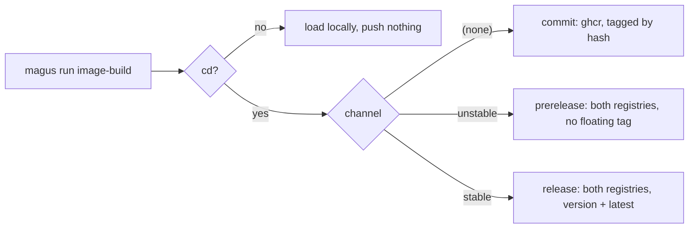

# Recommendations

magus enforces one target name (`ci`) and reserves four charms (`rw`, `cd`, `gha`, `relock`).
Everything else about your layout is yours. That leaves real questions unanswered: what to call the charm that publishes, whether two charms
may be combined, where a workspace's own error codes come from.

This page answers them the way magus's own workspace does. None of it is checked by
the tool. Where a recommendation here contradicts something magus actually enforces,
the enforcement wins and this page is the bug.

Most of it is about charms, where magus supplies a mechanism and no vocabulary at all.
For target names, see [the canonical seven](concepts/targets.md#the-target-name) and the
four tests a new one has to pass; what this page adds about them is at the end, including
the one case where it declines to recommend anything.

## A charm is an adverb

A target is the verb. A charm changes how it runs, never what runs:
`magus run build:static` is still `build`. If you find yourself wanting
`magus run publish`, the target is `build` and the charm is `cd`.

So charm names read as modifiers, not actions. `rw` is
"read-write", not "write". `cd` is "in delivery mode", not "deliver".

## A charm names a departure, never the default

The default state does not get a charm. A charm marks a deliberate step away from
what a target already does, so naming the default gives you two ways to say one
thing - and forces the bare command to mean something else.

That "something else" is almost always the riskier variant, which is how the
mistake bites. magus ships two binaries: a static one that runs anywhere, and a
dynamically linked one that needs a loader and system libzstd/liblzma.

```buzz
// Wrong: `static` names the default, so the bare target is left meaning the
// exception - and the exception is the build most likely to fail on a stranger's
// machine.
if (ctx.has_charm("static")) {
    build_release_variant(ctx, goos, goarch, false, "");
} else {
    build_release_variant(ctx, goos, goarch, true, "_dynamic");
}

// Right: the default is the unconditional branch; the charm names the departure.
if (ctx.has_charm("dynamic")) {
    build_release_variant(ctx, goos, goarch, true, "_dynamic");
} else {
    build_release_variant(ctx, goos, goarch, false, "");
}
```

The difference shows up at the command line, where it is what people actually
copy:

```sh
# Wrong: the safe artifact needs ceremony, the fragile one is what you get by
# typing the obvious thing.
magus run release-build:static    # static
magus run release-build           # dynamic: needs a loader and system libzstd/liblzma

# Right
magus run release-build           # static, runs anywhere
magus run release-build:dynamic   # opts into the loader and the system libraries
```

This target really did read `has_charm("static")`, and the cost was not
theoretical: the bare `magus run release-build` produced the dynamic build, the
one that needs a loader and system libraries, so the command someone runs without
reading handed back the artifact most likely to fail on their machine.

Two tests, both mechanical:

- If the charm's presence and absence produce the same result, the charm should
  not exist.
- If its absence produces the thing you would not recommend, the default is on
  the wrong side. Swap the branches; do not add a second charm to compensate.

## One charm answers one question

Charms are an unordered set, and magus gives none precedence over another. A
magusfile that reads two charms in sequence therefore invents a precedence the
engine does not have, and the loser is discarded silently:

```buzz
// Wrong: :amd64,arm64 returns amd64 and drops the arm64 the caller asked for.
if (ctx.has_charm("amd64")) { return "linux/amd64"; }
if (ctx.has_charm("arm64")) { return "linux/arm64"; }
```

Two charms that answer one question are a mistake worth reporting, not resolving.
Group them on an axis and reject the pair:

| axis | charms | question |
| --- | --- | --- |
| deliver | `cd` | publish the artifact, or only build it? |
| channel | `stable`, `unstable` | which stream does this land in? |
| platform | `amd64`, `arm64` | build for which architecture? |
| variant | `static` | which build of the same artifact? |

An axis with one charm is binary and needs no guard. An axis with two needs one.

Drawn as axes rather than a list of charms, magus's own `image-build` reads like this:



Every leaf is reachable, and no two charms lead to the same one. That is the shape to
aim for: if two combinations land on one leaf, one of the charms is not earning its
place.

## Name a charm for the value, not the ceremony

`stable` and `unstable` name a channel, the same vocabulary Rust
(stable/beta/nightly), Debian (stable/testing/unstable) and npm dist-tags already
use. `release` would read well too, but it is a target in this workspace, and
`magus doctor` fails a name that is both a charm and a target because
`target:charm` then reads ambiguously.

Avoid `snapshot`. It means opposite things in the two tools that popularized it -
GoReleaser's `--snapshot` builds and publishes **nothing**, while Maven's
`-SNAPSHOT` publishes to a different repository. A reader cannot know which you
meant.

Name the property, not the mechanism that produces it.

```sh
# Wrong: names how it was compiled. Only a reader who already knows Go's
# toolchain can tell what it will require at runtime - and they did not need
# telling.
magus run release-build:cgo

# Right: names what the build actually needs.
magus run release-build:dynamic
```

The same rule governs the artifacts a charm produces, because the name outlives
the command that made it. This workspace publishes
`magus_<version>_<os>_<arch>_static.tar.gz` and `:latest-dynamic`, not `-cgo`, for
exactly that reason - each name states a runtime property rather than a build flag.

## A rubric for a new charm name

Six questions, roughly in cost order. The first three eliminate most candidates,
and they are the ones worth asking before you get attached to a word.

**1. Is it a modifier, or is it an action?** A target is the verb and a charm says
in what manner, so a name that reads as something you *do* is a target wearing the
wrong suffix. `upgrade`, `publish` and `resolve` all fail here. `rw`, `static` and
`stable` pass because each describes the run rather than commanding it.

**2. Does it mean one thing everywhere your readers have been?** A charm name is
read by people arriving from other toolchains, so a word those toolchains disagree
about imports the disagreement. This is the `snapshot` rule above, and package
managers supply two more of the same kind:

| word | one meaning | the other |
| --- | --- | --- |
| `update` | advance to newer versions (`pnpm update`, `cargo update`) | refresh metadata, change nothing (`apt update`, `brew update`) |
| `lock` | rewrite the lockfile (`uv lock`) | do not touch the lockfile (`cargo --locked`) |
| `snapshot` | build and publish nothing (GoReleaser) | publish to a different repository (Maven) |

Two of these invert on you. A reader who guesses wrong does not get an error, they
get the opposite of what they wanted.

**3. Does the default already supply the contrast?** A charm only has to name the
departure, not restate the behavior. `rw` does not say what it writes or which
targets it flips, because read-only is the default and that is the whole contrast.
A name that re-explains the base behavior is longer than it needs to be.

**4. Does it collide with a target name?** `magus doctor` fails a name that is both,
because `target:charm` then reads ambiguously. This is why `release` is not the
channel charm in this workspace.

**5. What axis is it on, and does that axis need a guard?** See the axis table
above. One charm on an axis is binary and needs no guard; two need one, because the
engine gives neither precedence and the loser is discarded silently.

**6. Would it be inert almost everywhere it can be typed?** A charm useful with one
target is a tool flag with delusions. The test is not how many targets declare it
today but whether the name would mean the same thing if they did.

### Do and do not

| do not | why | do instead |
| --- | --- | --- |
| `upgrade`, `publish`, `deploy` | actions, not manners; these are targets | name the mode the run is in |
| `update`, `lock`, `snapshot` | invert in meaning between common tools | pick a word with one reading |
| `deps`, `platform`, `channel` | bare nouns read as selectors ("test the deps") rather than modes | qualify it into a modifier |
| `release`, `build`, `test` | collide with target names; doctor fails them | check the target list first |
| `fast`, `full`, `proper` | describe a feeling, not a difference a reader can predict | name the concrete difference |
| `nofrozen`, `skip-verify` | negations of a default that is already implicit | name what is granted, not what is skipped |

### A worked example: how `relock` got its name

The built-in `relock` charm went through this rubric, and the trail is more useful
than the verdict. The goal: one charm for the case where a run may rewrite dependency
state, so an ordinary build never re-resolves dependencies as a side effect.

The first instinct is that a lockfile refresh is a write, so `rw` already covers it.
Question 6 catches that: `rw` means "regenerate derived output from sources in this
tree," which is deterministic and reproducible. A dependency refresh reads a remote
registry, so running it twice a day apart gives different bytes and discarding the
result does not let you recover it by re-running. Same verb, different guarantee,
so folding it into `rw` would quietly widen what `rw` promises - and in a workspace
with `default_charms: [rw]`, it would mean unrelated builds rewrite the lockfile.

That establishes a new charm is warranted. Then the rubric runs:

- `update` dies at question 2: it advances versions in pnpm and cargo, and refreshes
  metadata in apt and brew.
- `upgrade` dies at question 1 as an action, and separately misdescribes the common
  case: pinning a transitive package *down* to dodge an advisory is not an upgrade.
- `resolve` is technically accurate, since pinning, reconciling and advancing all
  re-run the resolver, but it is still a verb, and `magus vcs resolve` already
  spends the word.
- `deps` survives 1 through 5 and stumbles on grammar: a bare noun reads as a
  selector rather than a manner.
- `relock` is what magus reserved.

`relock` is worth dwelling on, because it **fails question 1 and was chosen anyway**.
It is a verb, and a reader could reasonably want to type it as a target. That is a
real cost, accepted deliberately: it is concrete where every alternative was abstract,
and the artifact it names is the one piece of vocabulary nearly every ecosystem
already shares.

It escapes question 2 on a technicality worth knowing. Bare `lock` is disqualified
above, and rightly: `cargo --locked` means do not touch it, `uv lock` means rewrite
it. The `re-` prefix collapses that ambiguity, because "lock it again" cannot mean
"leave it alone." A prefix that removes a reading is a legitimate way to rescue an
otherwise-ambiguous word.

Two costs come with it, and neither is hidden. Go has no lockfile at all, so `relock`
is a slight metaphor over `go.mod` and `go.sum`. And magus itself ships unrelated
`.lock` files (`docs/active.urls.lock`), so the word is not unambiguous inside this
workspace either. Both were judged smaller than the guessability `relock` buys.

Question 5 settles what the candidates kept reopening. "May dependency state change?"
is one axis, and it is binary, so it takes one charm and no guard. Splitting it into
a reconcile charm and an upgrade charm would put two charms on one axis, which needs
a guard and asks every caller to know which they meant.

None of this is checked by the tool. It is written down because the reasoning is
easier to reuse than to rediscover, because two of these names looked obviously
correct right up until someone checked what they meant elsewhere, and because the
name that won broke a rule on this page. The rules are for thinking with, not for
deciding by.

## A charm that makes a claim should check it

`stable` is not a label the author gets to assert. It tells a consumer following
`latest` that this artifact is for them, so the artifact has to qualify. The check is
one semver field. Press Run:

<!-- magus-run -->
```buzz
import "std";
import "semver";

// The channel a version qualifies for. `git describe` renders an untagged commit as
// v0.4.0-3-gabc123, whose prerelease component is 3-gabc123 - so one field answers both
// "is this a prerelease" and "is this even a tagged build", and stable rejects both.
fun channelFor(v: str) > str {
    if (semver\parse(v).prerelease != "") { return "unstable"; }
    return "stable";
}

std\print("v0.4.0            -> " + channelFor("v0.4.0"));
std\print("v0.5.0-rc.1       -> " + channelFor("v0.5.0-rc.1"));
std\print("v0.4.0-3-gabc123  -> " + channelFor("v0.4.0-3-gabc123"));
```

In a magusfile the mismatch raises rather than returns, so `magus run
image-build:cd,stable` on an untagged commit fails before it pushes anything.

Check the claim or drop the charm. An unchecked one is a comment that happens to run.

## Raise your own diagnostics

A magusfile can `throw` a string, which leaves every caller substring-matching
prose. Prefer a code, which is stable and branchable:

```buzz
magus\raise("WS1001", message: "the `amd64` and `arm64` charms both answer which platform to build for");
```

```buzz
catch (e) {
    final d: magus\Diagnostic = e;
    if (d.code == "WS1001") { ... }
}
```

Pick a prefix for your workspace and keep it. `MGS` is refused: it is a closed
catalog that `magus explain`, the knowledge graph and the docs URL map all resolve
against, so a workspace code that rendered like one would document nothing. Pass
`cause:` when you are wrapping a failure so the original stays readable and
reachable, the way Go's `%w` does.

## Where this page stops

The canonical target names are worth adopting: `build`, `test`, `lint`, `format`,
`generate`, `preflight` and `clean` mean the same thing in every toolchain, which is
the test they had to pass to get in. `ci` you get either way, since magus reserves it.

Releasing is different, and this page does not recommend a shape for it. magus's own
workspace splits it into a `release` target that picks versions and cuts tags, plus
`release-build` and `release-sign` - and that split exists because this repository
publishes several independently versioned Go modules from one tree. Yours may cut one
tag, or none, or hand the whole job to a service. Everyone's release process differs
enough that a recommendation would be someone else's constraint, so what is written
above is a description of what works here, not advice.

The same caution applies to `deploy` and `serve`. They are real phases and they stay
custom on purpose, for the reason [targets.md](concepts/targets.md#when-does-a-name-earn-canonical-status)
gives: which environment, which registry, which port is workspace-specific enough that
one shape would be more prescriptive than useful.

## Read the real thing

The most useful example is the workspace that generated this page. magus builds itself,
so its magusfile is a working reference rather than a sample:

- [`magusfile.buzz`](https://github.com/egladman/magus/blob/main/magusfile.buzz) at the
  root: `image_build` and `channel()` are the two-axis model above, `publish_registries`
  is the single choke point three targets share, and `exclusive_charms` is the guard.
- [`console/magusfile.buzz`](https://github.com/egladman/magus/blob/main/console/magusfile.buzz):
  a smaller one, and a second language, if the root is too much at once.

## See also

- [Charms](concepts/charms.md): the mechanism, and what a charm can patch.
- [Targets](concepts/targets.md#the-target-name): the canonical names and the four
  tests a new one has to pass.
- [Debugging](guides/debugging.md#-step): `--step` walks a target one command at a
  time, which is how you find out what a charm actually did to the argv.
- [Tips](guides/tips.md#step-through-a-target-to-diagnose-a-volatile-build): stepping
  through a volatile build, and [the auth realm](guides/tips.md#the-auth-realm-is-not-the-push-path),
  which is the registry-vocabulary problem the channel charms sit next to.
- [GitHub Actions](guides/integrations/github-actions.md#what-belongs-in-yaml): the
  same "one question, one answer" idea applied to workflows.
