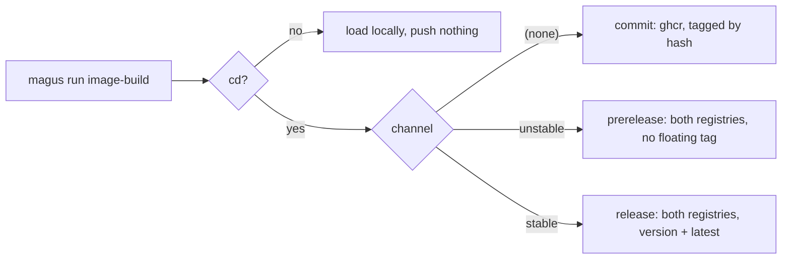

# Recommendations

magus enforces one target name (`ci`) and reserves three charms (`rw`, `cd`, `gha`).
Everything else about your layout is yours. That leaves real questions unanswered: what to call the charm that publishes, whether two charms
may be combined, where a workspace's own error codes come from.

This page answers them the way magus's own workspace does. None of it is checked by
the tool. Where a recommendation here contradicts something magus actually enforces,
the enforcement wins and this page is the bug.

Most of it is about charms, where magus supplies a mechanism and no vocabulary at all.
For target names, see [the canonical seven](concepts/targets.md#the-target-name) and the
four tests a new one has to pass; what this page adds about them is at the end, including
the one case where it declines to recommend anything.

## A charm is an adverb

A target is the verb. A charm changes how it runs, never what runs:
`magus run build:static` is still `build`. If you find yourself wanting
`magus run publish`, the target is `build` and the charm is `cd`.

So charm names read as modifiers, not actions. `rw` is
"read-write", not "write". `static` is "the static one", not "build static".

## One charm answers one question

Charms are an unordered set, and magus gives none precedence over another. A
magusfile that reads two charms in sequence therefore invents a precedence the
engine does not have, and the loser is discarded silently:

```buzz
// Wrong: :amd64,arm64 returns amd64 and drops the arm64 the caller asked for.
if (ctx.has_charm("amd64")) { return "linux/amd64"; }
if (ctx.has_charm("arm64")) { return "linux/arm64"; }
```

Two charms that answer one question are a mistake worth reporting, not resolving.
Group them on an axis and reject the pair:

| axis | charms | question |
| --- | --- | --- |
| deliver | `cd` | publish the artifact, or only build it? |
| channel | `stable`, `unstable` | which stream does this land in? |
| platform | `amd64`, `arm64` | build for which architecture? |
| variant | `static` | which build of the same artifact? |

An axis with one charm is binary and needs no guard. An axis with two needs one.

Drawn as axes rather than a list of charms, magus's own `image-build` reads like this:



Every leaf is reachable, and no two charms lead to the same one. That is the shape to
aim for: if two combinations land on one leaf, one of the charms is not earning its
place.

## Name a charm for the value, not the ceremony

`stable` and `unstable` name a channel, the same vocabulary Rust
(stable/beta/nightly), Debian (stable/testing/unstable) and npm dist-tags already
use. `release` would read well too, but it is a target in this workspace, and
`magus doctor` fails a name that is both a charm and a target because
`target:charm` then reads ambiguously.

Avoid `snapshot`. It means opposite things in the two tools that popularized it -
GoReleaser's `--snapshot` builds and publishes **nothing**, while Maven's
`-SNAPSHOT` publishes to a different repository. A reader cannot know which you
meant.

## A charm that makes a claim should check it

`stable` is not a label the author gets to assert. It tells a consumer following
`latest` that this artifact is for them, so the artifact has to qualify. The check is
one semver field. Press Run:

<!-- magus-run -->
```buzz
import "std";
import "semver";

// The channel a version qualifies for. `git describe` renders an untagged commit as
// v0.4.0-3-gabc123, whose prerelease component is 3-gabc123 - so one field answers both
// "is this a prerelease" and "is this even a tagged build", and stable rejects both.
fun channelFor(v: str) > str {
    if (semver\parse(v).prerelease != "") { return "unstable"; }
    return "stable";
}

std\print("v0.4.0            -> " + channelFor("v0.4.0"));
std\print("v0.5.0-rc.1       -> " + channelFor("v0.5.0-rc.1"));
std\print("v0.4.0-3-gabc123  -> " + channelFor("v0.4.0-3-gabc123"));
```

In a magusfile the mismatch raises rather than returns, so `magus run
image-build:cd,stable` on an untagged commit fails before it pushes anything.

Check the claim or drop the charm. An unchecked one is a comment that happens to run.

## Raise your own diagnostics

A magusfile can `throw` a string, which leaves every caller substring-matching
prose. Prefer a code, which is stable and branchable:

```buzz
magus\raise("WS1001", message: "the `amd64` and `arm64` charms both answer which platform to build for");
```

```buzz
catch (e) {
    final d: magus\Diagnostic = e;
    if (d.code == "WS1001") { ... }
}
```

Pick a prefix for your workspace and keep it. `MGS` is refused: it is a closed
catalog that `magus explain`, the knowledge graph and the docs URL map all resolve
against, so a workspace code that rendered like one would document nothing. Pass
`cause:` when you are wrapping a failure so the original stays readable and
reachable, the way Go's `%w` does.

## Where this page stops

The canonical target names are worth adopting: `build`, `test`, `lint`, `format`,
`generate`, `preflight` and `clean` mean the same thing in every toolchain, which is
the test they had to pass to get in. `ci` you get either way, since magus reserves it.

Releasing is different, and this page does not recommend a shape for it. magus's own
workspace splits it into a `release` target that picks versions and cuts tags, plus
`release-build` and `release-sign` - and that split exists because this repository
publishes several independently versioned Go modules from one tree. Yours may cut one
tag, or none, or hand the whole job to a service. Everyone's release process differs
enough that a recommendation would be someone else's constraint, so what is written
above is a description of what works here, not advice.

The same caution applies to `deploy` and `serve`. They are real phases and they stay
custom on purpose, for the reason [targets.md](concepts/targets.md#when-does-a-name-earn-canonical-status)
gives: which environment, which registry, which port is workspace-specific enough that
one shape would be more prescriptive than useful.

## Read the real thing

The most useful example is the workspace that generated this page. magus builds itself,
so its magusfile is a working reference rather than a sample:

- [`magusfile.buzz`](https://github.com/egladman/magus/blob/main/magusfile.buzz) at the
  root: `image_build` and `channel()` are the two-axis model above, `publish_registries`
  is the single choke point three targets share, and `exclusive_charms` is the guard.
- [`console/magusfile.buzz`](https://github.com/egladman/magus/blob/main/console/magusfile.buzz):
  a smaller one, and a second language, if the root is too much at once.

## See also

- [Charms](concepts/charms.md): the mechanism, and what a charm can patch.
- [Targets](concepts/targets.md#the-target-name): the canonical names and the four
  tests a new one has to pass.
- [Debugging](guides/debugging.md#-step): `--step` walks a target one command at a
  time, which is how you find out what a charm actually did to the argv.
- [Tips](guides/tips.md#step-through-a-target-to-diagnose-a-volatile-build): stepping
  through a volatile build, and [the auth realm](guides/tips.md#the-auth-realm-is-not-the-push-path),
  which is the registry-vocabulary problem the channel charms sit next to.
- [GitHub Actions](guides/integrations/github-actions.md#what-belongs-in-yaml): the
  same "one question, one answer" idea applied to workflows.
