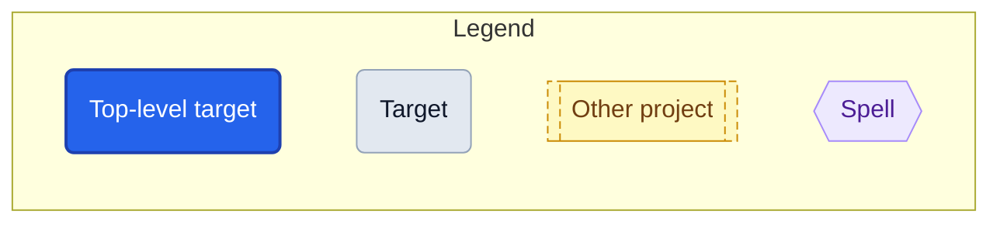
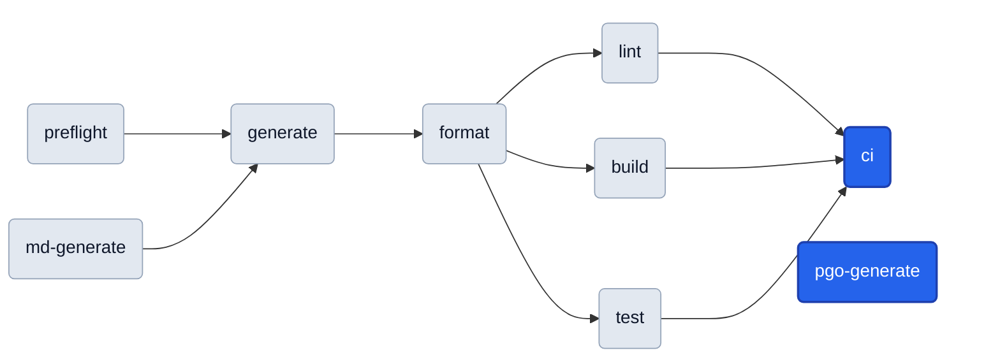
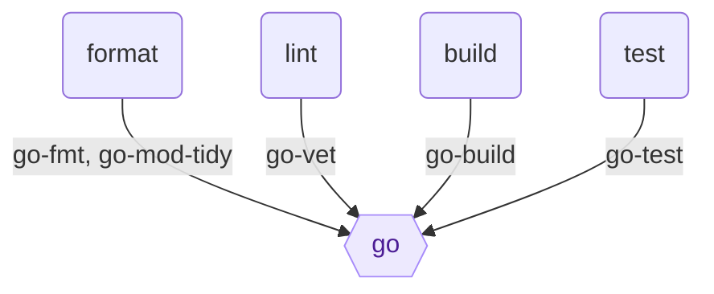

# Targets

<!-- Generated by `magus describe graph -o markdown`. Do not edit by hand. -->

A **target** is a named operation (build, test, lint, …) declared as an `export fun` in a project's magusfile. This cheat sheet (the per-target catalog and run-order graph below) is extracted statically from the magusfile source, so it stays in lockstep with how the project actually builds.

## Quick start

```sh
magus run <target>            # from inside the project directory
magus run <target> <path>     # from anywhere in the workspace
magus run <target>:<charm>    # change HOW it runs (e.g. lint:rw)
```

Unfamiliar with a term? See the [Glossary](#glossary).

## Reading the graphs



- Every rounded box is a **target** you can `magus run`. **Blue** is a top-level target (nothing else depends on it — a typical entry point); **gray** ones are pulled in as dependencies.
- Arrows show **run order**: a target's dependencies run before it, so the graph flows left → right (e.g. `preflight` runs first, `ci` last).
- A dotted arrow marks a **cross-project dependency** (the other project's target runs first).
- Each project's **Toolchain** graph (top-down) shows which **spell** each target drives.

## Project: magus/gopherbuzz

<details>
<summary><b>Shared defaults</b>: inputs, outputs &amp; spells shared by every target in <code>magus/gopherbuzz</code></summary>

```text
sources  **/*.go, go.mod, go.sum, go.work, go.work.sum, magusfile.buzz, magusfiles/**/*.buzz
outputs  MAGUS.md
spells   magusfile, go
```

</details>

**Run order**



**Toolchain**

Which spell each target drives; edge labels are the tool-native operations.



### `generate`

generate regenerates MAGUS.md and gates on drift, mirroring the root project: a cache hit would skip the check, so it runs every time.

**Defaults**

```sh
magus run generate    # from the project directory
magus run generate .  # from the workspace root
```

**Charms**

```sh
magus run generate:rw  # mutate in place instead of checking
```

**Depends on:**

- [`preflight`](#preflight)
- [`md-generate`](#md-generate)

**Details:** uncached (always runs) · isolated (runs alone, no concurrent targets)

### `format`

**Defaults**

```sh
magus run format    # from the project directory
magus run format .  # from the workspace root
```

**Depends on:**

- [`generate`](#generate)

### `lint`

**Defaults**

```sh
magus run lint    # from the project directory
magus run lint .  # from the workspace root
```

**Depends on:**

- [`format`](#format)

### `build`

**Defaults**

```sh
magus run build    # from the project directory
magus run build .  # from the workspace root
```

**Depends on:**

- [`format`](#format)

### `test`

**Defaults**

```sh
magus run test    # from the project directory
magus run test .  # from the workspace root
```

**Depends on:**

- [`format`](#format)

### `ci`

'ci' is the conventional anchor `magus affected ci` keys off; it fans out lint/build/test in parallel, each waiting on format.

**Defaults**

```sh
magus run ci    # from the project directory
magus run ci .  # from the workspace root
```

**Depends on:**

- [`lint`](#lint)
- [`build`](#build)
- [`test`](#test)

### `pgo-generate`

Regenerate default.pgo — the profile-guided optimization profile for the Buzz VM.

**Defaults**

```sh
magus run pgo-generate    # from the project directory
magus run pgo-generate .  # from the workspace root
```

**Details:** uncached (always runs)

### `preflight`

**Defaults**

```sh
magus run preflight    # from the project directory
magus run preflight .  # from the workspace root
```

### `md-generate`

md-generate renders MAGUS.md (the target catalog + dependency graph) via `magus describe graph`, parsed statically from this magusfile so it stays in lockstep with the project's targets.

**Defaults**

```sh
magus run md-generate    # from the project directory
magus run md-generate .  # from the workspace root
```

## Glossary

- **Workspace**: the magus root directory that owns a set of projects and shared config; the unit magus operates over.
- **Project**: a directory magus recognized as a unit of work (it has a magusfile); the unit of caching, scheduling, and dependency tracking.
- **Magusfile**: the `magusfile.buzz` that declares a project's targets (as `export fun`s) and binds its spells.
- **Target**: a named operation (`build`, `test`, …) you invoke with `magus run <target>`; it may compose a spell's tool-native operations and depend on other targets.
- **Spell**: a language/runtime adapter (e.g. `go`, `md`) that maps generic targets onto a toolchain's real commands.
- **Charm**: an execution modifier attached with `:` (`lint:rw`) that changes _how_ a target runs, not _which_ one; the built-in `rw` flips a check-only target to mutate in place, and `ci` always strips it.
- **Module**: a magus stdlib namespace a magusfile imports for host capabilities: filesystem, exec, vcs, and more.
- **Buzz**: the language magusfiles are written in (the `.buzz` engine).
