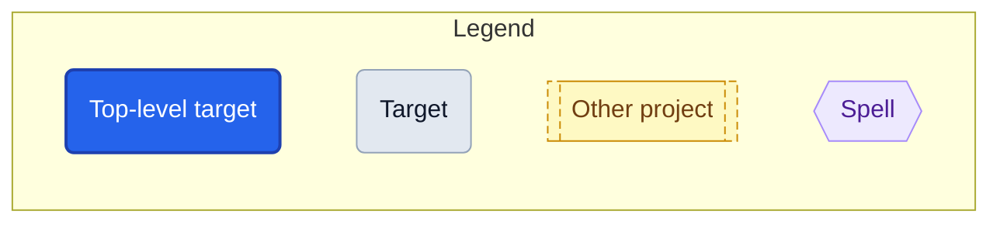
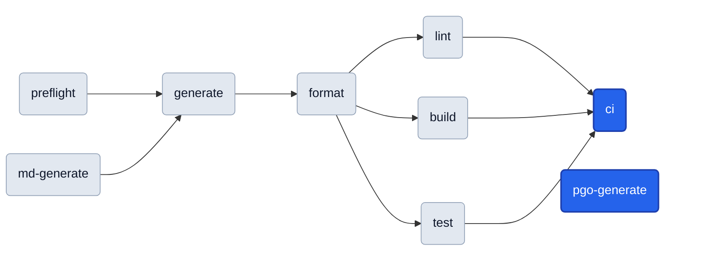
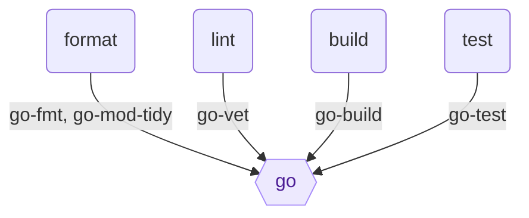

# Targets

<!-- Generated by `magus describe graph -o markdown`. Do not edit by hand. -->

A **target** is a named operation (build, test, lint, …) declared as an `export fun` in a project's magusfile. This cheat sheet (the per-target catalog and run-order graph below) is extracted statically from the magusfile source, so it stays in lockstep with how the project actually builds.

## Quick start

```sh
magus run <target>          # from inside the project directory
magus run <target> <path>   # from anywhere in the workspace
magus run <target>:<charm>  # change HOW it runs (e.g. lint:rw)
```

Unfamiliar with a term? See the [Glossary](https://eli.gladman.cc/magus/glossary/).

## Query first

This workspace has a knowledge graph of **936 nodes** and **1499 edges** (schema v1). Query it instead of grepping:

```sh
magus query "<terms>"       # kind:spell, project:pkg/foo, relation:uses, free text, -negation
magus explain <node>        # one node: its edges, provenance, blast radius
magus path <a> <b>          # how two nodes connect
magus graph stats           # god nodes, orphans, doc coverage (MCP: magus_stats)
magus graph export -o json  # the whole graph (MCP: magus_query, magus_explain, magus_path)
```

| Kind | Count | List them | Anchors (most connected) |
|---|--:|---|---|
| project | 1 | `magus query kind:project` | `.` |
| target | 9 | `magus query kind:target` | `format`, `generate`, `build` |
| spell | 11 | `magus query kind:spell` | `go`, `buf`, `py` |
| op | 43 | `magus query kind:op` | `go-build`, `go-fmt`, `go-mod-tidy` |
| charm | 1 | `magus query kind:charm` | `rw` |
| module | 22 | `magus query kind:module` | `fs`, `charm`, `env` |
| method | 148 | `magus query kind:method` | `archive.compress`, `archive.uncompress`, `charm.after` |
| diagnostic | 23 | `magus query kind:diagnostic` | `MGS1001`, `MGS1002`, `MGS2001` |
| doc | 3 | `magus query kind:doc` | `MAGUS.md`, `README.md`, `docs/ffi.md` |
| file | 59 | `magus query kind:file` | `examples/bubblegum/config.buzz`, `examples/bubblegum/platform/macos/cocoa.buzz`, `examples/bubblegum/core/command.buzz` |
| function | 557 | `magus query kind:function` | `sel`, `sendObject`, `send` |
| import | 59 | `magus query kind:import` | `std`, `state`, `os` |

| Project | Targets | Scope a query | Key targets |
|---|--:|---|---|
| . | 9 | `magus query project:.` | `format`, `generate`, `build` |

## Reading the graphs



- Every rounded box is a **target** you can `magus run`. **Blue** is a top-level target (nothing else depends on it — a typical entry point); **gray** ones are pulled in as dependencies.
- Arrows show **run order**: a target's dependencies run before it, so the graph flows left → right (e.g. `preflight` runs first, `ci` last).
- A dotted arrow marks a **cross-project dependency** (the other project's target runs first).
- Each project's **Toolchain** graph (top-down) shows which **spell** each target drives.

## Project: gopherbuzz

<details>
<summary><b>Shared defaults</b>: inputs, outputs &amp; spells shared by every target in <code>gopherbuzz</code></summary>

```text
sources  **/*.go, go.mod, go.sum, go.work, go.work.sum, magusfile.buzz, magusfiles/**/*.buzz
outputs  MAGUS.md
spells   magusfile, go
```

</details>

**Run order**



**Toolchain**

Which spell each target drives; edge labels are the tool-native operations.



### `generate`

Regenerates MAGUS.md and fails on drift.

**Defaults**

```sh
magus run generate  # from the workspace root
```

**Charms**

```sh
magus run generate:rw  # mutate in place instead of checking
```

**Depends on:**

- [`preflight`](#preflight)
- [`md-generate`](#md-generate)

**Details:** uncached (always runs) · exclusive (runs alone, no concurrent targets)

### `format`

**Defaults**

```sh
magus run format  # from the workspace root
```

**Depends on:**

- [`generate`](#generate)

### `lint`

**Defaults**

```sh
magus run lint  # from the workspace root
```

**Depends on:**

- [`format`](#format)

### `build`

**Defaults**

```sh
magus run build  # from the workspace root
```

**Depends on:**

- [`format`](#format)

### `test`

**Defaults**

```sh
magus run test  # from the workspace root
```

**Depends on:**

- [`format`](#format)

### `ci`

The anchor `magus affected ci` keys off; fans out lint/build/test after format.

**Defaults**

```sh
magus run ci  # from the workspace root
```

**Depends on:**

- [`lint`](#lint)
- [`build`](#build)
- [`test`](#test)

### `pgo-generate`

Regenerates default.pgo, the Buzz VM's PGO profile.

**Defaults**

```sh
magus run pgo-generate  # from the workspace root
```

**Details:** uncached (always runs)

### `preflight`

**Defaults**

```sh
magus run preflight  # from the workspace root
```

### `md-generate`

Renders MAGUS.md (target catalog plus graph) from this magusfile.

**Defaults**

```sh
magus run md-generate  # from the workspace root
```
