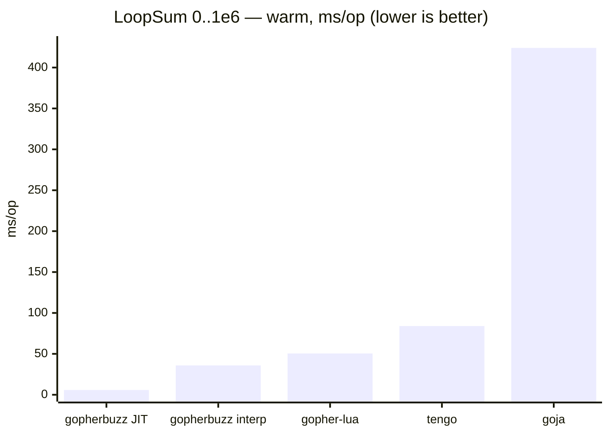
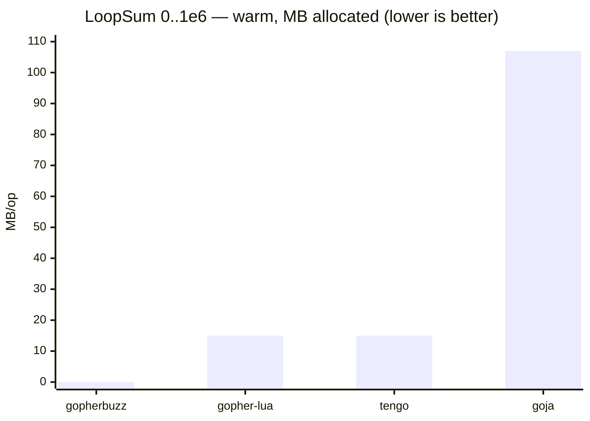

# gopherbuzz

A pure-Go bytecode VM for the [Buzz](https://buzz-lang.dev/0.5.0/) scripting
language with JIT support.

- Reference: <https://buzz-lang.dev/0.5.0/reference/>
- Hot-path notes: [Performance design](#performance-design) · JIT: [Baseline JIT](#baseline-jit)

## Performance

A pure-Go VM with a baseline JIT — no cgo, no toolchain. Its standout case is a
tight top-level numeric loop (`LoopSum`, sum `0..1e6`) — the one shape the JIT
compiles. Both gopherbuzz bars below are the **same VM**, JIT on vs. off, so the
chart shows what the JIT adds *and* what the interpreter does without it:





On this loop gopherbuzz leads on both axes: ~6× its own interpreter and ~9×
gopher-lua via the JIT, and — because the NaN-boxed `[]uint64` stack has no
GC-visible pointers — steady-state allocation is effectively zero.

**`LoopSum` is the flattering workload, and the JIT's only wheelhouse —
everywhere else gopherbuzz runs the interpreter.** There it wins the lighter
scripting microbenchmarks (loops, calls, `fib`, collection iteration) but
**loses every heavy compute kernel on raw time**: Mandelbrot and MatMul to
gopher-lua, BinaryTrees and NBody to tengo, and string building to gopher-lua.
Its allocation stays well under the dynamically typed peers across the board, but
it's "kilobytes" only on the lean workloads — collection- and string-heavy ones
reach single-digit MB. The full win-and-lose matrix — 10 workloads, warm + fresh,
plus an opt-in LuaJIT / Umka / wazero tier that is faster still — lives in
[`benchmarks/`](benchmarks/), kept deliberately honest.

benchstat median, amd64 Xeon @ 2.80 GHz, Go 1.25; cross-language microbenchmarks
differ in semantics (types, safety, GC) — read as order-of-magnitude, not a
verdict.

Reproduce:

```sh
go test -run='^$' -bench=. -benchmem ./...                # in-tree (BUZZ_JIT=0 for interp)
cd benchmarks/comparison && GOWORK=off go test -bench=. . # cross-language
```

## Why this matters

gopherbuzz is the interpreter behind **magus**, and magus has exactly one job:
fan out across a workspace, run the tasks, and get out of the way. Two
constraints fall out of that, and they're why this VM exists at all:

- **No second toolchain.** magus is a single static Go binary that cross-compiles
  cleanly and runs anywhere `go` does — no cgo, no C library, nothing to install
  first. The moment the magusfile language reached for a faster engine that
  needed a C toolchain (the [extended tier](benchmarks/comparison/) — LuaJIT,
  Umka — makes the speed on offer explicit), magus would forfeit that promise. So
  the engine has to be **pure Go**. That rules out the fastest options in the
  comparison and makes a fast *pure-Go* VM the only door, not a preference.
- **It's on every task's critical path.** The VM evaluates the `magusfile.bzz`
  and the host-call glue for every target, on every run, before any real work
  starts — and again as the fan-out widens. If it's slow or allocation-heavy,
  that cost is paid over and over and lands as latency and GC pressure sitting
  between you and your build. "Get out of the way" only holds if the layer doing
  the dispatching is itself too cheap to notice.

That's the whole bar: **be invisible.** The benchmarks above are deliberately
heavy stress loops (a million iterations, recursion to `fib(30)`); a real
`magusfile.bzz` is orders of magnitude smaller, so the VM's slice of any run sits
far below them — well under the cost of the work it's dispatching. Fast and lean
on the stress tests is the headroom that makes it negligible in practice.

And yes — we're well into diminishing returns now. Shaving another few percent off
the hot path won't change anyone's day, and the [perf design notes](#performance-design)
exist mostly to stop a future change from *regressing* what's here. The point was
never to win microbenchmarks; it was to make the interpreter cheap enough that
magus can treat it as free — without reaching for a second toolchain to get there.
It was a fun exercise besides.

## Building

```sh
go build ./...
go test ./...
```

No cgo, no external toolchain. Pure-Go deps:
[`purego`](https://github.com/ebitengine/purego) (`zdef()` FFI) and
[`golang-asm`](https://github.com/twitchyliquid64/golang-asm) (JIT codegen, amd64).

`default.pgo` is applied automatically by Go 1.21+ when building from this dir;
regenerate with `magus run regen-pgo gopherbuzz` after hot-path changes (a stale
profile is neutral). After bumping `BytecodeVersion`, run `go generate` in
`../internal/spell` to rebuild the embedded spell bytecode.

## Build tags

Three mutually exclusive `Value` representations; one is compiled at a time.

| Tag | `Value` | Use |
|---|---|---|
| _(none)_ | 8-byte NaN-box + handle table | **default production build** |
| `buzz_safe` | 24-byte interface + assertion, bounds-checked | CI / differential testing |
| `buzz_unsafe` | 24-byte pointer struct | legacy baseline |

The default build has **zero GC write barriers** on the push/arith/pop path (the
operand stack is `[]uint64`). `buzz_safe` is behaviorally identical and slower —
it lets CI validate the fast build. The [JIT](#baseline-jit) is built with the
default rep on amd64 and arm64; every other config (safe/unsafe, other arches,
wasm) uses a no-op stub.

```sh
go test -tags buzz_safe ./...
go test -tags buzz_unsafe ./...
```

## WebAssembly

The core is pure Go with no cgo, so it cross-compiles to wasm unmodified
(`zdef()` returns "unsupported"; the JIT uses its stub). `wasm/main.go` (guarded
by `//go:build wasm`) reads a program from stdin and prints a trailing `return`:

```sh
tinygo build -target=wasi -o buzz.wasm ./wasm        # ~1.6 MB; default scheduler (fibers use goroutines)
GOOS=wasip1 GOARCH=wasm go build -o buzz.wasm ./wasm # ~4 MB, no extra toolchain
echo 'return (1 + 2) * 10;' | wasmtime buzz.wasm     # 30
```

Both `wasip1/wasm` and `js/wasm` build. This makes gopherbuzz (to our knowledge
the first Go implementation of Buzz) run **in the browser** — the magus docs
site's Buzz playground (`magus/cmd/buzz-playground` over `magus/internal/playground`)
evaluates Buzz live and dry-runs a `magusfile.bzz`, with host calls recorded.

## Architecture

```
source → Parse → ast.Program → Checker → Compiler (FoldConsts → FusePeephole)
       → Chunk (bytecode) → VM.Exec (register-window stack) → Value
```

- **`Instr`** `{Op uint8, A, B int32}` — word-coded, pointer-free, in a contiguous slice, fetched without bounds checks on the hot path.
- **`Value`** — 8-byte NaN-boxed word. Immediates (int/float/bool/null) live in the payload; heap objects are indices into a per-VM handle table, so the operand stack is `[]uint64` with no GC-visible pointers.

## Baseline JIT

On **amd64**, a hot top-level chunk whose body is the numeric loop/arithmetic
opcode subset is compiled to native code, deleting interpreter dispatch. On by
default; disable with `BUZZ_JIT=0` or `vm.SetJIT(false)`.

- The pointerless `[]uint64` stack lets native code run with no GC cooperation; every value sits at a static slot offset at each opcode boundary, so interpreter state is always materialized.
- Each op has an int and a double (SSE) fast path. Anything else — mixed
  int/float, a non-number via `any`, NaN, float ÷0/`%` — **deopts** to the interpreter at the recorded ip; unsupported ops (calls, members, strings) make the chunk ineligible. The interpreter is the oracle, so the JIT is never wrong.
- Loop back-edges poll cancellation every 256 iterations (one predicted branch).

Codegen uses [`golang-asm`](https://github.com/twitchyliquid64/golang-asm): same machine code (so same runtime speed) as a hand emitter, but toolchain-verified.
Only the trampolines (`vm/jit_<arch>.s`) are hand asm. Not yet JIT'd: calls,
non-top-level frames, strings.

## Performance design

The interpreter's throughput rests on a few load-bearing tricks. Before touching
the hot path, baseline with `benchstat` over `-bench=. -count=10` and re-check
under `buzz_safe`.

- **`Exec` is I-cache-bound** (~50 KB single `switch`). Adding a new full `case`
  regresses *all* benchmarks 25–55%. Add small branches inside existing handlers,
  or move cold code to `//go:noinline` helpers — never a new case body.
- **Superinstructions** (`FusePeephole`): `OpLocalConstOp`, `OpLocalLocalOp`,
  `OpForCondLC` fuse the dominant `GetLocal/LoadConst/<op>/JumpFalse` patterns.
- **SetLocal absorption**: fused ops peek ahead and write `x = x op y` straight
  to the slot.
- **Static int proof**: bit 31 of a fused op's `B` means "both operands proven
  int" (drops the tag checks); sub-opcode is masked `& 0x7F` / `& 0x7FFF`. Sound
  because `OpCheckType` guards every `any → int` narrowing.
- **Inline caches**: per-VM `mcache` (member access) and field-slot hints
  (`OpGetField`/`OpSetField`) — pointer/index compares, no string scan. Per-VM,
  not per-Chunk (chunks are shared; verified `-race`).
- **NaN-box + handle table**: zero write barriers on push/pop; the table pins
  objects for the VM's life (fine for short per-target sessions).

## Bytecode version

Bump `vm.BytecodeVersion` (in `vm/marshal.go`) when opcode numbering, the
`Instr`/`Chunk`/`UpvalInfo` layout, the fused-op encoding, or the serializable
`Value`/AST set changes.

## Contributing gotchas

1. No new `Exec` case bodies (I-cache — see above).
2. Value changes must pass under all three build tags (CI runs default + `buzz_safe`; spot-check `buzz_unsafe`).
3. Fused-op sub-opcode masking (`& 0x7F` / `& 0x7FFF`) must track any new flag bits, in both `chunk.go` and the VM handlers.
4. `slotTypeInt = 1` (vm `chunk.go`) mirrors `buzz.sInt` so they must be kept in sync.
5. `mcache`/`ncache` are per-VM, never per-Chunk (chunks are shared).
6. Re-check escapes with `go build -gcflags='-m=2' ./vm/` after hot-path changes.
