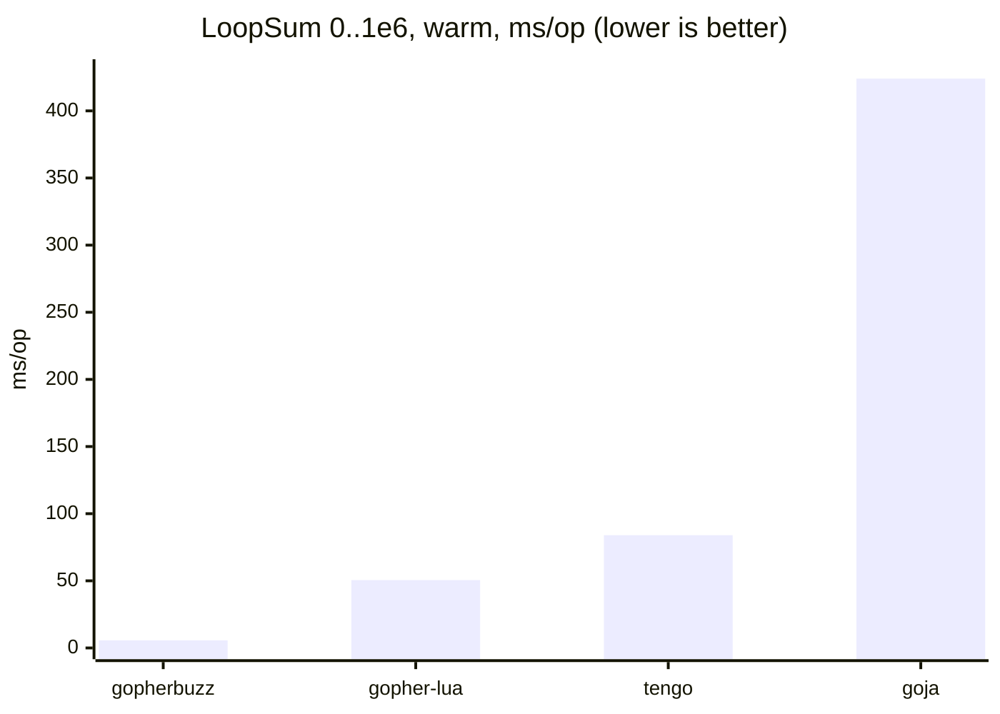
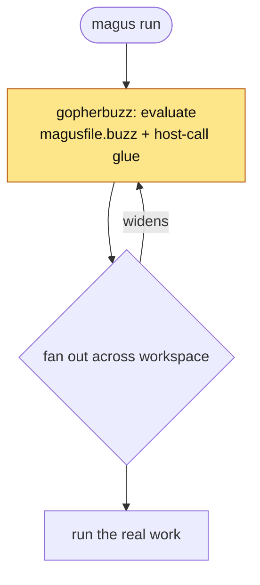
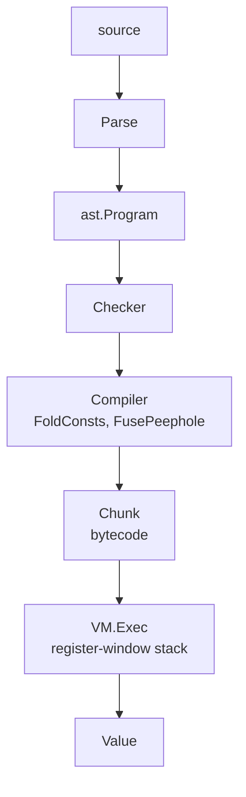

# gopherbuzz

A pure-Go bytecode VM for the [Buzz](https://buzz-lang.dev/) scripting
language with JIT support. It targets Buzz 0.6.0-dev, tracking upstream
`buzz-language/buzz` `main` at the commit pinned in [`version.go`](version.go)
(`UpstreamRef`); the released 0.5.0 baseline stays compatible.

- Reference: <https://buzz-lang.dev/0.5.0/reference/> (latest published; 0.6.0 is unreleased)
- Hot-path notes: [Performance design](#performance-design) · JIT: [Baseline JIT](#baseline-jit)

## Performance

A pure-Go VM with a baseline JIT: no cgo, no toolchain. Its standout case is a
tight top-level numeric loop (`LoopSum`, sum `0..1e6`), one shape the JIT
compiles to native code (it also compiles the nested float loops of the
Mandelbrot kernel; see [`benchmarks/`](benchmarks/)):



That 5.7 ms is the JIT engaged; the same VM with the JIT off runs the loop in
40.6 ms, still ahead of the others, but the native-code path is the headline.
Allocation is effectively zero either way: the NaN-boxed `[]uint64` stack has no
GC-visible pointers.

**The JIT compiles top-level numeric loops to native code; everything else runs
on the interpreter.** Its wheelhouse now covers both `LoopSum` and the
`Mandelbrot` kernel. The baseline JIT learned the `and` short-circuit and
int→float promotion, so Mandelbrot's nested float loop compiles to native SSE and
runs in ~26 ms, an ~9× lead over gopher-lua's 246 ms. On the interpreter
gopherbuzz wins the lighter scripting microbenchmarks (loops, calls, `fib`,
collection iteration) and, with the float fast path in the arithmetic dispatch,
is competitive on the heavy compute kernels: it trails gopher-lua on un-JIT'd
MatMul, draws level with tengo on BinaryTrees and with gopher-lua on NBody, and
string building still goes to gopher-lua. Allocation stays well under
the dynamically typed peers throughout: kilobytes on lean workloads, and
map/list iteration is allocation-free (`foreach` reuses a per-slot iterator);
only string building reaches low single-digit MB. The full win-and-lose
matrix (10 workloads, warm + fresh, plus an opt-in LuaJIT / Umka tier that is
faster still) lives in [`benchmarks/`](benchmarks/), kept deliberately honest.

benchstat median, Go 1.25; gopherbuzz re-measured on an amd64 Xeon @ 2.10 GHz,
the comparison engines on an amd64 Xeon @ 2.80 GHz (so the gap is conservative).
Cross-language microbenchmarks differ in semantics (types, safety, GC), so read
as order-of-magnitude, not a verdict.

Reproduce:

```sh
go test -run='^$' -bench=. -benchmem ./...                # in-tree (BUZZ_JIT=0 for interp)
cd benchmarks/comparison && GOWORK=off go test -bench=. . # cross-language
```

## Why this matters

gopherbuzz is the interpreter behind **magus**, which fans out across a
workspace and runs the tasks. The VM sits on the critical path of that flow,
before any real work starts:



Two constraints follow:

- **No second toolchain.** magus is a single static Go binary: no cgo, no C
  library, nothing to install. A faster engine that requires a C toolchain (the
  [extended tier](benchmarks/comparison/): LuaJIT, Umka) would forfeit that, so
  the engine has to be **pure Go**.
- **It's on every task's critical path.** The VM evaluates `magusfile.buzz` and
  the host-call glue on every run, and again as the fan-out widens. A slow or
  allocation-heavy layer pays that cost as latency and GC pressure on every build.

The goal is for the VM to stay invisible. The benchmarks above are deliberately
heavy stress loops; a real `magusfile.buzz` is orders of magnitude smaller, so
the VM's slice of any run sits well below the work it dispatches. Returns are
diminishing now, and the [perf design notes](#performance-design) mostly
exist to stop a future change from regressing what's here. The aim is to make
the interpreter cheap enough that magus can treat it as free, without reaching
for a second toolchain to get there.

## Building

```sh
go build ./...
go test ./...
```

No cgo, no external toolchain. Pure-Go deps:
[`purego`](https://github.com/ebitengine/purego) (`zdef()` FFI) and
[`golang-asm`](https://github.com/twitchyliquid64/golang-asm) (JIT codegen, amd64).

`default.pgo` is applied automatically by Go 1.21+ when building from this dir;
regenerate with `magus run pgo-generate gopherbuzz` after hot-path changes (a stale
profile is neutral). After bumping `BytecodeVersion`, run `go generate` in
[`../internal/spell`](../internal/spell) to rebuild the embedded spell bytecode.

## CLI

`cmd/buzz` is a standalone runner mirroring the upstream `buzz` CLI, built on the
Go standard library alone (no third-party CLI framework):

```sh
go run ./cmd/buzz script.buzz          # run a file
echo 'return 1 + 2;' | go run ./cmd/buzz -   # run stdin
go run ./cmd/buzz -e 'import "std"; std.print("hi");'
go run ./cmd/buzz -c script.buzz       # type-check only
go run ./cmd/buzz -t script.buzz       # run its test "..." {} blocks
go run ./cmd/buzz --ast script.buzz    # dump the AST as JSON
go run ./cmd/buzz -L ./lib m.buzz      # add an import search path
```

The Buzz standard library is available; magus host bindings are not (use
`magus buzz` / `magus repl --engine buzz` for those).

## Testing

Upstream Buzz's `test "name" { … }` blocks are supported. A block runs only under
`buzz -t` / `--test`; a normal run skips it. A block fails when its body raises,
typically a `std.assert` that did not hold:

```buzz
import "std";

test "addition" {
    std.assert(1 + 1 == 2, "math broke");
}
```

```sh
go run ./cmd/buzz -t mytests.buzz
# ok    test "addition"
# ---
# 1 passed, 0 failed
```

**Named arguments:** upstream Buzz labels call arguments (`f(a: 1, b: 2)`)
and requires the labels on multi-argument calls. gopherbuzz accepts them as a
superset: labels resolve against the callee's parameter names at check time
(any order; positional arguments first), while unlabeled calls keep working.
For dynamically typed callees (host functions, `any` values) labels cannot be
verified and arguments pass in written order. After label resolution,
arguments evaluate in parameter order.

**Deliberate divergence:** upstream hard-reserves `test` as a keyword; gopherbuzz
treats it as a _contextual_ soft keyword. `test` introduces a block only in the
`test "…" {` position and stays a normal identifier elsewhere. This runs every
upstream test block verbatim while keeping `test` usable as an identifier, which
the magus embedding needs (`export fun test` is a common target). It is therefore
a strict superset of upstream, the same "match capabilities, diverge only where a
Go embedding forces it" stance taken for [FFI](docs/ffi.md).

## Build tags

Three mutually exclusive `Value` representations; one is compiled at a time.

| Tag           | `Value`                                       | Use                          |
| ------------- | --------------------------------------------- | ---------------------------- |
| _(none)_      | 8-byte NaN-box + handle table                 | **default production build** |
| `buzz_safe`   | 24-byte interface + assertion, bounds-checked | CI / differential testing    |
| `buzz_unsafe` | 24-byte pointer struct                        | legacy baseline              |

The default build has **zero GC write barriers** on the push/arith/pop path (the
operand stack is `[]uint64`). `buzz_safe` is behaviorally identical and slower,
which lets CI validate the fast build. The [JIT](#baseline-jit) is built with the
default rep on amd64 and arm64; every other config (safe/unsafe, other arches,
wasm) uses a no-op stub.

```sh
go test -tags buzz_safe ./...
go test -tags buzz_unsafe ./...
```

## FFI (calling C)

`zdef()` binds functions (and data symbols like `kCFBooleanTrue`) from a C
shared library at runtime, accepting both upstream-Buzz Zig declarations
(`fn sqrt(x: f64) f64;`) and C prototypes, via
[`purego`](https://github.com/ebitengine/purego), with no cgo and no build-time
toolchain. The `ffi` module adds C-ABI type metadata and a pinned-memory API so
scripts can drive the common patterns: scalar calls, pointer out-parameters,
by-reference structs, and callbacks.

```buzz
import "ffi";
final lib = zdef("libm", "double sqrt(double x);");
final r = lib.sqrt(9.0);                 // 3.0
```

Unlike upstream Buzz (whose FFI is Zig-ABI native and needs an embedded Zig
compiler), gopherbuzz is C-ABI native: `zdef` takes C prototypes and `ffi.sizeOf`
& friends take C type-name strings. Parsing works on every target; binding works
where purego does, and returns a clear "unsupported" error elsewhere (e.g. wasm).

Full reference: [`docs/ffi.md`](docs/ffi.md) · runnable demo:
[`examples/ffi-c/`](examples/ffi-c/) (`go run .`) · a larger showcase:
[`examples/bubblegum/`](examples/bubblegum/), an i3-flavored macOS tiling
window manager written in pure Buzz on this FFI.

## WebAssembly

The core is pure Go with no cgo, so it cross-compiles to wasm unmodified
(`zdef()` returns "unsupported"; the JIT uses its stub). `wasm/main.go` (guarded
by `//go:build wasm`) reads a program from stdin and prints a trailing `return`:

```sh
tinygo build -target=wasi -o buzz.wasm ./wasm        # ~1.6 MB; default scheduler (fibers use goroutines)
GOOS=wasip1 GOARCH=wasm go build -o buzz.wasm ./wasm # ~4 MB, no extra toolchain
echo 'return (1 + 2) * 10;' | wasmtime buzz.wasm     # 30
```

Both `wasip1/wasm` and `js/wasm` build. This makes gopherbuzz (to our knowledge
the first Go implementation of Buzz) run **in the browser**: the [magus](..) docs
site's Buzz playground ([`cmd/buzz-playground`](../cmd/buzz-playground) over
[`internal/playground`](../internal/playground)) evaluates Buzz live and
dry-runs a `magusfile.buzz`, with host calls recorded.

## Architecture



- **`Instr`** `{Op uint8, A, B int32}`: word-coded, pointer-free, in a contiguous slice, fetched without bounds checks on the hot path.
- **`Value`**: 8-byte NaN-boxed word. Immediates (int/float/bool/null) live in the payload; heap objects are indices into a per-VM handle table, so the operand stack is `[]uint64` with no GC-visible pointers.

## Baseline JIT

On **amd64**, a hot top-level chunk whose body is the numeric loop/arithmetic
opcode subset is compiled to native code, deleting interpreter dispatch. On by
default; disable with `BUZZ_JIT=0` or `vm.SetJIT(false)`.

- The pointerless `[]uint64` stack lets native code run with no GC cooperation; every value sits at a static slot offset at each opcode boundary, so interpreter state is always materialized.
- Each op has an int and a double (SSE) fast path. Anything else (mixed
  int/float, a non-number via `any`, NaN, float ÷0/`%`) **deopts** to the interpreter at the recorded ip; unsupported ops (calls, members, strings) make the chunk ineligible. The interpreter is the oracle, so the JIT is never wrong.
- Loop back-edges poll cancellation every 256 iterations (one predicted branch).

Codegen uses [`golang-asm`](https://github.com/twitchyliquid64/golang-asm): same machine code (so same runtime speed) as a hand emitter, but toolchain-verified.
Only the trampolines (`vm/jit_<arch>.s`) are hand asm. Not yet JIT'd: calls,
non-top-level frames, strings.

## Performance design

The interpreter's throughput rests on a few load-bearing tricks. Before touching
the hot path, baseline with `benchstat` over `-bench=. -count=10` and re-check
under `buzz_safe`.

- **`Exec` is I-cache-bound** (~50 KB single `switch`). Adding a new full `case`
  regresses _all_ benchmarks 25-55%. Add small branches inside existing handlers,
  or move cold code to `//go:noinline` helpers, never a new case body.
- **Superinstructions** (`FusePeephole`): `OpBinLC`, `OpBinLL`,
  `OpCmpLC` fuse the dominant `GetLocal/LoadConst/<op>/JumpFalse` patterns.
- **SetLocal absorption**: fused ops peek ahead and write `x = x op y` straight
  to the slot.
- **Static int proof**: bit 31 of a fused op's `B` means "both operands proven
  int" (drops the tag checks); sub-opcode is masked `& 0x7F` / `& 0x7FFF`. Sound
  because `OpCheckType` guards every `any → int` narrowing.
- **Inline caches**: per-VM `mcache` (member access) and field-slot hints
  (`OpGetField`/`OpSetField`): pointer/index compares, no string scan. Per-VM,
  not per-Chunk (chunks are shared; verified `-race`).
- **NaN-box + handle table**: zero write barriers on push/pop; the table pins
  objects for the VM's life (fine for short per-target sessions).

## Bytecode version

Bump `vm.BytecodeVersion` (in `vm/marshal.go`) when opcode numbering, the
`Instr`/`Chunk`/`UpvalInfo` layout, the fused-op encoding, or the serializable
`Value`/AST set changes.

## Contributing gotchas

1. No new `Exec` case bodies (I-cache; see above).
2. Value changes must pass under all three build tags (CI runs default + `buzz_safe`; spot-check `buzz_unsafe`).
3. Fused-op sub-opcode masking (`& 0x7F` / `& 0x7FFF`) must track any new flag bits, in both `chunk.go` and the VM handlers.
4. `slotTypeInt = 1` (vm `chunk.go`) mirrors `buzz.sInt` so they must be kept in sync.
5. `mcache`/`ncache` are per-VM, never per-Chunk (chunks are shared).
6. Re-check escapes with `go build -gcflags='-m=2' ./vm/` after hot-path changes.
