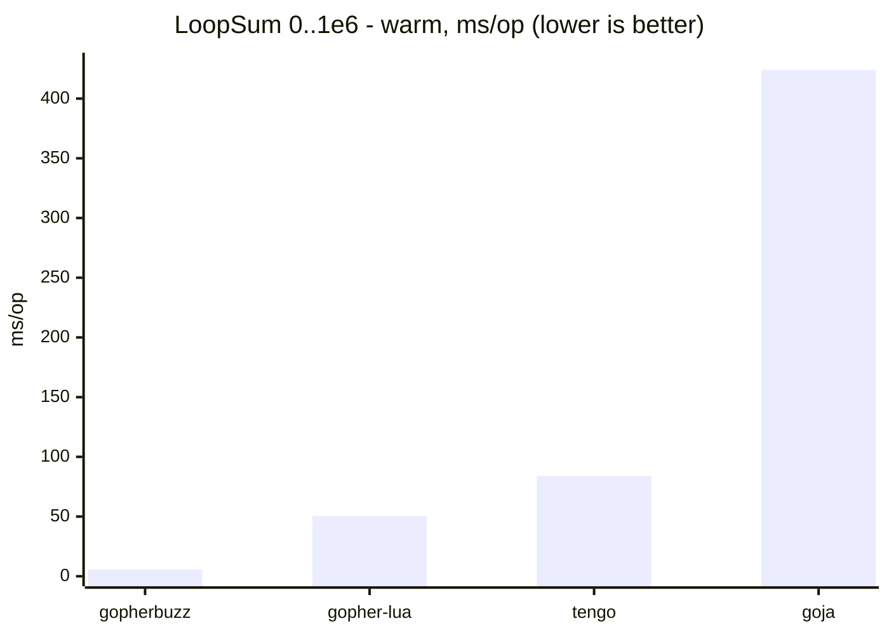
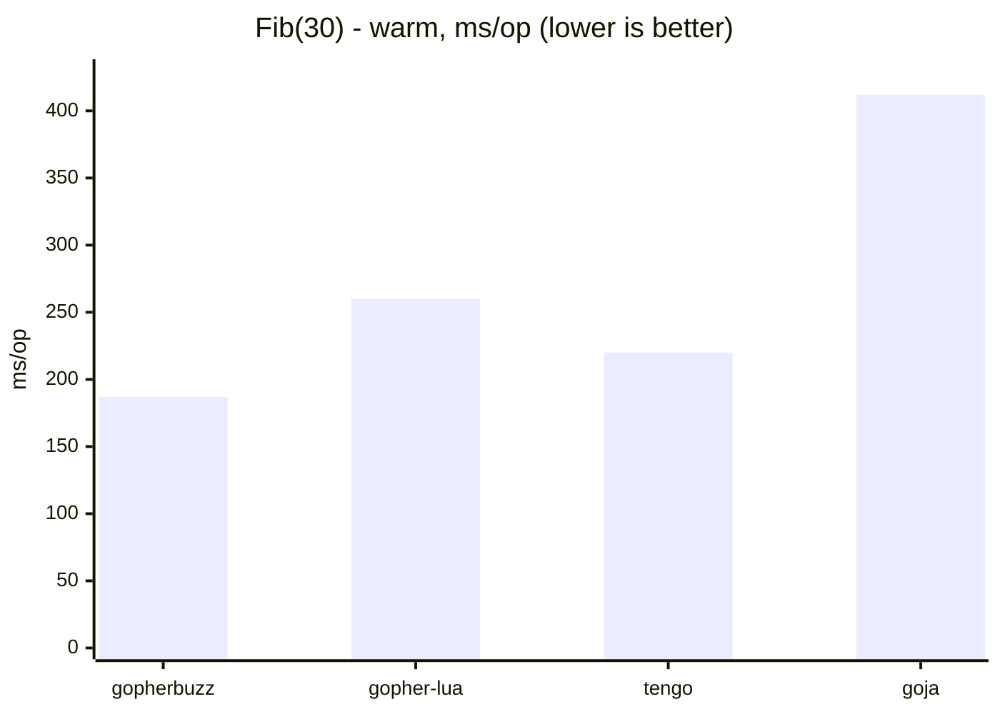

# Cross-language comparison

Benchmarks gopherbuzz (this repo's Buzz VM) against other embedded languages, on
ten workloads. This is a **separate Go module** (`buzzbench`) so its comparison
dependencies - gopher-lua, tengo, goja - never touch the `gopherbuzz` module. It
uses a `replace` directive to build against the in-tree `gopherbuzz`.

Two tiers, kept honest by being labelled as such:

- **Pure-Go, no-toolchain** (default): gopherbuzz, gopher-lua, tengo, goja. No
  cgo, no C libraries - what you get from `go test`.
- **Extended tier** (opt-in, `-tags cgo_engines`): LuaJIT (a tracing JIT, cgo)
  and Umka (a C interpreter, cgo). These show the ceiling a JIT/native dependency
  buys, and the gap a pure-Go interpreter accepts in exchange for `CGO_ENABLED=0`,
  cross-compilation, and a tiny Go-managed footprint. See
  [Extended tier](#extended-tier-opt-in).

## A level battlefield

Cross-engine microbenchmarks are easy to skew by accident: if one engine reuses
a warm VM while another rebuilds its VM every iteration, you are no longer
measuring the same thing. To keep every engine on the same footing, each one
runs under **both** of these protocols, and the harness times them identically:

- **Warm** - the VM is constructed once and reused; only repeated execution on
  the warm VM is timed (compilation and VM construction are hoisted out of the
  loop). This is the headline steady-state-throughput number.
- **Fresh** - a new VM is constructed and torn down every iteration, so the
  per-run setup cost is folded in. The compiled program is reused across
  iterations where the engine separates the compiled artifact from VM state
  (gopherbuzz, goja, tengo via `Clone`); for engines whose compiled artifact is bound
  to the VM (gopher-lua), the source is necessarily re-loaded.

For workloads this heavy (`fib(30)` ≈ 10⁶ calls), setup is noise, so Warm ≈ Fresh
on **time** - the axes diverge mainly on **allocations**, where Fresh exposes the
per-run VM allocation that Warm amortizes away.

## Run

```sh
cd benchmarks/comparison
# GOWORK=off: this is a separate module, not part of the repo's go.work
GOWORK=off go test -run='^$' -bench=. -benchmem .

# one workload / one protocol (sub-benchmark names are Workload/Protocol/Engine)
GOWORK=off go test -run='^$' -bench='LoopSum/Warm' -benchmem .

# stable medians with confidence intervals
GOWORK=off go test -run='^$' -bench=. -benchmem -count=6 . > out.txt
benchstat out.txt
```

Sub-benchmark names are `BenchmarkComparison/<Workload>/<Protocol>/<Engine>`,
e.g. `BenchmarkComparison/LoopSum/Warm/GopherbuzzJIT`. Filter with a regex on any
segment - `-bench='LoopSum/Warm'`, `-bench='/Fresh/Goja'`, etc.

## Workloads

Each program is **self-contained** - it builds whatever data or function it
needs inside the timed program - and every engine runs the same shape. This is
deliberate: the in-tree engine suite (`internal/interp/engine`) can lean on
a persistent session to keep `setup` state alive across a separate `hot` chunk,
but that doesn't port across engines (tengo can't share a defined function or
collection between compiled units), so a setup/hot split would not be level here.
Sizes are picked so the intended operation dominates construction.

- **LoopSum** - sum `0..1e6` in a tight numeric loop. The JIT's wheelhouse: a
  top-level numeric loop with no calls.
- **Fib** - recursive `fib(30)`. Call-heavy, so gopherbuzz runs it on the
  interpreter (the JIT does not compile calls yet) - an honest control that
  measures raw interpreter dispatch, not the JIT.
- **Call** - 1e6 iterations of a trivial two-arg `add` call. LoopSum plus a
  call/return on every iteration, so the delta from LoopSum is call overhead.
- **ForeachList** - build a 1000-element list, then sum it by iteration 1000
  times (1e6 element reads). Stresses list iteration/indexing.
- **ForeachMap** - iterate a 10-entry map's key/value pairs 1e5 times (1e6
  visits). Stresses map iteration and, for some engines, per-iteration key
  enumeration.
- **StringInterp** - build an interpolated/concatenated `"item {i}"` string in a
  1e5-iteration loop.

And four heavier **compute kernels**, to show the whole stack's time *and*
allocation footprint under sustained work:

- **Mandelbrot** - 150×150 escape-time grid, max 100 iterations. Float-heavy
  nested loops, near-zero allocation.
- **MatMul** - 80×80 integer matrix multiply. Nested loops over 2D lists.
- **BinaryTrees** - allocate, walk, and discard ~1M small tree nodes. The
  allocation/GC-pressure workload.
- **NBody** - 5-body gravitational simulation, 1e4 steps, with `sqrt`. Float
  arithmetic and array updates (gopherbuzz runs it via a session so it can
  `import "math"`).

And two **string/text** workloads, which stress substring extraction and map
churn - the area gopherbuzz historically handled worst:

- **KmerCount** - slide a 6-wide window over a ~1 KB string, tally the k-mers in a
  map, 50x.
- **SubstringSearch** - slide over the same string counting a short pattern by
  extracting and comparing each window, 100x (no map).

`LoopSum` and `Mandelbrot` are JIT-eligible, so gopherbuzz appears on each as two
rows (`GopherbuzzJIT` / `GopherbuzzInterp`) via `vm.SetJIT`. Mandelbrot exercises
the JIT's full range - nested loops, an `and` short-circuit escape condition, and
mixed int/float arithmetic. On the other workloads the JIT never engages (calls,
collections, and strings aren't compiled), so gopherbuzz is reported as a single
`Gopherbuzz` (interpreter) row.

## Engines

| Bench engine | Library | Language |
|---|---|---|
| `Gopherbuzz*` | this repo | Buzz |
| `Lua` | [`yuin/gopher-lua`](https://github.com/yuin/gopher-lua) | Lua 5.1 |
| `Tengo` | [`d5/tengo`](https://github.com/d5/tengo) | Tengo |
| `Goja` | [`dop251/goja`](https://github.com/dop251/goja) | JavaScript (ES5.1+) |

## Representative results

benchstat median, n=6, Go 1.25. The gopherbuzz rows were re-measured on an
amd64 Xeon @ 2.10 GHz; the comparison engines (gopher-lua, tengo, goja) are from
an earlier run on an amd64 Xeon @ 2.80 GHz. Read the gopherbuzz-vs-engine gap as
conservative - gopherbuzz is reported on the slower box.





### Scripting microbenchmarks

**Warm - steady-state execution time** on a reused VM (ms/op, lower is better):

| Engine | LoopSum | Fib(30) | Call | ForeachList | ForeachMap | StringInterp |
|---|--:|--:|--:|--:|--:|--:|
| gopherbuzz (JIT) | **5.7** | - | - | - | - | - |
| gopherbuzz | 40.6 | **187** | **126** | **39** | **51** | 38 |
| gopher-lua | 50.5 | 260 | 130 | 148 | 179 | **25** |
| tengo | 84.0 | 220 | 139 | 60 | 139 | 28 |
| goja (JS) | 424 | 412 | 576 | 561 | 941 | 53 |

The `gopherbuzz (JIT)` row exists only for `LoopSum`, the sole JIT-eligible
workload; everywhere else gopherbuzz runs the interpreter (the `gopherbuzz` row).
gopherbuzz leads every scripting workload except `StringInterp`, where
gopher-lua's and tengo's string handling edge it out - disclosed, not hidden.

**Warm - allocation** (B/op, lower is better):

| Engine | LoopSum | Fib(30) | Call | ForeachList | ForeachMap | StringInterp |
|---|--:|--:|--:|--:|--:|--:|
| gopherbuzz | ~0 | 3.9 KB | 2.4 KB | ~90 KB | ~2.4 KB | ~4 MB |
| gopher-lua | 15 MB | 88 KB | 31 MB | 23 MB | 9.2 MB | 5.3 MB |
| tengo | 15 MB | 27 MB | 23 MB | 7.9 MB | 60 MB | 14 MB |
| goja (JS) | 107 MB | 40 KB | 114 MB | 118 MB | 394 MB | 15 MB |

gopherbuzz's NaN-boxed `[]uint64` stack keeps the numeric/call paths at KB (or,
for warm `LoopSum`, effectively zero), and `foreach` reuses a per-slot iterator
object, so map/list iteration is allocation-free too (`ForeachMap`'s 1e6 visits
cost ~2 KB, not megabytes). `StringInterp` is the one workload that still
allocates heavily, and it is GC-sensitive - its time carries a wide CI run to run.

### String/text workloads

Two text-processing workloads added to probe gopherbuzz's string handling head-on
(its structural soft spot: every string is content-interned, and substrings churn
the heap). Both are split-free and produce identical results across engines,
guarded by a cross-engine agreement test (`extra_test.go`).

- **KmerCount** - slide a 6-wide window over a ~1 KB string, tally the k-mers in a
  map, 50x. Substring extraction + map churn.
- **SubstringSearch** - slide over the same string counting a short pattern by
  extracting each window and comparing, 100x. Substring extraction, no map.

**Warm - execution time** (ms/op) | **allocation** (B/op), lower is better:

| Engine | KmerCount | KmerCount B/op | SubstringSearch | SubstringSearch B/op |
|---|--:|--:|--:|--:|
| gopherbuzz | 15.2 | **553 KB** | **16.6** | **1 KB** |
| gopher-lua | 18.1 | 2.7 MB | 19.9 | 3.7 MB |
| tengo | **13.8** | 4.4 MB | 18.4 | 7.2 MB |
| goja (JS) | 66 | 13 MB | 74 | 12 MB |

These started ~10-18x *behind* gopher-lua and tengo - and profiling that gap was
the point. It turned up two real bugs and one structural cost, all since fixed:
`str.sub` rebuilt a `[]rune` of the whole string on every call (O(n) per call,
O(n²) over a sliding window); each `s.sub(...)` allocated a fresh bound-method
closure; and every substring appended a new entry to the never-freed global
string-intern heap. With those addressed (an ASCII fast path in `sub`, caching
string-method dispatch in the inline cache, and one cached heap index per
interned string), gopherbuzz now leads the pure-Go field on `SubstringSearch`,
trails only tengo on `KmerCount`, and allocates one to three orders of magnitude
less than every peer. `StringInterp` above is the string workload it still loses:
its strings are all unique, so interning can never amortize them.

### Compute kernels

**Warm - execution time** (ms/op, lower is better):

| Engine | Mandelbrot | MatMul | BinaryTrees | NBody |
|---|--:|--:|--:|--:|
| gopherbuzz (JIT) | **26** | - | - | - |
| gopherbuzz | 370 | 82 | 116 | 155 |
| gopher-lua | 246 | **55** | 163 | 155 |
| tengo | 406 | 80 | **114** | **146** |
| goja (JS) | 2276 | 417 | 269 | 726 |

**Warm - allocation** (lower is better):

| Engine | Mandelbrot | MatMul | BinaryTrees | NBody |
|---|--:|--:|--:|--:|
| gopherbuzz | **~770 B** | **1.2 MB** | **18 MB** | **17 KB** |
| gopher-lua | 93 MB | 8.5 MB | 45 MB | 25 MB |
| tengo | 103 MB | 13 MB | 24 MB | 27 MB |
| goja (JS) | 453 MB | 56 MB | 146 MB | 98 MB |

The compute kernels are where the field is most honest. **On Mandelbrot the JIT
changes the game outright: 26 ms vs gopher-lua's 246 - an ~9× lead** - because
the kernel is now JIT-eligible (the baseline JIT learned the `and` short-circuit
and int→float promotion, so its nested float loop compiles to native SSE code).
Off the JIT, the interpreter is competitive rather than dominant: an inline
float+float fast path in the arithmetic/comparison dispatch keeps float operands
off the polymorphic `arith→asNumeric→floatArith` fallback, so `GopherbuzzInterp`
lands at 370 ms - behind gopher-lua on Mandelbrot but, on the un-JIT'd kernels,
level with gopher-lua on NBody (155 vs 155, a whisker behind tengo's 146) and now
tied with tengo on BinaryTrees (116 vs 114, well ahead of gopher-lua's 163);
gopher-lua keeps MatMul (55 vs 82). And gopherbuzz's *allocation* is in a
different class throughout - and now leads every compute kernel: Mandelbrot in
hundreds of bytes vs 93-453 MB, BinaryTrees at 18 MB vs 24-146 MB, NBody in 17 KB
vs 25-98 MB - a tiny, GC-quiet footprint whether interpreted or JIT'd.

**The fresh axis.** Re-run with `-bench='/Fresh/'` to construct a new VM every
iteration. On these heavy workloads the *time* barely moves (per-run setup is
noise); the difference shows in *allocations*, where Fresh exposes the per-VM
construction that Warm amortizes away (e.g. gopherbuzz `LoopSum` goes from ~0 to
~3 KB/op, Fib from 3.9 KB to 31 KB/op).

### Extended tier (opt-in)

This tier is **off by default**, enabled with a build tag:

```sh
# LuaJIT needs libluajit-5.1-dev (Debian/Ubuntu: apt install libluajit-5.1-dev).
# Umka's C source is vendored (internal/umka, v1.5.6, BSD-2-Clause), built by cgo.
GOWORK=off CGO_ENABLED=1 go test -tags cgo_engines -run='^$' -bench=. -benchmem .
```

- **LuaJIT 2.1** (cgo) - a tracing JIT; reuses the Lua sources verbatim.
- **Umka** (cgo) - a statically typed C interpreter (its own dialect; `workload.umka`).

**Memory:** Go's `-benchmem` counts only Go-heap allocation, so LuaJIT's and
Umka's C-heap usage reads ~0 and is *not* comparable - read their times only.

Indicative warm times (ms/op):

| Workload | LuaJIT | Umka | best pure-Go | gopherbuzz |
|---|--:|--:|--:|--:|
| LoopSum | 1.5 | 35 | 5.7 (gopherbuzz JIT) | 5.7 / 40.6 |
| Fib(30) | 24 | 140 | 187 (gopherbuzz) | 187 |
| Call | 1.2 | 70 | 126 (gopherbuzz) | 126 |
| Mandelbrot | 4.9 | 152 | 26 (gopherbuzz JIT) | 26 / 370 |
| MatMul | 0.9 | 37 | 55 (gopher-lua) | 82 |
| NBody | 1.7 | 60 | 146 (tengo) | 155 |

Two honest takeaways:

- **LuaJIT** is 1-2 orders of magnitude ahead - exactly what a mature tracing JIT
  backed by C buys. It's the disclosed ceiling, not the bar a pure-Go engine is
  trying to clear.
- **Umka**, a statically typed C interpreter, generally beats the *dynamically*
  typed pure-Go interpreters on compute (types known at compile time) while
  staying well behind the JIT.

The axis is JIT-vs-interpreter and static-vs-dynamic, not language brand.
gopherbuzz is the only engine here that is pure Go, `CGO_ENABLED=0`,
cross-compilable, and GC-friendly, and it still wins the JIT-eligible loop
(`LoopSum`) outright among the pure-Go field.

These are microbenchmarks across languages with different semantics, type
systems, and safety models - read them as order-of-magnitude, not a verdict.
The point of keeping the harness in-tree is that it's easy to add your own
workload and re-measure.
