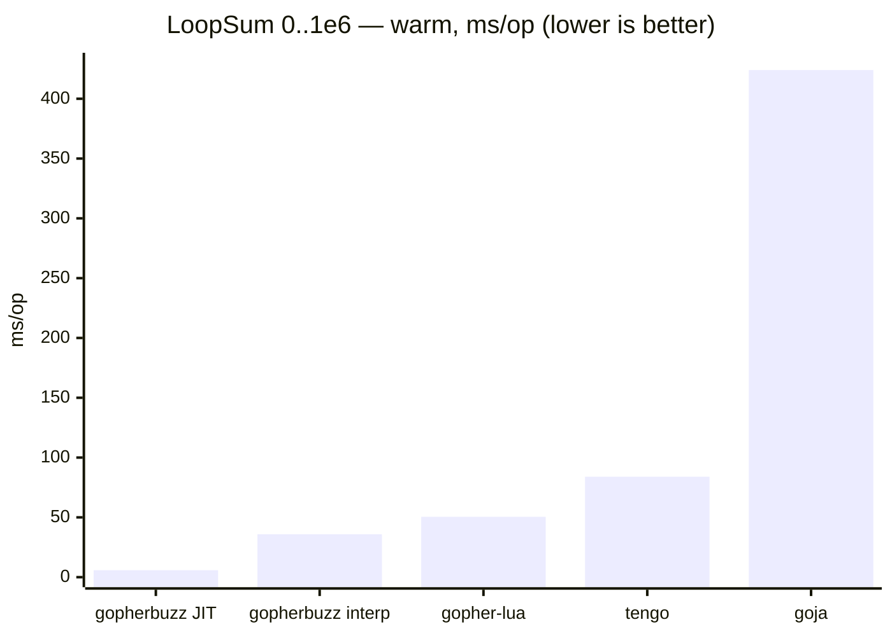

# Cross-language comparison

Benchmarks gopherbuzz (this repo's Buzz VM) against other embedded languages, on
ten workloads. This is a **separate Go module** (`buzzbench`) so its comparison
dependencies — gopher-lua, tengo, goja — never touch the `gopherbuzz` module. It
uses a `replace` directive to build against the in-tree `gopherbuzz`.

Two tiers, kept honest by being labelled as such:

- **Pure-Go, no-toolchain** (default): gopherbuzz, gopher-lua, tengo, goja. No
  cgo, no C libraries — what you get from `go test`.
- **Extended tier** (opt-in, `-tags cgo_engines`): LuaJIT (a tracing JIT, cgo),
  Umka (a C interpreter, cgo), and wazero (a *pure-Go* WASM JIT running compiled
  C kernels). These show the ceiling a JIT/native dependency buys, and the gap a
  pure-Go interpreter accepts in exchange for `CGO_ENABLED=0`, cross-compilation,
  and a tiny Go-managed footprint. See [Extended tier](#extended-tier-opt-in).

## A level battlefield

Cross-engine microbenchmarks are easy to skew by accident: if one engine reuses
a warm VM while another rebuilds its VM every iteration, you are no longer
measuring the same thing. To keep every engine on the same footing, each one
runs under **both** of these protocols, and the harness times them identically:

- **Warm** — the VM is constructed once and reused; only repeated execution on
  the warm VM is timed (compilation and VM construction are hoisted out of the
  loop). This is the headline steady-state-throughput number.
- **Fresh** — a new VM is constructed and torn down every iteration, so the
  per-run setup cost is folded in. The compiled program is reused across
  iterations where the engine separates the compiled artifact from VM state
  (gopherbuzz, goja, tengo via `Clone`); for engines whose compiled artifact is bound
  to the VM (gopher-lua), the source is necessarily re-loaded.

For workloads this heavy (`fib(30)` ≈ 10⁶ calls), setup is noise, so Warm ≈ Fresh
on **time** — the axes diverge mainly on **allocations**, where Fresh exposes the
per-run VM allocation that Warm amortizes away.

## Run

```sh
cd benchmarks/comparison
# GOWORK=off: this is a separate module, not part of the repo's go.work
GOWORK=off go test -run='^$' -bench=. -benchmem .

# one workload / one protocol (sub-benchmark names are Workload/Protocol/Engine)
GOWORK=off go test -run='^$' -bench='LoopSum/Warm' -benchmem .

# stable medians with confidence intervals
GOWORK=off go test -run='^$' -bench=. -benchmem -count=6 . > out.txt
benchstat out.txt
```

Sub-benchmark names are `BenchmarkComparison/<Workload>/<Protocol>/<Engine>`,
e.g. `BenchmarkComparison/LoopSum/Warm/GopherbuzzJIT`. Filter with a regex on any
segment — `-bench='LoopSum/Warm'`, `-bench='/Fresh/Goja'`, etc.

## Workloads

Each program is **self-contained** — it builds whatever data or function it
needs inside the timed program — and every engine runs the same shape. This is
deliberate: the in-tree engine suite (`magus/internal/interp/engine`) can lean on
a persistent session to keep `setup` state alive across a separate `hot` chunk,
but that doesn't port across engines (tengo can't share a defined function or
collection between compiled units), so a setup/hot split would not be level here.
Sizes are picked so the intended operation dominates construction.

- **LoopSum** — sum `0..1e6` in a tight numeric loop. The JIT's wheelhouse: a
  top-level numeric loop with no calls.
- **Fib** — recursive `fib(30)`. Call-heavy, so gopherbuzz runs it on the
  interpreter (the JIT does not compile calls yet) — an honest control that
  measures raw interpreter dispatch, not the JIT.
- **Call** — 1e6 iterations of a trivial two-arg `add` call. LoopSum plus a
  call/return on every iteration, so the delta from LoopSum is call overhead.
- **ForeachList** — build a 1000-element list, then sum it by iteration 1000
  times (1e6 element reads). Stresses list iteration/indexing.
- **ForeachMap** — iterate a 10-entry map's key/value pairs 1e5 times (1e6
  visits). Stresses map iteration and, for some engines, per-iteration key
  enumeration.
- **StringInterp** — build an interpolated/concatenated `"item {i}"` string in a
  1e5-iteration loop.

And four heavier **compute kernels**, to show the whole stack's time *and*
allocation footprint under sustained work:

- **Mandelbrot** — 150×150 escape-time grid, max 100 iterations. Float-heavy
  nested loops, near-zero allocation.
- **MatMul** — 80×80 integer matrix multiply. Nested loops over 2D lists.
- **BinaryTrees** — allocate, walk, and discard ~1M small tree nodes. The
  allocation/GC-pressure workload.
- **NBody** — 5-body gravitational simulation, 1e4 steps, with `sqrt`. Float
  arithmetic and array updates (gopherbuzz runs it via a session so it can
  `import "math"`).

Only `LoopSum` is JIT-eligible, so gopherbuzz appears there as two rows
(`GopherbuzzJIT` / `GopherbuzzInterp`) via `vm.SetJIT` — the suffix names the
*flag*, not the path taken. On every other workload the JIT never engages (calls,
collections, and strings aren't compiled), so gopherbuzz is reported as a single
`Gopherbuzz` (interpreter) row.

## Engines

| Bench engine | Library | Language |
|---|---|---|
| `Gopherbuzz*` | this repo | Buzz |
| `Lua` | [`yuin/gopher-lua`](https://github.com/yuin/gopher-lua) | Lua 5.1 |
| `Tengo` | [`d5/tengo`](https://github.com/d5/tengo) | Tengo |
| `Goja` | [`dop251/goja`](https://github.com/dop251/goja) | JavaScript (ES5.1+) |

## Representative results

benchstat median, n=6, amd64 Xeon @ 2.80 GHz, Go 1.25.




### Scripting microbenchmarks

**Warm — steady-state execution time** on a reused VM (ms/op, lower is better):

| Engine | LoopSum | Fib(30) | Call | ForeachList | ForeachMap | StringInterp |
|---|--:|--:|--:|--:|--:|--:|
| gopherbuzz (JIT) | **5.8** | — | — | — | — | — |
| gopherbuzz | 35.9 | **182** | **115** | **38** | **74** | 37 |
| gopher-lua | 50.5 | 260 | 130 | 148 | 179 | **25** |
| tengo | 84.0 | 220 | 139 | 60 | 139 | 28 |
| goja (JS) | 424 | 412 | 576 | 561 | 941 | 53 |

The `gopherbuzz (JIT)` row exists only for `LoopSum`, the sole JIT-eligible
workload; everywhere else gopherbuzz runs the interpreter (the `gopherbuzz` row).
gopherbuzz leads every scripting workload except `StringInterp`, where
gopher-lua's and tengo's string handling edge it out — disclosed, not hidden.

**Warm — allocation** (B/op, lower is better):

| Engine | LoopSum | Fib(30) | Call | ForeachList | ForeachMap | StringInterp |
|---|--:|--:|--:|--:|--:|--:|
| gopherbuzz | ~0 | 3.9 KB | 2.2 KB | 339 KB | 6.9 MB | 13 MB |
| gopher-lua | 15 MB | 88 KB | 31 MB | 23 MB | 9.2 MB | 5.3 MB |
| tengo | 15 MB | 27 MB | 23 MB | 7.9 MB | 60 MB | 14 MB |
| goja (JS) | 107 MB | 40 KB | 114 MB | 118 MB | 394 MB | 15 MB |

gopherbuzz's NaN-boxed `[]uint64` stack keeps the numeric/call paths at KB (or,
for warm `LoopSum`, effectively zero); the collection and string workloads do
allocate, but still far below the others. `StringInterp` is the exception and is
GC-sensitive — its time carries a wide CI run to run.

### Compute kernels

**Warm — execution time** (ms/op, lower is better):

| Engine | Mandelbrot | MatMul | BinaryTrees | NBody |
|---|--:|--:|--:|--:|
| gopherbuzz | 364 | 80 | 201 | 161 |
| gopher-lua | **246** | **55** | 163 | 155 |
| tengo | 406 | 80 | **114** | **146** |
| goja (JS) | 2276 | 417 | 269 | 726 |

**Warm — allocation** (lower is better):

| Engine | Mandelbrot | MatMul | BinaryTrees | NBody |
|---|--:|--:|--:|--:|
| gopherbuzz | **512 B** | **2.3 MB** | 41 MB | **11 KB** |
| gopher-lua | 93 MB | 8.5 MB | 45 MB | 25 MB |
| tengo | 103 MB | 13 MB | **24 MB** | 27 MB |
| goja (JS) | 453 MB | 56 MB | 146 MB | 98 MB |

The compute kernels are where the field is most honest: **without the JIT,
gopherbuzz's interpreter is mid-pack on raw compute time** — gopher-lua wins the
float kernels (Mandelbrot, MatMul) and tengo wins the recursive/array ones
(BinaryTrees, NBody). But gopherbuzz's *allocation* is in a different class:
Mandelbrot in 512 bytes vs 93–453 MB, NBody in 11 KB vs 25–98 MB. It trades
peak throughput on un-JIT'd float code for a tiny, GC-quiet footprint.

**The fresh axis.** Re-run with `-bench='/Fresh/'` to construct a new VM every
iteration. On these heavy workloads the *time* barely moves (per-run setup is
noise); the difference shows in *allocations*, where Fresh exposes the per-VM
construction that Warm amortizes away (e.g. gopherbuzz `LoopSum` goes from ~0 to
~3 KB/op, Fib from 3.9 KB to 26 KB/op).

### Extended tier (opt-in)

This tier is **off by default**, enabled with a build tag:

```sh
# LuaJIT needs libluajit-5.1-dev (Debian/Ubuntu: apt install libluajit-5.1-dev).
# Umka's C source is vendored (internal/umka, v1.5.6, BSD-2-Clause), built by cgo.
# wazero is pure Go; the WASM kernels are committed (internal/wasm), so no wasm
# toolchain is needed at run time (rebuild them with internal/wasm/build.sh).
GOWORK=off CGO_ENABLED=1 go test -tags cgo_engines -run='^$' -bench=. -benchmem .
```

- **LuaJIT 2.1** (cgo) — a tracing JIT; reuses the Lua sources verbatim.
- **Umka** (cgo) — a statically typed C interpreter (its own dialect; `workload.umka`).
- **wazero** (pure Go) — a WASM runtime whose compiler backend JITs to native
  code. Its "program" is a C kernel compiled to wasm32 (`internal/wasm`), so it's
  the *pure-Go JIT* ceiling on compiled code — only the numeric kernels exist as
  WASM (Mandelbrot, MatMul, NBody).

**Memory:** Go's `-benchmem` counts only Go-heap allocation, so LuaJIT's and
Umka's C-heap usage reads ~0 and is *not* comparable — read their times only.
wazero is pure Go, so its memory *is* captured (and is tiny: the kernels run in
pre-allocated linear memory).

Indicative warm times (ms/op):

| Workload | LuaJIT | wazero | Umka | best pure-Go | gopherbuzz |
|---|--:|--:|--:|--:|--:|
| LoopSum | 1.5 | — | 35 | 5.8 (gopherbuzz JIT) | 5.8 / 35.9 |
| Fib(30) | 24 | — | 140 | 182 (gopherbuzz) | 182 |
| Call | 1.2 | — | 70 | 115 (gopherbuzz) | 115 |
| Mandelbrot | 4.9 | 4.9 | 152 | 246 (gopher-lua) | 364 |
| MatMul | 0.9 | 0.7 | 37 | 55 (gopher-lua) | 80 |
| NBody | 1.7 | 1.6 | 60 | 146 (tengo) | 161 |

Three honest takeaways:

- **LuaJIT** is 1–2 orders of magnitude ahead — exactly what a mature tracing JIT
  backed by C buys. It's the disclosed ceiling, not the bar a pure-Go engine is
  trying to clear.
- **wazero** answers the obvious question — *is there a pure-Go JIT?* — yes, and
  it's right alongside LuaJIT on the compute kernels (it even edges LuaJIT on
  MatMul). But it runs *compiled C-to-WASM*, not a script; it's a native-codegen
  runtime, not a scripting engine, so it's a ceiling reference, not a peer of the
  interpreters.
- **Umka**, a statically typed C interpreter, generally beats the *dynamically*
  typed pure-Go interpreters on compute (types known at compile time) while
  staying well behind both JITs.

The axis is JIT-vs-interpreter and static-vs-dynamic, not language brand.
gopherbuzz is the only engine here that is pure Go, `CGO_ENABLED=0`,
cross-compilable, and GC-friendly, and it still wins the JIT-eligible loop
(`LoopSum`) outright among the pure-Go field.

These are microbenchmarks across languages with different semantics, type
systems, and safety models — read them as order-of-magnitude, not a verdict.
The point of keeping the harness in-tree is that it's easy to add your own
workload and re-measure.
