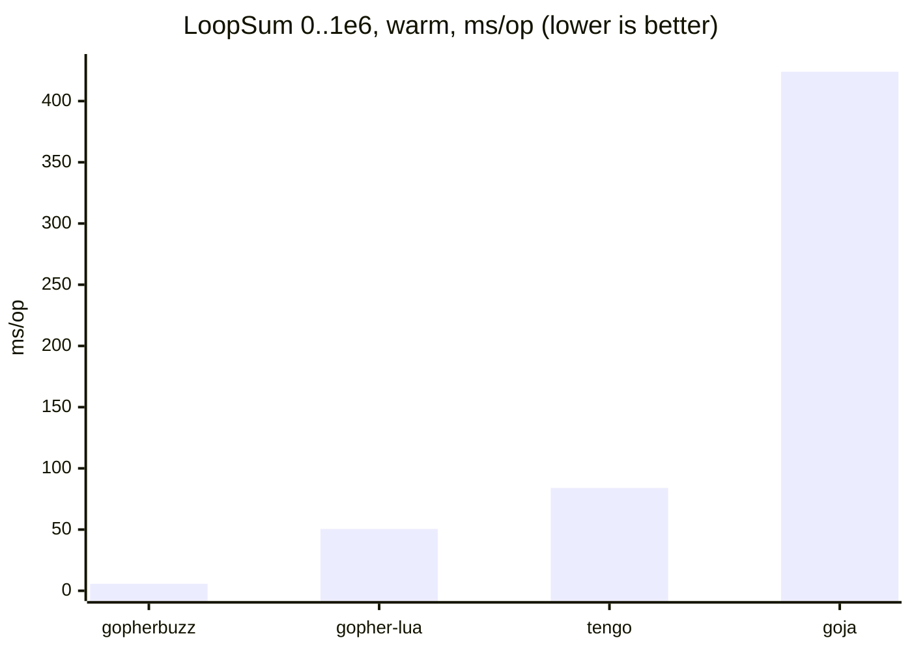
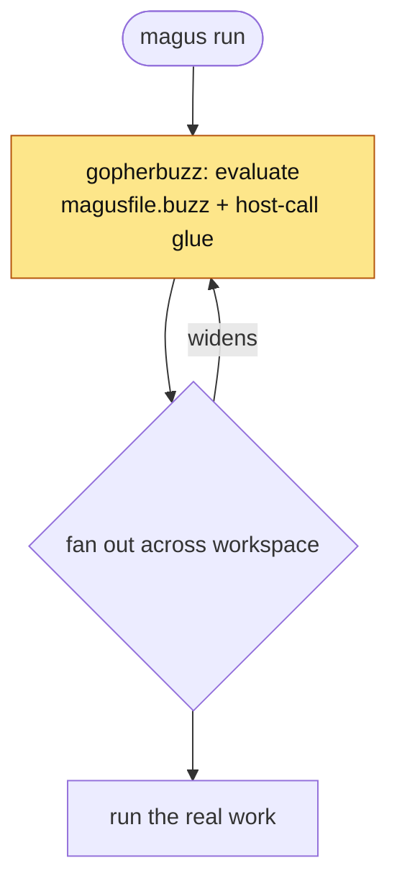
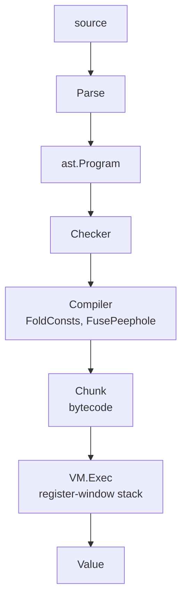

# gopherbuzz

A pure-Go bytecode VM for the [Buzz](https://buzz-lang.dev/) scripting
language with JIT support. It targets Buzz 0.6.0-dev, tracking upstream
`buzz-language/buzz` `main` at the commit pinned in [`version.go`](version.go)
(`UpstreamRef`).

It implements a **subset** of the language. The goal is 100% compatibility; the
running record of how far along that is lives in [Upstream parity](#upstream-parity),
and is enforced by a test rather than asserted by this file. If you are evaluating
gopherbuzz as a Buzz implementation, read [Where the skeletons are](#where-the-skeletons-are) before the feature list -- it names every place this VM
answers differently from upstream, or accepts source upstream refuses.

- Reference: <https://buzz-lang.dev/0.5.0/reference/> (latest published; 0.6.0 is unreleased)
- Hot-path notes: [Performance design](#performance-design) · JIT: [Baseline JIT](#baseline-jit)

## Upstream parity

Measured against `UpstreamRef` (`0.5.0-251-ged42f47`) on 2026-08-11. Upstream ships
six test directories; three are measurable here, and all three numbers are below
rather than only the flattering one.

| upstream suite          | files |      gopherbuzz | what it asks                                                     |
| ----------------------- | ----: | --------------: | ---------------------------------------------------------------- |
| `tests/behavior/`       |    83 |     **74 pass** | does correct source produce the right answer?                    |
| `tests/compile_errors/` |    77 | **51 rejected** | does gopherbuzz REJECT what upstream rejects?                    |
| `tests/fuzzed/`         |   644 |    **0 panics** | can malformed input crash the front end?                         |
| `tests/bench/`          |    11 |         not run | upstream's benchmarks (ours are in [`benchmarks/`](benchmarks/)) |
| `tests/manual/`         |     9 |         not run | interactive                                                      |
| `tests/utils/`          |    10 |             n/a | helper modules the behavior tests import                         |

**The compile-error row is the uncomfortable one and the most important.** 26 of those
77 programs compile CLEAN here that upstream refuses. That is not a missing feature, it
is missing strictness: gopherbuzz will accept source upstream tells you is wrong. If
you are evaluating this VM as a Buzz implementation, weigh that at least as heavily as
the behavior row -- a permissive checker is the failure mode a subset does not warn you
about.

The three largest clusters are closed: `match` analysis (11 files -- exhaustiveness,
duplicate conditions, overlapping ranges), terminal flow (8 -- unreachable code after
a statement that transfers control away, plus the missing return), and yield
propagation with the reserved-method signatures (6). What remains has no cluster
bigger than a handful: `out` and block expressions, mutability, unused locals and
shadowing, and assorted type checks.

Three things to know before adding a rule here.

Upstream's own suite is not internally consistent everywhere, so check a proposed rule
against `tests/behavior/` before writing it. `unused-import` is the worked example: the
note in `session.go` records why that one cannot be promoted at all.

A strictness check has a DIRECTION. Reporting unreachable code over-claims (a wrong
answer calls live code dead); reporting a missing return under-claims (a wrong answer
invents an error on a correct function). `terminates` and `terminatesForReturn` exist
because those two biases disagree about try/catch.

Some of what is left is a DIALECT DECISION rather than a missing check, and the two
`yield` files are the example. Upstream requires a `*>` annotation on any function
that yields; gopherbuzz deliberately does not, dismisses a yield outside a fiber
(documented on `ast.YieldExpr`, pinned by `TestYieldOutsideFiberDismissed`), and both
this package's fiber fixtures and magus's own s3-cache spell rely on that. Closing
those two costs a migration and reverses a recorded choice -- which is a call to make
deliberately, not a gap to patch.

The fuzz corpus is upstream's checked-in AFL output, not hand-written tests: the
filenames are AFL's (`id_000123,sig_06,src_000051,op_flip1,pos_1`), where `sig_06` is
the signal that crashed the target and `op_flip1`/`op_arith8` is the mutation applied.
The contents are real Buzz programs with a byte corrupted -- `mnssage:` for `message:`,
or invalid UTF-8 spliced mid-token. Passing means the front end REPORTS an error rather
than crashing on them; note the scope, since it is measured over parse, check and
compile and not over execution, and upstream blacklists an entry or two of its own.

The behavior baseline when this record started was 12 of 83.

Measure against the PINNED commit, not a local `main` checkout: a newer checkout
has files that do not exist at the pin, which is how an earlier hand-count reached
a wrong 13-of-84.

Nothing is copied into this repo. `magus run conformance libs/gopherbuzz` fetches
`buzz-language/buzz` at the pinned sha into a cache directory and runs all three
suites against it, so every number here is reproducible against the ref this VM
claims to track.

Both allowlists -- `testdata/upstream-behavior-allowlist.txt` and
`testdata/upstream-compile-errors-allowlist.txt` -- are the enforced source of truth,
and each fails in **both** directions: a listed test that regresses, and an unlisted
test that starts passing without being recorded. Parity can therefore only go up, and
closing a gap forces the gain to be banked rather than quietly enjoyed.

### What works

Objects (fields with defaults, methods, `static fun` and static fields, `mut` instances, optional
unwrap `if (x -> y)`, field punning), enums (`enum<str>`/`enum<int>` backing
types and explicit case values), namespaces and imports, optionals with `??`,
`as?` and optional chaining `?.`/`?[`, nullable declarations that omit their
initializer, default argument values, error sets on declarations plus
`try` and multiple typed `catch` clauses, collection mutability as part of the TYPE
(`mut [int]` is a distinct type that `typeof` renders, `mut T` is assignable to `T`
and not the reverse, and the clone family re-types across it), fibers with `resolve`, ranges, string
interpolation, pattern literals, `zdef` FFI, closures, generics as erasure, ranges with their full method set, and
the collection/loop core (multi-clause `for`, labeled loops), and block
expressions (`from { ... out v; }`), free identifiers (`@"non-standard"`), and
generic object declarations, inline ifs, `catch void`, and maps keyed by any
value (an object, an int, a bool -- not only a `str`). Three deliberate supersets: the contextual
`test` keyword (below), named-argument labels, and compiled-bytecode serialization
(next).

### One superset worth naming: serialized bytecode

Upstream compiles to bytecode -- it is a bytecode VM, JITed through MIR -- but it has
no way to PERSIST that bytecode. Its subcommands are `test`, `check`, `fetch`,
`format`, `help`, `init` and `version` (running a script is the default path), none of
which emits an artifact, and `Chunk.zig` builds a chunk in memory with no reader or
writer beside it. Upstream's `serialize` is the `buzz:serialize` JSON module, a
different thing entirely: it turns a runtime VALUE into text.

gopherbuzz adds the persistence: [`Chunk.Marshal`](vm/marshal.go) emits a portable
`.bo` blob that `UnmarshalChunk` runs without re-parsing or re-compiling, with source
positions split into a companion `.bdb`. The distinction is narrow but it is the whole
superset -- compiling to bytecode is upstream behaviour, writing it to a file is not.

This is the ordinary shape for a bytecode VM rather than an invention -- CPython's
`.pyc`, the JVM's `.class`, `luac` and Lua's `string.dump`, and Erlang's `.beam` are
all the same idea, and the split debug file mirrors a PDB or a DWARF `.dwo`. It is
also load-bearing here: magus ships every built-in spell as a prebuilt `.bo`
(`internal/spellruntime/gen/*.bo`), so a spell loads without a compiler on the critical
path.

Because it is ours and not upstream's, it is ours to keep whole. Every constant kind
the compiler can mint -- null, bool, int, float, str, enum def, object declaration,
pattern, and type value -- has an encoding, so the encoder's "cannot serialize" arm
is unreachable from compiled code. A type-value constant (`<T>`, `typeof x`) was the
one that had been missed: `Marshal` failed outright on it, which silently barred any
program using `typeof` from ever being a built-in spell. [Bytecode version](#bytecode-version) records what each format bump changed and why an older
VM must reject a newer blob.

Read that list as "the shape parses and runs", not as "matches upstream in every
detail". Several entries carry a caveat recorded under [Where the skeletons are](#where-the-skeletons-are) -- `as` coerces rather than asserts, `match` does no
exhaustiveness analysis, protocol conformance is unverified, and generics are erased.

### What does not

**No open gaps remain.** Every one of the nine still-failing files is blocked by a
property of the EMBEDDING rather than by unwritten code, so this list is not a
backlog:

- **A compiled native library.** `ffi`, `extern-library`, `c-buzz-api` and
  `types-as-value` all `zdef` against `tests/utils/libforeign`, and `os` shells out
  to upstream's own `./zig-out/bin/buzz`. All five need upstream built with Zig.
- **Reified generics.** `testing` calls `assertOfType::<int>` and
  `assertThrows::<str>`; gopherbuzz erases type parameters, so a type argument is
  not a runtime value. gopherbuzz's own `testing` module takes a type NAME instead.
- **`math\deg` will not be matched.** Upstream's result implies a degrees-per-radian
  constant of 57.295779513082195; the correctly-rounded f64 value is
  57.29577951308232, which is what gopherbuzz returns. Matching upstream here would
  mean shipping a less accurate constant to satisfy a test.
- **GC collector callbacks** depend on Buzz's own collector running at points a Go
  program does not control. Upstream's test asserts a collector ran after dropping a
  reference; Go's GC gives no such guarantee.
- **`std\toUd`** returns Zig-specific userdata, which this embedding has no
  representation for.

### Where the skeletons are

These are ours, not missing features: places gopherbuzz answers differently from
upstream, or answers where upstream would refuse. They are listed because a subset you
can measure is more useful than a subset you have to discover. Each is a real,
reproducible difference at the pinned ref.

**Silently different answers.** The dangerous class -- these do not error.

- **A bare `as` COERCES instead of asserting.** `3.9 as int` is 3 here; upstream's `as`
  is a statically checked cast, not a conversion. Only `as?` was fixed to be a real type
  test. gopherbuzz's own testdata depends on the coercion, which is why it still stands.
- **A compound assign evaluates its target twice.** `x op= v` desugars to `x = x op v`
  sharing the target node, so `f().n += 1` calls `f()` twice. Harmless for the plain
  variable and field cases; wrong for any side-effecting target.
- **A stored map key shadows a same-named builtin method.** `rec.map` reads the field,
  not `map.map`. Deliberate -- an anonymous object literal is represented as a map, and
  upstream's anonymous objects have fields and no methods -- but it is a language-wide
  flip driven by one representation choice.
- **A backtick string interpolates, and an unparsable `{...}` stays literal.** Upstream
  interpolates too, but would reject the malformed case; here it silently becomes text.
  That leniency is load-bearing (it is what lets a Mustache template and a `zdef` block
  live in a raw string), and it means a regex quantifier written `` `[0-9]{3}` `` becomes
  `[0-9]3` with no diagnostic.

**Checks that are recorded but not enforced.** Declared and then trusted.

- **`obj{...}` annotations are erased in the checker**, so an annotated discard
  (`_: obj{ nope: str } = ...`) asserts nothing statically. The RUNTIME test
  (`x is obj{...}`) does check field presence, so the two disagree.
- **Protocol conformance is declared, never verified.** `object<Drawable> Foo {}`
  type-checks with none of `Drawable`'s methods. `Compat` consults the declaration only.
- **`match` analysis is narrower than the runtime.** Exhaustiveness, duplicate
  conditions and overlapping ranges are all checked now, but only over conditions that
  fold to a CONSTANT: `1 + 1` duplicates `2`, while two conditions naming the same
  `final` do not. That is deliberately one-sided -- an unfoldable condition is recorded
  and never reported, because a false positive here rejects a correct program.
- **Generics are erased.** There is no reified type argument, so `assertOfType::<int>`
  cannot inspect anything; gopherbuzz's own `testing` module takes a type NAME string
  instead. This is the one "cannot accommodate" above that is really a design choice.

**Narrower gaps.** Known, bounded, and unlikely to bite most programs.

- A selective import (`import a, b from "..."`) is honored for host modules but not yet
  for source or file modules, which bind every export.
- Top-level placeholder hoisting made a forward reference from top-level code a bare
  runtime error instead of a positioned diagnostic.

**Costs the design imposes.** Not correctness, but you should know before adopting.

- A local a closure captures is boxed, and boxing is keyed on the NAME via an
  over-approximating scan. An unrelated shadowing name inside a nested closure therefore
  boxes the outer local too, which costs the superinstruction fast paths and de-JITs the
  chunk: measured ~30% on a hot loop that differs only in an inner parameter's name.
- Each boxed local allocates into a grow-only, never-freed global heap in the default
  NaN-boxed build, so a captured local declared inside a loop pins one entry per
  iteration: measured 2.7x RSS over 2M iterations.
- A map keyed by anything other than `str` gets NO key->index hash at any size, so
  its lookups are O(n) where a `str`-keyed map is O(1) above `smallMapThreshold`.
  The hash is keyed by the key's display string, which stops being an identity the
  moment `1` and `"1"` can both be present; giving it a synthetic per-key identity
  would cost an allocation on every get of EVERY map to serve a shape neither this
  embedding nor upstream's suite builds at size.

A test is often blocked by more than one gap, so closing a single entry does not
always flip a file green. The allowlist reports real progress; the table only
explains it. `types-as-value.buzz` is the worked example: adding `protocol`
declarations and exempting `zdef` from argument labeling both moved it forward, and
it stays red because it also needs a native library this embedding cannot build.

## Performance

A pure-Go VM with a baseline JIT: no cgo, no toolchain. Its standout case is a
tight top-level numeric loop (`LoopSum`, sum `0..1e6`), one shape the JIT
compiles to native code (it also compiles the nested float loops of the
Mandelbrot kernel; see [`benchmarks/`](benchmarks/)):



That 5.7 ms is the JIT engaged; the same VM with the JIT off runs the loop in
40.6 ms, still ahead of the others, but the native-code path is the headline.
Allocation is effectively zero either way: the NaN-boxed `[]uint64` stack has no
GC-visible pointers.

**The JIT compiles top-level numeric loops to native code; everything else runs
on the interpreter.** Its wheelhouse now covers both `LoopSum` and the
`Mandelbrot` kernel. The baseline JIT learned the `and` short-circuit and
int→float promotion, so Mandelbrot's nested float loop compiles to native SSE and
runs in ~26 ms, an ~9× lead over gopher-lua's 246 ms. On the interpreter
gopherbuzz wins the lighter scripting microbenchmarks (loops, calls, `fib`,
collection iteration) and, with the float fast path in the arithmetic dispatch,
is competitive on the heavy compute kernels: it trails gopher-lua on un-JIT'd
MatMul, draws level with tengo on BinaryTrees and with gopher-lua on NBody, and
string building still goes to gopher-lua. Allocation stays well under
the dynamically typed peers throughout: kilobytes on lean workloads, and
map/list iteration is allocation-free (`foreach` reuses a per-slot iterator);
only string building reaches low single-digit MB. The full win-and-lose
matrix (10 workloads, warm + fresh, plus an opt-in LuaJIT / Umka tier that is
faster still) lives in [`benchmarks/`](benchmarks/), kept deliberately honest.

benchstat median, Go 1.25; gopherbuzz re-measured on an amd64 Xeon @ 2.10 GHz,
the comparison engines on an amd64 Xeon @ 2.80 GHz (so the gap is conservative).
Cross-language microbenchmarks differ in semantics (types, safety, GC), so read
as order-of-magnitude, not a verdict.

Reproduce:

```sh
go test -run='^$' -bench=. -benchmem ./...                # in-tree (BUZZ_JIT=0 for interp)
cd benchmarks/comparison && GOWORK=off go test -bench=. . # cross-language
```

## Why this matters

gopherbuzz is the interpreter behind **magus**, which fans out across a
workspace and runs the tasks. The VM sits on the critical path of that flow,
before any real work starts:



Two constraints follow:

- **No second toolchain.** magus is a single static Go binary: no cgo, no C
  library, nothing to install. A faster engine that requires a C toolchain (the
  [extended tier](benchmarks/comparison/): LuaJIT, Umka) would forfeit that, so
  the engine has to be **pure Go**.
- **It's on every task's critical path.** The VM evaluates `magusfile.buzz` and
  the host-call glue on every run, and again as the fan-out widens. A slow or
  allocation-heavy layer pays that cost as latency and GC pressure on every build.

The goal is for the VM to stay invisible. The benchmarks above are deliberately
heavy stress loops; a real `magusfile.buzz` is orders of magnitude smaller, so
the VM's slice of any run sits well below the work it dispatches. Returns are
diminishing now, and the [perf design notes](#performance-design) mostly
exist to stop a future change from regressing what's here. The aim is to make
the interpreter cheap enough that magus can treat it as free, without reaching
for a second toolchain to get there.

## Building

```sh
go build ./...
go test ./...
```

No cgo, no external toolchain. Pure-Go deps:
[`purego`](https://github.com/ebitengine/purego) (`zdef()` FFI) and
[`golang-asm`](https://github.com/twitchyliquid64/golang-asm) (JIT codegen, amd64).

After bumping `BytecodeVersion`, run `go generate` in
[`../internal/spellruntime`](../internal/spellruntime) to rebuild the embedded spell bytecode.

## CLI

`cmd/buzz` is a standalone runner mirroring the upstream `buzz` CLI, built on the
Go standard library alone (no third-party CLI framework):

```sh
go run ./cmd/buzz script.buzz          # run a file
echo 'return 1 + 2;' | go run ./cmd/buzz -   # run stdin
go run ./cmd/buzz -e 'import "std"; std.print("hi");'
go run ./cmd/buzz -c script.buzz       # type-check only
go run ./cmd/buzz -t script.buzz       # run its test "..." {} blocks
go run ./cmd/buzz --ast script.buzz    # dump the AST as JSON
go run ./cmd/buzz -L ./lib m.buzz      # add an import search path
```

The Buzz standard library is available; magus host bindings are not (use
`magus buzz` for those, or `magus buzz --workspace` to load a magusfile).

## Testing

Upstream Buzz's `test "name" { … }` blocks are supported. A block runs only under
`buzz -t` / `--test`; a normal run skips it. A block fails when its body raises,
typically a `std.assert` that did not hold:

```buzz
import "std";

test "addition" {
    std.assert(1 + 1 == 2, "math broke");
}
```

```sh
go run ./cmd/buzz -t mytests.buzz
# ok    test "addition"
# ---
# 1 passed, 0 failed
```

**Named arguments:** upstream Buzz labels call arguments (`f(a: 1, b: 2)`)
and requires the labels on multi-argument calls. gopherbuzz accepts them as a
superset: labels resolve against the callee's parameter names at check time
(any order; positional arguments first), while unlabeled calls keep working.
For dynamically typed callees (host functions, `any` values) labels cannot be
verified and arguments pass in written order. After label resolution,
arguments evaluate in parameter order.

**Deliberate divergence:** upstream hard-reserves `test` as a keyword; gopherbuzz
treats it as a _contextual_ soft keyword. `test` introduces a block only in the
`test "…" {` position and stays a normal identifier elsewhere. This runs every
upstream test block verbatim while keeping `test` usable as an identifier, which
the magus embedding needs (`export fun test` is a common target). It is therefore
a strict superset of upstream, the same "match capabilities, diverge only where a
Go embedding forces it" stance taken for [FFI](docs/ffi.md).

## Build tags

Three mutually exclusive `Value` representations; one is compiled at a time.

| Tag           | `Value`                                       | Use                          |
| ------------- | --------------------------------------------- | ---------------------------- |
| _(none)_      | 8-byte NaN-box + handle table                 | **default production build** |
| `buzz_safe`   | 24-byte interface + assertion, bounds-checked | CI / differential testing    |
| `buzz_unsafe` | 24-byte pointer struct                        | legacy baseline              |

The default build has **zero GC write barriers** on the push/arith/pop path (the
operand stack is `[]uint64`). `buzz_safe` is behaviorally identical and slower,
which lets CI validate the fast build. The [JIT](#baseline-jit) is built with the
default rep on amd64 and arm64 (on every OS, including Windows); every other
config (safe/unsafe, other arches, wasm) uses a no-op stub. See
[which platforms this has actually run on](#which-platforms-this-has-actually-run-on)
before trusting a JIT result on a platform CI does not cover.

```sh
go test -tags buzz_safe ./...
go test -tags buzz_unsafe ./...
```

## FFI (calling C)

`zdef()` binds functions (and data symbols like `kCFBooleanTrue`) from a C
shared library at runtime, accepting both upstream-Buzz Zig declarations
(`fn sqrt(x: f64) f64;`) and C prototypes, via
[`purego`](https://github.com/ebitengine/purego), with no cgo and no build-time
toolchain. The `ffi` module adds C-ABI type metadata and a pinned-memory API so
scripts can drive the common patterns: scalar calls, pointer out-parameters,
by-reference structs, and callbacks.

```buzz
import "ffi";
final lib = zdef("libm", "double sqrt(double x);");
final r = lib.sqrt(9.0);                 // 3.0
```

Unlike upstream Buzz (whose FFI is Zig-ABI native and needs an embedded Zig
compiler), gopherbuzz is C-ABI native: `zdef` takes C prototypes and `ffi.sizeOf`
& friends take C type-name strings. Parsing works on every target; binding works
where purego does, and returns a clear "unsupported" error elsewhere (e.g. wasm).

Full reference: [`docs/ffi.md`](docs/ffi.md) · runnable demo:
[`examples/ffi-c/`](examples/ffi-c/) (`go run .`) · a larger showcase:
[`examples/bubblegum/`](examples/bubblegum/), an i3-flavored macOS tiling
window manager written in pure Buzz on this FFI.

## WebAssembly

The core is pure Go with no cgo, so it cross-compiles to wasm unmodified
(`zdef()` returns "unsupported"; the JIT uses its stub). `wasm/main.go` (guarded
by `//go:build wasm`) reads a program from stdin and prints a trailing `return`:

```sh
tinygo build -target=wasi -o buzz.wasm ./wasm        # ~1.6 MB; default scheduler (fibers use goroutines)
GOOS=wasip1 GOARCH=wasm go build -o buzz.wasm ./wasm # ~4 MB, no extra toolchain
echo 'return (1 + 2) * 10;' | wasmtime buzz.wasm     # 30
```

Both `wasip1/wasm` and `js/wasm` build. This makes gopherbuzz (to our knowledge
the first Go implementation of Buzz) run **in the browser**: the [magus](..) docs
site's Buzz playground ([`cmd/buzz-playground`](../cmd/buzz-playground) over
[`internal/playground`](../internal/playground)) evaluates Buzz live and
dry-runs a `magusfile.buzz`, with host calls recorded.

## Architecture



- **`Instr`** `{Op uint8, A, B int32}`: word-coded, pointer-free, in a contiguous slice, fetched without bounds checks on the hot path.
- **`Value`**: 8-byte NaN-boxed word. Immediates (int/float/bool/null) live in the payload; heap objects are indices into a per-VM handle table, so the operand stack is `[]uint64` with no GC-visible pointers.

## Baseline JIT

On **amd64 and arm64**, a hot top-level chunk whose body is the numeric
loop/arithmetic opcode subset is compiled to native code, deleting interpreter
dispatch. On by default; disable with `BUZZ_JIT=0` or `vm.SetJIT(false)`.

- The pointerless `[]uint64` stack lets native code run with no GC cooperation; every value sits at a static slot offset at each opcode boundary, so interpreter state is always materialized.
- Each op has an int and a double (SSE) fast path. Anything else (mixed
  int/float, a non-number via `any`, NaN, float ÷0/`%`) **deopts** to the interpreter at the recorded ip; unsupported ops (calls, members, strings) make the chunk ineligible. The interpreter is the oracle, so the JIT is never wrong.
- Loop back-edges poll cancellation every 256 iterations (one predicted branch).
- Eligibility (`depths()`) is also **validation**, not just an opcode filter: every
  local slot, branch target, const index, fused sub-opcode and absorbed-nop slot is
  range-checked before a backend turns it into an address. The interpreter can
  assume a well-formed chunk (its indexing is bounds-checked, and the compiler
  emits nothing else); generated code cannot, on both counts -- and `marshal.go`
  decodes chunks from `.bo` bytes the compiler never wrote. A malformed chunk is
  declined, exactly like an unsupported opcode.
- Code generation is **serialized**. `golang-asm` initializes package-level
  assembler tables from `NewBuilder` without synchronization, so two goroutines
  entering the generator at once race inside it -- on any two chunks, not just the
  same one. Compiling happens once per chunk, so the lock costs nothing; the cache
  read in front of it stays lock-free.
- A compilation lives exactly as long as its `*Chunk`. The cache is keyed by a
  WEAK pointer, so it is not itself the reason a chunk can never be collected; when
  the chunk goes, a cleanup drops the entry and unmaps the executable pages.
  Reachability is what makes that unmap safe -- a chunk is reachable for the whole
  of its native run -- which is also why there is no LRU or size cap: neither can
  prove nobody is inside those pages. `vm.JITMappedBytes()` is the gauge, and it
  should plateau in a long-lived host rather than climb.
- Every native exit is **checked, not trusted**. A deopt names a resume ip and a
  stack height, and the height has to equal `base + LocalCount + entryDepth[ip]` --
  the same depth model the stub was emitted from, so this is an exact equality, not
  a range check. An exit that fails it (or names an ip outside the chunk, or a
  status no stub writes) is discarded: the entry locals are restored, the chunk is
  marked ineligible, and it re-runs interpreted from the top. Sound only because the
  eligibility filter rejects calls, which makes the locals window the entire
  observable effect of a native run.

Because that recovery is silent and correct, the counters are the only evidence it
happened: `vm.JITBadExitCount()` and `vm.JITCompileFailCount()` are both zero on a
healthy build, and a non-zero value is a bug in this package rather than anything
about the program. Both also fire a fault hook (`FaultJITBadExit`,
`FaultJITCompile`). The differential suite asserts them alongside the answers,
since an answer-only assertion stays green while the JIT quietly stops engaging.

Codegen uses [`golang-asm`](https://github.com/twitchyliquid64/golang-asm): same machine code (so same runtime speed) as a hand emitter, but toolchain-verified.
Only the trampolines (`vm/jit_<arch>.s`) are hand asm. Not yet JIT'd: calls,
non-top-level frames, strings.

### Which platforms this has actually run on

This is hand-written machine code, so "it compiles" and "it produces the right
answer" are different claims. Only the second one matters, and it is only earned
by executing the differential suite (`TestJITMatchesInterpreter`,
`TestJITComputesNatively`, `TestJITDeoptsOnRuntimeError`) on the platform in
question. Where each stands:

| Platform      | Backend        | Executable memory | Status                                                                                  |
| ------------- | -------------- | ----------------- | --------------------------------------------------------------------------------------- |
| linux/amd64   | `jit_amd64.go` | mmap              | **Exercised every CI run** - the only platform CI covers.                               |
| darwin/arm64  | `jit_arm64.go` | mmap              | **Exercised continuously** by hand - primary development platform, not covered by CI.   |
| linux/arm64   | `jit_arm64.go` | mmap              | **Verified by hand** - suite executed on arm64 hardware, 2026-08-04. Not covered by CI. |
| darwin/amd64  | `jit_amd64.go` | mmap              | Not executed here. Same backend and mapping as linux/amd64; only the OS differs.        |
| windows/amd64 | `jit_amd64.go` | `VirtualAlloc`    | **NEVER EXECUTED.** Compiled and reviewed only.                                         |
| windows/arm64 | `jit_arm64.go` | `VirtualAlloc`    | **NEVER EXECUTED.** Compiled and reviewed only.                                         |

The two Windows rows are the honest gap, and they are new: the JIT was excluded
on Windows (`!windows` in every build tag) until it was enabled alongside the
windows/arm64 release build. They share the two backends above, which are
well-exercised elsewhere, but they are the only platforms using
`jit_mem_windows.go` (`VirtualAlloc` + `VirtualProtect` +
`FlushInstructionCache` instead of `mmap` + `mprotect`), and nothing executes
them: CI runs on linux/amd64 only, and no Windows machine is in the loop.

What that does and does not mean:

- `safeCompileJIT` recovers a codegen panic and falls back to the interpreter,
  so an _unencodable_ instruction degrades to slow, not wrong. It now reports
  that (`JITCompileFailCount`) instead of caching the same silent "ineligible"
  verdict an unsupported opcode gets, so a backend that has stopped working is
  distinguishable from one that was never asked to. With `depths()` validating
  the chunk, nothing reaches that recovery any more except a genuine codegen
  bug -- which is why the test for it substitutes a panicking generator rather
  than feeding in a malformed chunk.
- A miscompile that produces an **unresumable exit** is caught by the exit check
  above and recovered. A miscompile that computes the **wrong number** is not:
  nothing cross-checks arithmetic the interpreter never re-runs, so if the Windows
  mapping handed back memory that was subtly wrong, the failure mode is still a
  wrong answer.
- A **fault inside generated code is not recoverable at all.** `jitEntry` is
  `NOSPLIT` with no stack map, so a SIGSEGV in the generated bytes is
  `fatal error: unexpected fault address`, which `recover()` cannot see and
  `debug.SetPanicOnFault` does not cover (it applies to faults in Go code). Every
  guard here is a compile-time or exit-time check; none of them is a net under the
  native run itself. Windows is where that matters, because `jit_mem_windows.go`
  is the one executable-memory path nothing has ever executed.
- `BUZZ_JIT=0` disables the JIT entirely and is the mitigation if a Windows
  result is ever suspect. Reporting that `BUZZ_JIT=0` changes an answer is the
  single most useful bug report this component can receive.

## Performance design

The interpreter's throughput rests on a few load-bearing tricks. Before touching
the hot path, baseline with `benchstat` over `-bench=. -count=10` and re-check
under `buzz_safe`.

- **`Exec` is I-cache-bound** (~50 KB single `switch`). Adding a new full `case`
  regresses _all_ benchmarks 25-55%. Add small branches inside existing handlers,
  or move cold code to `//go:noinline` helpers, never a new case body.
- **Superinstructions** (`FusePeephole`): `OpBinLC`, `OpBinLL`,
  `OpCmpLC` fuse the dominant `GetLocal/LoadConst/<op>/JumpFalse` patterns.
- **SetLocal absorption**: fused ops peek ahead and write `x = x op y` straight
  to the slot.
- **Static int proof**: bit 31 of a fused op's `B` means "both operands proven
  int" (drops the tag checks); sub-opcode is masked `& 0x7F` / `& 0x7FFF`. Sound
  because `OpCheckType` guards every `any → int` narrowing.
- **Inline caches**: per-VM `mcache` (member access) and field-slot hints
  (`OpGetField`/`OpSetField`): pointer/index compares, no string scan. Per-VM,
  not per-Chunk (chunks are shared; verified `-race`).
- **NaN-box + handle table**: zero write barriers on push/pop; the table pins
  objects for the VM's life (fine for short per-target sessions).

## Bytecode version

Bump `vm.BytecodeVersion` (in `vm/marshal.go`) when opcode numbering, the
`Instr`/`Chunk`/`UpvalInfo` layout, the fused-op encoding, or the serializable
`Value`/AST set changes.

## Contributing gotchas

1. No new `Exec` case bodies (I-cache; see above).
2. Value changes must pass under all three build tags (CI runs default + `buzz_safe`; spot-check `buzz_unsafe`).
3. Fused-op sub-opcode masking (`& 0x7F` / `& 0x7FFF`) must track any new flag bits, in both `chunk.go` and the VM handlers.
4. `slotTypeInt = 1` (vm `chunk.go`) mirrors `buzz.sInt` so they must be kept in sync.
5. `mcache`/`ncache` are per-VM, never per-Chunk (chunks are shared).
6. Re-check escapes with `go build -gcflags='-m=2' ./vm/` after hot-path changes.
