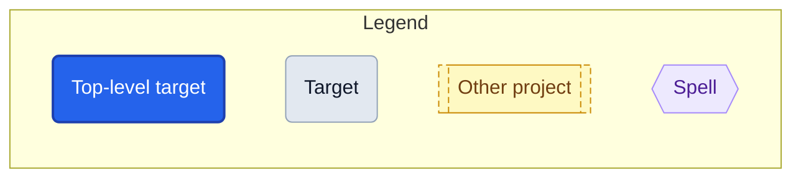
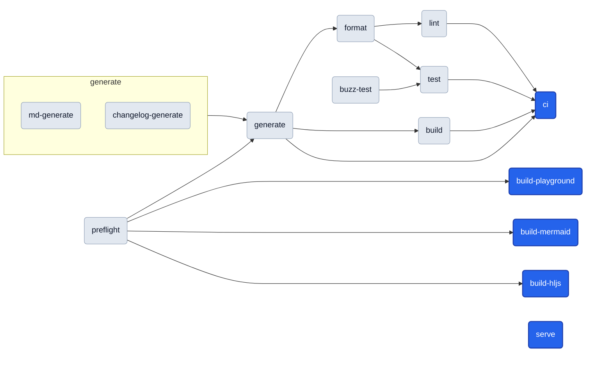

# Targets

<!-- Generated by `magus describe graph -o markdown`. Do not edit by hand. -->

A **target** is a named operation (build, test, lint, …) declared as an `export fun` in a project's magusfile. This cheat sheet (the per-target catalog and run-order graph below) is extracted statically from the magusfile source, so it stays in lockstep with how the project actually builds.

## Quick start

```sh
magus run <target>          # from inside the project directory
magus run <target> <path>   # from anywhere in the workspace
magus run <target>:<charm>  # change HOW it runs (e.g. lint:rw)
```

Unfamiliar with a term? See the [Glossary](https://eli.gladman.cc/magus/glossary/).

## Query first

This workspace has a knowledge graph of **523 nodes** and **652 edges** (schema v1). Query it instead of grepping:

```sh
magus query "<terms>"       # kind:spell, project:pkg/foo, relation:uses, free text, -negation
magus explain <node>        # one node: its edges, provenance, blast radius
magus path <a> <b>          # how two nodes connect
magus graph stats           # god nodes, orphans, doc coverage (MCP: magus_stats)
magus graph export -o json  # the whole graph (MCP: magus_query, magus_explain, magus_path)
```

| Kind | Count | List them | Anchors (most connected) |
|---|--:|---|---|
| project | 1 | `magus query kind:project` | `website` |
| target | 14 | `magus query kind:target` | `generate`, `ci`, `preflight` |
| spell | 11 | `magus query kind:spell` | `go`, `buf`, `py` |
| op | 43 | `magus query kind:op` | `shellcheck`, `buf-breaking`, `buf-build` |
| charm | 1 | `magus query kind:charm` | `rw` |
| module | 22 | `magus query kind:module` | `fs`, `charm`, `env` |
| method | 148 | `magus query kind:method` | `archive.compress`, `archive.uncompress`, `charm.after` |
| diagnostic | 26 | `magus query kind:diagnostic` | `MGS1001`, `MGS1002`, `MGS2001` |
| file | 23 | `magus query kind:file` | `scribe.buzz`, `magusfile.buzz`, `scribe_html.buzz` |
| function | 210 | `magus query kind:function` | `site_render`, `renderPage`, `strLess` |
| import | 24 | `magus query kind:import` | `magus`, `magus/spell/go`, `assert` |

| Project | Targets | Scope a query | Key targets |
|---|--:|---|---|
| . | 14 | `magus query project:.` | `generate`, `ci`, `preflight` |

## Reading the graphs



- Every rounded box is a **target** you can `magus run`. **Blue** is a top-level target (nothing else depends on it — a typical entry point); **gray** ones are pulled in as dependencies.
- Arrows show **run order**: a target's dependencies run before it, so the graph flows left -> right (e.g. `preflight` runs first, `ci` last).
- A dotted arrow marks a **cross-project dependency** (the other project's target runs first).
- Each project's **Toolchain** graph (top-down) shows which **spell** each target drives.

## Project: website

<details>
<summary><b>Shared defaults</b>: inputs, outputs &amp; spells shared by every target in <code>website</code></summary>

```text
sources  magusfile.buzz, magusfiles/**/*.buzz
outputs  gen/**, MAGUS.md, js/gen/**
spells   magusfile
```

</details>

**Run order**



### `generate`

generate renders the site, refreshes MAGUS.md, regenerates CHANGELOG.md (the released sections), and rebuilds the client bundles, then gates on drift: a clean checkout only goes dirty when a source edit wasn't re-rendered/rebuilt and committed.

**Defaults**

```sh
magus run generate  # from the workspace root
```

**Charms**

```sh
magus run generate:rw  # mutate in place instead of checking
```

**Depends on:**

- [`preflight`](#preflight)
- [`md-generate`](#md-generate)
- [`changelog-generate`](#changelog-generate)

**Details:** uncached (always runs) · exclusive (runs alone, no concurrent targets)

### `format`

**Defaults**

```sh
magus run format  # from the workspace root
```

**Depends on:**

- [`generate`](#generate)

### `lint`

**Defaults**

```sh
magus run lint  # from the workspace root
```

**Depends on:**

- [`format`](#format)

### `build`

**Defaults**

```sh
magus run build  # from the workspace root
```

**Depends on:**

- [`generate`](#generate)

### `test`

**Defaults**

```sh
magus run test  # from the workspace root
```

**Depends on:**

- [`format`](#format)
- [`buzz-test`](#buzz-test)

### `ci`

'ci' is the anchor `magus affected ci` keys off.

**Defaults**

```sh
magus run ci  # from the workspace root
```

**Depends on:**

- [`generate`](#generate)
- [`lint`](#lint)
- [`build`](#build)
- [`test`](#test)

### `build-playground`

build-playground rebuilds the WebAssembly interpreter the playground loads: TinyGo compiles ../cmd/buzz-playground straight into gen/playground/buzz.wasm, and the matching wasm_exec.js glue is copied beside it.

**Defaults**

```sh
magus run build-playground  # from the workspace root
```

**Depends on:**

- [`preflight`](#preflight)

**Details:** uncached (always runs)

### `build-mermaid`

build-mermaid bundles the vendored mermaid library (js/vendor/mermaid.js -> mermaid@11) into the committed gen/assets/mermaid.js.

**Defaults**

```sh
magus run build-mermaid  # from the workspace root
```

**Depends on:**

- [`preflight`](#preflight)

### `build-hljs`

build-hljs bundles the vendored highlight.js library (js/vendor/hljs.js -> highlight.js@11) into the committed gen/assets/hljs.js.

**Defaults**

```sh
magus run build-hljs  # from the workspace root
```

**Depends on:**

- [`preflight`](#preflight)

### `serve`

serve renders once, serves gen/ over HTTP, and re-renders on a docs/blog change - handy for local docs work.

**Defaults**

```sh
magus run serve  # from the workspace root
```

**Details:** uncached (always runs)

### `preflight`

**Defaults**

```sh
magus run preflight  # from the workspace root
```

### `md-generate`

md-generate refreshes MAGUS.md (the target catalog + dependency graph) from this magusfile, so it stays in lockstep with the targets.

**Defaults**

```sh
magus run md-generate  # from the workspace root
```

### `changelog-generate`

changelog-generate regenerates CHANGELOG.md from releases/*.yaml, preserving the [Unreleased] section verbatim.

**Defaults**

```sh
magus run changelog-generate  # from the workspace root
```

### `buzz-test`

buzz-test runs scribe's in-file `test "..." {}` blocks through `magus buzz`, in --embedded mode so scribe's markdown/encoding imports resolve.

**Defaults**

```sh
magus run buzz-test  # from the workspace root
```
